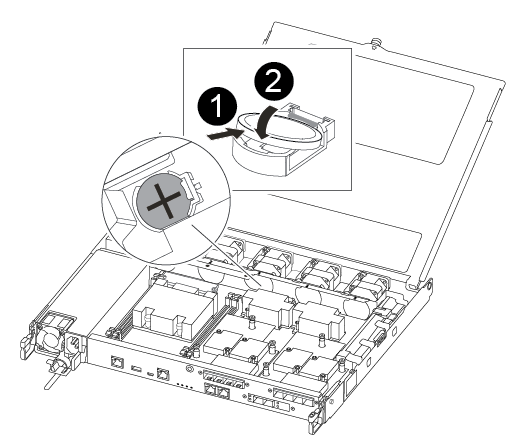

= Passo 1: Desligue o controlador desativado
:allow-uri-read: 

Você substitui a bateria do relógio em tempo real (RTC) no módulo do controlador para que os serviços e aplicativos do sistema que dependem da sincronização precisa de tempo continuem funcionando.

* Pode utilizar este procedimento com todas as versões do ONTAP suportadas pelo seu sistema
* Todos os outros componentes do sistema devem estar funcionando corretamente; caso contrário, você deve entrar em Contato com o suporte técnico.

== Passo 1: Desligue o controlador desativado

Para encerrar o controlador com deficiência, você deve determinar o status do controlador e, se necessário, assumir o controlador para que o controlador saudável continue fornecendo dados do armazenamento do controlador com deficiência.

.Sobre esta tarefa
* Se você tiver um sistema SAN, você deve ter verificado mensagens de  `cluster kernel-service show`evento ) para o blade SCSI do controlador afetado. O `cluster kernel-service show` comando (do modo avançado priv) exibe o nome do nó, link:https://docs.netapp.com/us-en/ontap/system-admin/display-nodes-cluster-task.html["status do quorum"]desse nó, o status de disponibilidade desse nó e o status operacional desse nó.
+
Cada processo SCSI-blade deve estar em quórum com os outros nós no cluster. Qualquer problema deve ser resolvido antes de prosseguir com a substituição.

* Se você tiver um cluster com mais de dois nós, ele deverá estar no quórum. Se o cluster não estiver em quórum ou se um controlador íntegro exibir false para qualificação e integridade, você deverá corrigir o problema antes de encerrar o controlador prejudicado; link:https://docs.netapp.com/us-en/ontap/system-admin/synchronize-node-cluster-task.html?q=Quorum["Sincronize um nó com o cluster"^]consulte .

.Passos
. Se o AutoSupport estiver ativado, suprimir a criação automática de casos invocando uma mensagem AutoSupport: `system node autosupport invoke -node * -type all -message MAINT=<# of hours>h`
+
A seguinte mensagem AutoSupport suprime a criação automática de casos por duas horas: `cluster1:> system node autosupport invoke -node * -type all -message MAINT=2h`

. Desative a giveback automática a partir da consola do controlador saudável: `storage failover modify –node local -auto-giveback false`
+

NOTE: Quando vir _do pretende desativar a auto-giveback?_, introduza `y`.

. Leve o controlador prejudicado para o prompt Loader:
+
[cols="1,2"]
|===
| Se o controlador afetado estiver a apresentar... | Então... 

 a| 
O prompt Loader
 a| 
Vá para a próxima etapa.

 a| 
A aguardar pela giveback...
 a| 
Pressione Ctrl-C e responda `y` quando solicitado.

 a| 
Prompt do sistema ou prompt de senha
 a| 
Assuma ou interrompa o controlador prejudicado do controlador saudável: `storage failover takeover -ofnode _impaired_node_name_`

Quando o controlador prejudicado mostrar aguardando a giveback..., pressione Ctrl-C e responda `y`.

|===

== Passo 2: Remova o módulo do controlador

Deve remover o módulo do controlador do chassis quando substituir um componente no interior do módulo do controlador.

Certifique-se de etiquetar os cabos para que saiba de onde vieram.

. Se você ainda não está aterrado, aterre-se adequadamente.
. Desconete as fontes de alimentação do módulo do controlador da fonte.
. Solte os fixadores do cabo de alimentação e, em seguida, desconete os cabos das fontes de alimentação.
. Insira o dedo indicador no mecanismo de travamento em ambos os lados do módulo do controlador, pressione a alavanca com o polegar e puxe o controlador cuidadosamente alguns centímetros para fora do chassi.
+

NOTE: Se tiver dificuldade em remover o módulo do controlador, coloque os dedos indicadores através dos orifícios dos dedos a partir do interior (cruzando os braços).

+
image::../media/drw_a250_pcm_remove_install.png[Abra o mecanismo de bloqueio]

+
[cols="1,4"]
|===

 a| 
image:../media/icon_round_1.png["Legenda número 1"]
 a| 
Alavanca

 a| 
image:../media/icon_round_2.png["Legenda número 2"]
 a| 
Mecanismo de bloqueio

|===
. Usando ambas as mãos, segure os lados do módulo do controlador e puxe-o suavemente para fora do chassi e coloque-o em uma superfície plana e estável.
. Rode o parafuso de aperto manual na parte frontal do módulo do controlador no sentido contrário ao dos ponteiros do relógio e abra a tampa do módulo do controlador.
+
image::../media/drw_a250_open_controller_module_cover.png[Abra a tampa do módulo do controlador]

+
[cols="1,4"]
|===

 a| 
image:../media/icon_round_1.png["Legenda número 1"]
| Parafuso de aperto manual 

 a| 
image::../media/icon_round_2.png[Legenda número 2]
 a| 
Tampa do módulo do controlador.

|===
. Levante a tampa da conduta de ar.
+
image::../media/drw_a250_remove_airduct_cover.png[Levante a tampa da conduta de ar]

== Passo 3: Substitua a bateria RTC

Para substituir a bateria do RTC, localize-a no interior do controlador e siga a sequência específica de passos.

Utilize o seguinte vídeo ou os passos tabulados para substituir a bateria RTC:

.Animação - substitua a bateria do RTC
video::6ed27f71-d3a7-4cee-8d9f-ac5b016c982d[panopto]
. Localize a bateria RTC entre o dissipador de calor e o midplane e remova-a exatamente como mostrado no gráfico.
+
image::../media/drw_a250_remove_rtc_batt.png[Retire a bateria do RTC]

+
[cols="1,4"]
|===

 a| 
image:../media/icon_round_1.png["Legenda número 1"]
 a| 
Puxe cuidadosamente a patilha para fora do compartimento da bateria. *Atenção:* puxando-o de forma agressiva pode deslocar a aba.

 a| 
image:../media/icon_round_2.png["Legenda número 2"]
 a| 
Levante a bateria. *Nota:* tome nota da polaridade da bateria.

 a| 
image:../media/icon_round_3.png["Legenda número 3"]
 a| 
A bateria deve ser ejetada.

|===
+
A bateria será ejetada para fora.

. Retire a bateria de substituição do saco de transporte antiestático.
. Localize o suporte da bateria RTC entre o dissipador de calor e o midplane e insira-o exatamente como mostrado no gráfico.
+

+
|===

 a| 
image:../media/icon_round_1.png["Legenda número 1"]
| Com a polaridade positiva virada para cima, deslize a bateria por baixo da patilha do compartimento da bateria. 

 a| 
image:../media/icon_round_2.png["Legenda número 2"]
 a| 
Empurre cuidadosamente a bateria para a devida posição e certifique-se de que a patilha a fixa ao alojamento.

CAUTION: Pressionar agressivamente pode fazer com que a bateria seja ejetada novamente.

|===
. Inspecione visualmente a bateria para se certificar de que está completamente instalada no suporte e de que a polaridade está correta.

== Etapa 4: Reinstale o módulo do controlador e ajuste a hora/data após a substituição da bateria do RTC

Depois de substituir um componente no módulo do controlador, tem de reinstalar o módulo do controlador no chassis do sistema, repor a hora e a data no controlador e, em seguida, iniciá-lo.

. Se ainda não o tiver feito, feche a tampa da conduta de ar ou do módulo do controlador.
. Alinhe a extremidade do módulo do controlador com a abertura no chassis e, em seguida, empurre cuidadosamente o módulo do controlador até meio do sistema.
+
Não introduza completamente o módulo do controlador no chassis até ser instruído a fazê-lo.

. Recable o sistema, conforme necessário.
+
Se você removeu os conversores de Mídia (QSFPs ou SFPs), lembre-se de reinstalá-los se você estiver usando cabos de fibra ótica.

. Se as fontes de alimentação estiverem desconetadas, conete-as novamente e reinstale os retentores do cabo de alimentação.
. Insira o módulo do controlador no chassis:
+
.. Certifique-se de que os braços do mecanismo de engate estão bloqueados na posição totalmente estendida.
.. Utilizando ambas as mãos, alinhe e deslize suavemente o módulo do controlador para dentro dos braços do mecanismo de bloqueio até parar.
.. Coloque os dedos indicadores através dos orifícios dos dedos a partir do interior do mecanismo de bloqueio.
.. Pressione os polegares para baixo nas patilhas cor-de-laranja na parte superior do mecanismo de bloqueio e empurre suavemente o módulo do controlador sobre o batente.
.. Solte os polegares da parte superior dos mecanismos de travamento e continue empurrando até que os mecanismos de travamento se encaixem no lugar.
+
O módulo do controlador começa a arrancar assim que estiver totalmente assente no chassis. Esteja preparado para interromper o processo de inicialização.

.. Interrompa o controlador no prompt DO Loader.

+
O módulo do controlador deve ser totalmente inserido e alinhado com as bordas do chassi.

. Redefina a hora e a data no controlador:
+
.. Verifique a data e a hora no controlador saudável com o `show date` comando.
.. No prompt Loader no controlador de destino, verifique a hora e a data.
.. Se necessário, modifique a data com o `set date mm/dd/yyyy` comando.
.. Se necessário, defina a hora, em GMT, usando o `set time hh:mm:ss` comando.
.. Confirme a data e a hora no controlador de destino.

. No prompt Loader, digite `bye` para reinicializar as placas PCIe e outros componentes e deixar a controladora reiniciar.
. Volte a colocar o controlador em funcionamento normal, devolvendo o respetivo armazenamento: `storage failover giveback -ofnode _impaired_node_name_`
. Se a giveback automática foi desativada, reative-a: `storage failover modify -node local -auto-giveback true`

== Passo 5: Devolva a peça com falha ao NetApp

Devolva a peça com falha ao NetApp, conforme descrito nas instruções de RMA fornecidas com o kit. Consulte a https://mysupport.netapp.com/site/info/rma["Devolução de peças e substituições"] página para obter mais informações.
