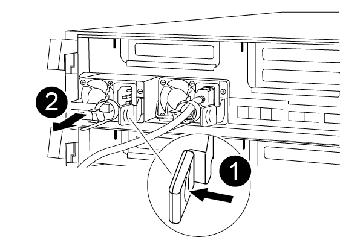
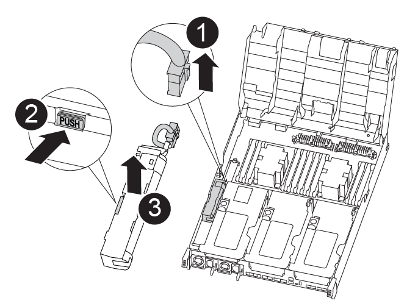

= Passo 1: Remova o módulo do controlador
:allow-uri-read: 

Para substituir o hardware do módulo do controlador, é necessário remover o controlador prejudicado, mover os componentes FRU para o módulo do controlador de substituição, instalar o módulo do controlador de substituição no chassis e, em seguida, inicializar o sistema para o modo de manutenção.

== Passo 1: Remova o módulo do controlador

Para aceder aos componentes no interior do módulo do controlador, tem de remover o módulo do controlador do chassis.

Você pode usar a ilustração a seguir ou as etapas escritas para remover o módulo do controlador do chassi.

.Animação - retire o módulo do controlador
video::ca74d345-e213-4390-a599-aae10019ec82[panopto]
. Se você ainda não está aterrado, aterre-se adequadamente.
. Solte os fixadores do cabo de alimentação e, em seguida, desconete os cabos das fontes de alimentação.
. Solte o gancho e a alça de loop que prendem os cabos ao dispositivo de gerenciamento de cabos e, em seguida, desconete os cabos do sistema e os SFPs (se necessário) do módulo do controlador, mantendo o controle de onde os cabos estavam conetados.
+
Deixe os cabos no dispositivo de gerenciamento de cabos para que, ao reinstalar o dispositivo de gerenciamento de cabos, os cabos sejam organizados.

. Retire o dispositivo de gestão de cabos do módulo do controlador e coloque-o de lado.
. Prima ambos os trincos de bloqueio para baixo e, em seguida, rode ambos os trincos para baixo ao mesmo tempo.
+
O módulo do controlador desloca-se ligeiramente para fora do chassis.

+
image:../media/drw_A400_Remove_controller.png["Solte o módulo do controlador"]

+
[cols="10a,90a"]
|===

 a| 
image:../media/icon_round_1.png["Legenda número 1"]
 a| 
Trincos de bloqueio

 a| 
image:../media/icon_round_2.png["Legenda número 2"]
 a| 
O controlador se move ligeiramente para fora do chassi

|===
. Faça deslizar o módulo do controlador para fora do chassis.
+
Certifique-se de que suporta a parte inferior do módulo do controlador enquanto o desliza para fora do chassis.

. Coloque o módulo do controlador numa superfície estável e plana.
. No módulo do controlador de substituição, abra a conduta de ar e retire os risers vazios do módulo do controlador utilizando a animação, a ilustração ou os passos escritos:
+
.Animação - Remova os risers vazios do módulo do controlador de substituição
video::49053752-e813-4c15-a917-ab190147fa6e[panopto]

image::../media/drw_a400_empty_riser_remove.png[Remova a riser vazia]

[cols="10,90"]
|===

 a| 
image:../media/icon_round_1.png["Legenda número 1"]
 a| 
Travas de liberação da riser

|===
. Pressione as patilhas de bloqueio nas laterais da conduta de ar para dentro, em direção ao centro do módulo do controlador.
. Faça deslizar a conduta de ar em direção à parte de trás do módulo do controlador e, em seguida, rode-a para cima até à posição completamente aberta.
. Gire a trava de travamento da riser no lado esquerdo da riser 1 para cima e em direção à conduta de ar, levante a riser e, em seguida, coloque-a de lado.
. Repita o passo anterior para os restantes risers.

== Passo 2: Mova as fontes de alimentação

Deve mover a fonte de alimentação do módulo do controlador afetado para o módulo do controlador de substituição quando substituir um módulo do controlador.

Você pode usar a animação, ilustração ou as etapas escritas a seguir para mover as fontes de alimentação para o módulo do controlador de substituição.

.Animação - mova as fontes de alimentação
video::92060115-1967-475b-b517-aad9012f130c[panopto]
. Retire a fonte de alimentação:
+

+
[cols="10,90"]
|===

 a| 
image:../media/icon_round_1.png["Legenda número 1"]
 a| 
Patilha de bloqueio da PSU

 a| 
image:../media/icon_round_2.png["Legenda número 2"]
 a| 
Fixador do cabo de alimentação

|===
+
.. Rode a pega do excêntrico de forma a que possa ser utilizada para retirar a fonte de alimentação do chassis.
.. Prima a patilha de bloqueio azul para libertar a fonte de alimentação do chassis.
.. Utilizando ambas as mãos, puxe a fonte de alimentação para fora do chassis e, em seguida, coloque-a de lado.

. Mova a fonte de alimentação para o novo módulo do controlador e, em seguida, instale-a.
. Utilizando ambas as mãos, apoie e alinhe as extremidades da fonte de alimentação com a abertura no módulo do controlador e, em seguida, empurre cuidadosamente a fonte de alimentação para o módulo do controlador até que a patilha de bloqueio encaixe no lugar.
+
As fontes de alimentação apenas engatarão adequadamente com o conetor interno e trancam no lugar de uma forma.

+

NOTE: Para evitar danificar o conetor interno, não utilize força excessiva ao deslizar a fonte de alimentação para o sistema.

. Repita as etapas anteriores para qualquer fonte de alimentação restante.

== Etapa 3: Mova a bateria NVDIMM

Para mover a bateria NVDIMM do módulo do controlador desativado para o módulo do controlador de substituição, é necessário executar uma sequência específica de passos.

Você pode usar a animação, a ilustração ou as etapas escritas a seguir para mover a bateria NVDIMM do módulo do controlador prejudicado para o módulo do controlador de substituição.

.Animação - mova a bateria NVDIMM
video::94d115b2-b02a-4234-805c-aad9012f204c[panopto]

[cols="10,90"]
|===

 a| 
image:../media/icon_round_1.png["Legenda número 1"]
 a| 
Ficha da bateria NVDIMM

 a| 
image:../media/icon_round_2.png["Legenda número 2"]
 a| 
Patilha de bloqueio da bateria NVDIMM

 a| 
image:../media/icon_round_3.png["Legenda número 3"]
 a| 
Bateria NVDIMM

|===
. Abrir a conduta de ar:
+
.. Pressione as patilhas de bloqueio nas laterais da conduta de ar para dentro, em direção ao centro do módulo do controlador.
.. Faça deslizar a conduta de ar em direção à parte de trás do módulo do controlador e, em seguida, rode-a para cima até à posição completamente aberta.

. Localize a bateria NVDIMM no módulo do controlador.
. Localize a ficha da bateria e aperte o clipe na face da ficha da bateria para soltar a ficha da tomada e, em seguida, desligue o cabo da bateria da tomada.
. Segure a bateria e pressione a patilha de bloqueio azul marcada com PUSH e, em seguida, levante a bateria para fora do suporte e do módulo do controlador.
. Desloque a bateria para o módulo do controlador de substituição.
. Alinhe o módulo da bateria com a abertura da bateria e, em seguida, empurre cuidadosamente a bateria para dentro da ranhura até encaixar no lugar.
+

NOTE: Não conete o cabo da bateria de volta à placa-mãe até que seja instruído a fazê-lo.

== Passo 4: Mova a Mídia de inicialização

Tem de localizar o suporte de arranque e, em seguida, seguir as instruções para o remover do módulo do controlador afetado e inseri-lo no módulo do controlador de substituição.

Pode utilizar a animação, a ilustração ou os passos escritos a seguir para mover o suporte de arranque do módulo do controlador afetado para o módulo do controlador de substituição.

.Animação - mova a Mídia de inicialização
video::2a14099c-85de-4a84-867c-aad9012efac8[panopto]
image::../media/drw_A400_Replace-boot_media.png[Retire o suporte de arranque]

[cols="10,90"]
|===

 a| 
image:../media/icon_round_1.png["Legenda número 1"]
 a| 
Patilha de bloqueio do suporte de arranque

 a| 
image:../media/icon_round_2.png["Legenda número 2"]
 a| 
Suporte de arranque

|===
. Localize e remova o suporte de arranque do módulo do controlador:
+
.. Pressione o botão azul na extremidade do suporte de inicialização até que o lábio do suporte de inicialização apague o botão azul.
.. Rode o suporte de arranque para cima e puxe cuidadosamente o suporte de arranque para fora do encaixe.

. Mova o suporte de arranque para o novo módulo do controlador, alinhe as extremidades do suporte de arranque com o alojamento da tomada e, em seguida, empurre-o suavemente para dentro do encaixe.
. Verifique o suporte de arranque para se certificar de que está encaixado corretamente e completamente no encaixe.
+
Se necessário, retire o suporte de arranque e volte a colocá-lo no socket.

. Bloqueie o suporte de arranque no devido lugar:
+
.. Rode o suporte de arranque para baixo em direção à placa-mãe.
.. Prima o botão azul de bloqueio para que fique na posição aberta.
.. Colocando os dedos na extremidade do suporte de arranque com o botão azul, empurre firmemente a extremidade do suporte de arranque para engatar o botão de bloqueio azul.

== Passo 5: Mova os risers PCIe e a placa mezzanine

Como parte do processo de substituição da controladora, você deve mover os risers PCIe e a placa mezzanine do módulo do controlador prejudicado para o módulo do controlador de substituição.

Você pode usar as seguintes animações, ilustrações ou as etapas escritas para mover os risers PCIe e a placa mezzanine do módulo controlador prejudicado para o módulo controlador de substituição.

Movimentação do riser PCIe 1 e 2 (risers esquerdo e médio):

.Animação - mover risers PCI 1 e 2
video::f4ee1d4d-6029-4fe6-a063-aad9012f170b[panopto]
Movimentação da placa mezanino e do riser 3 (riser direito):

.Animação - mova a placa mezzanine e o riser 3
video::b0c3b575-3434-4e00-a421-aad9012f2e9e[panopto]
image::../media/drw_A400_Replace-PCIe-cards.png[Remova as placas PCIe]

[cols="10,90"]
|===

 a| 
image:../media/icon_round_1.png["Legenda número 1"]
 a| 
Trava de travamento da riser

 a| 
image:../media/icon_round_2.png["Legenda número 2"]
 a| 
Trinco de bloqueio da placa PCI

 a| 
image:../media/icon_round_3.png["Legenda número 3"]
 a| 
Placa de bloqueio PCI

 a| 
image:../media/icon_round_4.png["Legenda número 4"]
 a| 
Placa PCI

|===
. Mova os risers PCIe um e dois do módulo do controlador prejudicado para o módulo do controlador de substituição:
+
.. Remova quaisquer módulos SFP ou QSFP que possam estar nas placas PCIe.
.. Gire a trava de travamento da riser no lado esquerdo da riser para cima e em direção à conduta de ar.
+
A riser levanta-se ligeiramente do módulo do controlador.

.. Levante a riser e, em seguida, mova-a para o módulo do controlador de substituição.
.. Alinhe a riser com os pinos na lateral do soquete da riser, abaixe a riser para baixo nos pinos, empurre a riser diretamente no soquete da placa-mãe e gire a trava para baixo com a chapa metálica na riser.
.. Repita esta etapa para o riser número 2.

. Remova o riser número 3, remova a placa mezanino e instale ambos no módulo do controlador de substituição:
+
.. Remova quaisquer módulos SFP ou QSFP que possam estar nas placas PCIe.
.. Gire a trava de travamento da riser no lado esquerdo da riser para cima e em direção à conduta de ar.
+
A riser levanta-se ligeiramente do módulo do controlador.

.. Levante a riser e, em seguida, coloque-a de lado em uma superfície estável e plana.
.. Solte os parafusos de aperto manual na placa mezzanine e levante cuidadosamente a placa diretamente para fora do soquete e, em seguida, mova-a para o módulo controlador de substituição.
.. Instale o mezanino no controlador de substituição e fixe-o com os parafusos de aperto manual.
.. Instale a terceira riser no módulo do controlador de substituição.

== Passo 6: Mova os DIMMs

Você precisa localizar os DIMMs e depois movê-los do módulo do controlador prejudicado para o módulo do controlador de substituição.

Você deve ter o novo módulo de controlador pronto para que possa mover os DIMMs diretamente do módulo de controlador prejudicado para os slots correspondentes no módulo de controlador de substituição.

Você pode usar a animação, ilustração ou as etapas escritas a seguir para mover os DIMMs do módulo do controlador prejudicado para o módulo do controlador de substituição.

.Animação - mova os DIMMs
video::717b52fa-f236-4f3d-b07d-aad9012f51a3[panopto]
image::../media/drw_A400_Replace-NVDIMM-DIMM.png[Mova os DIMMs]

[cols="10,90"]
|===

 a| 
image:../media/icon_round_1.png["Legenda número 1"]
 a| 
Patilhas de bloqueio do DIMM

 a| 
image:../media/icon_round_2.png["Legenda número 2"]
 a| 
DIMM

 a| 
image:../media/icon_round_3.png["Legenda número 3"]
 a| 
Soquete DIMM

|===
. Localize os DIMMs no módulo do controlador.
. Observe a orientação do DIMM no soquete para que você possa inserir o DIMM no módulo do controlador de substituição na orientação adequada.
. Verifique se a bateria NVDIMM não está conetada ao novo módulo do controlador.
. Mova os DIMMs do módulo do controlador prejudicado para o módulo do controlador de substituição:
+

NOTE: Certifique-se de que instala cada DIMM no mesmo slot que ocupou no módulo do controlador prejudicado.

+
.. Ejete o DIMM de seu slot, empurrando lentamente as abas do ejetor do DIMM em ambos os lados do DIMM e, em seguida, deslize o DIMM para fora do slot.
+

NOTE: Segure cuidadosamente o DIMM pelas bordas para evitar a pressão nos componentes da placa de circuito DIMM.

.. Localize o slot DIMM correspondente no módulo do controlador de substituição.
.. Certifique-se de que as abas do ejetor DIMM no soquete DIMM estão na posição aberta e insira o DIMM diretamente no soquete.
+
Os DIMMs se encaixam firmemente no soquete, mas devem entrar facilmente. Caso contrário, realinhar o DIMM com o soquete e reinseri-lo.

.. Inspecione visualmente o DIMM para verificar se ele está alinhado uniformemente e totalmente inserido no soquete.
.. Repita essas subetapas para os DIMMs restantes.

. Conete a bateria NVDIMM à placa-mãe.
+
Certifique-se de que a ficha fica fixa no módulo do controlador.

== Passo 7: Instale o módulo do controlador

Depois de todos os componentes terem sido movidos do módulo do controlador afetado para o módulo do controlador de substituição, tem de instalar o módulo do controlador de substituição no chassis e, em seguida, iniciá-lo no modo de manutenção.

Você pode usar a animação, ilustração ou as etapas escritas a seguir para instalar o módulo do controlador de substituição no chassi.

.Animação - instale o módulo do controlador
video::0310fe80-b129-4685-8fef-ab19010e720a[panopto]
image::../media/drw_A400_Install_controller_source.png[Instale o controlador]

[cols="10,90"]
|===

 a| 
image:../media/icon_round_1.png["Legenda número 1"]
 a| 
Módulo do controlador

 a| 
image:../media/icon_round_2.png["Legenda número 2"]
 a| 
Travas de travamento do controlador

|===
. Se ainda não o tiver feito, feche a conduta de ar.
. Alinhe a extremidade do módulo do controlador com a abertura no chassis e, em seguida, empurre cuidadosamente o módulo do controlador até meio do sistema.
+

NOTE: Não introduza completamente o módulo do controlador no chassis até ser instruído a fazê-lo.

. Faça o cabeamento apenas das portas de gerenciamento e console, para que você possa acessar o sistema para executar as tarefas nas seções a seguir.
+

NOTE: Você conetará o resto dos cabos ao módulo do controlador posteriormente neste procedimento.

. Conclua a instalação do módulo do controlador:
+
.. Utilizando os trincos de bloqueio, empurre firmemente o módulo do controlador para dentro do chassis até que os trincos de bloqueio comecem a subir.
+

NOTE: Não utilize força excessiva ao deslizar o módulo do controlador para dentro do chassis para evitar danificar os conetores.

.. Assente totalmente o módulo do controlador no chassis, rodando os trincos de bloqueio para cima, inclinando-os para que estes limpem os pinos de bloqueio, empurre cuidadosamente o controlador totalmente para dentro e, em seguida, baixe os trincos de bloqueio para a posição de bloqueio.
.. Conete os cabos de alimentação às fontes de alimentação, reinstale o colar de travamento do cabo de alimentação e, em seguida, conete as fontes de alimentação à fonte de alimentação.
+
O módulo do controlador começa a inicializar assim que a energia é restaurada. Esteja preparado para interromper o processo de inicialização.

.. Se ainda não o tiver feito, reinstale o dispositivo de gerenciamento de cabos.
.. Interrompa o processo normal de inicialização e inicialize no Loader pressionando `Ctrl-C`.
+

NOTE: Se o sistema parar no menu de inicialização, selecione a opção para inicializar NO Loader.

.. No prompt Loader, digite `bye` para reinicializar as placas PCIe e outros componentes.
.. Interrompa o processo de inicialização e inicialize no prompt DO Loader pressionando `Ctrl-C`.
+
Se o sistema parar no menu de inicialização, selecione a opção para inicializar NO Loader.

