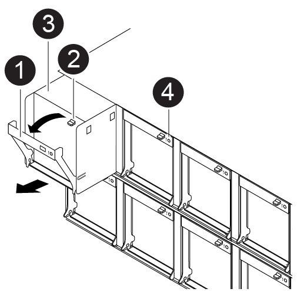

= 
:allow-uri-read: 

Para trocar um módulo de ventilador sem interromper o serviço, você deve executar uma sequência específica de tarefas.

NOTE: Tem de substituir o módulo da ventoinha no espaço de dois minutos após o retirar do chassis. O fluxo de ar do sistema é interrompido e o módulo do controlador ou módulos são desligados após dois minutos para evitar o sobreaquecimento.

Você pode usar a seguinte animação, ilustração ou as etapas escritas para trocar um módulo de ventilador a quente.

.Animação - substitua uma ventoinha
video::ae59d53d-7746-402c-bd6b-aad9012efa89[panopto]

[cols="10,90"]
|===

 a| 
image:../media/icon_round_1.png["Legenda número 1"]
 a| 
Pega da ventoinha

 a| 
image:../media/icon_round_2.png["Legenda número 2"]
 a| 
Patilha de bloqueio

 a| 
image:../media/icon_round_3.png["Legenda número 3"]
 a| 
Ventoinha

 a| 
image:../media/icon_round_4.png["Legenda número 4"]
 a| 
LED de estado

|===
.Passos
. Se você ainda não está aterrado, aterre-se adequadamente.
. Retire a moldura (se necessário) com duas mãos, segurando as aberturas de cada lado da moldura e puxando-a na sua direção até que a moldura se solte dos pernos esféricos na estrutura do chassis.
. Identifique o módulo da ventoinha que deve substituir verificando as mensagens de erro da consola e observando o LED de atenção em cada módulo da ventoinha.
+
Use a mensagem do BMC ou o LED de Atenção para identificar o módulo de ventoinha a ser substituído. BMC mapeia os módulos de ventoinha como Fan#_#, onde o primeiro número é o slot e o segundo é a linha (1=superior, 2=inferior); por exemplo, slot 1, segunda linha = Fan1_2.

. Pressione o trinco de desbloqueio no manípulo do excêntrico do módulo da ventoinha e, em seguida, rode o manípulo do excêntrico para baixo.
+
O módulo da ventoinha se afasta ligeiramente do chassi.

. Puxe o módulo da ventoinha diretamente para fora do chassis, certificando-se de que o apoia com a mão livre para que não saia do chassis.
+

CAUTION: Os módulos da ventoinha são curtos. Apoie sempre a parte inferior do módulo da ventoinha com a mão livre para que não caia subitamente do chassis e o machuque.

. Coloque o módulo da ventoinha de lado.
. Insira o módulo da ventoinha de substituição no chassis, alinhando-o com a abertura e, em seguida, deslizando-o para o chassis.
. Empurre firmemente a pega do came do módulo da ventoinha para que fique totalmente assente no chassis.
+
O manípulo do came levanta-se ligeiramente quando o módulo do ventilador está completamente encaixado.

. Desloque o manípulo do excêntrico para a posição fechada, certificando-se de que o trinco de libertação do manípulo do excêntrico encaixa na posição de bloqueio.
+
O LED de atenção apaga-se depois da ventoinha estar encaixada e atingir a velocidade de funcionamento.

. Alinhe a moldura com os pernos esféricos e, em seguida, empurre cuidadosamente a moldura para os pernos esféricos.
. Devolva a peça com falha ao NetApp, conforme descrito nas instruções de RMA fornecidas com o kit. Consulte a https://mysupport.netapp.com/site/info/rma["Devolução de peças e substituições"^] página para obter mais informações.

