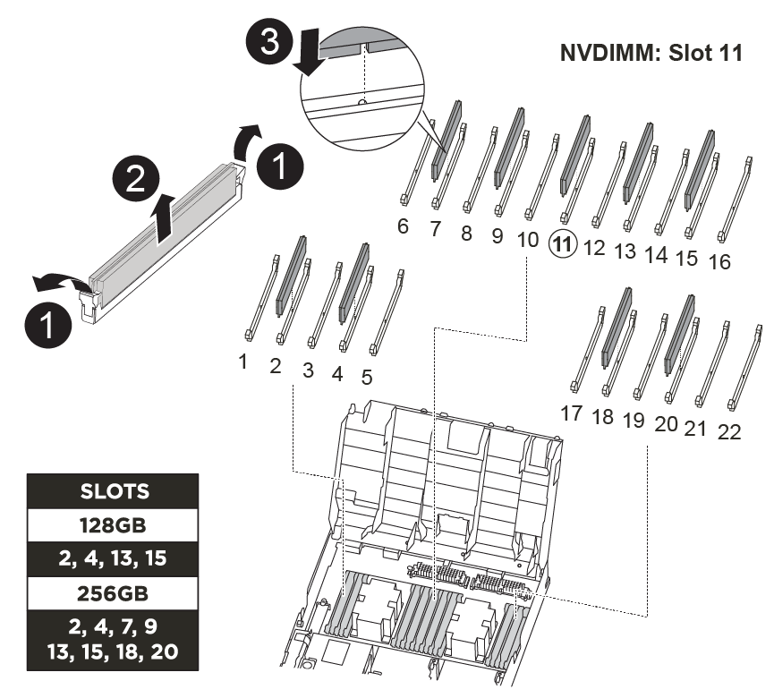

= 
:allow-uri-read: 

Você precisa localizar os DIMMs e depois movê-los do módulo do controlador prejudicado para o módulo do controlador de substituição.

Você deve ter o novo módulo de controlador pronto para que possa mover os DIMMs diretamente do módulo de controlador prejudicado para os slots correspondentes no módulo de controlador de substituição.

Você pode usar a animação, ilustração ou as etapas escritas a seguir para mover os DIMMs do módulo do controlador prejudicado para o módulo do controlador de substituição.

.Animação - mova os DIMMs
video::717b52fa-f236-4f3d-b07d-aad9012f51a3[panopto]

[cols="10,90"]
|===

 a| 
image:../media/icon_round_1.png["Legenda número 1"]
 a| 
Patilhas de bloqueio do DIMM

 a| 
image:../media/icon_round_2.png["Legenda número 2"]
 a| 
DIMM

 a| 
image:../media/icon_round_3.png["Legenda número 3"]
 a| 
Soquete DIMM

|===
.Passos
. Localize os DIMMs no módulo do controlador.
. Observe a orientação do DIMM no soquete para que você possa inserir o DIMM no módulo do controlador de substituição na orientação adequada.
. Verifique se a bateria NVDIMM não está conetada ao novo módulo do controlador.
. Mova os DIMMs do módulo do controlador prejudicado para o módulo do controlador de substituição:
+

NOTE: Certifique-se de instalar cada módulo DIMM no mesmo slot que ocupava no módulo controlador com defeito.

+
.. Ejete o DIMM de seu slot, empurrando lentamente as abas do ejetor do DIMM em ambos os lados do DIMM e, em seguida, deslize o DIMM para fora do slot.
+

NOTE: Segure cuidadosamente o DIMM pelas bordas para evitar a pressão nos componentes da placa de circuito DIMM.

.. Localize o slot DIMM correspondente no módulo do controlador de substituição.
.. Certifique-se de que as abas do ejetor DIMM no soquete DIMM estão na posição aberta e insira o DIMM diretamente no soquete.
+
Os DIMMs se encaixam firmemente no soquete, mas devem entrar facilmente. Caso contrário, realinhar o DIMM com o soquete e reinseri-lo.

.. Inspecione visualmente o DIMM para verificar se ele está alinhado uniformemente e totalmente inserido no soquete.
.. Repita essas subetapas para os DIMMs restantes.

. Conete a bateria NVDIMM à placa-mãe.
+
Certifique-se de que a ficha fica fixa no módulo do controlador.

