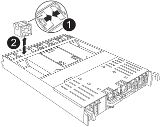

= 
:allow-uri-read: 

.Passos
. Retire o módulo da ventoinha apertando as patilhas de bloqueio na parte lateral do módulo da ventoinha e, em seguida, levantando o módulo da ventoinha diretamente para fora do módulo do controlador.
+

+
[cols="1,4"]
|===

 a| 
image::../media/icon_round_1.png[Legenda número 1]
 a| 
Patilhas de bloqueio da ventoinha

 a| 
image::../media/icon_round_2.png[Legenda número 2]
 a| 
Módulo da ventoinha

|===
. Transfira o módulo da ventoinha para o módulo controlador de substituição e, em seguida, instale-o alinhando suas bordas com a abertura no módulo controlador e deslizando-o até que as travas de fixação se encaixem no lugar.
. Repita estes passos para os restantes módulos do ventilador.

