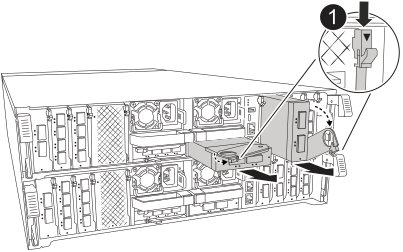

= 
:allow-uri-read: 

Para substituir um módulo de e/S, localize-o no módulo do controlador e siga a sequência específica de passos.

CAUTION: Use sempre uma pulseira antiestática aterrada, conectada a um ponto de aterramento verificado durante a instalação e os procedimentos de manutenção. A não observância das precauções adequadas contra ESD pode causar danos permanentes aos nós controladores, prateleiras de armazenamento e switches de rede.

.Passos
. Identifique os cabos para saber de onde vieram e, em seguida, desconecte todos os cabos do módulo de E/S de destino.
. Gire a bandeja de gerenciamento de cabos para baixo puxando os botões no interior da bandeja de gerenciamento de cabos e girando-a para baixo.
. Retire o módulo de e/S do módulo do controlador:
+

NOTE: A ilustração a seguir mostra a remoção de um módulo de E/S horizontal e vertical. Normalmente, você removerá apenas um módulo de E/S.

+

+
[cols="1,4"]
|===

 a| 
image:../media/icon_round_1.png["Legenda número 1"]
 a| 
Botão de bloqueio do came

|===
+
.. Prima o botão do trinco do excêntrico.
.. Rode o trinco do excêntrico para longe do módulo o mais longe possível.
.. Retire o módulo do módulo do controlador encaixando o dedo na abertura da alavanca do came e puxando o módulo para fora do módulo do controlador.
+
Mantenha o controle de qual slot o módulo de E/S estava.

. Coloque o módulo de e/S de lado.
. Instale o módulo de e/S de substituição na ranhura de destino:
+
.. Alinhe o módulo de e/S com as extremidades da ranhura.
.. Deslize cuidadosamente o módulo para dentro do slot até o módulo do controlador e, em seguida, gire o trinco do came totalmente para cima para bloquear o módulo no lugar.

. Faça o cabo do módulo de e/S.
. Rode o tabuleiro de gestão de cabos para a posição de bloqueio.

