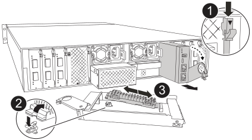

= 
:allow-uri-read: 

O módulo de gerenciamento do sistema contém a mídia de inicialização e fornece funções de gerenciamento do sistema. Você deve remover o módulo de gerenciamento do sistema com defeito, transferir a mídia de inicialização para o módulo de substituição e reinstalar o módulo de substituição no gabinete.

.Passos
. Retire o módulo de gestão do sistema:
+

NOTE: Certifique-se de que o destage da NVRAM foi concluído antes de prosseguir. Quando o LED no módulo NV estiver apagado, a NVRAM foi destageada. Se o LED estiver piscando, aguarde até que pare de piscar. Se a intermitência continuar por mais de 5 minutos, entre em contato com o Suporte Técnico para obter assistência.

+
image::../media/drw_afx_2k_sys_mgmt_remove_replace_ieops-2880.svg[Substitua o módulo de gestão do sistema]

+
[cols="1,4"]
|===

 a| 
image::../media/icon_round_1.png[Legenda número 1]
 a| 
Trinco do excêntrico do módulo de gestão do sistema

|===
+
.. Se você ainda não está aterrado, aterre-se adequadamente.
.. Desconecte os cabos de alimentação das PSUs.
.. Remova todos os cabos conectados ao módulo de gerenciamento do sistema.  Identifique os cabos onde eles foram conectados para que você possa reconectá-los às portas corretas ao reinstalar o módulo.
.. Gire a bandeja de gerenciamento de cabos para baixo puxando os botões de ambos os lados no interior da bandeja de gerenciamento de cabos e, em seguida, gire a bandeja para baixo.
.. Prima o botão do came no módulo de gestão do sistema.
.. Rode a alavanca do came para baixo o mais longe possível.
.. Coloque o dedo no orifício da alavanca do came e puxe o módulo diretamente para fora do sistema.
.. Coloque o módulo de gerenciamento do sistema em um tapete antiestático para acessar a mídia de inicialização.

. Mova o suporte de arranque para o módulo de gestão do sistema de substituição:
+

+
[cols="1,4"]
|===

 a| 
image::../media/icon_round_1.png[Legenda número 1]
 a| 
Trinco do excêntrico do módulo de gestão do sistema

 a| 
image::../media/icon_round_2.png[Legenda número 2]
 a| 
Botão de bloqueio do suporte de arranque

 a| 
image::../media/icon_round_3.png[Legenda número 3]
 a| 
Suporte de arranque

|===
+
.. Prima o botão azul de bloqueio do material de arranque no módulo de gestão do sistema afetado.
.. Rode o suporte de arranque para cima e deslize-o para fora do encaixe.

. Instale o suporte de arranque no módulo de gestão do sistema de substituição:
+
.. Alinhe as extremidades do suporte de arranque com o alojamento do encaixe e, em seguida, empurre-o suavemente no encaixe.
.. Rode o suporte de arranque para baixo até tocar no botão de bloqueio.
.. Prima o bloqueio azul e rode o suporte de arranque totalmente para baixo e solte o botão de bloqueio azul.

. Instale o módulo de gerenciamento do sistema de substituição no gabinete:
+
.. Alinhe as extremidades do módulo de gestão do sistema de substituição com a abertura do sistema e empurre-o cuidadosamente para dentro do módulo do controlador.
.. Deslize cuidadosamente o módulo para dentro da ranhura até que o trinco do excêntrico comece a engatar com o pino do excêntrico de e/S e, em seguida, rode o trinco do excêntrico totalmente para cima para bloquear o módulo no devido lugar.

. Rode o ARM de gestão de cabos para cima até à posição fechada.
. Recable o módulo de Gestão do sistema.

