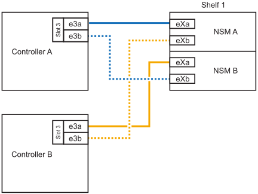
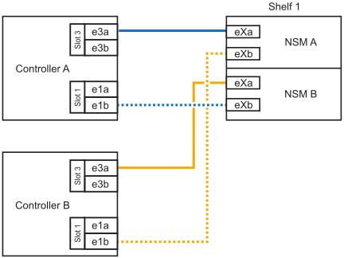
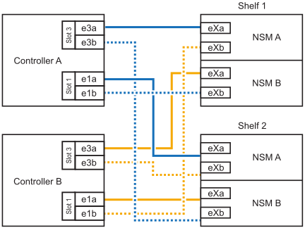

= 
:allow-uri-read: 

.Sobre esta tarefa
* Esse procedimento pressupõe que seu par de HA tenha apenas storage interno (sem compartimentos externos) e que você esteja adicionando "Hot-Adding" a duas gavetas adicionais e dois módulos de e/S com capacidade para RoCE em cada controladora.
* Este procedimento aborda os seguintes cenários de adição dinâmica:
+
** Adição automática da primeira gaveta a um par de HA com um módulo de e/S compatível com RoCE em cada controladora.
** Adição automática da primeira gaveta a um par de HA com dois módulos de e/S compatíveis com RoCE em cada controladora.
** Adição rápida da segunda gaveta a um par de HA com dois módulos de e/S compatíveis com RoCE em cada controladora.

* Esses sistemas são compatíveis com as duas gavetas NS224 com NSM100 módulos e NS224 gavetas com NSM100B módulos. Para garantir que você faça o cabeamento de seus controladores às portas corretas, substitua o "X" em cada diagrama pelo número de porta correto para seu módulo:
+
[cols="1,4"]
|===
| Tipo de módulo | Rotulagem do porto 

 a| 
NSM100
 a| 
"0"

ex. e0a

 a| 
NSM100B
 a| 
"1"

ex. e1a

|===

.Passos
. Se você estiver adicionando um compartimento usando um conjunto de portas compatíveis com RoCE (um módulo de e/S compatível com RoCE) em cada módulo de controladora e esse for o único compartimento de NS224 TB do seu par de HA, execute as seguintes etapas.
+
Caso contrário, vá para a próxima etapa.

+

NOTE: Esta etapa pressupõe que você instalou o módulo de e/S compatível com RoCE no slot 3.

+
.. Compartimento de cabos NSM A porta Exa para controlador A slot 3 porta a (E3A).
.. Porta eXb do compartimento de cabos NSM A para a porta b (e3b) do slot 3 do controlador B.
.. Porta Exa do NSM B da gaveta de cabos para a porta a (E3A) do slot 3 do controlador B.
.. Porta eXb da gaveta de cabos NSM B para porta b (e3b) da ranhura 3 do controlador A.
+
A ilustração a seguir mostra o cabeamento de uma gaveta hot-added usando um módulo de e/S compatível com RoCE em cada módulo de controladora:

+

. Se você estiver adicionando uma ou duas gavetas usando dois conjuntos de portas compatíveis com RoCE (dois módulos de e/S compatíveis com RoCE) em cada módulo de controladora, execute as subetapas aplicáveis.
+

NOTE: Esta etapa pressupõe que você instalou os módulos de e/S compatíveis com RoCE nos slots 3 e 1.

+
[cols="1,3"]
|===
| Compartimentos | Cabeamento 

 a| 
Gaveta 1
 a| 
.. Cabo NSM A porta Exa para controlador A slot 3 porta a (E3A).
.. Cabo NSM A porta eXb para o slot B do controlador 1 porta b (e1b).
.. Cabo NSM B porta Exa para o slot B do controlador 3 porta a (E3A).
.. Cabo NSM B porta eXb para controlador A slot 1 porta b (e1b).
.. Se você estiver adicionando uma segunda prateleira com o produto em funcionamento, conclua as subetapas "`Prateleira 2`"; caso contrário, vá para a próxima etapa.

A ilustração a seguir mostra o cabeamento de uma gaveta hot-added usando dois módulos de e/S compatíveis com RoCE em cada módulo de controladora:

 a| 
Gaveta 2
 a| 
.. Cabo NSM A porta Exa para controlador A slot 1 porta a (e1a).
.. Cabo NSM A porta eXb para o slot B do controlador 3 porta b (e3b).
.. Cabo NSM B porta Exa para o slot B do controlador 1 porta a (e1a).
.. Cabo NSM B porta eXb para controlador A slot 3 porta b (e3b).
.. Vá para a próxima etapa.

A ilustração a seguir mostra o cabeamento de duas prateleiras hot-added usando dois módulos de e/S compatíveis com RoCE em cada módulo de controladora:

|===
. Verifique se o compartimento hot-added está cabeado corretamente usando https://mysupport.netapp.com/site/tools/tool-eula/activeiq-configadvisor["Active IQ Config Advisor"^]o .
+
Se forem gerados erros de cabeamento, siga as ações corretivas fornecidas.

