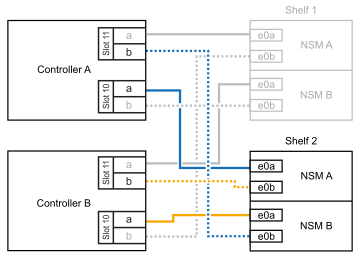
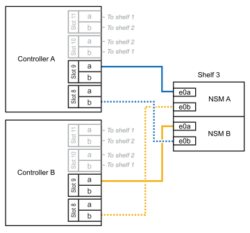

= 
:allow-uri-read: 

.Sobre esta tarefa
* Esse procedimento pressupõe que o seu par de HA tenha pelo menos uma gaveta de NS224 existente.
* Este procedimento aborda os seguintes cenários de adição dinâmica:
+
** Adição automática de uma segunda gaveta a um par de HA com dois módulos de e/S compatíveis com RoCE em cada controladora. (Você instalou um segundo módulo de e/S e reconetou a primeira gaveta para ambos os módulos de e/S ou já tinha a primeira gaveta cabeada para dois módulos de e/S. Você vai ligar a segunda gaveta a ambos os módulos de e/S).
** Adição automática de uma terceira gaveta a um par de HA com três módulos de e/S compatíveis com RoCE em cada controladora. (Você instalou um terceiro módulo de e/S e caberá a terceira prateleira somente ao terceiro módulo de e/S).
** Adição automática de uma terceira gaveta a um par de HA com quatro módulos de e/S compatíveis com RoCE em cada controladora. (Você instalou um terceiro e quarto módulo de e/S e caberá a terceira prateleira para o terceiro e quarto módulos de e/S).
** Adição automática de uma quarta gaveta a um par de HA com quatro módulos de e/S compatíveis com RoCE em cada controladora. (Você instalou um quarto módulo de e/S e reconetou a terceira gaveta para o terceiro e quarto módulos de e/S ou já tinha a terceira gaveta cabeada para o terceiro e quarto módulos de e/S. Você vai ligar a quarta prateleira para o terceiro e quarto módulo de e/S).

.Passos
. Se a gaveta de NS224 TB que você está adicionando quente for a segunda gaveta de NS224 TB no par de HA, execute as seguintes etapas.
+
Caso contrário, vá para a próxima etapa.

+
.. Compartimento de cabos NSM A porta e0a para controlador A slot 10 porta a (e10a).
.. Compartimento de cabos NSM A porta e0b para a porta b (e11b) do slot 11 do controlador B.
.. Compartimento de cabos NSM B porta e0a para a porta a (e10a) do slot B do controlador B slot 10.
.. Compartimento de cabos NSM B porta e0b para a porta b (e11b) do slot 11 do controlador A.
+
A ilustração a seguir destaca o cabeamento para a segunda gaveta do par de HA com dois módulos de e/S compatíveis com RoCE em cada controladora:

+

. Se o compartimento de NS224 TB que você estiver adicionando a quente for o terceiro compartimento de NS224 TB no par de HA com três módulos de e/S compatíveis com RoCE em cada controladora, execute as seguintes etapas. Caso contrário, vá para a próxima etapa.
+
.. Compartimento de cabos NSM A porta e0a para controlador A slot 9 porta a (e9a).
.. Compartimento de cabos NSM A porta e0b para a porta b (e9b) do slot 9 do controlador B.
.. Compartimento de cabos NSM B porta e0a para a porta a (e9a) do slot B do controlador B slot 9.
.. Compartimento de cabos NSM B porta e0b para a porta b (e9b) do slot 9 do controlador A.
+
A ilustração a seguir destaca o cabeamento da terceira gaveta do par de HA com três módulos de e/S compatíveis com RoCE em cada controladora:

+
image::../media/drw_ns224_vino_m_3shelves_3cards_ieops-1643.svg[Cabeamento para AFF/ASA A1K com três gavetas e três módulos de e/S]

. Se o compartimento de NS224 TB que você estiver adicionando a quente for o terceiro compartimento de NS224 TB no par de HA com quatro módulos de e/S compatíveis com RoCE em cada controladora, execute as seguintes etapas. Caso contrário, vá para a próxima etapa.
+
.. Compartimento de cabos NSM A porta e0a para controlador A slot 9 porta a (e9a).
.. Compartimento de cabos NSM A porta e0b para a porta b (e8b) do slot 8 do controlador B.
.. Compartimento de cabos NSM B porta e0a para a porta a (e9a) do slot B do controlador B slot 9.
.. Compartimento de cabos NSM B porta e0b para a porta b (e8b) do slot 8 do controlador A.
+
A ilustração a seguir destaca o cabeamento da terceira gaveta do par de HA com quatro módulos de e/S compatíveis com RoCE em cada controladora:

+

. Se o compartimento NS224 que você está adicionando a quente for o quarto compartimento NS224 no par de HA com quatro módulos de e/S compatíveis com RoCE em cada controladora, execute as seguintes etapas.
+
.. Compartimento de cabos NSM A porta e0a para controlador A slot 8 porta a (e8a).
.. Compartimento de cabos NSM A porta e0b para a porta b (e9b) do slot 9 do controlador B.
.. Compartimento de cabos NSM B porta e0a para a porta a (e8a) do slot B do controlador B slot 8.
.. Compartimento de cabos NSM B porta e0b para a porta b (e9b) do slot 9 do controlador A.
+
A ilustração a seguir destaca o cabeamento da quarta gaveta no par de HA com quatro módulos de e/S compatíveis com RoCE em cada controladora:

+
image::../media/drw_ns224_vino_m_4shelves_4cards_ieops-1645.svg[Cabeamento para AFF/ASA A1K com quatro gavetas e quatro módulos de e/S]

. Verifique se o compartimento hot-added está cabeado corretamente usando https://mysupport.netapp.com/site/tools/tool-eula/activeiq-configadvisor["Active IQ Config Advisor"^]o .
+
Se forem gerados erros de cabeamento, siga as ações corretivas fornecidas.

