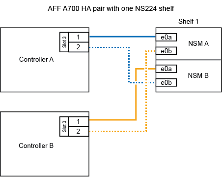

= 
:allow-uri-read: 

.Antes de começar
Se você estiver adicionando o shelf inicial de NS224 TB (não há compartimento de NS224 TB no seu par de HA), instale um módulo de despejo de memória (X9170A GB, NVMe 1TB SSD) em cada controladora para dar suporte a despejos de núcleo (armazenar arquivos de núcleo).

+ Ver link:../fas9000/caching-module-and-core-dump-module-replace.html["Substitua o módulo de armazenamento em cache ou adicione/substitua um módulo de despejo de núcleo - AFF A700 e FAS9000"^].

.Sobre esta tarefa
A forma como você faz o cabeamento de uma gaveta de NS224 a um par de HA do AFF A700 depende do número de gavetas que você está adicionando ao quente e do número de conjuntos de portas com capacidade para RoCE (um ou dois) que você está usando nas controladoras.

.Passos
. Se você estiver adicionando um compartimento usando um conjunto de portas compatíveis com RoCE (um módulo de e/S compatível com RoCE) em cada controladora e esse for o único compartimento de NS224 TB do seu par de HA, execute as seguintes etapas.
+
Caso contrário, vá para a próxima etapa.

+

NOTE: Esta etapa pressupõe que você instalou o módulo de e/S compatível com RoCE no slot 3, em vez do slot 7, em cada controlador.

+
.. Prateleira de cabos NSM A porta e0a para controlador A slot 3 porta a..
.. Compartimento de cabos NSM A porta e0b para a porta B do slot 3 do controlador b.
.. Compartimento de cabos NSM B porta e0a para a 3 porta a. do slot B do controlador B..
.. Compartimento de cabos NSM B porta e0b para a porta b do slot 3 do controlador A.
+
A ilustração a seguir mostra o cabeamento de uma gaveta hot-added usando um módulo de e/S compatível com RoCE em cada controladora:

+

. Se você estiver adicionando uma ou duas gavetas usando dois conjuntos de portas compatíveis com RoCE (dois módulos de e/S compatíveis com RoCE) em cada controladora, execute as subetapas aplicáveis.
+
[cols="1,3"]
|===
| Compartimentos | Cabeamento 

 a| 
Gaveta 1
 a| 

NOTE: Essas subetapas supõem que você está iniciando o cabeamento pela porta da gaveta de cabeamento e0a para o módulo de e/S compatível com RoCE no slot 3, em vez do slot 7.

.. Cabo NSM A porta e0a para controlador A slot 3 porta a..
.. Cabo NSM A porta e0b para a porta B do slot 7 do controlador b.
.. Cabo NSM B porta e0a para a 3 porta a. do slot B do controlador B..
.. Cabo NSM B porta e0b para controlador A slot 7 porta b..
.. Se você estiver adicionando uma segunda prateleira com o produto em funcionamento, conclua as subetapas "`Prateleira 2`"; caso contrário, vá para a próxima etapa.

 a| 
Gaveta 2
 a| 

NOTE: Essas subetapas supõem que você está iniciando o cabeamento pela porta da gaveta de cabeamento e0a para o módulo de e/S compatível com RoCE no slot 7, em vez do slot 3 (que se correlaciona com as subetapas de cabeamento para a gaveta 1).

.. Cabo NSM A porta e0a para controlador A slot 7 porta a..
.. Cabo NSM A porta e0b para a porta B do slot 3 do controlador b.
.. Cabo NSM B porta e0a para a 7 porta a. do slot B do controlador B..
.. Cabo NSM B porta e0b para controlador A slot 3 porta b..
.. Vá para a próxima etapa.

|===
+
A ilustração a seguir mostra o cabeamento para a primeira e segunda prateleiras hot-added:

+
image::../media/drw_ns224_a700_2shelves.png[Cabeamento de um AFF A700 com duas gavetas NS224 e dois conjuntos de portas de módulo de e/S]

. Verifique se o compartimento hot-added está cabeado corretamente usando https://mysupport.netapp.com/site/tools/tool-eula/activeiq-configadvisor["Active IQ Config Advisor"^]o .
+
Se forem gerados erros de cabeamento, siga as ações corretivas fornecidas.

