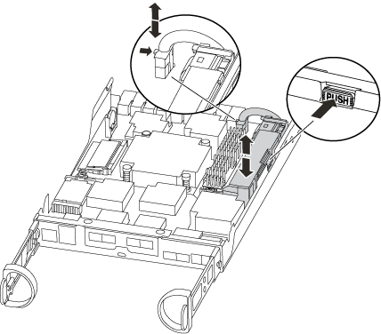

= Substitua um DIMM - AFF A150
:allow-uri-read: 
:icons: font
:imagesdir: ../media/

[role="lead"]
Você deve substituir um DIMM no controlador quando seu sistema de armazenamento encontrar erros como erros CECC excessivos (códigos de correção de erros Correctable) que são baseados em alertas do Monitor de integridade ou erros ECC incorrigíveis, geralmente causados por uma única falha de DIMM que impede o sistema de armazenamento de inicializar o ONTAP.

Todos os outros componentes do sistema devem estar funcionando corretamente; caso contrário, você deve entrar em Contato com o suporte técnico.

Você deve substituir o componente com falha por um componente FRU de substituição que você recebeu de seu provedor.

== Passo 1: Desligue o controlador desativado

Para encerrar o controlador com deficiência, você deve determinar o status do controlador e, se necessário, assumir o controlador para que o controlador saudável continue fornecendo dados do armazenamento do controlador com deficiência.

.Sobre esta tarefa
* Se você tiver um sistema SAN, você deve ter verificado mensagens de  `cluster kernel-service show`evento ) para o blade SCSI do controlador afetado. O `cluster kernel-service show` comando (do modo avançado priv) exibe o nome do nó, link:https://docs.netapp.com/us-en/ontap/system-admin/display-nodes-cluster-task.html["status do quorum"]desse nó, o status de disponibilidade desse nó e o status operacional desse nó.
+
Cada processo SCSI-blade deve estar em quórum com os outros nós no cluster. Qualquer problema deve ser resolvido antes de prosseguir com a substituição.

* Se você tiver um cluster com mais de dois nós, ele deverá estar no quórum. Se o cluster não estiver em quórum ou se um controlador íntegro exibir false para qualificação e integridade, você deverá corrigir o problema antes de encerrar o controlador prejudicado; link:https://docs.netapp.com/us-en/ontap/system-admin/synchronize-node-cluster-task.html?q=Quorum["Sincronize um nó com o cluster"^]consulte .

.Passos
. Se o AutoSupport estiver ativado, suprimir a criação automática de casos invocando uma mensagem AutoSupport:
+
`system node autosupport invoke -node * -type all -message MAINT=<# of hours>h`

+
A seguinte mensagem AutoSupport suprime a criação automática de casos por duas horas:

+
`cluster1:> system node autosupport invoke -node * -type all -message MAINT=2h`

. Desabilitar devolução automática:
+
.. Digite o seguinte comando no console do controlador íntegro:
+
`storage failover modify -node _impaired_node_name_ -auto-giveback false`

.. Digitar `y` quando você vê o prompt _Você quer desabilitar o retorno automático?_

. Leve o controlador prejudicado para o prompt Loader:
+
[cols="1,2"]
|===
| Se o controlador afetado estiver a apresentar... | Então... 

 a| 
O prompt Loader
 a| 
Vá para a próxima etapa.

 a| 
A aguardar pela giveback...
 a| 
Pressione Ctrl-C e responda `y` quando solicitado.

 a| 
Prompt do sistema ou prompt de senha
 a| 
Assuma ou interrompa o controlador prejudicado do controlador saudável:

`storage failover takeover -ofnode _impaired_node_name_ -halt _true_`

O parâmetro _-halt True_ traz para o prompt Loader.

|===
. Se o sistema tiver apenas um módulo de controlador no chassi, desligue as fontes de alimentação e desconete os cabos de alimentação do controlador prejudicado da fonte de alimentação.

== Passo 2: Remova o módulo do controlador

Para aceder aos componentes no interior do controlador, tem de remover primeiro o módulo do controlador do sistema e, em seguida, remover a tampa do módulo do controlador.

.Passos
. Se você ainda não está aterrado, aterre-se adequadamente.
. Solte o gancho e a alça de loop que prendem os cabos ao dispositivo de gerenciamento de cabos e, em seguida, desconete os cabos do sistema e os SFPs (se necessário) do módulo do controlador, mantendo o controle de onde os cabos estavam conetados.
+
Deixe os cabos no dispositivo de gerenciamento de cabos para que, ao reinstalar o dispositivo de gerenciamento de cabos, os cabos sejam organizados.

. Retire e reserve os dispositivos de gerenciamento de cabos dos lados esquerdo e direito do módulo do controlador.
+
image::../media/drw_25xx_cable_management_arm.png[Inserir ou remover o ARM de gerenciamento de cabos]

. Aperte o trinco na pega do excêntrico até que este se solte, abra totalmente o manípulo do excêntrico para libertar o módulo do controlador do plano médio e, em seguida, utilizando duas mãos, puxe o módulo do controlador para fora do chassis.
+
image::../media/drw_2240_x_opening_cam_latch.png[Abrir o trinco do puxador da árvore de cames]

. Vire o módulo do controlador ao contrário e coloque-o numa superfície plana e estável.
. Abra a tampa deslizando as patilhas azuis para soltar a tampa e, em seguida, rode a tampa para cima e abra-a.
+
image::../media/drw_2600_opening_pcm_cover.png[Abrir ou fechar o módulo do controlador]

== Etapa 3: Substitua os DIMMs

Para substituir os DIMMs, localize-os dentro do controlador e siga a sequência específica de passos.

Se você estiver substituindo um DIMM, será necessário removê-lo depois de desconetar a bateria do NVMEM do módulo do controlador.

.Passos
. Se você ainda não está aterrado, aterre-se adequadamente.
. Verifique o LED NVMEM na parte traseira do módulo do controlador.
+
Você deve executar um desligamento normal do sistema antes de substituir os componentes do sistema para evitar a perda de dados não gravados na memória não volátil (NVMEM). O LED está localizado na parte de trás do módulo do controlador. Procure o seguinte ícone:

+
image::../media/drw_hw_nvram_icon.png[LED NV]

. Se o LED NVMEM não estiver piscando, não há conteúdo no NVMEM; você pode pular as etapas a seguir e prosseguir para a próxima tarefa neste procedimento.
. Se o LED NVMEM estiver intermitente, existem dados no NVMEM e tem de desligar a bateria para limpar a memória:
+
.. Localize a bateria, prima o clipe na face da ficha da bateria para soltar o clipe de bloqueio da tomada e, em seguida, desligue o cabo da bateria da tomada.
+

.. Confirme se o LED NVMEM já não está aceso.
.. Volte a ligar a ficha da bateria.

. Volte a <<Etapa 3: Substitua os DIMMs>>este procedimento para verificar novamente o LED do NVMEM.
. Localize os DIMMs no módulo do controlador.
. Observe a orientação do DIMM no soquete para que você possa inserir o DIMM de substituição na orientação adequada.
. Ejete o DIMM de seu slot, empurrando lentamente as duas abas do ejetor do DIMM em ambos os lados do DIMM e, em seguida, deslize o DIMM para fora do slot.
+

NOTE: Segure cuidadosamente o DIMM pelas bordas para evitar a pressão nos componentes da placa de circuito DIMM.

+
O número e a colocação dos DIMMs do sistema dependem do modelo do sistema.

+
A ilustração a seguir mostra a localização dos DIMMs do sistema:

+
image::../media/drw_2600_dimm_repl_animated_gif.png[Substituição de um DIMM]

. Remova o DIMM de substituição do saco de transporte antiestático, segure o DIMM pelos cantos e alinhe-o com o slot.
+
O entalhe entre os pinos no DIMM deve estar alinhado com a guia no soquete.

. Certifique-se de que as abas do ejetor DIMM no conetor estão na posição aberta e insira o DIMM diretamente no slot.
+
O DIMM encaixa firmemente no slot, mas deve entrar facilmente. Caso contrário, realinhar o DIMM com o slot e reinseri-lo.

+

NOTE: Inspecione visualmente o DIMM para verificar se ele está alinhado uniformemente e totalmente inserido no slot.

. Empurre com cuidado, mas firmemente, na borda superior do DIMM até que as abas do ejetor se encaixem no lugar sobre os entalhes nas extremidades do DIMM.
. Localize a tomada da ficha da bateria do NVMEM e, em seguida, aperte o grampo na face da ficha do cabo da bateria para a inserir na tomada.
+
Certifique-se de que a ficha fica fixa no módulo do controlador.

. Feche a tampa do módulo do controlador.

== Etapa 4: Reinstale o módulo do controlador

Depois de substituir os componentes no módulo do controlador, volte a instalá-lo no chassis.

.Passos
. Se você ainda não está aterrado, aterre-se adequadamente.
. Se ainda não o tiver feito, substitua a tampa no módulo do controlador.
. Alinhe a extremidade do módulo do controlador com a abertura no chassis e, em seguida, empurre cuidadosamente o módulo do controlador até meio do sistema.
+

NOTE: Não introduza completamente o módulo do controlador no chassis até ser instruído a fazê-lo.

. Recable o sistema, conforme necessário.
+
Se você removeu os conversores de Mídia (QSFPs ou SFPs), lembre-se de reinstalá-los se você estiver usando cabos de fibra ótica.

. Conclua a reinstalação do módulo do controlador:
+
[cols="1,2"]
|===
| Se o seu sistema estiver em... | Em seguida, execute estas etapas... 

 a| 
Um par de HA
 a| 
O módulo do controlador começa a arrancar assim que estiver totalmente assente no chassis.

.. Com a alavanca do came na posição aberta, empurre firmemente o módulo do controlador até que ele atenda ao plano médio e esteja totalmente assentado e, em seguida, feche a alavanca do came para a posição travada.
+

NOTE: Não utilize força excessiva ao deslizar o módulo do controlador para dentro do chassis para evitar danificar os conetores.

+
O controlador começa a arrancar assim que estiver sentado no chassis.

.. Se ainda não o tiver feito, reinstale o dispositivo de gerenciamento de cabos.
.. Prenda os cabos ao dispositivo de gerenciamento de cabos com o gancho e a alça de loop.

 a| 
Uma configuração autônoma
 a| 
.. Com a alavanca do came na posição aberta, empurre firmemente o módulo do controlador até que ele atenda ao plano médio e esteja totalmente assentado e, em seguida, feche a alavanca do came para a posição travada.
+

NOTE: Não utilize força excessiva ao deslizar o módulo do controlador para dentro do chassis para evitar danificar os conetores.

.. Se ainda não o tiver feito, reinstale o dispositivo de gerenciamento de cabos.
.. Prenda os cabos ao dispositivo de gerenciamento de cabos com o gancho e a alça de loop.
.. Volte a ligar os cabos de alimentação às fontes de alimentação e às fontes de alimentação e, em seguida, ligue a alimentação para iniciar o processo de arranque.

|===

== Etapa 5: Alterne agregados de volta em uma configuração de MetroCluster de dois nós

Esta tarefa só se aplica a configurações de MetroCluster de dois nós.

.Passos
. Verifique se todos os nós estão no `enabled` estado: `metrocluster node show`
+
[listing]
----
cluster_B::>  metrocluster node show

DR                           Configuration  DR
Group Cluster Node           State          Mirroring Mode
----- ------- -------------- -------------- --------- --------------------
1     cluster_A
              controller_A_1 configured     enabled   heal roots completed
      cluster_B
              controller_B_1 configured     enabled   waiting for switchback recovery
2 entries were displayed.
----
. Verifique se a ressincronização está concluída em todos os SVMs: `metrocluster vserver show`
. Verifique se todas as migrações automáticas de LIF que estão sendo executadas pelas operações de recuperação foram concluídas com sucesso: `metrocluster check lif show`
. Execute o switchback usando o `metrocluster switchback` comando de qualquer nó no cluster sobrevivente.
. Verifique se a operação de comutação foi concluída: `metrocluster show`
+
A operação de switchback ainda está em execução quando um cluster está no `waiting-for-switchback` estado:

+
[listing]
----
cluster_B::> metrocluster show
Cluster              Configuration State    Mode
--------------------	------------------- 	---------
 Local: cluster_B configured       	switchover
Remote: cluster_A configured       	waiting-for-switchback
----
+
A operação de switchback é concluída quando os clusters estão no `normal` estado.:

+
[listing]
----
cluster_B::> metrocluster show
Cluster              Configuration State    Mode
--------------------	------------------- 	---------
 Local: cluster_B configured      		normal
Remote: cluster_A configured      		normal
----
+
Se um switchback estiver demorando muito tempo para terminar, você pode verificar o status das linhas de base em andamento usando o `metrocluster config-replication resync-status show` comando.

. Restabelecer qualquer configuração SnapMirror ou SnapVault.

== Passo 6: Devolva a peça com falha ao NetApp

Devolva a peça com falha ao NetApp, conforme descrito nas instruções de RMA fornecidas com o kit. Consulte a https://mysupport.netapp.com/site/info/rma["Devolução de peças e substituições"] página para obter mais informações.
