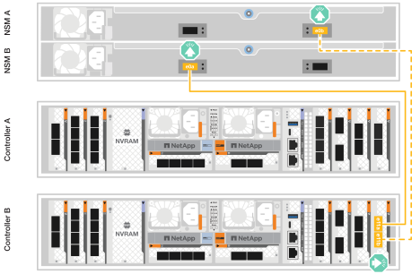

= Cable the hardware - AFF A1K
:allow-uri-read: 
:icons: font
:imagesdir: ../media/

[role="lead"]
Depois de instalar o hardware de rack para seu sistema de storage AFF A1K, instale os cabos de rede das controladoras e conete os cabos entre as controladoras e as gavetas de storage.

.Antes de começar
Contacte o administrador da rede para obter informações sobre como ligar o sistema de armazenamento aos comutadores.

.Sobre esta tarefa
* Esses procedimentos mostram configurações comuns. O cabeamento específico depende dos componentes solicitados para o seu sistema de storage. Para obter detalhes abrangentes de configuração e prioridade de slot, link:https://hwu.netapp.com["NetApp Hardware Universe"^]consulte .
* Os slots de e/S em um controlador AFF A1K são numerados de 1 a 11.
+
image::../media/drw_a1K_back_slots_labeled_ieops-2162.svg[Numeração de slots em um controlador AFF A1K]

* Os gráficos de cabeamento têm ícones de seta mostrando a orientação adequada (para cima ou para baixo) da aba de puxar do conetor do cabo ao inserir um conetor em uma porta.
+
Ao inserir o conetor, você deve sentir que ele clique no lugar; se você não sentir que ele clique, remova-o, vire-o e tente novamente.

+
image::../media/drw_cable_pull_tab_direction_ieops-1699.svg[Exemplo de orientação da patilha de puxar do cabo]

* Se o cabeamento de um switch ótico for feito, insira o transcetor ótico na porta da controladora antes de fazer o cabeamento da porta do switch.

== Etapa 1: Faça o cabeamento das conexões cluster/HA

Faça o cabeamento dos controladores ao cluster do ONTAP. Este procedimento difere dependendo do modelo do sistema de armazenamento e da configuração do módulo de e/S.

NOTE: O tráfego de interconexão de cluster e o tráfego de HA compartilham as mesmas portas físicas.

[role="tabbed-block"]
====
.Cabeamento de cluster sem switch
--
Use o cabo de interconexão cluster/HA para conetar as portas e1a a e1a e as portas e7a a e7a.

.Passos
. Conete a porta e1a no controlador A à porta e1a no controlador B.
. Conete a porta e7a no controlador A à porta e1a no controlador B.
+
*Cabos de interconexão de cluster/HA*

+
image::../media/oie_cable_25Gb_Ethernet_SFP28_ieops-1069.png[Cabo de HA de cluster]

+
image::../media/drw_a1k_tnsc_cluster_cabling_ieops-1648.svg[Diagrama de cabeamento de cluster sem switch de dois nós]

--
.Cabeamento de cluster comutado
--
Use o cabo de 100 GbE para conetar as portas e1a a e1a e as portas e7a a e7a.

.Passos
. Conete a porta e1a no controlador A e a porta e1a no controlador B ao switch de rede do cluster A..
. Conete a porta e7a no controlador A e a porta e7a no controlador B ao switch de rede do cluster B.
+
*Cabo de 100 GbE*

+
image::../media/oie_cable100_gbe_qsfp28.png[Cabo de 100 GB]

+
image::../media/drw_a1k_switched_cluster_cabling_ieops-1652.svg[Conexões do cluster de cabos à rede do cluster]

--
====

== Etapa 2: Faça o cabeamento das conexões de rede do host

Conete as portas do módulo Ethernet à rede host.

A seguir estão alguns exemplos típicos de cabeamento de rede de host. Consulte link:https://hwu.netapp.com["NetApp Hardware Universe"^] para obter a configuração específica do sistema.

.Passos
. Conete as portas e9a e e9b ao switch de rede de dados Ethernet.
+

NOTE: Para obter o máximo desempenho do sistema para tráfego de cluster e HA, não use as portas e1b e E7B para conexões de rede de host. Use uma placa de host separada para maximizar o desempenho.

+
*Cabo de 100 GbE*

+
image::../media/oie_cable_sfp_gbe_copper.png[100GB cabo Ethernet]

+
image::../media/drw_a1k_network_cabling1_ieops-1649.svg[Cabo para rede Ethernet 100GB]

. Conete seus switches de rede host de 10/25 GbE.
+
*Host de 10/25 GbE*

+
image::../media/oie_cable_sfp_gbe_copper.png[Cabo Ethernet 10/25GB]

+
image::../media/drw_a1k_network_cabling2_ieops-1650.svg[Cabo para rede Ethernet 10/25GB]

== Passo 3: Faça o cabeamento das conexões de rede de gerenciamento

Use os cabos RJ-45 de 1000BASEBASE-T para conetar as portas de gerenciamento (chave inglesa) em cada controlador aos switches de rede de gerenciamento.

*CABOS RJ-45 DE 1000BASEBASE-T*

image::../media/oie_cable_rj45.png[Cabos RJ-45]

image::../media/drw_a1k_management_connection_ieops-1651.svg[Conete-se à sua rede de gerenciamento]

IMPORTANT: Não conete os cabos de energia ainda.

== Etapa 4: Faça o cabeamento das conexões da prateleira

Os procedimentos de cabeamento a seguir mostram como conectar suas controladoras a um compartimento de storage. Escolha uma das seguintes opções de cabeamento que corresponda à sua configuração.

Para obter o número máximo de gavetas compatíveis com o seu sistema de storage e para todas as opções de cabeamento, link:https://hwu.netapp.com["NetApp Hardware Universe"^]consulte .

[role="tabbed-block"]
====
.Opção 1: Conetar a uma gaveta de armazenamento de NS224 GB
--
Conete cada controlador aos módulos NSM no compartimento NS224. Os gráficos mostram o cabeamento A do controlador em azul e o cabeamento B do controlador em amarelo.

*Cabos de cobre 100 GbE QSFP28*

image::../media/oie_cable100_gbe_qsfp28.png[Cabo de cobre de 100 GbE QSFP28]

.Passos
. No controlador A, ligue as seguintes portas:
+
.. Conete a porta e11a à porta NSM A e0a.
.. Conete a porta e11b à porta NSM B e0b.
+
image:../media/drw_a1k_1shelf_cabling_a_ieops-1703.svg["Controladora A e11a e e11b em uma única gaveta de NS224 U."]

. No controlador B, ligue as seguintes portas:
+
.. Conete a porta e11a à porta NSM B e0a.
.. Conete a porta e11b à porta NSM A e0b.
+

--
.Opção 2: Conete-se a duas gavetas de armazenamento NS224
--
Conecte cada controladora aos módulos do NSM nas duas gavetas NS224. Os gráficos mostram o cabeamento A do controlador em azul e o cabeamento B do controlador em amarelo.

*Cabos de cobre 100 GbE QSFP28*

image::../media/oie_cable100_gbe_qsfp28.png[Cabo de cobre de 100 GbE QSFP28]

.Passos
. No controlador A, ligue as seguintes portas:
+
.. Conete a porta e11a ao compartimento 1 NSM A porta e0a.
.. Conete a porta e11b à porta e0b do NSM B da gaveta 2.
.. Conete a porta e10a ao compartimento 2 NSM A porta e0a.
.. Conete a porta e10b ao compartimento 1 NSM A porta e0b.
+
image:../media/drw_a1k_2shelf_cabling_a_ieops-1705.svg["Conexões controlador a compartimento para o controlador A"]

. No controlador B, ligue as seguintes portas:
+
.. Conete a porta e11a à porta e0a do NSM B da gaveta 1.
.. Conete a porta e11b ao compartimento 2 NSM A porta e0b.
.. Conete a porta e10a à porta e0a do NSM B da gaveta 2.
.. Conete a porta e10b ao compartimento 1 NSM A porta e0b.
+
image:../media/drw_a1k_2shelf_cabling_b_ieops-1706.svg["Conexões controlador para compartimento para o controlador B"]

--
====
.O que se segue?
Depois de ter cabeado o hardware do seu sistema AFF A1K, link:install-power-hardware.html["Ligue o sistema de armazenamento AFF A1K"]você .
