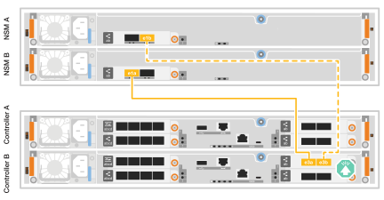

= Faça o cabo do hardware - AFF A20, AFF A30 e AFF A50
:allow-uri-read: 
:icons: font
:imagesdir: ../media/

[role="lead"]
Depois de instalar o hardware do sistema de storage AFF A20, AFF A30 ou AFF A50, faça o cabeamento das controladoras à rede e às gavetas.

.Antes de começar
Contacte o administrador da rede para obter informações sobre como ligar o sistema de armazenamento aos comutadores de rede.

.Sobre esta tarefa
* Os procedimentos de cabeamento de rede de cluster/HA e host mostram configurações comuns. Tenha em mente que o cabeamento específico depende dos componentes solicitados para o seu sistema de armazenamento. Para obter detalhes abrangentes de configuração e prioridade de slot, link:https://hwu.netapp.com["NetApp Hardware Universe"^]consulte .
* Os gráficos de cabeamento têm ícones de seta mostrando a orientação adequada (para cima ou para baixo) da aba de puxar do conetor do cabo ao inserir um conetor em uma porta.
+
Ao inserir o conetor, você deve sentir que ele clique no lugar; se você não sentir que ele clique, remova-o, vire-o e tente novamente.

+
image:../media/drw_cable_pull_tab_direction_ieops-1699.svg["Direção da patilha de puxar do cabo"]

* Se o cabeamento de um switch ótico for feito, insira o transcetor ótico na porta da controladora antes de fazer o cabeamento da porta do switch.

== Etapa 1: Faça o cabeamento das conexões cluster/HA

Faça o cabeamento dos controladores para criar as conexões do cluster ONTAP.

[role="tabbed-block"]
====
.Cabeamento de cluster sem switch
--
.AFF A30 ou AFF A50 com dois módulos de e/S de 40/100 GbE de 2 portas
[%collapsible]
=====
.Passos
. Cable as conexões de interconexão cluster/HA:
+

NOTE: O tráfego de interconexão de cluster e o tráfego de HA compartilham as mesmas portas físicas (nos módulos de e/S nos slots 2 e 4). As portas são de 40/100 GbE.

+
.. Controlador de cabo A porta E2A para a porta E2A do controlador B.
.. Controlador de cabo A porta e4a para a porta e4a do controlador B.
+

NOTE: As portas E2B e e4b do módulo de e/S não são utilizadas e estão disponíveis para conetividade de rede de host.

+
*Cabos de interconexão de cluster/HA de 100 GbE*

+
image::../media/oie_cable100_gbe_qsfp28.png[Cabo de cluster HA de 100 GbE]

+
image::../media/drw_isi_a30-50_switchless_2p_100gbe_2card_cabling_ieops-2011.svg[diagrama de cabeamento de cluster sem switch de a30 gbe e a50 gbe usando dois módulos de e/s de 100gbe gbe]

=====
.AFF A30 ou AFF A50 com um módulo de e/S de 40/100 GbE de 2 portas
[%collapsible]
=====
.Passos
. Cable as conexões de interconexão cluster/HA:
+

NOTE: O tráfego de interconexão de cluster e o tráfego de HA compartilham as mesmas portas físicas (no módulo de e/S no slot 4). As portas são de 40/100 GbE.

+
.. Controlador de cabo A porta e4a para a porta e4a do controlador B.
.. Controlador de cabo A porta e4b para a porta e4b do controlador B.
+
*Cabos de interconexão de cluster/HA de 100 GbE*

+
image::../media/oie_cable100_gbe_qsfp28.png[Cabo de cluster HA de 100 GbE]

+
image::../media/drw_isi_a30-50_switchless_2p_100gbe_1card_cabling_ieops-1925.svg[diagrama de cabeamento de cluster sem switch de a30 gbe e a50 gbe usando um módulo de e/s de 100gbe gbe]

=====
.AFF A20 com um módulo de e/S de 10/25 GbE de 2 portas
[%collapsible]
=====
.Passos
. Cable as conexões de interconexão cluster/HA:
+

NOTE: O tráfego de interconexão de cluster e o tráfego de HA compartilham as mesmas portas físicas (no módulo de e/S no slot 4). As portas são de 10/25 GbE.

+
.. Controlador de cabo A porta e4a para a porta e4a do controlador B.
.. Controlador de cabo A porta e4b para a porta e4b do controlador B.
+
*Cabos de interconexão de cluster/HA de 25 GbE*

+
image:../media/oie_cable_sfp_gbe_copper.png["Conetor de cobre GbE SFP, largura de 100px mm"]

+
image::../media/drw_isi_a20_switchless_2p_25gbe_cabling_ieops-2018.svg[diagrama de cabeamento de cluster sem switch de a20 gbe usando um módulo de e/s de 25 gbe]

=====
--
.Cabeamento de cluster comutado
--
.AFF A30 ou AFF A50 com dois módulos de e/S de 40/100 GbE de 2 portas
[%collapsible]
=====
.Passos
. Cable as conexões de interconexão cluster/HA:
+

NOTE: O tráfego de interconexão de cluster e o tráfego de HA compartilham as mesmas portas físicas (nos módulos de e/S nos slots 2 e 4). As portas são de 40/100 GbE.

+
.. Controlador de cabo A porta e4a para o switch de rede do cluster A..
.. Controlador de cabo A porta E2A para o switch de rede do cluster B.
.. Porta e4a do controlador de cabo B para o switch de rede do cluster A..
.. Porta E2A do controlador de cabo B para o switch de rede do cluster B.
+

NOTE: As portas E2B e e4b do módulo de e/S não são utilizadas e estão disponíveis para conetividade de rede de host.

+
*Cabos de interconexão de cluster/HA de 40/100 GbE*

+
image::../media/oie_cable100_gbe_qsfp28.png[Cabo de cluster HA de 40/100 GbE]

+
image::../media/drw_isi_a30-50_switched_2p_100gbe_2card_cabling_ieops-2013.svg[diagrama de cabeamento de cluster comutado a30 e a50 usando dois módulos de e/s 100gbe]

=====
.AFF A30 ou AFF A50 com um módulo de e/S de 40/100 GbE de 2 portas
[%collapsible]
=====
.Passos
. Faça o cabo dos controladores para os switches de rede do cluster:
+

NOTE: O tráfego de interconexão de cluster e o tráfego de HA compartilham as mesmas portas físicas (no módulo de e/S no slot 4). As portas são de 40/100 GbE.

+
.. Controlador de cabo A porta e4a para o switch de rede do cluster A..
.. Controlador de cabo A porta e4b para o switch de rede do cluster B.
.. Porta e4a do controlador de cabo B para o switch de rede do cluster A..
.. Porta e4b do controlador de cabo B para o switch de rede do cluster B.
+
*Cabos de interconexão de cluster/HA de 40/100 GbE*

+
image::../media/oie_cable100_gbe_qsfp28.png[Cabo de cluster HA de 40/100 GbE]

+
image::../media/drw_isi_a30-50_2p_100gbe_1card_switched_cabling_ieops-1926.svg[Conexões do cluster de cabos à rede do cluster]

=====
.AFF A20 com um módulo de e/S de 10/25 GbE de 2 portas
[%collapsible]
=====
. Faça o cabo dos controladores para os switches de rede do cluster:
+

NOTE: O tráfego de interconexão de cluster e o tráfego de HA compartilham as mesmas portas físicas (no módulo de e/S no slot 4). As portas são de 10/25 GbE.

+
.. Controlador de cabo A porta e4a para o switch de rede do cluster A..
.. Controlador de cabo A porta e4b para o switch de rede do cluster B.
.. Porta e4a do controlador de cabo B para o switch de rede do cluster A..
.. Porta e4b do controlador de cabo B para o switch de rede do cluster B.
+
*Cabos de interconexão de cluster/HA de 10/25 GbE*

+
image:../media/oie_cable_sfp_gbe_copper.png["Conetor de cobre GbE SFP, largura de 100px mm"]

+
image:../media/drw_isi_a20_switched_2p_25gbe_cabling_ieops-2019.svg["diagrama de cabeamento de cluster comutado a20 usando um módulo de e/s 25gbe"]

=====
--
====

== Etapa 2: Faça o cabeamento das conexões de rede do host

Faça o cabeamento das controladoras à rede de host Ethernet ou FC.

[role="tabbed-block"]
====
.Cabeamento de host Ethernet
--
.AFF A30 ou AFF A50 com dois módulos de e/S de 40/100 GbE de 2 portas
[%collapsible]
=====
.Passos
. Em cada controladora, as portas de cabo E2B e e4b para os switches de rede host Ethernet.
+

NOTE: As portas nos módulos de e/S no slot 2 e 4 são de 40/100 GbE (a conectividade de host é de 40/100 GbE).

+
*Cabos de 40/100 GbE*

+
image::../media/oie_cable_sfp_gbe_copper.png[Cabo de 40/100 GB]

+
image::../media/drw_isi_a30-50_host_2p_40-100gbe_2card_cabling_ieops-2014.svg[Cabo para switches de rede host ethernet 40/100gbe]

=====
.AFF A20, A30 ou AFF A50 com um módulo de e/S de 10/25 GbE de 4 portas
[%collapsible]
=====
.Passos
. Em cada controlador, as portas de cabo E2A, E2B, E2C e e2D para os switches de rede de host Ethernet.
+
*Cabos de 10/25 GbE*

+
image:../media/oie_cable_sfp_gbe_copper.png["Conetor de cobre GbE SFP, largura de 100px mm"]

+
image::../media/drw_isi_a30-50_host_2p_40-100gbe_1card_cabling_ieops-1923.svg[Cabo para switches de rede host ethernet 40/100gbe]

=====
--
.Cabeamento de host FC
--
.AFF A20, A30 ou AFF A50 com um módulo de e/S FC de 4 portas de 64 GB/s.
[%collapsible]
=====
.Passos
. Em cada controladora, cable as portas 1a, 1b, 1c e 1D para os switches de rede de host FC.
+
*Cabos FC de 64 GB/s*

+
image:../media/oie_cable_sfp_gbe_copper.png["Cabo fc de 64 GB, largura de 100px mm"]

+

=====
--
====

== Passo 3: Faça o cabeamento das conexões de rede de gerenciamento

Ligue os controladores à rede de gestão.

. Cable as portas de gerenciamento (chave inglesa) em cada controlador para os switches de rede de gerenciamento.
+
*CABOS RJ-45 DE 1000BASEBASE-T*

+
image::../media/oie_cable_rj45.png[Cabos RJ-45]

+
image::../media/drw_isi_g_wrench_cabling_ieops-1928.svg[Conete-se à sua rede de gerenciamento]

IMPORTANT: Não conete os cabos de energia ainda.

== Etapa 4: Faça o cabeamento das conexões da prateleira

Este procedimento mostra como enviar os controladores para uma gaveta de NS224 U.

.Sobre esta tarefa
* Para obter o número máximo de gavetas compatíveis com o seu sistema de storage e para todas as opções de cabeamento, como ótico e conectado a switch, link:https://hwu.netapp.com["NetApp Hardware Universe"^]consulte .
* Você faz o cabeamento de cada controlador para cada módulo NSM100B na prateleira NS224 usando os cabos de armazenamento fornecidos com o sistema de armazenamento, que pode ser o seguinte tipo de cabo:
+
*Cabos de cobre 100 GbE QSFP28*

+
image::../media/oie_cable100_gbe_qsfp28.png[Cabo de cobre de 100 GbE QSFP28]

* Os gráficos mostram o cabeamento A do controlador em azul e o cabeamento B do controlador em amarelo.

.Passos
. Controlador de cabo A para a prateleira:
+
.. Controlador de cabo A porta E3A para NSM A porta e1a.
.. Controlador de cabo A porta e3b para NSM B porta e1b.
+
image:../media/drw_isi_g_1_ns224_controller_a_cabling_ieops-1945.svg["Controladora A, portas E3A e e3b cabeadas para uma gaveta de NS224 U."]

. Controlador de cabo B para a prateleira:
+
.. Porta B do controlador de cabo E3A para a porta e1a do NSM B.
.. Porta B do controlador de cabo e3b para a porta e1b do NSM A.
+

.O que se segue?
Depois de ativar o hardware para o sistema de storage, você link:install-power-hardware.html["ligue o sistema de armazenamento"].
