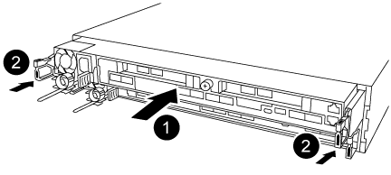

= Transfira a imagem de arranque para o suporte de arranque utilizando uma unidade flash USB - AFF A320
:allow-uri-read: 
:icons: font
:imagesdir: ../media/

[role="lead"]
A Mídia de inicialização de substituição que você instalou não tem uma imagem de inicialização, então você precisa transferir uma imagem de inicialização usando uma unidade flash USB.

* Você deve ter uma unidade flash USB, formatada para MBR/FAT32, com pelo menos 4GBGB de capacidade
* Uma cópia da mesma versão de imagem do ONTAP que a que o controlador afetado estava a executar. Você pode baixar a imagem apropriada da seção Downloads no site de suporte da NetApp
+
** Se a NVE estiver ativada, transfira a imagem com encriptação de volume NetApp, conforme indicado no botão de transferência.
** Se a NVE não estiver ativada, transfira a imagem sem encriptação de volume NetApp, conforme indicado no botão de transferência.

* Se o seu sistema for um par de HA, tem de ter uma ligação de rede.
* Se o seu sistema for um sistema autónomo, não necessita de uma ligação de rede, mas tem de efetuar uma reinicialização adicional ao restaurar o sistema de ficheiros var.
+
.. Transfira e copie a imagem de serviço apropriada do site de suporte da NetApp para a unidade flash USB.
+
... Transfira a imagem de serviço para o seu espaço de trabalho no seu computador portátil.
... Descompacte a imagem de serviço.
+

NOTE: Se você estiver extraindo o conteúdo usando o Windows, não use o winzip para extrair a imagem netboot. Use outra ferramenta de extração, como 7-Zip ou WinRAR.

+
Há duas pastas no arquivo de imagem de serviço descompactado:

+
**** inicialização
**** efi

... Copie a pasta efi para o diretório superior da unidade flash USB.
+
A unidade flash USB deve ter a pasta efi e a mesma versão de imagem de serviço (BIOS) do que o controlador deficiente está executando.

... Retire a unidade flash USB do seu computador portátil.

.. Se ainda não o tiver feito, feche a conduta de ar.
.. Alinhe a extremidade do módulo do controlador com a abertura no chassis e, em seguida, empurre cuidadosamente o módulo do controlador até meio do sistema.
.. Reinstale o dispositivo de gerenciamento de cabos e reconete o sistema, conforme necessário.
+
Ao reativar, lembre-se de reinstalar os conversores de Mídia (SFPs ou QSFPs) se eles foram removidos.

.. Ligue o cabo de alimentação à fonte de alimentação e volte a instalar o fixador do cabo de alimentação.
.. Introduza a unidade flash USB na ranhura USB do módulo do controlador.
+
Certifique-se de que instala a unidade flash USB na ranhura identificada para dispositivos USB e não na porta da consola USB.

.. Conclua a reinstalação do módulo do controlador:
+

+
... Certifique-se de que os braços do trinco estão bloqueados na posição estendida.
... Utilizando os braços de engate, empurre o módulo do controlador para dentro do compartimento do chassis até parar.
+

NOTE: Não empurre para baixo o mecanismo de bloqueio na parte superior dos braços do trinco. Fazendo isso com levante o mecanismo de bloqueio e proíba deslizar o módulo do controlador para dentro do chassi.

... Prima e mantenha premidas as patilhas cor-de-laranja na parte superior do mecanismo de bloqueio.
... Empurre cuidadosamente o módulo do controlador para dentro do compartimento do chassis até que esteja alinhado com as extremidades do chassis.
+

NOTE: Os braços do mecanismo de engate deslizam para o chassis.

+
O módulo do controlador começa a arrancar assim que estiver totalmente assente no chassis.

... Solte os trincos para bloquear o módulo do controlador no devido lugar.
... Se ainda não o tiver feito, reinstale o dispositivo de gerenciamento de cabos.

.. Interrompa o processo de inicialização pressionando Ctrl-C para parar no prompt DO Loader.
+
Se você perder essa mensagem, pressione Ctrl-C, selecione a opção para inicializar no modo Manutenção e, em seguida, interrompa o controlador para inicializar NO Loader.

.. Embora as variáveis de ambiente e bootargs sejam mantidas, você deve verificar se todas as variáveis de ambiente de inicialização necessárias e bootargs estão corretamente definidas para o seu tipo de sistema e configuração usando o `printenv bootarg name` comando e corrigir quaisquer erros usando o `setenv variable-name <value>` comando.
+
... Verifique as variáveis de ambiente de inicialização:
+
**** `bootarg.init.boot_clustered`
**** `partner-sysid`
**** `bootarg.init.flash_optimized` Para AFF C190/AFF A220 (All Flash FAS)
**** `bootarg.init.san_optimized` Para AFF A220 e array all-flash SAN
**** `bootarg.init.switchless_cluster.enable`

... Se o Gerenciador de chaves Externo estiver habilitado, verifique os valores de inicialização listados na `kenv` saída ASUP:
+
**** `bootarg.storageencryption.support <value>`
**** `bootarg.keymanager.support <value>`
**** `kmip.init.interface <value>`
**** `kmip.init.ipaddr <value>`
**** `kmip.init.netmask <value>`
**** `kmip.init.gateway <value>`

... Se o Gerenciador de chaves integrado estiver habilitado, verifique os valores de bootarg listados na `kenv` saída ASUP:
+
**** `bootarg.storageencryption.support <value>`
**** `bootarg.keymanager.support <value>`
**** `bootarg.onboard_keymanager <value>`

... Salve as variáveis de ambiente que você alterou com o `savenv` comando
... Confirme as alterações usando o `printenv _variable-name_` comando.

.. A partir do prompt Loader, inicialize a imagem de recuperação da unidade flash USB: `boot_recovery`
+
A imagem é transferida da unidade flash USB.

.. Quando solicitado, insira o nome da imagem ou aceite a imagem padrão exibida dentro dos colchetes na tela.
.. Após a instalação da imagem, inicie o processo de restauração:
+
... Registe o endereço IP do controlador afetado que é apresentado no ecrã.
... Pressione `y` quando solicitado para restaurar a configuração de backup.
... Pressione `y` quando solicitado a substituir /etc/ssh/ssh_host_dsa_key.

.. A partir do controlador parceiro no nível avançado de privilégio, inicie a sincronização de configuração utilizando o endereço IP registado na etapa anterior: `system node restore-backup -node local -target-address _impaired_node_IP_address_`
.. Se a restauração for bem-sucedida, pressione `y` no controlador prejudicado quando solicitado a usar a cópia restaurada?.
.. Prima `y` quando vir confirmar que o procedimento de cópia de segurança foi bem-sucedido e, em seguida, prima `y` quando lhe for pedido para reiniciar o controlador.
.. Verifique se as variáveis ambientais estão definidas como esperado.
+
... Leve o controlador para o prompt Loader.
+
No prompt do ONTAP, você pode emitir o comando system node halt -skip-lif-migration-before-shutdown true -ignore-quórum-warnings true -inhibit-overall true.

... Verifique as configurações de variáveis de ambiente com o `printenv` comando.
... Se uma variável de ambiente não for definida como esperado, modifique-a com o `setenv __environment-variable-name__ __changed-value__` comando.
... Salve suas alterações usando o `savenv` comando.
... Reinicie o controlador.

.. Com o controlador desativado reinicializado exibindo a `Waiting for giveback...` mensagem, execute um giveback do controlador saudável:
+
[cols="1,2"]
|===
| Se o seu sistema estiver em... | Então... 

 a| 
Um par de HA
 a| 
Depois que o controlador afetado estiver a apresentar a `Waiting for giveback...` mensagem, efetue uma giveback a partir do controlador saudável:

... A partir do controlador saudável: `storage failover giveback -ofnode partner_node_name`
+
O controlador prejudicado recupera seu armazenamento, termina a inicialização e, em seguida, reinicia e é novamente tomado pelo controlador saudável.

+

NOTE: Se o giveback for vetado, você pode considerar substituir os vetos.

+
https://docs.netapp.com/us-en/ontap/high-availability/index.html["Gerenciamento de par HA"^]

... Monitorize o progresso da operação de giveback utilizando o `storage failover show-giveback` comando.
... Após a conclusão da operação de giveback, confirme se o par de HA está saudável e se a aquisição é possível usando o `storage failover show` comando.
... Restaure o giveback automático se você o tiver desativado usando o comando de modificação de failover de armazenamento.

|===
.. Saia do nível de privilégio avançado no controlador saudável.

