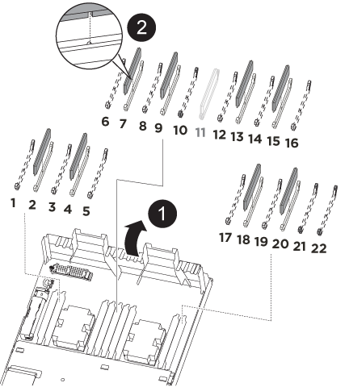

= Substitua o hardware do módulo do controlador - AFF A320
:allow-uri-read: 
:icons: font
:imagesdir: ../media/

[role="lead"]
Para substituir o hardware do módulo do controlador, é necessário remover o controlador prejudicado, mover os componentes FRU para o módulo do controlador de substituição, instalar o módulo do controlador de substituição no chassis e, em seguida, inicializar o sistema para o modo de manutenção.

== Passo 1: Remova o módulo do controlador

Para aceder aos componentes no interior do módulo do controlador, tem de remover o módulo do controlador do chassis.

Pode utilizar as seguintes imagens ou os passos escritos para remover o módulo do controlador do chassis.

A imagem seguinte mostra a remoção dos cabos e braços de gestão do cabo do módulo do controlador afetado:

image::../media/drw_a320_controller_cable_unplug_animated_gif.png[Remover o dispositivo de gerenciamento de cabos]

A imagem seguinte mostra a remoção do módulo do controlador afetado do chassis:

image::../media/drw_a320_controller_remove_animated_gif.png[Remover o controlador]

. Se você ainda não está aterrado, aterre-se adequadamente.
. Desconete a fonte de alimentação do módulo do controlador da fonte de alimentação.
. Solte o gancho e a alça de loop que prendem os cabos ao dispositivo de gerenciamento de cabos e, em seguida, desconete os cabos do sistema e os SFPs (se necessário) do módulo do controlador, mantendo o controle de onde os cabos estavam conetados.
+
Deixe os cabos no dispositivo de gerenciamento de cabos para que, ao reinstalar o dispositivo de gerenciamento de cabos, os cabos sejam organizados.

. Retire e reserve os dispositivos de gerenciamento de cabos dos lados esquerdo e direito do módulo do controlador.
. Retire o módulo do controlador do chassis:
+
.. Insira o indicador no mecanismo de travamento em ambos os lados do módulo do controlador.
.. Prima a patilha cor-de-laranja na parte superior do mecanismo de bloqueio até este libertar o pino de bloqueio no chassis.
+
O gancho do mecanismo de travamento deve estar quase na vertical e deve estar livre do pino do chassi.

.. Puxe cuidadosamente o módulo do controlador algumas polegadas na sua direção para que possa agarrar os lados do módulo do controlador.
.. Usando ambas as mãos, puxe cuidadosamente o módulo do controlador para fora do chassi e coloque-o em uma superfície plana e estável.

== Passo 2: Mova as fontes de alimentação

Deve mover a fonte de alimentação do módulo do controlador afetado para o módulo do controlador de substituição quando substituir um módulo do controlador.

. Rode a pega do excêntrico de forma a que possa ser utilizada para retirar a fonte de alimentação do módulo do controlador enquanto prime a patilha de bloqueio azul.
+

CAUTION: A fonte de alimentação é curta. Utilize sempre as duas mãos para o apoiar quando o retirar do módulo do controlador, de modo a que não se liberte subitamente do módulo do controlador e o machuque.

. Mova a fonte de alimentação para o novo módulo do controlador e, em seguida, instale-a.
. Utilizando ambas as mãos, apoie e alinhe as extremidades da fonte de alimentação com a abertura no módulo do controlador e, em seguida, empurre cuidadosamente a fonte de alimentação para o módulo do controlador até que a patilha de bloqueio encaixe no lugar.
+
As fontes de alimentação apenas engatarão adequadamente com o conetor interno e trancam no lugar de uma forma.

+

NOTE: Para evitar danificar o conetor interno, não utilize força excessiva ao deslizar a fonte de alimentação para o sistema.

== Etapa 3: Mova a bateria NVDIMM

Para mover a bateria NVDIMM do módulo do controlador desativado para o módulo do controlador de substituição, é necessário executar uma sequência específica de passos.

Você pode usar a ilustração a seguir ou as etapas escritas para mover a bateria NVDIMM do módulo do controlador prejudicado para o módulo do controlador de substituição.

image::../media/drw_a320_nvbat_move_animated_gif.png[Mova a bateria NV]

. Localize a bateria NVDIMM no módulo do controlador.
. Localize a ficha da bateria e aperte o clipe na face da ficha da bateria para soltar a ficha da tomada e, em seguida, desligue o cabo da bateria da tomada.
. Segure a bateria e pressione a patilha de bloqueio azul marcada com PUSH e, em seguida, levante a bateria para fora do suporte e do módulo do controlador.
. Desloque a bateria para o módulo do controlador de substituição.
. Alinhe o módulo da bateria com a abertura da bateria e, em seguida, empurre cuidadosamente a bateria para dentro da ranhura até encaixar no lugar.
+

NOTE: Não conete o cabo da bateria de volta à placa-mãe até que seja instruído a fazê-lo.

== Passo 4: Mova a Mídia de inicialização

Tem de localizar o suporte de arranque e, em seguida, seguir as instruções para o remover do módulo do controlador afetado e inseri-lo no módulo do controlador de substituição.

Pode utilizar a seguinte ilustração ou os passos escritos para mover o suporte de arranque do módulo do controlador afetado para o módulo do controlador de substituição.

image::../media/drw_a320_boot_media_move_animated_gif.png[Mova o suporte de arranque]

. Abra a conduta de ar e localize o suporte de arranque utilizando a seguinte ilustração ou o mapa da FRU no módulo do controlador:
. Localize e remova o suporte de arranque do módulo do controlador:
+
.. Pressione o botão azul na extremidade do suporte de inicialização até que o lábio do suporte de inicialização apague o botão azul.
.. Rode o suporte de arranque para cima e puxe cuidadosamente o suporte de arranque para fora do encaixe.

. Mova o suporte de arranque para o novo módulo do controlador, alinhe as extremidades do suporte de arranque com o alojamento da tomada e, em seguida, empurre-o suavemente para dentro do encaixe.
. Verifique o suporte de arranque para se certificar de que está encaixado corretamente e completamente no encaixe.
+
Se necessário, retire o suporte de arranque e volte a colocá-lo no socket.

. Bloqueie o suporte de arranque no devido lugar:
+
.. Rode o suporte de arranque para baixo em direção à placa-mãe.
.. Colocando um dedo na extremidade do suporte de arranque com o botão azul, prima a extremidade do suporte de arranque para engatar o botão de bloqueio azul.
.. Enquanto pressiona o suporte de arranque, levante o botão azul de bloqueio para bloquear o suporte de arranque no lugar.

== Passo 5: Mova os DIMMs

Você precisa localizar os DIMMs e depois movê-los do módulo do controlador prejudicado para o módulo do controlador de substituição.

Você deve ter o novo módulo de controlador pronto para que possa mover os DIMMs diretamente do módulo de controlador prejudicado para os slots correspondentes no módulo de controlador de substituição.

Você pode usar as ilustrações a seguir ou as etapas escritas para mover os DIMMs do módulo do controlador prejudicado para o módulo do controlador de substituição.

. Localize os DIMMs no módulo do controlador.
+
image::../media/drw_a320_dimm_map.png[Mapa de DIMM]

+
|===

 a| 
image:../media/icon_round_1.png["Legenda número 1"]
| Conduta de ar 

 a| 
image:../media/icon_round_2.png["Legenda número 2"]
 a| 
** Slots DIMMs do sistema: 2,4, 7, 9, 13, 15, 18 e 20
** Slot NVDIMM: 11
+

NOTE: O NVDIMM tem uma aparência significativamente diferente dos DIMMs do sistema.

|===
. Observe a orientação do DIMM no soquete para que você possa inserir o DIMM no módulo do controlador de substituição na orientação adequada.
. Verifique se a bateria NVDIMM não está conetada ao novo módulo do controlador.
. Mova os DIMMs do módulo do controlador prejudicado para o módulo do controlador de substituição:
+

NOTE: Certifique-se de que instala cada DIMM no mesmo slot que ocupou no módulo do controlador prejudicado.

+
.. Ejete o DIMM de seu slot, empurrando lentamente as abas do ejetor do DIMM em ambos os lados do DIMM e, em seguida, deslize o DIMM para fora do slot.
+

NOTE: Segure cuidadosamente o DIMM pelas bordas para evitar a pressão nos componentes da placa de circuito DIMM.

.. Localize o slot DIMM correspondente no módulo do controlador de substituição.
.. Certifique-se de que as abas do ejetor DIMM no soquete DIMM estão na posição aberta e insira o DIMM diretamente no soquete.
+
Os DIMMs se encaixam firmemente no soquete, mas devem entrar facilmente. Caso contrário, realinhar o DIMM com o soquete e reinseri-lo.

.. Inspecione visualmente o DIMM para verificar se ele está alinhado uniformemente e totalmente inserido no soquete.
.. Repita essas subetapas para os DIMMs restantes.

. Conete a bateria NVDIMM à placa-mãe.
+
Certifique-se de que a ficha fica fixa no módulo do controlador.

== Passo 6: Mova os risers PCIe

Você deve mover os risers PCIe, com as placas PCIe instaladas neles, do módulo de controlador prejudicado para o módulo de controlador de substituição.

Você pode usar a ilustração a seguir ou as etapas escritas para mover os risers PCIe do módulo do controlador prejudicado para o módulo do controlador de substituição.

image::../media/drw_a320_pci_riser_move_animated_gif.png[Mova a riser PCI]

. Remova a tampa sobre os risers PCIe desapertando o parafuso de aperto manual azul na tampa, deslize a tampa na sua direção, rode a tampa para cima, levante-a do módulo do controlador e, em seguida, coloque-a de lado.
. Retire os tirantes vazios do módulo do controlador de substituição.
+
.. Coloque o indicador no orifício do lado esquerdo do módulo riser e segure o riser com o polegar.
.. Levante a riser diretamente para cima e para fora do compartimento e, em seguida, coloque-a de lado.
.. Repita essas subetapas para o segundo riser.

. Mova os risers PCIe do módulo do controlador prejudicado para os mesmos compartimentos de riser no módulo do controlador de substituição:
+
.. Remova uma riser do módulo do controlador prejudicado e mova-a para o módulo do controlador de substituição.
.. Baixe a riser diretamente para dentro do compartimento, de modo que ela fique quadrada com o compartimento e os pinos da riser deslizem para dentro dos orifícios guia na parte traseira do compartimento.
.. Coloque o riser no soquete da placa-mãe diretamente para baixo no soquete, aplicando pressão até mesmo para baixo ao longo das bordas do riser até que ele assente.
+
A riser deve assentar suavemente com pouca resistência. Recoloque a riser no compartimento se você encontrar resistência significativa colocando a riser no soquete.

.. Repita essas subetapas para o segundo riser.
.. Reinstale a tampa sobre os risers PCIe.

== Passo 7: Instale o módulo do controlador

Depois de todos os componentes terem sido movidos do módulo do controlador afetado para o módulo do controlador de substituição, tem de instalar o módulo do controlador de substituição no chassis e, em seguida, iniciá-lo no modo de manutenção.

Você pode usar a ilustração a seguir ou as etapas escritas para instalar o módulo do controlador de substituição no chassi.

image::../media/drw_a320_controller_install_animated_gif.png[Instalar o controlador]

. Se ainda não o tiver feito, feche a conduta de ar na parte traseira do módulo do controlador e volte a instalar a tampa sobre as placas PCIe.
. Alinhe a extremidade do módulo do controlador com a abertura no chassis e, em seguida, empurre cuidadosamente o módulo do controlador até meio do sistema.
+

NOTE: Não introduza completamente o módulo do controlador no chassis até ser instruído a fazê-lo.

. Faça o cabeamento apenas das portas de gerenciamento e console, para que você possa acessar o sistema para executar as tarefas nas seções a seguir.
+

NOTE: Você conetará o resto dos cabos ao módulo do controlador posteriormente neste procedimento.

. Conclua a reinstalação do módulo do controlador:
+
.. Certifique-se de que os braços do trinco estão bloqueados na posição estendida.
.. Utilizando os braços de engate, empurre o módulo do controlador para dentro do compartimento do chassis até parar.
.. Prima e mantenha premidas as patilhas cor-de-laranja na parte superior do mecanismo de bloqueio.
.. Empurre cuidadosamente o módulo do controlador para dentro do compartimento do chassis até que esteja alinhado com as extremidades do chassis.
+

NOTE: Os braços do mecanismo de engate deslizam para o chassis.

+
O módulo do controlador começa a arrancar assim que estiver totalmente assente no chassis.

.. Solte os trincos para bloquear o módulo do controlador no devido lugar.
.. Recable a fonte de alimentação.
.. Se ainda não o tiver feito, reinstale o dispositivo de gerenciamento de cabos.
.. Interrompa o processo de inicialização normal pressionando `Ctrl-C`.

