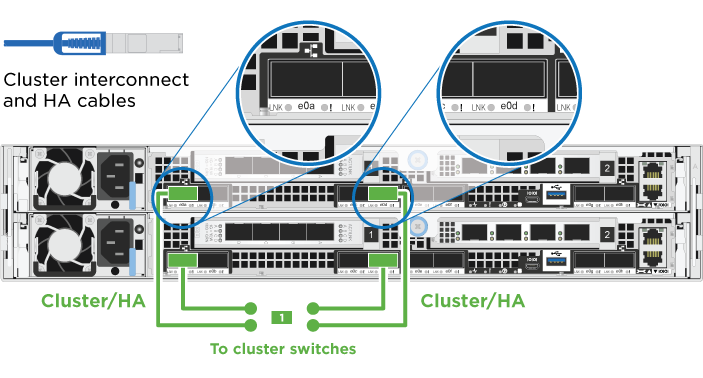
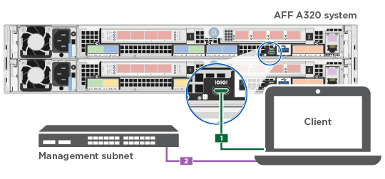

= Guia detalhado - AFF A320
:allow-uri-read: 
:icons: font
:imagesdir: ../media/

[role="lead"]
Este guia fornece instruções detalhadas passo a passo para instalar um sistema NetApp típico. Use este guia se quiser instruções de instalação mais detalhadas.

== Prepare-se para a instalação

Para instalar seu sistema AFF A320, você precisa criar uma conta, Registrar o sistema e obter chaves de licença. Você também precisa fazer o inventário do número e do tipo apropriados de cabos para o seu sistema e coletar informações específicas de rede.

Você precisa ter acesso ao Hardware Universe para obter informações sobre os requisitos do site, bem como informações adicionais sobre o sistema configurado. Você também pode querer ter acesso às Notas de versão da sua versão do ONTAP para obter mais informações sobre este sistema.

https://hwu.netapp.com["NetApp Hardware Universe"]

http://mysupport.netapp.com/documentation/productlibrary/index.html?productID=62286["Encontre as Notas de versão para sua versão do ONTAP 9"]

Você precisa fornecer o seguinte em seu site:

* Espaço em rack para o sistema de armazenamento
* Chave de fendas Phillips nº 2
* Cabos de rede adicionais para conetar seu sistema ao switch de rede e laptop ou console com um navegador da Web
* Um laptop ou console com uma conexão RJ-45 e acesso a um navegador da Web
+
.. Desembale o conteúdo de todas as caixas.
.. Registre o número de série do sistema nos controladores.
+
image::../media/drw_ssn_label.png[Exemplo de número de série do sistema]

.. Configure a sua conta:
+
... Inicie sessão na sua conta existente ou crie uma conta.
... Registe o seu sistema.
+
https://mysupport.netapp.com/eservice/registerSNoAction.do?moduleName=RegisterMyProduct["Registro de produto NetApp"]

.. Faça um inventário e anote o número e os tipos de cabos que você recebeu.
+
A tabela a seguir identifica os tipos de cabos que você pode receber. Se você receber um cabo não listado na tabela, consulte o Hardware Universe para localizar o cabo e identificar seu uso.

+
https://hwu.netapp.com["NetApp Hardware Universe"]

+
[cols="1,2,1,2"]
|===
| Tipo de cabo... | Número de peça e comprimento | Tipo de conetor | Para... 

 a| 
Cabo de 100 GbE (QSF(28)
 a| 
X66211A-05 (112-00595), 0,5m

X66211A-1 (112-00573), 1m

X66211A-2 (112-00574), 2m

X66211A-5 (112-00574), 5m
 a| 
image:../media/oie_cable100_gbe_qsfp28.png["Conetor 100 GbE QSFP28"]
 a| 
Storage, interconexão/HA de cluster e dados Ethernet (dependendo da ordem)

 a| 
Cabo de 40 GbE
 a| 
X66211A-1 (112-00573), 1m;

X66211A-3 (112-00543), 3m;

X66211A-5 (112-00576), 5m
 a| 
image:../media/oie_cable_sfp_gbe_copper.png["Conetor de cobre GbE SFP"]
 a| 
Storage, interconexão/HA de cluster e dados Ethernet (dependendo da ordem)

 a| 
Cabo Ethernet - MPO
 a| 
X66200-2 (112-00326), 2m

X66250-5 (112-00328), 5m

X66250-30 (112-00331), 30m
 a| 
image:../media/oie_cable_etherned_mpo.png["Cabo Ethernet - MPO"]
 a| 
Cabo Ethernet (dependente da ordem)

 a| 
Cabos óticos
 a| 
SR:

X6553-R6 (112-00188), 2m

X6554-R6 (112-00189), 15m

X6537-R6 (112-00091), 30m

LR:

X66250-3 (112-00342), 2m

X66260-5 (112-00344), 5m

X66260-30 (112-00354), 30m
 a| 
image:../media/oie_cable_fiber_lc_connector.png["Conetor de fibra LC"]
 a| 
Configurações FC (dependentes da ordem)

 a| 
RJ-45 (dependente da ordem)
 a| 
X6585-R6 (112-00291), 3m

X6562-R6 (112-00196), 5m
 a| 
image:../media/oie_cable_rj45.png["Conetor do cabo RJ-45"]
 a| 
Rede de gerenciamento

 a| 
Cabo micro-USB da consola
 a| 
Não aplicável
 a| 
image:../media/oie_cable_micro_usb.png["Conetor micro USB"]
 a| 
Conexão do console usada durante a configuração do software se o laptop ou o console não suportar descoberta de rede.

 a| 
Cabos de alimentação
 a| 
Não aplicável
 a| 
image:../media/oie_cable_power.png["Cabos de alimentação"]
 a| 
Ligar o sistema

|===
.. Baixe e complete a Planilha de configuração _Cluster_.
+
https://library.netapp.com/ecm/ecm_download_file/ECMLP2839002["Folha de trabalho de configuração do cluster"]

== Instale o hardware

Você precisa instalar seu sistema em um rack de 4 colunas ou gabinete do sistema NetApp, conforme aplicável.

. Instale os kits de calhas, conforme necessário.
. Instale e fixe o seu sistema utilizando as instruções incluídas no kit de calhas.
+

NOTE: Você precisa estar ciente das preocupações de segurança associadas ao peso do sistema.

+
image::../media/drw_a320_weight_label.png[Cuidado com o peso de elevação do sistema]

. Conete os dispositivos de gerenciamento de cabos (como mostrado).
+
image::../media/drw_a320_cable_management_arms.png[Retire ou instale os braços de gestão do cabo]

. Coloque a moldura na parte frontal do sistema.

== Controladores de cabo para a rede

Você pode conetar os controladores à rede usando o método de cluster sem switch de dois nós ou usando a rede de interconexão de cluster.

=== Opção 1: Cabo de um cluster sem switch de dois nós

As portas de dados opcionais, placas NIC opcionais e portas de gerenciamento nos módulos do controlador são conetadas aos switches. As portas de interconexão/HA do cluster são cabeadas em ambos os módulos do controlador.

Tem de ter contactado o administrador da rede para obter informações sobre a ligação do sistema aos comutadores.

Certifique-se de que verifica a seta da ilustração para a orientação adequada da presilha de puxar do conetor do cabo.

image::../media/oie_cable_pull_tab_up.png[Conetor de cabo com patilha na parte superior]

NOTE: Ao inserir o conetor, você deve senti-lo clicar no lugar; se você não sentir que ele clique, remova-o, vire-o e tente novamente.

. Você pode usar a ilustração ou as instruções passo a passo para concluir o cabeamento entre os controladores e os switches:
+
image::../media/drw_a320_tnsc_network_cabling_composite_animated_gif.png[Composto de cabeamento de cluster sem switch de dois nós]

+
[cols="1,2"]
|===
| Passo | Execute em cada módulo do controlador 

 a| 
image:../media/icon_square_1_green.png["Passo 1"]
 a| 
Faça o cabeamento das portas cluster/HA umas às outras com o cabo de 100 GbE (QSFP28):

** e0a a e0a
** e0d a e0d image:../media/drw_a320_tnsc_cluster_ha_connection_step1a.png["O cluster sem switch de dois nós coneta as conexões cluster-HA"]

 a| 
image:../media/icon_square_2_yellow.png["Passo 2"]
 a| 
Se você estiver usando as portas integradas para uma conexão de rede de dados, conete os cabos 100GbE ou 40GbE aos switches de rede de dados apropriados:

** e0g e e0h image:../media/drw_a320_onboard_data_connection_step2.png["Conete conexões de rede de dados integradas"]

 a| 
image:../media/icon_square_3_orange.png["Passo 3"]
 a| 
Se você estiver usando suas placas NIC para conexões Ethernet ou FC, conete a(s) placa(s) NIC aos switches apropriados:

image::../media/drw_a320_nic_connections_step3.png[O cluster sem switch de dois nós coneta as NICs]

 a| 
image:../media/icon_square_4_red.png["Passo 4"]
 a| 
Faça o cabeamento das e0M portas aos switches de rede de gerenciamento com os cabos RJ45.

image:../media/drw_a320_management_port_connection_step4.png["Conete a porta de gerenciamento"]

 a| 
image:../media/oie_legend_icon_attn_symbol.png["Símbolo de atenção"]
 a| 
NÃO conete os cabos de energia neste momento.

|===
. Faça o seu armazenamento por cabo: <<Controladores de cabos para compartimentos de unidades>>

=== Opção 2: Cabeamento de um cluster comutado

As portas de dados opcionais, placas NIC opcionais e portas de gerenciamento nos módulos do controlador são conetadas aos switches. As portas de interconexão/HA do cluster são cabeadas para o switch cluster/HA.

Tem de ter contactado o administrador da rede para obter informações sobre a ligação do sistema aos comutadores.

Certifique-se de que verifica a seta da ilustração para a orientação adequada da presilha de puxar do conetor do cabo.

image::../media/oie_cable_pull_tab_up.png[Conetor de cabo com patilha na parte superior]

NOTE: Ao inserir o conetor, você deve senti-lo clicar no lugar; se você não sentir que ele clique, remova-o, vire-o e tente novamente.

. Você pode usar a ilustração ou as instruções passo a passo para concluir o cabeamento entre os controladores e os switches:
+
image::../media/drw_a320_switched_network_cabling_composite_animated_GIF.png[Composto de cabeamento de cluster comutado]

+
[cols="1,3"]
|===
| Passo | Execute em cada módulo do controlador 

 a| 
image:../media/icon_square_1_green.png["Passo 1"]
 a| 
Faça o cabeamento das portas cluster/HA para o switch cluster/HA com o cabo de 100 GbE (QSFP28):

** e0a em ambos os controladores para o switch de cluster/HA
** e0d em ambos os controladores para o switch de cluster/HA 

 a| 
image:../media/icon_square_2_yellow.png["Passo 2"]
 a| 
Se você estiver usando as portas integradas para uma conexão de rede de dados, conete os cabos 100GbE ou 40GbE aos switches de rede de dados apropriados:

** e0g e e0h image:../media/drw_a320_onboard_data_connection_step2.png["Conexões de rede integradas de cluster comutado"]

 a| 
image:../media/icon_square_3_orange.png["Passo 3"]
 a| 
Se você estiver usando suas placas NIC para conexões Ethernet ou FC, conete a(s) placa(s) NIC aos switches apropriados:

image::../media/drw_a320_nic_connections_step3.png[Conexões de rede comutadas do cluster]

 a| 
image:../media/icon_square_4_red.png["Passo 4"]
 a| 
Faça o cabeamento das e0M portas aos switches de rede de gerenciamento com os cabos RJ45.

image:../media/drw_a320_management_port_connection_step4.png["Conexões de rede comutada de gerenciamento de cluster"]

 a| 
image:../media/oie_legend_icon_attn_symbol.png["Símbolo de atenção"]
 a| 
NÃO conete os cabos de energia neste momento.

|===
. Faça o seu armazenamento por cabo: <<Controladores de cabos para compartimentos de unidades>>

== Controladores de cabos para compartimentos de unidades

Você precisa vincular os controladores às gavetas usando as portas de storage integradas.

=== Opção 1: Cabeamento das controladoras a um único compartimento de unidade

Você deve vincular cada controlador aos módulos do NSM no compartimento de unidades NS224.

Certifique-se de que verifica a seta da ilustração para a orientação adequada da presilha de puxar do conetor do cabo.

image::../media/oie_cable_pull_tab_up.png[Conetor de cabo com patilha na parte superior]

NOTE: Ao inserir o conetor, você deve senti-lo clicar no lugar; se você não sentir que ele clique, remova-o, vire-o e tente novamente.

. Você pode usar a ilustração ou as instruções passo a passo para encaminhar seus controladores para uma única gaveta.
+
image::../media/drw_a320_single_shelf_connections_animated_gif.png[Composto de cabeamento de compartimento único de unidade]

+
[cols="1,3"]
|===
| Passo | Execute em cada módulo do controlador 

 a| 

 a| 
Controlador de cabos A à prateleira image:../media/drw_a320_storage_cabling_controller_a_single_shelf.png["Controlador de cabos A à prateleira"]

 a| 
image:../media/icon_square_2_yellow.png["Legenda número 2"]
 a| 
Controlador de cabo B para a prateleira: image:../media/drw_a320_storage_cabling_controller_b_single_shelf.png["Conete o controlador B a uma única gaveta"]

|===
. Para concluir a configuração do sistema, consulte <<Configuração e configuração completas do sistema>>

=== Opção 2: Cabeamento das controladoras para dois compartimentos de unidades

Você precisa vincular cada controlador aos módulos do NSM em ambas as gavetas de unidades NS224.

Certifique-se de que verifica a seta da ilustração para a orientação adequada da presilha de puxar do conetor do cabo.

image::../media/oie_cable_pull_tab_up.png[Conetor de cabo com patilha na parte superior]

NOTE: Ao inserir o conetor, você deve senti-lo clicar no lugar; se você não sentir que ele clique, remova-o, vire-o e tente novamente.

. Você pode usar a ilustração a seguir ou as etapas escritas para vincular os controladores a dois compartimentos de unidades.
+
image::../media/drw_a320_2_shevles_cabling_animated_gif.png[Animação de duas prateleiras de cabos]

+
[cols="1-3"]
|===
| Passo | Execute em cada módulo do controlador 

 a| 

 a| 
Controlador de cabos A para as prateleiras: image:../media/drw_a320_2_shelves_cabling_controller_a.png["Faça o cabo de duas gavetas para o controlador A"]

 a| 
image:../media/icon_square_2_yellow.png["Legenda número 2"]
 a| 
Controlador de cabos B para as prateleiras: image:../media/drw_a320_2_shelves_cabling_controller_b.png["O cabo teo se coneta ao controlador b"]

|===
. Para concluir a configuração do sistema, consulte <<Configuração e configuração completas do sistema>>

== Configuração e configuração completas do sistema

Você pode concluir a configuração e configuração do sistema usando a descoberta de cluster com apenas uma conexão com o switch e laptop, ou conetando-se diretamente a um controlador no sistema e, em seguida, conetando-se ao switch de gerenciamento.

=== Opção 1: Concluir a configuração e a configuração do sistema se a deteção de rede estiver ativada

Se tiver a deteção de rede ativada no seu computador portátil, pode concluir a configuração e configuração do sistema utilizando a deteção automática de cluster.

. Conete os cabos de alimentação às fontes de alimentação do controlador e, em seguida, conete-os a fontes de alimentação em diferentes circuitos.
+
O sistema começa a arrancar. A inicialização inicial pode levar até oito minutos

. Certifique-se de que o seu computador portátil tem a deteção de rede ativada.
+
Consulte a ajuda online do seu computador portátil para obter mais informações.

. Use a animação a seguir para conetar seu laptop ao switch de gerenciamento.
+
.Animação - Conete seu laptop ao interrutor de gerenciamento
video::d61f983e-f911-4b76-8b3a-ab1b0066909b[panopto]
. Selecione um ícone ONTAP listado para descobrir:
+
image::../media/drw_autodiscovery_controler_select.png[Selecione um ícone ONTAP]

+
.. Abra o Explorador de ficheiros.
.. Clique em *rede* no painel esquerdo e clique com o botão direito do rato e selecione *atualizar*.
.. Clique duas vezes no ícone ONTAP e aceite quaisquer certificados exibidos na tela.
+

NOTE: XXXXX é o número de série do sistema para o nó de destino.

+
O System Manager é aberto.

. Use a configuração guiada pelo Gerenciador de sistema para configurar o sistema usando os dados coletados no _Guia de configuração do NetApp ONTAP_.
+
https://library.netapp.com/ecm/ecm_download_file/ECMLP2862613["Guia de configuração do ONTAP"]

. Verifique a integridade do sistema executando o Config Advisor.
. Depois de concluir a configuração inicial, vá para para https://docs.netapp.com/us-en/ontap/index.html["Documentação do ONTAP 9"^] para obter informações sobre como configurar recursos adicionais no ONTAP.

=== Opção 2: Concluir a configuração e a configuração do sistema se a deteção de rede não estiver ativada

Se a deteção de rede não estiver ativada no seu computador portátil, tem de concluir a configuração e a configuração utilizando esta tarefa.

. Faça o cabo e configure o seu laptop ou console:
+
.. Defina a porta de console no laptop ou console para 115.200 baud com N-8-1.
+

NOTE: Consulte a ajuda on-line do seu laptop ou console para saber como configurar a porta do console.

.. Conete o cabo do console ao laptop ou console usando o cabo do console fornecido com o sistema e conete o laptop ao switch de gerenciamento na sub-rede de gerenciamento.
+

.. Atribua um endereço TCP/IP ao laptop ou console, usando um que esteja na sub-rede de gerenciamento.

. Use a animação a seguir para definir uma ou mais IDs de gaveta de unidade:
+
.Animação - Definir IDs do compartimento da unidade
video::c600f366-4d30-481a-89d9-ab1b0066589b[panopto]
. Conete os cabos de alimentação às fontes de alimentação do controlador e, em seguida, conete-os a fontes de alimentação em diferentes circuitos.
+
O sistema começa a arrancar. A inicialização inicial pode levar até oito minutos

. Atribua um endereço IP de gerenciamento de nó inicial a um dos nós.
+
[cols="1,3"]
|===
| Se a rede de gestão tiver DHCP... | Então... 

 a| 
Configurado
 a| 
Registre o endereço IP atribuído aos novos controladores.

 a| 
Não configurado
 a| 
.. Abra uma sessão de console usando PuTTY, um servidor de terminal ou o equivalente para o seu ambiente.
+

NOTE: Verifique a ajuda on-line do seu laptop ou console se você não sabe como configurar o PuTTY.

.. Insira o endereço IP de gerenciamento quando solicitado pelo script.

|===
. Usando o System Manager em seu laptop ou console, configure seu cluster:
+
.. Aponte seu navegador para o endereço IP de gerenciamento de nó.
+

NOTE: O formato para o endereço é https://x.x.x.x+.

.. Configure o sistema usando os dados coletados no _NetApp ONTAP Configuration Guide_.
+
https://library.netapp.com/ecm/ecm_download_file/ECMLP2862613["Guia de configuração do ONTAP"]

. Verifique a integridade do sistema executando o Config Advisor.
. Depois de concluir a configuração inicial, vá para para https://docs.netapp.com/us-en/ontap/index.html["Documentação do ONTAP 9"^] para obter informações sobre como configurar recursos adicionais no ONTAP.

