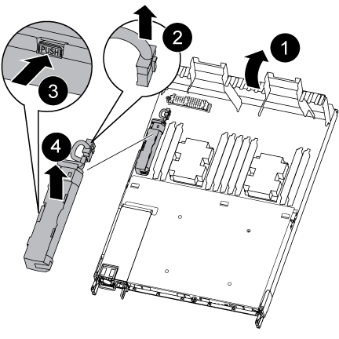

= Substitua a bateria NVDIMM - AFF A320
:allow-uri-read: 
:icons: font
:imagesdir: ../media/

[role="lead"]
Para substituir a bateria NVDIMM, é necessário remover o módulo do controlador, remover a bateria, substituir a bateria e reinstalar o módulo do controlador.

Todos os outros componentes do sistema devem estar funcionando corretamente; caso contrário, você deve entrar em Contato com o suporte técnico.

== Passo 1: Desligue o controlador

Para encerrar o controlador com deficiência, você deve determinar o status do controlador e, se necessário, assumir o controlador para que o controlador saudável continue fornecendo dados do armazenamento do controlador com deficiência.

.Sobre esta tarefa
* Se você tiver um sistema SAN, você deve ter verificado mensagens de  `cluster kernel-service show`evento ) para o blade SCSI do controlador afetado. O `cluster kernel-service show` comando (do modo avançado priv) exibe o nome do nó, link:https://docs.netapp.com/us-en/ontap/system-admin/display-nodes-cluster-task.html["status do quorum"]desse nó, o status de disponibilidade desse nó e o status operacional desse nó.
+
Cada processo SCSI-blade deve estar em quórum com os outros nós no cluster. Qualquer problema deve ser resolvido antes de prosseguir com a substituição.

* Se você tiver um cluster com mais de dois nós, ele deverá estar no quórum. Se o cluster não estiver em quórum ou se um controlador íntegro exibir false para qualificação e integridade, você deverá corrigir o problema antes de encerrar o controlador prejudicado; link:https://docs.netapp.com/us-en/ontap/system-admin/synchronize-node-cluster-task.html?q=Quorum["Sincronize um nó com o cluster"^]consulte .

.Passos
. Se o AutoSupport estiver ativado, suprimir a criação automática de casos invocando uma mensagem AutoSupport: `system node autosupport invoke -node * -type all -message MAINT=<# of hours>h`
+
A seguinte mensagem AutoSupport suprime a criação automática de casos por duas horas: `cluster1:> system node autosupport invoke -node * -type all -message MAINT=2h`

. Desative a giveback automática a partir da consola do controlador saudável: `storage failover modify –node local -auto-giveback false`
+

NOTE: Quando vir _do pretende desativar a auto-giveback?_, introduza `y`.

. Leve o controlador prejudicado para o prompt Loader:
+
[cols="1,2"]
|===
| Se o controlador afetado estiver a apresentar... | Então... 

 a| 
O prompt Loader
 a| 
Vá para a próxima etapa.

 a| 
A aguardar pela giveback...
 a| 
Pressione Ctrl-C e responda `y` quando solicitado.

 a| 
Prompt do sistema ou prompt de senha
 a| 
Assuma ou interrompa o controlador prejudicado do controlador saudável: `storage failover takeover -ofnode _impaired_node_name_`

Quando o controlador prejudicado mostrar aguardando a giveback..., pressione Ctrl-C e responda `y`.

|===

== Passo 2: Remova o módulo do controlador

Para aceder aos componentes no interior do módulo do controlador, tem de remover o módulo do controlador do chassis.

. Se você ainda não está aterrado, aterre-se adequadamente.
. Desconete a fonte de alimentação do módulo do controlador da fonte de alimentação.
. Solte o gancho e a alça de loop que prendem os cabos ao dispositivo de gerenciamento de cabos e, em seguida, desconete os cabos do sistema e os SFPs (se necessário) do módulo do controlador, mantendo o controle de onde os cabos estavam conetados.
+
image::../media/drw_a320_controller_cable_unplug_animated_gif.png[Remover o dispositivo de gerenciamento de cabos]

+
Deixe os cabos no dispositivo de gerenciamento de cabos para que, ao reinstalar o dispositivo de gerenciamento de cabos, os cabos sejam organizados.

. Retire e reserve os dispositivos de gerenciamento de cabos dos lados esquerdo e direito do módulo do controlador.
. Retire o módulo do controlador do chassis:
+
image::../media/drw_a320_controller_remove_animated_gif.png[Retire o controlador]

+
.. Insira o indicador no mecanismo de travamento em ambos os lados do módulo do controlador.
.. Prima a patilha cor-de-laranja na parte superior do mecanismo de bloqueio até este libertar o pino de bloqueio no chassis.

+
O gancho do mecanismo de travamento deve estar quase na vertical e deve estar livre do pino do chassi.

+
.. Puxe cuidadosamente o módulo do controlador algumas polegadas na sua direção para que possa agarrar os lados do módulo do controlador.
.. Usando ambas as mãos, puxe cuidadosamente o módulo do controlador para fora do chassi e coloque-o em uma superfície plana e estável.

== Etapa 3: Substitua a bateria NVDIMM

Para substituir a bateria NVDIMM, você deve remover a bateria com falha do módulo do controlador e instalar a bateria de substituição no módulo do controlador.

. Abra a conduta de ar e localize a bateria NVDIMM.
. Localize a ficha da bateria e aperte o clipe na face da ficha da bateria para soltar a ficha da tomada e, em seguida, desligue o cabo da bateria da tomada.
. Segure a bateria e pressione a patilha de bloqueio azul marcada com PUSH e, em seguida, levante a bateria para fora do suporte e do módulo do controlador.
. Retire a bateria de substituição da respetiva embalagem.
. Alinhe o módulo da bateria com a abertura da bateria e, em seguida, empurre cuidadosamente a bateria para dentro da ranhura até encaixar no lugar.
. Volte a ligar a ficha da bateria ao módulo do controlador e, em seguida, feche a conduta de ar.

== Passo 4: Instale o módulo do controlador

Depois de ter substituído o componente no módulo do controlador, tem de reinstalar o módulo do controlador no chassis e, em seguida, iniciá-lo.

. Se ainda não o tiver feito, feche a conduta de ar na parte traseira do módulo do controlador e volte a instalar a tampa sobre as placas PCIe.
. Alinhe a extremidade do módulo do controlador com a abertura no chassis e, em seguida, empurre cuidadosamente o módulo do controlador até meio do sistema.
+
image::../media/drw_a320_controller_install_animated_gif.png[Instale o controlador]

+

NOTE: Não introduza completamente o módulo do controlador no chassis até ser instruído a fazê-lo.

. Faça o cabeamento apenas das portas de gerenciamento e console, para que você possa acessar o sistema para executar as tarefas nas seções a seguir.
+

NOTE: Você conetará o resto dos cabos ao módulo do controlador posteriormente neste procedimento.

. Conclua a reinstalação do módulo do controlador:
+
.. Certifique-se de que os braços do trinco estão bloqueados na posição estendida.
.. Utilizando os braços de engate, empurre o módulo do controlador para dentro do compartimento do chassis até parar.
.. Prima e mantenha premidas as patilhas cor-de-laranja na parte superior do mecanismo de bloqueio.
.. Empurre cuidadosamente o módulo do controlador para dentro do compartimento do chassis até que esteja alinhado com as extremidades do chassis.
+

NOTE: Os braços do mecanismo de engate deslizam para o chassis.

+
O módulo do controlador começa a arrancar assim que estiver totalmente assente no chassis.

.. Solte os trincos para bloquear o módulo do controlador no devido lugar.
.. Recable a fonte de alimentação.
.. Se ainda não o tiver feito, reinstale o dispositivo de gerenciamento de cabos.

== Passo 5: Restaure o módulo do controlador para a operação

Você deve reajustar o sistema, devolver o módulo do controlador e, em seguida, reativar a giveback automática.

. Recable o sistema, conforme necessário.
+
Se você removeu os conversores de Mídia (QSFPs ou SFPs), lembre-se de reinstalá-los se você estiver usando cabos de fibra ótica.

. Volte a colocar o controlador em funcionamento normal, devolvendo o respetivo armazenamento: `storage failover giveback -ofnode _impaired_node_name_`
. Se a giveback automática foi desativada, reative-a: `storage failover modify -node local -auto-giveback true`

== Passo 6: Devolva a peça com falha ao NetApp

Devolva a peça com falha ao NetApp, conforme descrito nas instruções de RMA fornecidas com o kit. Consulte a https://mysupport.netapp.com/site/info/rma["Devolução de peças e substituições"] página para obter mais informações.
