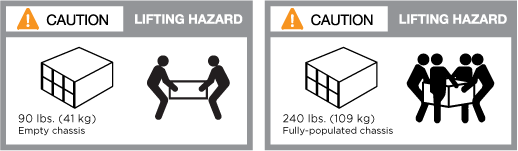
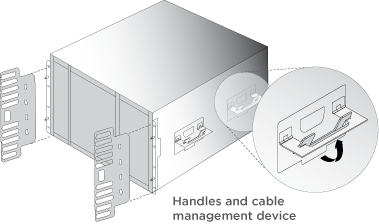
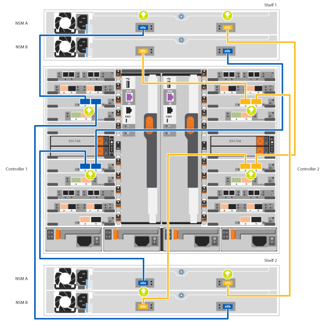

= Guia detalhado - AFF A700
:allow-uri-read: 
:icons: font
:imagesdir: ../media/

[role="lead"]
Este guia fornece instruções detalhadas passo a passo para instalar um sistema NetApp típico. Use este guia se quiser instruções de instalação mais detalhadas.

== Passo 1: Prepare-se para a instalação

Para instalar seu sistema, você precisa criar uma conta no site de suporte da NetApp, Registrar seu sistema e obter chaves de licença. Você também precisa fazer o inventário do número e do tipo apropriados de cabos para o seu sistema e coletar informações específicas de rede.

.Antes de começar
Você precisa ter acesso ao Hardware Universe para obter informações sobre os requisitos do site, bem como informações adicionais sobre o sistema configurado. Você também pode querer ter acesso às Notas de versão da sua versão do ONTAP para obter mais informações sobre este sistema.

https://hwu.netapp.com["NetApp Hardware Universe"]

http://mysupport.netapp.com/documentation/productlibrary/index.html?productID=62286["Encontre as Notas de versão para sua versão do ONTAP 9"]

Você precisa fornecer o seguinte em seu site:

* Espaço em rack para o sistema de armazenamento
* Chave de fendas Phillips nº 2
* Cabos de rede adicionais para conetar seu sistema ao switch de rede e laptop ou console com um navegador da Web

.Passos
. Desembale o conteúdo de todas as caixas.
. Registre o número de série do sistema nos controladores.
+
image::../media/drw_ssn_label.png[Exemplo de número de série do sistema]

. Faça um inventário e anote o número e os tipos de cabos que você recebeu.
+
A tabela a seguir identifica os tipos de cabos que você pode receber. Se você receber um cabo não listado na tabela, consulte o Hardware Universe para localizar o cabo e identificar seu uso.

+
https://hwu.netapp.com["NetApp Hardware Universe"]

+
[cols="1,2,1,2"]
|===
| Tipo de cabo... | Número de peça e comprimento | Tipo de conetor | Para... 

 a| 
Cabo de rede de 10 GbE
 a| 
X6566B-2-R6, (112-00299), 2m

X6566B-3-R6, 112-00300, 3m

X6566B-5-R6 , 112-00301, 5m
 a| 
image:../media/oie_cable_sfp_gbe_copper.png["Conetor de cobre GbE SFP"]
 a| 
Cabo de rede

 a| 
Cabo de rede de 40 GbE

Interconexão de cluster de 40 GbE
 a| 
X66100-1.112-00542, 1m

X66100-3.112-00543, 3m
 a| 
image:../media/oie_cable100_gbe_qsfp28.png["Conetor 100 GbE QSFP28"]
 a| 
Rede de 40 GbE

Interconexão de cluster

 a| 
Cabo de rede de 100 GbE

Cabo de storage de 100 GbE
 a| 
X66211A-05 (112-00595), 0,5m

X66211A-1 (112-00573), 1m

X66211A-2 (112-00574), 2m

X66211A-5 (112-00574), 5m
 a| 
image:../media/oie_cable100_gbe_qsfp28.png["Conetor 100 GbE QSFP28"]
 a| 
Cabo de rede

Cabo de armazenamento

NOTE: Este cabo aplica-se apenas ao AFF A700.

 a| 
Cabos de rede ótica (dependendo da ordem)
 a| 
X6553-R6 (112-00188), 2m

X6536-R6 (112-00090), 5m
 a| 

 a| 
Rede de host FC

 a| 
Cat 6, RJ-45 (dependente da encomenda)
 a| 
Números de peça X6585-R6 (112-00291), 3m

X6562-R6 (112-00196), 5m
 a| 
image:../media/oie_cable_rj45.png["Conetor do cabo RJ-45"]
 a| 
Rede de gerenciamento e dados Ethernet

 a| 
Armazenamento
 a| 
X66031A (112-00436), 1m

X66032A (112-00437), 2m

X66033A (112-00438), 3m
 a| 
image:../media/oie_cable_mini_sas_hd_to_mini_sas_hd.png["Conetor mini-SAS para mini-SAS"]
 a| 
Armazenamento

 a| 
Cabo micro-USB da consola
 a| 
Não aplicável
 a| 
image:../media/oie_cable_micro_usb.png["Conetor micro USB"]
 a| 
Conexão de console durante a configuração de software em laptop/console não Windows ou Mac

 a| 
Cabos de alimentação
 a| 
Não aplicável
 a| 
image:../media/oie_cable_power.png["Cabos de alimentação"]
 a| 
Ligar o sistema

|===
. Revise o _Guia de Confiuração do NetApp ONTAP_ e colete as informações necessárias listadas nesse guia.
+
https://library.netapp.com/ecm/ecm_download_file/ECMLP2862613["Guia de configuração do ONTAP"]

== Passo 2: Instale o hardware

Você precisa instalar seu sistema em um rack de 4 colunas ou gabinete do sistema NetApp, conforme aplicável.

.Passos
. Instale os kits de calhas, conforme necessário.
. Instale e fixe o seu sistema utilizando as instruções incluídas no kit de calhas.
+

NOTE: Você precisa estar ciente das preocupações de segurança associadas ao peso do sistema.

+

+

NOTE: A etiqueta à esquerda indica um chassis vazio, enquanto a etiqueta à direita indica um sistema totalmente preenchido.

. Conete os dispositivos de gerenciamento de cabos (como mostrado).
+

. Coloque a moldura na parte frontal do sistema.

== Passo 3: Controladores de cabo para a sua rede

Você pode conetar os controladores à rede usando o método de cluster sem switch de dois nós ou usando a rede de interconexão de cluster.

=== Opção 1: Cluster sem switch de dois nós

A rede de gerenciamento, a rede de dados e as portas de gerenciamento nos controladores são conetadas aos switches. As portas de interconexão de cluster são cabeadas em ambos os controladores.

Tem de ter contactado o administrador da rede para obter informações sobre a ligação do sistema aos comutadores.

Certifique-se de que verifica a direção das patilhas de puxar do cabo ao inserir os cabos nas portas. As presilhas de cabos estão disponíveis para todas as portas do módulo de rede.

image::../media/oie_cable_pull_tab_up.png[Conetor de cabo com patilha na parte superior]

NOTE: Ao inserir o conetor, você deve senti-lo clicar no lugar; se você não sentir que ele clique, remova-o, vire-o e tente novamente.

.Passos
. Use a animação ou ilustração para concluir o cabeamento entre os controladores e os switches:
+
.Animação - Cable um cluster sem switch de dois nós
video::7a55b98a-e8b8-41d5-821f-ac5b0032ead0[panopto]
+
image::../media/drw_9000_TNSC_composite_cabling.png[Cabeamento composto de cluster sem switch de dois nós]

. Vá para <<Etapa 4: Controladores de cabos para compartimentos de unidades>> para para obter instruções de cabeamento do compartimento de unidade.

=== Opção 2: Cluster comutado

A rede de gerenciamento, a rede de dados e as portas de gerenciamento nos controladores são conetadas aos switches. A interconexão de cluster e as portas de HA são cabeadas para o switch cluster/HA.

Tem de ter contactado o administrador da rede para obter informações sobre a ligação do sistema aos comutadores.

Certifique-se de que verifica a direção das patilhas de puxar do cabo ao inserir os cabos nas portas. As presilhas de cabos estão disponíveis para todas as portas do módulo de rede.

image::../media/oie_cable_pull_tab_up.png[Conetor de cabo com patilha na parte superior]

NOTE: Ao inserir o conetor, você deve senti-lo clicar no lugar; se você não sentir que ele clique, remova-o, vire-o e tente novamente.

.Passos
. Use a animação ou ilustração para concluir o cabeamento entre os controladores e os switches:
+
.Animação - cabeamento de cluster comutado
video::6381b3f1-4ce5-4805-bd0a-ac5b0032f51d[panopto]
+
image:../media/drw_9000_switched_cluster_cabling.png["Cabeamento composto de cluster comutado"]

. Vá para <<Etapa 4: Controladores de cabos para compartimentos de unidades>> para para obter instruções de cabeamento do compartimento de unidade.

== Etapa 4: Controladores de cabos para compartimentos de unidades

Você pode enviar seu novo sistema por cabo para DS212C, DS224C ou NS224 gavetas, dependendo se for um sistema AFF ou FAS.

=== Opção 1: Faça o cabeamento das controladoras para DS212C ou DS224C gavetas de unidades

Você precisa fazer o cabeamento das conexões de gaveta a gaveta e depois fazer o cabeamento das duas controladoras às gavetas de unidades DS212C ou DS224C.

Os cabos são inseridos na prateleira da unidade com as abas de puxar voltadas para baixo, enquanto a outra extremidade do cabo é inserida nos módulos de armazenamento do controlador com as abas de puxar para cima.

image::../media/oie_cable_pull_tab_down.png[Conetor de cabo com patilha de puxar na parte inferior]

image::../media/oie_cable_pull_tab_up.png[Conetor de cabo com patilha na parte superior]

.Passos
. Use as animações ou ilustrações a seguir para encaminhar as gavetas de unidades aos controladores.
+

NOTE: Os exemplos usam DS224C prateleiras. O cabeamento é semelhante a outras gavetas de unidade SAS com suporte.

+
** Cabeamento de gavetas SAS nas FAS9000, AFF A700 e ASA AFF A700, ONTAP 9.7 e versões anteriores:
+
.Animação - armazenamento SAS por cabo - ONTAP 9.7 e anterior
video::a312e09e-df56-47b3-9b5e-ab2300477f67[panopto]

+
image:../media/SAS_storage_ONTAP_9.7_and_earlier.png["Cabeamento de storage SAS para ONTAP 9.7 e anteriores"]

+
** Cabeamento das gavetas SAS nas FAS9000, AFF A700 e ASA AFF A700, ONTAP 9.8 e posterior:
+
.Animação - Cabo de armazenamento SAS - ONTAP 9.8 e posterior
video::61d23302-9526-4a2b-9335-ac5b0032eafd[panopto]
+
image:../media/SAS_storage_ONTAP_9.8_and_later.png["Cabeamento de storage SAS para ONTAP 9.8 e posterior"]

+

NOTE: Se você tiver mais de uma pilha de gaveta de unidades, consulte o _Installation and Cabling Guide_ para o tipo de compartimento de unidades.

+
link:../sas3/install-new-system.html["Instale e as prateleiras de cabos para uma nova instalação do sistema - prateleiras com IOM12 módulos"]

+
image:../media/Cable_shelves_new_system_IOM12_shelves.png["Cabeamento do sistema de storage com gavetas SAS"]

. Aceda a <<Passo 5: Conclua a configuração e configuração do sistema>> para concluir a configuração e configuração do sistema.

=== Opção 2: Faça o cabeamento das controladoras a uma única gaveta de unidade de NS224 TB nos sistemas AFF A700 e ASA AFF A700 executando o ONTAP 9.8 e posterior somente

Você deve enviar cada controlador por cabo aos módulos NSM no compartimento de unidades NS224 em um AFF A700 ou ASA AFF A700 executando o sistema ONTAP 9.8 ou posterior.

* Esta tarefa aplica-se apenas ao AFF A700 e ao ASA AFF A700 executando o ONTAP 9.8 ou posterior.
* Os sistemas devem ter pelo menos um módulo X91148A instalado nos slots 3 e/ou 7 para cada controlador. A animação ou ilustrações mostram este módulo instalado em ambos os slots 3 e 7.
* Certifique-se de que verifica a seta da ilustração para a orientação adequada da presilha de puxar do conetor do cabo. A presilha de puxar do cabo para os módulos de armazenamento está para cima, enquanto as presilhas de puxar nas prateleiras estão para baixo.
+
image::../media/oie_cable_pull_tab_up.png[Conetor de cabo com patilha na parte superior]

+
image::../media/oie_cable_pull_tab_down.png[Conetor de cabo com patilha de puxar na parte inferior]

+

NOTE: Ao inserir o conetor, você deve senti-lo clicar no lugar; se você não sentir que ele clique, remova-o, vire-o e tente novamente.

.Passos
. Use a animação ou as ilustrações a seguir para enviar os controladores por cabo com dois módulos de storage X91148A para um único compartimento de unidades de NS224 TB ou use o diagrama para enviar os controladores por cabo com um módulo de storage X91148A TB para um único compartimento de unidades de NS224 TB.
+
.Animação - Cabo uma única prateleira NS224 - ONTAP 9.8 e posterior
video::6520eb01-87b3-4520-9109-ac5b0032ea4e[panopto]
+
image::../media/drw_ns224_a700_1shelf.png[Fazer o cabeamento de um par de HA em uma única gaveta de unidade]

+
image::../media/single_NS224_shelf.png[Cabeamento de compartimento único]

. Aceda a <<Passo 5: Conclua a configuração e configuração do sistema>> para concluir a configuração e configuração do sistema.

=== Opção 3: Faça o cabeamento das controladoras para dois compartimentos de unidades NS224 nos sistemas AFF A700 e ASA AFF A700 executando somente o ONTAP 9.8 e posterior

Você precisa vincular cada controladora aos módulos do NSM nos NS224 compartimentos de unidades em um AFF A700 ou ASA AFF A700 executando o sistema ONTAP 9.8 ou posterior.

* Esta tarefa aplica-se apenas ao AFF A700 e ao ASA AFF A700 executando o ONTAP 9.8 ou posterior.
* Os sistemas devem ter dois módulos X91148A, por controlador, instalados nos slots 3 e 7.
* Certifique-se de que verifica a seta da ilustração para a orientação adequada da presilha de puxar do conetor do cabo. A presilha de puxar do cabo para os módulos de armazenamento está para cima, enquanto as presilhas de puxar nas prateleiras estão para baixo.
+
image::../media/oie_cable_pull_tab_up.png[Conetor de cabo com patilha na parte superior]

+
image::../media/oie_cable_pull_tab_down.png[Conetor de cabo com patilha de puxar na parte inferior]

+

NOTE: Ao inserir o conetor, você deve senti-lo clicar no lugar; se você não sentir que ele clique, remova-o, vire-o e tente novamente.

.Passos
. Use a animação ou as ilustrações a seguir para vincular seus controladores a dois compartimentos de unidades NS224.
+
.Animação - Cabo duas prateleiras NS224D - ONTAP 9 F.8 e posterior
video::34098e39-73ad-45de-9af7-ac5b0032ea9a[panopto]
+
image::../media/drw_ns224_a700_2shelves.png[Fazer o cabeamento de um par de HA a duas gavetas de unidades]

+

. Aceda a <<Passo 5: Conclua a configuração e configuração do sistema>> para concluir a configuração e configuração do sistema.

== Passo 5: Conclua a configuração e configuração do sistema

Você pode concluir a configuração e configuração do sistema usando a descoberta de cluster com apenas uma conexão com o switch e laptop, ou conetando-se diretamente a um controlador no sistema e, em seguida, conetando-se ao switch de gerenciamento.

=== Opção 1: Concluir a configuração e a configuração do sistema se a deteção de rede estiver ativada

Se tiver a deteção de rede ativada no seu computador portátil, pode concluir a configuração e configuração do sistema utilizando a deteção automática de cluster.

.Passos
. Use a animação a seguir para definir uma ou mais IDs de gaveta de unidade:
+
Se o seu sistema tiver NS224 compartimentos de unidades, as gavetas serão pré-configuradas para ID do compartimento 00 e 01. Se você quiser alterar as IDs de gaveta, você deve criar uma ferramenta para inserir no orifício onde o botão está localizado.

+
.Animação - defina IDs de gaveta de unidade SAS ou NVMe
video::95a29da1-faa3-4ceb-8a0b-ac7600675aa6[panopto]
. Conete os cabos de alimentação às fontes de alimentação do controlador e, em seguida, conete-os a fontes de alimentação em diferentes circuitos.
. Ligue os interruptores de energia para ambos os nós.
+
.Animação - ligue a alimentação dos controladores
video::bb04eb23-aa0c-4821-a87d-ab2300477f8b[panopto]
+

NOTE: A inicialização inicial pode levar até oito minutos.

. Certifique-se de que o seu computador portátil tem a deteção de rede ativada.
+
Consulte a ajuda online do seu computador portátil para obter mais informações.

. Use a animação a seguir para conetar seu laptop ao switch de gerenciamento.
+
.Animação - Conete seu laptop ao interrutor de gerenciamento
video::d61f983e-f911-4b76-8b3a-ab1b0066909b[panopto]
. Selecione um ícone ONTAP listado para descobrir:
+
image::../media/drw_autodiscovery_controler_select.png[Selecione um ícone ONTAP]

+
.. Abra o Explorador de ficheiros.
.. Clique em rede no painel esquerdo.
.. Clique com o botão direito do rato e selecione Atualizar.
.. Clique duas vezes no ícone ONTAP e aceite quaisquer certificados exibidos na tela.
+

NOTE: XXXXX é o número de série do sistema para o nó de destino.

+
O System Manager é aberto.

. Use a configuração guiada pelo Gerenciador de sistema para configurar o sistema usando os dados coletados no _Guia de configuração do NetApp ONTAP_.
+
https://library.netapp.com/ecm/ecm_download_file/ECMLP2862613["Guia de configuração do ONTAP"]

. Configure a sua conta e transfira o Active IQ Config Advisor:
+
.. Inicie sessão na sua conta existente ou crie uma conta.
+
https://mysupport.netapp.com/eservice/public/now.do["Registro de suporte da NetApp"]

.. Registe o seu sistema.
+
https://mysupport.netapp.com/eservice/registerSNoAction.do?moduleName=RegisterMyProduct["Registro de produto NetApp"]

.. Baixar Active IQ Config Advisor.
+
https://mysupport.netapp.com/site/tools/tool-eula/activeiq-configadvisor["NetApp Downloads: Config Advisor"]

. Verifique a integridade do sistema executando o Config Advisor.
. Depois de concluir a configuração inicial, vá para para https://docs.netapp.com/us-en/ontap/index.html["Documentação do ONTAP 9"^] para obter informações sobre como configurar recursos adicionais no ONTAP.

=== Opção 2: Concluir a configuração e a configuração do sistema se a deteção de rede não estiver ativada

Se a deteção de rede não estiver ativada no seu computador portátil, tem de concluir a configuração e a configuração utilizando esta tarefa.

.Passos
. Faça o cabo e configure o seu laptop ou console:
+
.. Defina a porta de console no laptop ou console para 115.200 baud com N-8-1.
+

NOTE: Consulte a ajuda on-line do seu laptop ou console para saber como configurar a porta do console.

.. Conete o cabo do console ao laptop ou console usando o cabo do console fornecido com o sistema e conete o laptop ao switch de gerenciamento na sub-rede de gerenciamento .
+
image::../media/drw_9000_cable_console_switch_controller.png[Cabeamento de console]

.. Atribua um endereço TCP/IP ao laptop ou console, usando um que esteja na sub-rede de gerenciamento.

. Use a animação a seguir para definir uma ou mais IDs de gaveta de unidade:
+
Se o seu sistema tiver NS224 compartimentos de unidades, as gavetas serão pré-configuradas para ID do compartimento 00 e 01. Se você quiser alterar as IDs de gaveta, você deve criar uma ferramenta para inserir no orifício onde o botão está localizado.

+
.Animação - defina IDs de gaveta de unidade SAS ou NVMe
video::95a29da1-faa3-4ceb-8a0b-ac7600675aa6[panopto]
. Conete os cabos de alimentação às fontes de alimentação do controlador e, em seguida, conete-os a fontes de alimentação em diferentes circuitos.
. Ligue os interruptores de energia para ambos os nós.
+
.Animação - ligue a alimentação dos controladores
video::bb04eb23-aa0c-4821-a87d-ab2300477f8b[panopto]
+

NOTE: A inicialização inicial pode levar até oito minutos.

. Atribua um endereço IP de gerenciamento de nó inicial a um dos nós.
+
[cols="1,3"]
|===
| Se a rede de gestão tiver DHCP... | Então... 

 a| 
Configurado
 a| 
Registre o endereço IP atribuído aos novos controladores.

 a| 
Não configurado
 a| 
.. Abra uma sessão de console usando PuTTY, um servidor de terminal ou o equivalente para o seu ambiente.
+

NOTE: Verifique a ajuda on-line do seu laptop ou console se você não sabe como configurar o PuTTY.

.. Insira o endereço IP de gerenciamento quando solicitado pelo script.

|===
. Usando o System Manager em seu laptop ou console, configure seu cluster:
+
.. Aponte seu navegador para o endereço IP de gerenciamento de nó.
+

NOTE: O formato para o endereço é https://x.x.x.x.+

.. Configure o sistema usando os dados coletados no _NetApp ONTAP Configuration Guide_.
+
https://library.netapp.com/ecm/ecm_download_file/ECMLP2862613["Guia de configuração do ONTAP"]

. Configure a sua conta e transfira o Active IQ Config Advisor:
+
.. Inicie sessão na sua conta existente ou crie uma conta.
+
https://mysupport.netapp.com/eservice/public/now.do["Registro de suporte da NetApp"]

.. Registe o seu sistema.
+
https://mysupport.netapp.com/eservice/registerSNoAction.do?moduleName=RegisterMyProduct["Registro de produto NetApp"]

.. Baixar Active IQ Config Advisor.
+
https://mysupport.netapp.com/site/tools/tool-eula/activeiq-configadvisor["NetApp Downloads: Config Advisor"]

. Verifique a integridade do sistema executando o Config Advisor.
. Depois de concluir a configuração inicial, vá para para https://docs.netapp.com/us-en/ontap/index.html["Documentação do ONTAP 9"^] para obter informações sobre como configurar recursos adicionais no ONTAP.

