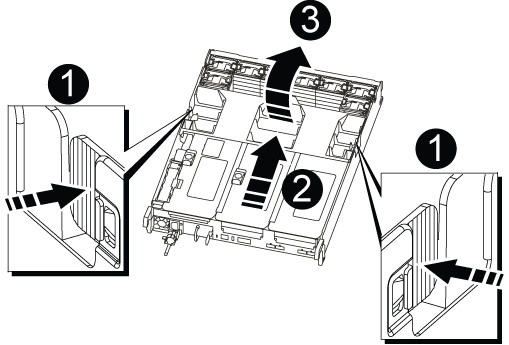
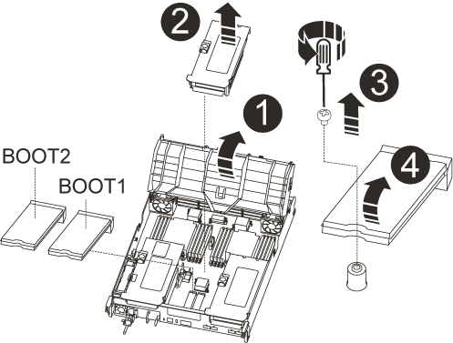

= Substitua o hardware do módulo do controlador - AFF A700s
:allow-uri-read: 
:icons: font
:imagesdir: ../media/

[role="lead"]
Para substituir o hardware do módulo do controlador, é necessário remover o controlador prejudicado, mover os componentes FRU para o módulo do controlador de substituição, instalar o módulo do controlador de substituição no chassis e, em seguida, inicializar o sistema para o modo de manutenção.

== Passo 1: Remova o módulo do controlador

Deve remover o módulo do controlador do chassis quando substituir o módulo do controlador ou substituir um componente dentro do módulo do controlador.

. Se você ainda não está aterrado, aterre-se adequadamente.
. Solte o gancho e a alça de loop que prendem os cabos ao dispositivo de gerenciamento de cabos e, em seguida, desconete os cabos do sistema e os SFPs (se necessário) do módulo do controlador, mantendo o controle de onde os cabos estavam conetados.
+
Deixe os cabos no dispositivo de gerenciamento de cabos para que, ao reinstalar o dispositivo de gerenciamento de cabos, os cabos sejam organizados.

. Desconete a fonte de alimentação do módulo do controlador da fonte e desconete o cabo da fonte de alimentação.
. Retire o dispositivo de gestão de cabos do módulo do controlador e coloque-o de lado.
. Prima ambos os trincos de bloqueio para baixo e, em seguida, rode ambos os trincos para baixo ao mesmo tempo.
+
O módulo do controlador desloca-se ligeiramente para fora do chassis.

+
image::../media/drw_a700s_pcm_remove.png[Solte o módulo do controlador]

+
[cols="1,4"]
|===

 a| 
image:../media/icon_round_1.png["Legenda número 1"]
 a| 
Trinco de bloqueio

 a| 
image:../media/icon_round_2.png["Legenda número 2"]
 a| 
Pino de bloqueio

|===
. Faça deslizar o módulo do controlador para fora do chassis.
+
Certifique-se de que suporta a parte inferior do módulo do controlador enquanto o desliza para fora do chassis.

. Coloque o módulo do controlador numa superfície estável e plana e, em seguida, abra a conduta de ar:
+
.. Pressione as patilhas de bloqueio nas laterais da conduta de ar em direção ao centro do módulo do controlador.
.. Deslize a conduta de ar em direção aos módulos da ventoinha e, em seguida, rode-a para cima até à posição completamente aberta.
+

+
[cols="1,4"]
|===

 a| 
image:../media/icon_round_1.png["Legenda número 1"]
 a| 
Patilhas de bloqueio da conduta de ar

 a| 
image:../media/icon_round_2.png["Legenda número 2"]
 a| 
Risers

 a| 
image:../media/icon_round_3.png["Legenda número 3"]
 a| 
Conduta de ar

|===

== Passo 2: Mova o cartão NVRAM

Como parte do processo de substituição do controlador, tem de remover a placa NVRAM da Riser 1 no módulo do controlador afetado e instalar a placa no Riser 1 do módulo do controlador de substituição. Você só deve reinstalar o Riser 1 no módulo do controlador de substituição depois de mover os DIMMs do módulo do controlador prejudicado para o módulo do controlador de substituição.

. Remova a riser NVRAM, Riser 1, do módulo do controlador:
+
.. Gire a trava de travamento da riser no lado esquerdo da riser para cima e em direção aos ventiladores.
+
A riser NVRAM levanta-se ligeiramente do módulo da controladora.

.. Levante a riser NVRAM, mova-a em direção aos ventiladores de modo que a aba de chapa metálica no riser limpe a borda do módulo do controlador, levante a riser diretamente para fora do módulo do controlador e, em seguida, coloque-a em uma superfície estável e plana para que você possa acessar a placa NVRAM.
+
image::../media/drw_a700s_nvme_replace.png[Volte a colocar a placa NVRAM]

+
[cols="1,4"]
|===

 a| 
image:../media/icon_round_1.png["Legenda número 1"]
 a| 
Conduta de ar

 a| 
image:../media/icon_round_2.png["Legenda número 2"]
 a| 
Trava de travamento do riser 1

 a| 
image:../media/icon_round_3.png["Legenda número 3"]
 a| 
Ficha do cabo da bateria NVRAM que liga à placa NVRAM

 a| 
image:../media/icon_round_4.png["Legenda número 4"]
 a| 
Suporte de bloqueio do cartão

 a| 
image:../media/icon_round_5.png["Legenda número 5"]
 a| 
Cartão NVRAM

|===

. Remova a placa NVRAM do módulo riser:
+
.. Gire o módulo riser para que você possa acessar a placa NVRAM.
.. Desconete o cabo da bateria do NVRAM conetado à placa NVRAM.
.. Pressione o suporte de travamento na lateral do riser NVRAM e gire-o para a posição aberta.
.. Remova a placa NVRAM do módulo riser.

. Remova a riser NVRAM do módulo de substituição do controlador.
. Instale a placa NVRAM na riser NVRAM:
+
.. Alinhe a placa com a guia da placa no módulo riser e o soquete da placa no riser.
.. Deslize a placa diretamente para dentro do soquete da placa.
+

NOTE: Certifique-se de que a placa está completamente encaixada no soquete riser.

.. Ligue o cabo da bateria à tomada na placa NVRAM.
.. Desloque o trinco de bloqueio para a posição de bloqueio e certifique-se de que este bloqueia no devido lugar.

== Passo 3: Mova as placas PCIe

Como parte do processo de substituição da controladora, você deve remover ambos os módulos riser PCIe, Riser 2 (o riser intermediário) e Riser 3 (riser na extrema direita) do módulo controlador prejudicado, remover as placas PCIe dos módulos riser e instalar as placas nos mesmos módulos riser no módulo controlador de substituição. Você instalará os módulos riser no módulo controlador de substituição assim que os DIMMs tiverem sido movidos para o módulo controlador de substituição.

IMPORTANT: Não instale os risers do módulo do controlador prejudicado no módulo do controlador de substituição.

. Remova a riser PCIe do módulo da controladora:
+
.. Remova todos os módulos SFP que possam estar nas placas PCIe.
.. Gire a trava de travamento do módulo no lado esquerdo da riser para cima e em direção aos módulos da ventoinha.
+
A riser PCIe levanta-se ligeiramente do módulo da controladora.

.. Levante a riser PCIe para cima, mova-a em direção aos ventiladores de modo que a aba de chapa metálica na riser limpe a borda do módulo controlador, levante a riser para fora do módulo controlador e, em seguida, coloque-a em uma superfície estável e plana.
+
image::../media/drw_a700s_pcie_replace.png[Substitua uma placa PCIe]

+
[cols="1,4"]
|===

 a| 
image:../media/icon_round_1.png["Legenda número 1"]
 a| 
Conduta de ar

 a| 
image:../media/icon_round_2.png["Legenda número 2"]
 a| 
Trava de travamento da riser

 a| 
image:../media/icon_round_3.png["Legenda número 3"]
 a| 
Suporte de bloqueio do cartão

 a| 
image:../media/icon_round_4.png["Legenda número 4"]
 a| 
Riser 2 (riser central) e placas PCI nos slots riser 2 e 3.

|===

. Remova a placa PCIe da riser:
+
.. Gire o riser para que você possa acessar a placa PCIe.
.. Pressione o suporte de travamento na lateral da riser PCIe e gire-o até a posição aberta.
.. Remova a placa PCIe da riser.

. Remova a riser correspondente do módulo do controlador de substituição.
. Instale a placa PCIe na riser a partir da controladora de substituição e reinstale-a novamente na controladora de substituição:
+
.. Alinhe a placa com a guia da placa no riser e o soquete da placa no riser e, em seguida, deslize-a diretamente para o soquete no riser.
+
Certifique-se de que a placa está completamente encaixada no soquete riser.

.. Reinstale a riser no módulo do controlador de substituição.
.. Rode o trinco de bloqueio para o lugar até encaixar na posição de bloqueio.

. Repita os passos anteriores para as placas Riser 3 e PCIe nos slots 4 e 5 no módulo controlador prejudicado.

== Passo 4: Mova a Mídia de inicialização

Há dois dispositivos de Mídia de inicialização no AFF A700s, um primário e um secundário ou um suporte de inicialização de backup. Você deve movê-los do controlador prejudicado para o controlador _replacement_ e instalá-los em seus respetivos slots no controlador _replacement_.

Os suportes de arranque estão localizados sob Riser 2, o módulo riser PCIe central. Este módulo PCIe deve ser removido para obter acesso à Mídia de inicialização.

. Localize o suporte de arranque:
+
.. Abra a conduta de ar, se necessário.
.. Se necessário, remova o Riser 2, o módulo PCIe central, desbloqueando a trava de travamento e removendo a riser do módulo do controlador.
+

+
[cols="1,4"]
|===

 a| 
image:../media/icon_round_1.png["Legenda número 1"]
 a| 
Conduta de ar

 a| 
image:../media/icon_round_2.png["Legenda número 2"]
 a| 
Riser 2 (módulo PCIe central)

 a| 
image:../media/icon_round_3.png["Legenda número 3"]
 a| 
Parafuso do suporte de arranque

 a| 
image:../media/icon_round_4.png["Legenda número 4"]
 a| 
Suporte de arranque

|===
. Retire o suporte de arranque do módulo do controlador:
+
.. Utilizando uma chave de fendas Phillips nº 1, retire o parafuso que segura o suporte de arranque e coloque o parafuso de lado num local seguro.
.. Agarrando os lados do suporte de arranque, rode suavemente o suporte de arranque para cima e, em seguida, puxe o suporte de arranque para fora do encaixe e coloque-o de lado.

. Mova o suporte de arranque para o novo módulo do controlador e instale-o:
+

NOTE: Instale o suporte de arranque no mesmo socket no módulo do controlador de substituição que foi instalado no módulo do controlador afetado; o socket do suporte de arranque primário (ranhura 1) ao socket do suporte de arranque primário e o socket do suporte de arranque secundário (ranhura 2) ao socket do suporte de arranque secundário.

+
.. Alinhe as extremidades do suporte de arranque com o alojamento do encaixe e, em seguida, empurre-o suavemente no encaixe.
.. Rode o suporte de arranque para baixo em direção à placa-mãe.
.. Fixe o suporte de arranque à placa-mãe utilizando o parafuso do suporte de arranque.
+
Não aperte demasiado o parafuso ou poderá danificar o suporte de arranque.

== Passo 5: Mova os fãs

É necessário mover as ventoinhas do módulo do controlador desativado para o módulo de substituição ao substituir um módulo do controlador com falha.

. Retire o módulo da ventoinha apertando as patilhas de bloqueio na parte lateral do módulo da ventoinha e, em seguida, levantando o módulo da ventoinha diretamente para fora do módulo do controlador.
+
image::../media/drw_a700s_replace_fan.png[Substitua uma ventoinha]

+
[cols="1,4"]
|===

 a| 
image:../media/icon_round_1.png["Legenda número 1"]
 a| 
Patilhas de bloqueio da ventoinha

 a| 
image:../media/icon_round_2.png["Legenda número 2"]
 a| 
Módulo da ventoinha

|===
. Mova o módulo da ventoinha para o módulo do controlador de substituição e, em seguida, instale o módulo da ventoinha alinhando as extremidades com a abertura no módulo do controlador e, em seguida, deslizando o módulo da ventoinha para o módulo do controlador até que os trincos de bloqueio encaixem no lugar.
. Repita estes passos para os restantes módulos do ventilador.

== Passo 6: Mova os DIMMs do sistema

Para mover os DIMMs, localize-os e mova-os do controlador prejudicado para o controlador de substituição e siga a sequência específica de passos.

. Localize os DIMMs no módulo do controlador.
+
image::../media/drw_a700s_dimm_replace.png[Substitua um DIMM]

+
[cols="1,4"]
|===

 a| 
image:../media/icon_round_1.png["Legenda número 1"]
 a| 
Conduta de ar

 a| 
image:../media/icon_round_2.png["Legenda número 2"]
 a| 
Riser 1 e DIMM banco 1-4

 a| 
image:../media/icon_round_3.png["Legenda número 3"]
 a| 
Riser 2 e DIMM bancos 5-8 e 9-12

 a| 
image:../media/icon_round_4.png["Legenda número 4"]
 a| 
Riser 3 e DIMM banco 13-16

|===
. Observe a orientação do DIMM no soquete para que você possa inserir o DIMM no módulo do controlador de substituição na orientação adequada.
. Ejete o DIMM de seu slot, empurrando lentamente as duas abas do ejetor do DIMM em ambos os lados do DIMM e, em seguida, deslize o DIMM para fora do slot.
+

NOTE: Segure cuidadosamente o DIMM pelas bordas para evitar a pressão nos componentes da placa de circuito DIMM.

. Localize o slot onde você está instalando o DIMM.
. Certifique-se de que as abas do ejetor DIMM no conetor estão na posição aberta e insira o DIMM diretamente no slot.
+
O DIMM encaixa firmemente no slot, mas deve entrar facilmente. Caso contrário, realinhar o DIMM com o slot e reinseri-lo.

+

NOTE: Inspecione visualmente o DIMM para verificar se ele está alinhado uniformemente e totalmente inserido no slot.

. Empurre com cuidado, mas firmemente, na borda superior do DIMM até que as abas do ejetor se encaixem no lugar sobre os entalhes nas extremidades do DIMM.
. Repita estas etapas para os DIMMs restantes.

== Passo 7: Instale o módulo NVRAM

Para instalar o módulo NVRAM, tem de seguir a sequência específica de passos.

. Instale a riser no módulo do controlador:
+
.. Alinhe o lábio da riser com a parte inferior da chapa metálica do módulo do controlador.
.. Guie a riser ao longo dos pinos no módulo da controladora e baixe a riser para dentro do módulo da controladora.
.. Desloque o trinco de bloqueio para baixo e clique-o na posição de bloqueio.
+
Quando bloqueado, a trava de travamento fica alinhada com a parte superior da riser e a riser fica bem no módulo da controladora.

.. Reinsira todos os módulos SFP que foram removidos das placas PCIe.

== Passo 8: Mova a bateria do NVRAM

Ao substituir o módulo do controlador, tem de mover a bateria do NVRAM do módulo do controlador desativado para o módulo do controlador de substituição

. Localize a bateria NVRAM no lado esquerdo do módulo riser, Riser 1.
+
image::../media/drw_a700s_nvme_battery_replace.png[Substitua a bateria do NVRAM]

+
[cols="1,4"]
|===

 a| 
image:../media/icon_round_1.png["Legenda número 1"]
 a| 
Ficha da bateria NVRAM

 a| 
image:../media/icon_round_2.png["Legenda número 2"]
 a| 
Patilha azul de bloqueio da bateria do NVRAM

|===
. Localize a ficha da bateria e aperte o clipe na face da ficha da bateria para soltar a ficha da tomada e, em seguida, desligue o cabo da bateria da tomada.
. Segure a bateria e pressione a patilha de bloqueio azul marcada com PUSH e, em seguida, levante a bateria para fora do suporte e do módulo do controlador.
. Mova a bateria para o módulo do controlador de substituição e, em seguida, instale-a na riser NVRAM:
+
.. Deslize a bateria para baixo ao longo da parede lateral de chapa metálica até que as patilhas de suporte no gancho lateral para dentro das ranhuras da bateria, e o trinco da bateria engata e bloqueia no lugar.
.. Pressione firmemente a bateria para baixo para se certificar de que está bloqueada no lugar.
.. Ligue a ficha da bateria à tomada riser e certifique-se de que a ficha fica fixa no lugar.

== Passo 9: Instale um riser PCIe

Para instalar um riser PCIe, você deve seguir uma sequência específica de etapas.

. Se você ainda não está aterrado, aterre-se adequadamente.
. Instale a riser no módulo do controlador:
+
.. Alinhe o lábio da riser com a parte inferior da chapa metálica do módulo do controlador.
.. Guie a riser ao longo dos pinos no módulo da controladora e baixe a riser para dentro do módulo da controladora.
.. Desloque o trinco de bloqueio para baixo e clique-o na posição de bloqueio.
+
Quando bloqueado, a trava de travamento fica alinhada com a parte superior da riser e a riser fica bem no módulo da controladora.

.. Reinsira todos os módulos SFP que foram removidos das placas PCIe.

. Repita os passos anteriores para as placas Riser 3 e PCIe nos slots 4 e 5 no módulo controlador prejudicado.

== Passo 10: Mova a fonte de alimentação

Deve mover a fonte de alimentação e a fonte de alimentação em branco do módulo do controlador afetado para o módulo do controlador de substituição quando substituir um módulo do controlador.

. Se você ainda não está aterrado, aterre-se adequadamente.
. Rode a pega do excêntrico de forma a que possa ser utilizada para retirar a fonte de alimentação do módulo do controlador enquanto prime a patilha de bloqueio.
+

CAUTION: A fonte de alimentação é curta. Utilize sempre as duas mãos para o apoiar quando o retirar do módulo do controlador, de modo a que não se liberte subitamente do módulo do controlador e o machuque.

+
image::../media/drw_a700s_replace_psu.gif[Substitua uma PSU]

+
[cols="1,4"]
|===

 a| 
image:../media/icon_round_1.png["Legenda número 1"]
 a| 
Patilha de bloqueio da fonte de alimentação azul

 a| 
image:../media/icon_round_2.png["Legenda número 2"]
 a| 
Fonte de alimentação

|===
. Mova a fonte de alimentação para o novo módulo do controlador e, em seguida, instale-a.
. Utilizando ambas as mãos, apoie e alinhe as extremidades da fonte de alimentação com a abertura no módulo do controlador e, em seguida, empurre cuidadosamente a fonte de alimentação para o módulo do controlador até que a patilha de bloqueio encaixe no lugar.
+
As fontes de alimentação apenas engatarão adequadamente com o conetor interno e trancam no lugar de uma forma.

+

NOTE: Para evitar danificar o conetor interno, não utilize força excessiva ao deslizar a fonte de alimentação para o sistema.

. Retire o painel de vedação da PSU do módulo do controlador desativado e, em seguida, instale-o no módulo do controlador de substituição.

== Passo 11: Instale o módulo do controlador

Depois de todos os componentes terem sido movidos do módulo do controlador afetado para o módulo do controlador de substituição, tem de instalar o módulo do controlador de substituição no chassis e, em seguida, iniciá-lo no modo de manutenção.

. Se você ainda não está aterrado, aterre-se adequadamente.
. Se ainda não o tiver feito, feche a conduta de ar:
+
.. Desloque a conduta de ar até ao módulo do controlador.
.. Faça deslizar a conduta de ar na direção dos tirantes até que as patilhas de bloqueio encaixem no lugar.
.. Inspecione a conduta de ar para se certificar de que está corretamente encaixada e trancada no lugar.
+
image::../media/drw_a700s_close_air_duct.png[Fechar a conduta de ar]

+
[cols="1,4"]
|===

 a| 
image:../media/icon_round_1.png["Legenda número 1"]
 a| 
Patilhas de bloqueio

 a| 
image:../media/icon_round_2.png["Legenda número 2"]
 a| 
Deslize o êmbolo

|===
. Alinhe a extremidade do módulo do controlador com a abertura no chassis e, em seguida, empurre cuidadosamente o módulo do controlador até meio do sistema.
+

NOTE: Não introduza completamente o módulo do controlador no chassis até ser instruído a fazê-lo.

. Faça o cabeamento apenas das portas de gerenciamento e console, para que você possa acessar o sistema para executar as tarefas nas seções a seguir.
+

NOTE: Você conetará o resto dos cabos ao módulo do controlador posteriormente neste procedimento.

. Conclua a reinstalação do módulo do controlador:
+
.. Empurre firmemente o módulo do controlador para dentro do chassi até que ele atenda ao plano médio e esteja totalmente assentado.
+
Os trincos de bloqueio sobem quando o módulo do controlador está totalmente assente.

+

NOTE: Não utilize força excessiva ao deslizar o módulo do controlador para dentro do chassis para evitar danificar os conetores.

+
O módulo do controlador começa a arrancar assim que estiver totalmente assente no chassis. Esteja preparado para interromper o processo de inicialização.

.. Rode os trincos de bloqueio para cima, inclinando-os de forma a que estes limpem os pinos de bloqueio e, em seguida, baixe-os para a posição de bloqueio.
.. Interrompa o processo de inicialização pressionando `Ctrl-C`.

. Conete os cabos do sistema e os módulos do transcetor ao módulo do controlador e reinstale o dispositivo de gerenciamento de cabos.
. Ligue os cabos de alimentação às fontes de alimentação e volte a instalar os fixadores do cabo de alimentação.
. Se o sistema estiver configurado para suportar interconexão de cluster de 10 GbE e conexões de dados em NICs de 40 GbE ou portas integradas, converta essas portas em conexões de 10 GbE usando o comando nicadmin Convert do modo de manutenção.
+

NOTE: Certifique-se de sair do modo de manutenção depois de concluir a conversão.

