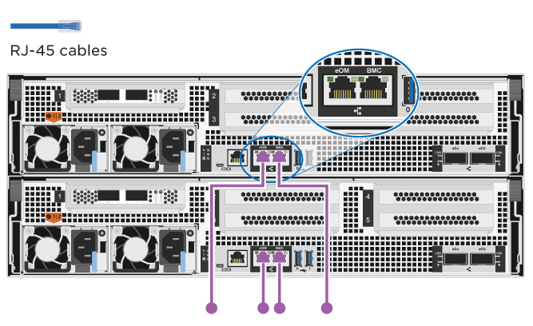
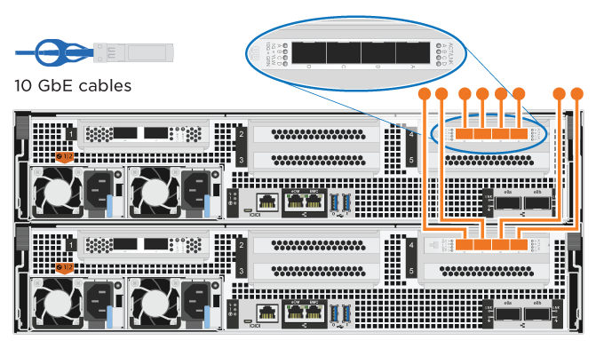

= Passos detalhados - AFF A800
:allow-uri-read: 
:icons: font
:imagesdir: ../media/

[role="lead"]
Esta seção fornece instruções detalhadas passo a passo para a instalação de um sistema AFF A800.

== Passo 1: Prepare-se para a instalação

Para instalar o sistema AFF A800, você precisa criar uma conta e Registrar o sistema. Você também precisa fazer o inventário do número e do tipo apropriados de cabos para o seu sistema e coletar informações específicas de rede.

Você precisa ter acesso ao link:https://hwu.netapp.com["NetApp Hardware Universe"^] (HWU) para obter informações sobre os requisitos do site, bem como informações adicionais sobre o seu sistema configurado. Também pode pretender ter acesso ao link:http://mysupport.netapp.com/documentation/productlibrary/index.html?productID=62286["Notas de versão para a sua versão do ONTAP"^] para obter mais informações sobre este sistema.

.O que você precisa
Você precisa fornecer o seguinte em seu site:

* Espaço em rack para o sistema de armazenamento
+
** 4U em uma configuração de HA para a plataforma
** 2U TB para cada compartimento de armazenamento de NS224 TB

* Chave de fendas Phillips nº 2
* Cabos de rede adicionais para conetar seu sistema ao switch de rede e laptop ou console com um navegador da Web
+
.. Desembale o conteúdo de todas as caixas.
.. Registre o número de série do sistema nos controladores.
+
image::../media/drw_ssn_label.png[Exemplo de número de série do sistema]

.Passos
. Configure a sua conta:
+
.. Inicie sessão na sua conta existente ou crie uma conta.
.. Registe o seu sistema (link:https://mysupport.netapp.com/eservice/registerSNoAction.do?moduleName=RegisterMyProduct["Registro de produto NetApp"^]).

. Baixe e instale link:https://mysupport.netapp.com/site/tools/tool-eula/activeiq-configadvisor["NetApp Downloads: Config Advisor"^] em seu laptop.
. Faça um inventário e anote o número e os tipos de cabos que você recebeu.
+
A tabela a seguir identifica os tipos de cabos que você pode receber. Se receber um cabo não listado na tabela, consulte link:https://hwu.netapp.com["NetApp Hardware Universe"^] para localizar o cabo e identificar a respetiva utilização.

+
[cols="1,2,2,2"]
|===
| Tipo de conetor | Número de peça e comprimento | Tipo de cabo... | Para... 

 a| 
Cabo de 100 GbE
 a| 
X66211A-05 (112-00595), 0,5m

X66211-1 (112-00573), 1m

X66211-2 (112-00574), 2m

X66211-5 (112-00576), 5m
 a| 
image:../media/oie_cable100_gbe_qsfp28.png["Conetor 100 GbE QSFP28"]
 a| 
** INTERCONEXÃO HA
** Rede de interconexão de cluster
** Armazenamento, dados

 a| 
Cabo de 10 GbE
 a| 
X6566B-3-R6 (112-00300), 3m;

X6566B-5-R6 (112-00301), 5m
 a| 
image:../media/oie_cable100_gbe_qsfp28.png["Conetor 10 GbE QSFP28"]
 a| 
** Dados

 a| 
Cabo de 25 GbE
 a| 
X66240A-2 (112-00598), 2m;

X66240A-5 (112-00600), 5m
 a| 
image:../media/oie_cable100_gbe_qsfp28.png["Conetor 25 GbE QSFP28"]
 a| 
** Dados

 a| 
RJ-45 (dependente da ordem)
 a| 
Não aplicável
 a| 
image:../media/oie_cable_rj45.png["Conetor do cabo RJ-45"]
 a| 
** Gerenciamento

 a| 
Fibre Channel
 a| 
X66250-2 (112-00342) 2m;

X66250-5 (112-00344) 5m;

X66250-15 (112-00346) 15m;

X66250-30 (112-00347) 30m
 a| 
image:../media/oie_cable_fc_optical.png["Cabo ótico OIE Fibre Channel"]
 a| 
** Rede

 a| 
Cabo micro-USB da consola
 a| 
Não aplicável
 a| 
image:../media/oie_cable_micro_usb.png["Conetor micro USB"]
 a| 
** Ligação da consola durante a configuração do software

 a| 
Cabos de alimentação
 a| 
Não aplicável
 a| 
image:../media/oie_cable_power.png["Cabos de alimentação"]
 a| 
Ligar as PSUs à fonte de alimentação

|===
. Faça o download e complete o link:https://library.netapp.com/ecm/ecm_download_file/ECMLP2839002["Folha de trabalho de configuração do cluster"^].

== Passo 2: Instale o hardware

Você precisa instalar seu sistema em um rack de 4 colunas ou gabinete do sistema NetApp, conforme aplicável.

.Passos
. Instale os kits de calhas, conforme necessário.
+
link:../platform-supplemental/superrail-install.html["Instalação do SuperRail em um rack de quatro colunas"]

. Instale e fixe o seu sistema utilizando as instruções incluídas no kit de calhas.
+

NOTE: Você precisa estar ciente das preocupações de segurança associadas ao peso do sistema.

+
image::../media/drw_affa800_weight_caution.png[Cuidado com o elevador para quatro pessoas]

. Conete os dispositivos de gerenciamento de cabos (como mostrado).
+
image::../media/drw_affa800_install_cable_mgmt.png[Ligar o dispositivo de gestão de cabos]

. Coloque a moldura na parte frontal do sistema.

== Passo 3: Controladores de cabo

Há cabeamento necessário para o cluster da sua plataforma usando o método de cluster sem switch de dois nós ou o método de rede de interconexão de cluster. Há cabeamento opcional para as redes de host Fibre Channel ou iSCSI ou armazenamento de conexão direta. Este cabeamento não é exclusivo; você pode ter um cabo para uma rede host e armazenamento.

=== Cabeamento necessário: Controladores de cabo para um cluster

Conete os controladores a um cluster usando o método de cluster sem switch de dois nós ou usando a rede de interconexão de cluster.

==== Opção 1: Cabo de um cluster sem switch de dois nós

As portas de rede de gerenciamento nos controladores são conetadas aos switches. As portas de interconexão de HA e interconexão de cluster são cabeadas em ambas as controladoras.

.Antes de começar
Contacte o administrador da rede para obter informações sobre como ligar o sistema aos comutadores.

Certifique-se de que verifica a seta da ilustração para a orientação adequada da presilha de puxar do conetor do cabo.

image::../media/oie_cable_pull_tab_up.png[Conetor de cabo com patilha na parte superior]

NOTE: Ao inserir o conetor, você deve senti-lo clicar no lugar; se você não sentir que ele clique, remova-o, vire-o e tente novamente.

.Passos
. Use a animação ou as etapas tabuladas para concluir o cabeamento entre os controladores e os switches:
+
.Animação - Cable um cluster sem switch de dois nós
video::edc42447-f721-4cbe-b080-ab0c0123a139[panopto]
+
[cols="10,90"]
|===
| Passo | Execute em cada módulo do controlador 

 a| 

 a| 
Cable as portas de interconexão HA:

** e0b a e0b
** e1b a e1b

image:../media/drw_affa800_ha_pair_cabling.png["Cabeamento de par HA"]

 a| 
image:../media/icon_square_2_green.png["Legenda número 2"]
 a| 
Cable as portas de interconexão de cluster:

** e0a a e0a
** e1a a e1a

image:../media/drw_affa800_tnsc_clust_cabling.png["Cabeamento de interconexão de cluster em um cluster sem switch de dois nós"]

 a| 
image:../media/icon_square_3_purple.png["Passo 3"]
 a| 
Faça o cabeamento das portas de gerenciamento aos switches de rede de gerenciamento 

 a| 
image:../media/oie_legend_icon_attn_symbol.png["Símbolo de atenção"]
 a| 
NÃO conete os cabos de energia neste momento.

|===
. Para executar o cabeamento opcional, consulte:
+
** <<Opção 1: Cabo para uma rede host Fibre Channel>>
** <<Opção 2: Cabo para uma rede host 10GbE>>
** <<Opção 3: Cabeamento das controladoras a um único compartimento de unidade>>
** <<Opção 4: Cabeamento das controladoras para dois compartimentos de unidades>>

. Para concluir a configuração do sistema, link:install-detailed-guide.html#step-4-complete-system-setup-and-configuration["Passo 4: Conclua a configuração e configuração do sistema"]consulte .

==== Opção 2: Conjunto comutado por cabo a

As portas de rede de interconexão e gerenciamento de cluster nos controladores são conetadas aos switches, enquanto as portas de interconexão de HA são cabeadas em ambos os controladores.

.Antes de começar
Contacte o administrador da rede para obter informações sobre como ligar o sistema aos comutadores.

Certifique-se de que verifica a seta da ilustração para a orientação adequada da presilha de puxar do conetor do cabo.

image::../media/oie_cable_pull_tab_up.png[Conetor de cabo com patilha na parte superior]

NOTE: Ao inserir o conetor, você deve senti-lo clicar no lugar; se você não sentir que ele clique, remova-o, vire-o e tente novamente.

.Passos
. Use a animação ou as etapas tabuladas para concluir o cabeamento entre os controladores e os switches:
+
.Animação - Cable a switched cluster
video::49e48140-4c5a-4395-a7d7-ab0c0123a10e[panopto]
+
[cols="10,90"]
|===
| Passo | Execute em cada módulo do controlador 

 a| 

 a| 
Cable as portas de interconexão HA:

** e0b a e0b
** e1b a e1b

image:../media/drw_affa800_ha_pair_cabling.png["Cabeamento de par HA"]

 a| 
image:../media/icon_square_2_green.png["Legenda número 2"]
 a| 
Cable as portas de interconexão de cluster aos switches de interconexão de cluster de 100 GbE.

** e0a
** e1a

image:../media/drw_affa800_switched_clust_cabling.png["Cabeamento de interconexão de cluster"]

 a| 
image:../media/icon_square_3_purple.png["Passo 3"]
 a| 
Faça o cabeamento das portas de gerenciamento aos switches de rede de gerenciamento 

 a| 
image:../media/oie_legend_icon_attn_symbol.png["Símbolo de atenção"]
 a| 
NÃO conete os cabos de energia neste momento.

|===
. Para executar o cabeamento opcional, consulte:
+
** <<Opção 1: Cabo para uma rede host Fibre Channel>>
** <<Opção 2: Cabo para uma rede host 10GbE>>
** <<Opção 3: Cabeamento das controladoras a um único compartimento de unidade>>
** <<Opção 4: Cabeamento das controladoras para dois compartimentos de unidades>>

. Para concluir a configuração do sistema, link:install-detailed-guide.html#step-4-complete-system-setup-and-configuration["Passo 4: Conclua a configuração e configuração do sistema"]consulte .

=== Cabeamento opcional: Opções dependentes da configuração de cabos

Você tem cabeamento opcional dependente da configuração para as redes de host Fibre Channel ou iSCSI ou armazenamento de conexão direta. Esse cabeamento não é exclusivo; você pode ter cabeamento para uma rede host e armazenamento.

==== Opção 1: Cabo para uma rede host Fibre Channel

As portas Fibre Channel nos controladores são conetadas aos switches de rede host Fibre Channel.

.Antes de começar
Contacte o administrador da rede para obter informações sobre como ligar o sistema aos comutadores.

Certifique-se de que verifica a seta da ilustração para a orientação adequada da presilha de puxar do conetor do cabo.

image::../media/oie_cable_pull_tab_up.png[Conetor de cabo com patilha na parte superior]

NOTE: Ao inserir o conetor, você deve senti-lo clicar no lugar; se você não sentir que ele clique, remova-o, vire-o e tente novamente.

[cols="10,90"]
|===
| Passo | Execute em cada módulo do controlador 

 a| 
1
 a| 
Portas de cabo de 2a a 2D para os switches de host FC.image:../media/drw_affa800_fc_host_cabling.png["Cabeamento de rede de host Fibre Channel"]

 a| 
2
 a| 
Para executar outro cabeamento opcional, escolha entre:

* <<Opção 3: Cabeamento das controladoras a um único compartimento de unidade>>
* <<Opção 4: Cabeamento das controladoras para dois compartimentos de unidades>>

 a| 
3
 a| 
Para concluir a configuração do sistema, link:install-detailed-guide.html#step-4-complete-system-setup-and-configuration["Passo 4: Conclua a configuração e configuração do sistema"]consulte .

|===

==== Opção 2: Cabo para uma rede host 10GbE

As portas 10GbE nos controladores são conetadas a 10GbE switches de rede host.

.Antes de começar
Contacte o administrador da rede para obter informações sobre como ligar o sistema aos comutadores.

Certifique-se de que verifica a seta da ilustração para a orientação adequada da presilha de puxar do conetor do cabo.

image::../media/oie_cable_pull_tab_up.png[Conetor de cabo com patilha na parte superior]

NOTE: Ao inserir o conetor, você deve senti-lo clicar no lugar; se você não sentir que ele clique, remova-o, vire-o e tente novamente.

[cols="10,90"]
|===
| Passo | Execute em cada módulo do controlador 

 a| 
1
 a| 
Portas de cabo de e4a a e4d para os switches de rede de host 10GbE.

 a| 
2
 a| 
Para executar outro cabeamento opcional, escolha entre:

* <<Opção 3: Cabeamento das controladoras a um único compartimento de unidade>>
* <<Opção 4: Cabeamento das controladoras para dois compartimentos de unidades>>

 a| 
3
 a| 
Para concluir a configuração do sistema, link:install-detailed-guide.html#step-4-complete-system-setup-and-configuration["Passo 4: Conclua a configuração e configuração do sistema"]consulte .

|===

==== Opção 3: Cabeamento das controladoras a um único compartimento de unidade

Você deve vincular cada controlador aos módulos do NSM no compartimento de unidades NS224.

.Antes de começar
Certifique-se de que verifica a seta da ilustração para a orientação adequada da presilha de puxar do conetor do cabo.

image::../media/oie_cable_pull_tab_up.png[Conetor de cabo com patilha na parte superior]

NOTE: Ao inserir o conetor, você deve senti-lo clicar no lugar; se você não sentir que ele clique, remova-o, vire-o e tente novamente.

Use a animação ou as etapas tabuladas para vincular seus controladores a uma única gaveta:

.Animação - Cable os controladores para uma única prateleira de unidade
video::09dade4f-00bd-4d41-97d7-ab0c0123a0b4[panopto]
[cols="10,90"]
|===
| Passo | Execute em cada módulo do controlador 

 a| 
image:../media/icon_square_1_blue.png["Legenda número 1"]
 a| 
Controlador de cabo A para a prateleira: image:../media/drw_affa800_1shelf_cabling_a.png["Cabeamento de controladoras em uma única gaveta"]

 a| 
image:../media/icon_square_2_yellow.png["Legenda número 2"]
 a| 
Controlador de cabo B para a prateleira: image:../media/drw_affa800_1shelf_cabling_b.png["Faça o cabeamento da controladora B em uma única gaveta"]

|===
Para concluir a configuração do sistema, link:install-detailed-guide.html#step-4-complete-system-setup-and-configuration["Passo 4: Conclua a configuração e configuração do sistema"]consulte .

==== Opção 4: Cabeamento das controladoras para dois compartimentos de unidades

Você precisa vincular cada controlador aos módulos do NSM em ambas as gavetas de unidades NS224.

.Antes de começar
Certifique-se de que verifica a seta da ilustração para a orientação adequada da presilha de puxar do conetor do cabo.

image::../media/oie_cable_pull_tab_up.png[Conetor de cabo com patilha na parte superior]

NOTE: Ao inserir o conetor, você deve senti-lo clicar no lugar; se você não sentir que ele clique, remova-o, vire-o e tente novamente.

Use a animação ou as etapas tabuladas para vincular os controladores a dois compartimentos de unidades:

.Animação - Cable os controladores para duas gavetas de unidade
video::fe50ac38-9375-4e6b-85af-ab0c0123a0e0[panopto]
[cols="10,90"]
|===
| Passo | Execute em cada módulo do controlador 

 a| 
image:../media/icon_square_1_blue.png["Legenda número 1"]
 a| 
Controlador de cabos A para as prateleiras: image:../media/drw_affa800_2shelf_cabling_a.png["Faça o cabeamento da controladora A A a duas gavetas"]

 a| 
image:../media/icon_square_2_yellow.png["Legenda número 2"]
 a| 
Controlador de cabos B para as prateleiras: image:../media/drw_affa800_2shelf_cabling_b.png["Faça o cabeamento da controladora B a duas gavetas"]

|===
Para concluir a configuração do sistema, link:install-detailed-guide.html#step-4-complete-system-setup-and-configuration["Passo 4: Conclua a configuração e configuração do sistema"]consulte .

== Passo 4: Conclua a configuração e configuração do sistema

Conclua a configuração e a configuração do sistema usando a descoberta de cluster apenas com uma conexão com o switch e laptop, ou conetando-se diretamente a um controlador no sistema e, em seguida, conetando-se ao switch de gerenciamento.

=== Opção 1: Conclua a configuração e a configuração do sistema se a deteção de rede estiver ativada

Se tiver a deteção de rede ativada no seu computador portátil, pode concluir a configuração e configuração do sistema utilizando a deteção automática de cluster.

.Passos
. Conete os cabos de alimentação às fontes de alimentação do controlador e, em seguida, conete-os a fontes de alimentação em diferentes circuitos.
+
O sistema começa a arrancar. A inicialização inicial pode levar até oito minutos.

. Certifique-se de que o seu computador portátil tem a deteção de rede ativada.
+
Consulte a ajuda online do seu computador portátil para obter mais informações.

. Use a animação para conetar seu laptop ao switch de gerenciamento:
+
.Animação - Conete seu laptop ao interrutor de gerenciamento
video::d61f983e-f911-4b76-8b3a-ab1b0066909b[panopto]
. Selecione um ícone ONTAP listado para descobrir:
+
image::../media/drw_autodiscovery_controler_select_ieops-1849.svg[Selecione um ícone ONTAP]

+
.. Abra o Explorador de ficheiros.
.. Clique em *rede* no painel esquerdo e clique com o botão direito do rato e selecione *atualizar*.
.. Clique duas vezes no ícone ONTAP e aceite quaisquer certificados exibidos na tela.
+

NOTE: XXXXX é o número de série do sistema para o nó de destino.

+
O System Manager é aberto.

. Utilize a configuração guiada do System Manager para configurar o sistema utilizando os dados recolhidos no link:https://library.netapp.com/ecm/ecm_download_file/ECMLP2862613["Guia de configuração do ONTAP"^].
. Verifique a integridade do sistema executando o Config Advisor.
. Depois de concluir a configuração inicial, vá para para https://docs.netapp.com/us-en/ontap/index.html["Documentação do ONTAP 9"^] para obter informações sobre como configurar recursos adicionais no ONTAP.

=== Opção 2: Conclua a configuração e a configuração do sistema se a deteção de rede não estiver ativada

Se a deteção de rede não estiver ativada no seu computador portátil, tem de concluir a configuração e a configuração utilizando esta tarefa.

.Passos
. Faça o cabo e configure o seu laptop ou console:
+
.. Defina a porta de console no laptop ou console para 115.200 baud com N-8-1.
+

NOTE: Consulte a ajuda on-line do seu laptop ou console para saber como configurar a porta do console.

.. Conete o cabo do console ao laptop ou console e conete a porta do console no controle usando o cabo do console fornecido com o sistema.
+
image::../media/drw_console_connect_affa800.png[Conexão à porta do console]

.. Conete o laptop ou o console ao switch na sub-rede de gerenciamento.
+
image::../media/drw_client_mgmt_subnet_affa800.png[Conexão do laptop ou console para ativar a sub-rede de gerenciamento]

.. Atribua um endereço TCP/IP ao laptop ou console, usando um que esteja na sub-rede de gerenciamento.

. Conete os cabos de alimentação às fontes de alimentação do controlador e, em seguida, conete-os a fontes de alimentação em diferentes circuitos.
+
O sistema começa a arrancar. A inicialização inicial pode levar até oito minutos.

. Atribua um endereço IP de gerenciamento de nó inicial a um dos nós.
+
[cols="1,2"]
|===
| Se a rede de gestão tiver DHCP... | Então... 

 a| 
Configurado
 a| 
Registre o endereço IP atribuído aos novos controladores.

 a| 
Não configurado
 a| 
.. Abra uma sessão de console usando PuTTY, um servidor de terminal ou o equivalente para o seu ambiente.
+

NOTE: Verifique a ajuda on-line do seu laptop ou console se você não sabe como configurar o PuTTY.

.. Insira o endereço IP de gerenciamento quando solicitado pelo script.

|===
. Usando o System Manager em seu laptop ou console, configure seu cluster:
+
.. Aponte seu navegador para o endereço IP de gerenciamento de nó.
+

NOTE: O formato para o endereço é https://x.x.x.x+.

.. Configure o sistema utilizando os dados recolhidos no link:https://library.netapp.com/ecm/ecm_download_file/ECMLP2862613["Guia de configuração do ONTAP"^].

. Verifique a integridade do sistema executando o Config Advisor.
. Depois de concluir a configuração inicial, vá para para https://docs.netapp.com/us-en/ontap/index.html["Documentação do ONTAP 9"^] para obter informações sobre como configurar recursos adicionais no ONTAP.

