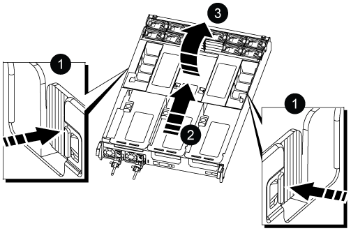

= Substitua a bateria do relógio em tempo real - AFF A800
:allow-uri-read: 
:icons: font
:imagesdir: ../media/

[role="lead"]
Você substitui a bateria do relógio em tempo real (RTC) no módulo do controlador para que os serviços e aplicativos do sistema que dependem da sincronização precisa de tempo continuem funcionando.

* Pode utilizar este procedimento com todas as versões do ONTAP suportadas pelo seu sistema
* Todos os outros componentes do sistema devem estar funcionando corretamente; caso contrário, você deve entrar em Contato com o suporte técnico.

== Passo 1: Desligue o controlador desativado

Para encerrar o controlador com deficiência, você deve determinar o status do controlador e, se necessário, assumir o controlador para que o controlador saudável continue fornecendo dados do armazenamento do controlador com deficiência.

.Sobre esta tarefa
* Se você tiver um sistema SAN, você deve ter verificado mensagens de  `cluster kernel-service show`evento ) para o blade SCSI do controlador afetado. O `cluster kernel-service show` comando (do modo avançado priv) exibe o nome do nó, link:https://docs.netapp.com/us-en/ontap/system-admin/display-nodes-cluster-task.html["status do quorum"]desse nó, o status de disponibilidade desse nó e o status operacional desse nó.
+
Cada processo SCSI-blade deve estar em quórum com os outros nós no cluster. Qualquer problema deve ser resolvido antes de prosseguir com a substituição.

* Se você tiver um cluster com mais de dois nós, ele deverá estar no quórum. Se o cluster não estiver em quórum ou se um controlador íntegro exibir false para qualificação e integridade, você deverá corrigir o problema antes de encerrar o controlador prejudicado; link:https://docs.netapp.com/us-en/ontap/system-admin/synchronize-node-cluster-task.html?q=Quorum["Sincronize um nó com o cluster"^]consulte .

.Passos
. Se o AutoSupport estiver ativado, suprimir a criação automática de casos invocando uma mensagem AutoSupport:
+
`system node autosupport invoke -node * -type all -message MAINT=<# of hours>h`

+
A seguinte mensagem AutoSupport suprime a criação automática de casos por duas horas:

+
`cluster1:> system node autosupport invoke -node * -type all -message MAINT=2h`

. Desative a giveback automática a partir da consola do controlador saudável:
+
`storage failover modify -node local -auto-giveback false`

+

NOTE: Quando vir _do pretende desativar a auto-giveback?_, introduza `y`.

. Leve o controlador prejudicado para o prompt Loader:
+
[cols="1,2"]
|===
| Se o controlador afetado estiver a apresentar... | Então... 

 a| 
O prompt Loader
 a| 
Vá para a próxima etapa.

 a| 
A aguardar pela giveback...
 a| 
Pressione Ctrl-C e responda `y` quando solicitado.

 a| 
Prompt do sistema ou prompt de senha
 a| 
Assuma ou interrompa o controlador prejudicado do controlador saudável:

`storage failover takeover -ofnode _impaired_node_name_ -halt _true_`

O parâmetro _-halt True_ traz para o prompt Loader.

|===

== Passo 2: Remova o módulo do controlador

Deve remover o módulo do controlador do chassis quando substituir o módulo do controlador ou substituir um componente dentro do módulo do controlador.

. Se você ainda não está aterrado, aterre-se adequadamente.
. Certifique-se de que todas as unidades no chassis estão firmemente assentadas contra o plano médio, utilizando os polegares para empurrar cada unidade até sentir um batente positivo.
+
image::../media/drw_a800_drive_seated_IEOPS-960.svg[Acionamentos do disco do assento]

. Desconete as fontes de alimentação do módulo do controlador da fonte.
. Solte os fixadores do cabo de alimentação e, em seguida, desconete os cabos das fontes de alimentação.
. Solte o gancho e a alça de loop que prendem os cabos ao dispositivo de gerenciamento de cabos e, em seguida, desconete os cabos do sistema e os módulos SFP e QSFP (se necessário) do módulo do controlador, mantendo o controle de onde os cabos foram conetados.
+
Deixe os cabos no dispositivo de gerenciamento de cabos para que, ao reinstalar o dispositivo de gerenciamento de cabos, os cabos sejam organizados.

. Retire o dispositivo de gestão de cabos do módulo do controlador e coloque-o de lado.
. Prima ambos os trincos de bloqueio para baixo e, em seguida, rode ambos os trincos para baixo ao mesmo tempo.
+
O módulo do controlador desloca-se ligeiramente para fora do chassis.

+
image::../media/drw_a800_pcm_remove.png[Solte o módulo do controlador]

[cols="1,4"]
|===

 a| 
image:../media/icon_round_1.png["Legenda número 1"]
 a| 
Trinco de bloqueio

 a| 
image:../media/icon_round_2.png["Legenda número 2"]
 a| 
Pino de bloqueio

|===
. Faça deslizar o módulo do controlador para fora do chassis.
+
Certifique-se de que suporta a parte inferior do módulo do controlador enquanto o desliza para fora do chassis.

. Coloque o módulo do controlador numa superfície estável e plana e, em seguida, abra a conduta de ar:
+
.. Pressione as patilhas de bloqueio nas laterais da conduta de ar em direção ao centro do módulo do controlador.
.. Deslize a conduta de ar em direção aos módulos da ventoinha e, em seguida, rode-a para cima até à posição completamente aberta.
+

+
[cols="1,4"]
|===

 a| 
image:../media/icon_round_1.png["Legenda número 1"]
 a| 
Patilhas de bloqueio da conduta de ar

 a| 
image:../media/icon_round_2.png["Legenda número 2"]
 a| 
Deslize a conduta de ar em direção aos módulos do ventilador

 a| 
image:../media/icon_round_3.png["Legenda número 3"]
 a| 
Gire a conduta de ar em direção aos módulos do ventilador

|===

== Passo 3: Substitua a bateria RTC

[role="tabbed-block"]
====
.Controlador original
--
. Remova o riser PCIe 2 (riser central) do módulo da controladora:
+
.. Remova quaisquer módulos SFP ou QSFP que possam estar nas placas PCIe.
.. Gire a trava de travamento do riser no lado esquerdo da riser para cima e em direção aos módulos do ventilador.
+
A riser levanta-se ligeiramente do módulo do controlador.

.. Levante a riser, mova-a em direção aos ventiladores de modo que a aba de chapa metálica na riser limpe a borda do módulo do controlador, levante a riser para fora do módulo do controlador e, em seguida, coloque-a em uma superfície estável e plana.
+
image::../media/drw_a800_riser_2_3_remove.png[Remova a riser 2]

+
[cols="1,4"]
|===

 a| 
image:../media/icon_round_1.png["Legenda número 1"]
 a| 
Conduta de ar

 a| 
image:../media/icon_round_2.png["Legenda número 2"]
 a| 
Trava de travamento do riser 2 (riser central)

|===

. Localize a bateria do RTC sob a riser 2.
+
image::../media/drw_a800_rtc_battery_replace.png[Retire e substitua a bateria RTC]

+
[cols="1,4"]
|===

 a| 
image:../media/icon_round_1.png["Legenda número 1"]
 a| 
Conduta de ar

 a| 
image:../media/icon_round_2.png["Legenda número 2"]
 a| 
Riser 2

 a| 
image:../media/icon_round_3.png["Legenda número 3"]
 a| 
Bateria e alojamento RTC

|===
. Empurre cuidadosamente a bateria para fora do suporte, rode-a para fora do suporte e, em seguida, levante-a para fora do suporte.
+

NOTE: Observe a polaridade da bateria ao removê-la do suporte. A bateria está marcada com um sinal de mais e deve ser posicionada corretamente no suporte. Um sinal de mais perto do suporte indica-lhe como a bateria deve ser posicionada.

. Retire a bateria de substituição do saco de transporte antiestático.
. Observe a polaridade da bateria RTC e, em seguida, insira-a no suporte inclinando a bateria em ângulo e empurrando-a para baixo.
. Inspecione visualmente a bateria para se certificar de que está completamente instalada no suporte e de que a polaridade está correta.
. Instale a riser no módulo do controlador:
+
.. Alinhe o lábio da riser com a parte inferior da chapa metálica do módulo do controlador.
.. Guie a riser ao longo dos pinos no módulo da controladora e baixe a riser para dentro do módulo da controladora.
.. Desloque o trinco de bloqueio para baixo e clique-o na posição de bloqueio.
+
Quando bloqueado, a trava de travamento fica alinhada com a parte superior da riser e a riser fica bem no módulo da controladora.

.. Reinsira todos os módulos SFP que foram removidos das placas PCIe.

--
.Controlador VER2
--
. Localize a bateria RTC perto dos DIMMs.
+
image::../media/drw_a800_rtc_battery_replace_v2.png[Retire e substitua a bateria do RTC]

+
[cols="1,4"]
|===

 a| 
image:../media/icon_round_1.png["Legenda número 1"]
 a| 
Conduta de ar

 a| 
image:../media/icon_round_2.png["Legenda número 2"]
 a| 
Bateria e alojamento RTC

|===
. Empurre cuidadosamente a bateria para fora do suporte, rode-a para fora do suporte e, em seguida, levante-a para fora do suporte.
+

NOTE: Observe a polaridade da bateria ao removê-la do suporte. A bateria está marcada com um sinal de mais e deve ser posicionada corretamente no suporte. Um sinal de mais perto do suporte indica-lhe como a bateria deve ser posicionada.

. Retire a bateria de substituição do saco de transporte antiestático.
. Observe a polaridade da bateria RTC e, em seguida, insira-a no suporte inclinando a bateria em ângulo e empurrando-a para baixo.
. Inspecione visualmente a bateria para se certificar de que está completamente instalada no suporte e de que a polaridade está correta.

--
====

== Etapa 4: Reinstale o módulo do controlador

Depois de substituir um componente no módulo do controlador, tem de reinstalar o módulo do controlador no chassis do sistema, repor a hora e a data no controlador e, em seguida, iniciá-lo.

. Se ainda não o tiver feito, feche a tampa da conduta de ar ou do módulo do controlador.
. Alinhe a extremidade do módulo do controlador com a abertura no chassis e, em seguida, empurre cuidadosamente o módulo do controlador até meio do sistema.
+
Não introduza completamente o módulo do controlador no chassis até ser instruído a fazê-lo.

. Recable o sistema, conforme necessário.
+
Se você removeu os conversores de Mídia (QSFPs ou SFPs), lembre-se de reinstalá-los se você estiver usando cabos de fibra ótica.

. Conclua a reinstalação do módulo do controlador:
+
.. Empurre firmemente o módulo do controlador para dentro do chassi até que ele atenda ao plano médio e esteja totalmente assentado.
+
Os trincos de bloqueio sobem quando o módulo do controlador está totalmente assente.

+

NOTE: Não utilize força excessiva ao deslizar o módulo do controlador para dentro do chassis para evitar danificar os conetores.

.. Rode os trincos de bloqueio para cima, inclinando-os de forma a que estes limpem os pinos de bloqueio e, em seguida, baixe-os para a posição de bloqueio.
.. Conete os cabos de alimentação às fontes de alimentação, reinstale o colar de travamento do cabo de alimentação e, em seguida, conete as fontes de alimentação à fonte de alimentação.
+
O módulo do controlador começa a inicializar assim que a energia é restaurada. Esteja preparado para interromper o processo de inicialização.

.. Se ainda não o tiver feito, reinstale o dispositivo de gerenciamento de cabos.
.. Interrompa o controlador no prompt DO Loader.

. Redefina a hora e a data no controlador:
+
.. Verifique a data e a hora no controlador saudável com o `show date` comando.
.. No prompt Loader no controlador de destino, verifique a hora e a data.
.. Se necessário, modifique a data com o `set date mm/dd/yyyy` comando.
.. Se necessário, defina a hora, em GMT, usando o `set time hh:mm:ss` comando.
.. Confirme a data e a hora no controlador de destino.

. No prompt Loader, digite `bye` para reinicializar as placas PCIe e outros componentes e deixar a controladora reiniciar.
. Volte a colocar o controlador em funcionamento normal, devolvendo o respetivo armazenamento: `storage failover giveback -ofnode _impaired_node_name_`
. Se a giveback automática foi desativada, reative-a: `storage failover modify -node local -auto-giveback true`

== Passo 5: Devolva a peça com falha ao NetApp

Devolva a peça com falha ao NetApp, conforme descrito nas instruções de RMA fornecidas com o kit. Consulte a https://mysupport.netapp.com/site/info/rma["Devolução de peças e substituições"] página para obter mais informações.
