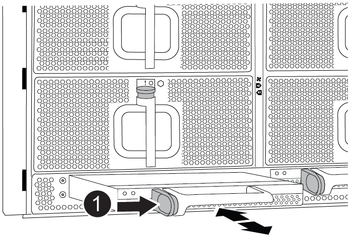

= Mova e substitua o hardware - AFF A900
:allow-uri-read: 

== Mova e substitua o hardware - AFF A900

[role="lead"]
Para substituir o chassis, tem de remover os componentes do chassis danificado e instalá-los no chassis de substituição.

== Etapa 1: Remova as fontes de alimentação

Remover as fontes de alimentação ao substituir um chassi envolve desligar, desconetar e remover as quatro fontes de alimentação da parte traseira do chassi com deficiência.

. Se você ainda não está aterrado, aterre-se adequadamente.
. Desligue a fonte de alimentação e desligue os cabos de alimentação:
+
.. Desligue o interrutor de alimentação da fonte de alimentação.
.. Abra o retentor do cabo de alimentação e, em seguida, desligue o cabo de alimentação da fonte de alimentação.
.. Desconete o cabo de alimentação da fonte de alimentação.

. Prima e mantenha premido o botão de bloqueio de terra cotta na pega da fonte de alimentação e, em seguida, puxe a fonte de alimentação para fora do chassis.
+

NOTE: Ao remover uma fonte de alimentação, utilize sempre duas mãos para suportar o seu peso.

+
.Animação - Remover/instalar a PSU
video::6d0eee92-72e2-4da4-a4fa-adf9016b57ff[panopto]
+
image::../media/drw_a900_remove_install_PSU_module.png[Remova ou instale um módulo da PSU]

+
[cols="1,4"]
|===

 a| 
image:../media/icon_round_1.png["Legenda número 1"]
 a| 
Botão de bloqueio

|===
. Repita as etapas anteriores para qualquer fonte de alimentação restante.

== Passo 2: Remova os ventiladores

Ao substituir o chassis, é necessário remover os seis módulos da ventoinha, localizados na parte dianteira do chassis.

. Se você ainda não está aterrado, aterre-se adequadamente.
. Retire a moldura (se necessário) com duas mãos, segurando as aberturas de cada lado da moldura e puxando-a na sua direção até que a moldura se solte dos pernos esféricos na estrutura do chassis.
. Prima o botão de bloqueio de terra cotta no módulo da ventoinha e puxe o módulo da ventoinha para fora do chassis, certificando-se de que o apoia com a mão livre.
+

NOTE: Os módulos da ventoinha são curtos. Apoie sempre a parte inferior do módulo da ventoinha com a mão livre para que não caia subitamente do chassis e o machuque.

+
.Animação - Remover/instalar a ventoinha
video::3c3c8d93-b48e-4554-87c8-adf9016af819[panopto]
+
image::../media/drw_a900_remove_install_fan.png[Remova ou instale a ventoinha]

+
[cols="1,4"]
|===

 a| 
image:../media/icon_round_1.png["Legenda número 1"]
 a| 
Botão de bloqueio terra cotta

 a| 
image:../media/icon_round_2.png["Legenda número 2"]
 a| 
Deslize o ventilador para dentro/fora do chassi

|===
. Coloque o módulo da ventoinha de lado.
. Repita os passos anteriores para quaisquer módulos de ventoinha restantes.

== Passo 3: Remova o módulo do controlador

Para substituir o chassis, tem de remover o ou os módulos do controlador do chassis afetado.

. Se você ainda não está aterrado, aterre-se adequadamente.
. Desconete os cabos do módulo do controlador desativado e mantenha o controle de onde os cabos foram conetados.
. Deslize o botão de bloqueio de terra cotta na pega do excêntrico para baixo até que este se destranque.
+
.Animação - Remover o controlador
video::256721fd-4c2e-40b3-841a-adf2000df5fa[panopto]
+
image::../media/drw_a900_remove_PCM.png[Retire o controlador]

+
[cols="1,4"]
|===

 a| 
image:../media/icon_round_1.png["Legenda número 1"]
 a| 
Botão de bloqueio do manípulo do came

 a| 
image:../media/icon_round_2.png["Legenda número 2"]
 a| 
Pega do came

|===
. Rode o manípulo do excêntrico de forma a desengatar completamente o módulo do controlador do chassis e, em seguida, deslize o módulo do controlador para fora do chassis.
+
Certifique-se de que suporta a parte inferior do módulo do controlador enquanto o desliza para fora do chassis.

. Coloque o módulo do controlador de lado em um local seguro e mantenha o controle de qual slot do chassi veio, de modo que ele possa ser instalado no mesmo slot no chassi de substituição.
. Repita estes passos se tiver outro módulo de controlador no chassis.

== Passo 4: Remova os módulos de e/S.

Para remover os módulos de e/S do chassis afetado, incluindo os módulos NVRAM, siga a sequência específica dos passos.

. Se você ainda não está aterrado, aterre-se adequadamente.
. Desconete qualquer cabeamento associado ao módulo de e/S de destino.
+
Certifique-se de etiquetar os cabos para que saiba de onde vieram.

. Retire o módulo de e/S alvo do chassis:
+
.. Prima o botão de bloqueio do came com letras e numerado.
+
O botão de bloqueio do excêntrico afasta-se do chassis.

.. Rode o trinco da árvore de cames para baixo até estar na posição horizontal.
+
O módulo de e/S desengata do chassis e desloca-se cerca de 1/2 polegadas para fora do slot de e/S.

.. Retire o módulo de e/S do chassis puxando as patilhas de puxar nas laterais da face do módulo.
+
Certifique-se de manter o controle de qual slot o módulo de e/S estava.

+
.Animação - Remover/instalar o módulo de e/S.
video::3a5b1f6e-15ec-40b4-bb2a-adf9016af7b6[panopto]
+
image:../media/drw_a900_remove_PCIe_module.png["Remova um módulo PCIe"]

+
[cols="1,4"]
|===

 a| 
image:../media/icon_round_1.png["Legenda número 1"]
 a| 
Trinco do came de e/S com letras e numerado

 a| 
image:../media/icon_round_2.png["Legenda número 2"]
 a| 
Trinco da came de e/S completamente desbloqueado

|===
. Coloque o módulo de e/S de lado.
. Repita o passo anterior para os restantes módulos de e/S no chassis com deficiência.

== Passo 5: Retire o módulo de alimentação do controlador de fase de remoção

Retire os dois módulos de alimentação do controlador de desativação da parte dianteira do chassis danificado.

. Se você ainda não está aterrado, aterre-se adequadamente.
. Prima o botão de bloqueio de terra cotta na pega do módulo e, em seguida, deslize o DCPM para fora do chassis.
+
.Animação - Remover/instalar DCPM
video::ade18276-5dbc-4b91-9a0e-adf9016b4e55[panopto]
+

+
[cols="1,4"]
|===

 a| 
image:../media/icon_round_1.png["Legenda número 1"]
 a| 
Botão de bloqueio DCPM terra cotta

|===
. Coloque o DCPM de lado em um local seguro e repita este passo para o DCPM restante.

== Passo 6: Remova o módulo LED USB

Retire os módulos LED USB.

.Animação - Remover/instalar USB
video::eb715462-cc20-454f-bcf9-adf9016af84e[panopto]
image::../media/drw_a900_remove_replace_LED_mod.png[Remova ou substitua um módulo LED USB]

[cols="1,4"]
|===

 a| 
image:../media/icon_round_1.png["Legenda número 1"]
 a| 
Ejete o módulo.

 a| 
image:../media/icon_round_2.png["Legenda número 2"]
 a| 
Deslize para fora do chassi.

|===
. Localize o módulo de LED USB na parte frontal do chassi com deficiência, diretamente sob os compartimentos DCPM.
. Prima o botão de bloqueio preto no lado direito do módulo para soltar o módulo do chassis e, em seguida, deslize-o para fora do chassis com deficiência.
. Coloque o módulo de lado num local seguro.

== Etapa 7: Remova o chassi

Você deve remover o chassi existente do rack de equipamentos ou do gabinete do sistema antes de instalar o chassi de substituição.

. Retire os parafusos dos pontos de montagem do chassis.
+

NOTE: Se o sistema estiver em um gabinete do sistema, talvez seja necessário remover o suporte de fixação traseiro.

. Com a ajuda de duas ou três pessoas, deslize o chassi prejudicado dos trilhos do rack em um gabinete do sistema ou suportes _L_ em um rack de equipamentos e, em seguida, coloque-o de lado.
. Se você ainda não está aterrado, aterre-se adequadamente.
. Usando duas ou três pessoas, instale o chassi de substituição no rack de equipamentos ou no gabinete do sistema guiando o chassi para os trilhos do rack em um gabinete do sistema ou suportes _L_ em um rack de equipamentos.
. Deslize o chassi até o rack de equipamentos ou o gabinete do sistema.
. Fixe a parte frontal do chassis ao rack de equipamentos ou ao gabinete do sistema, usando os parafusos que você removeu do chassi danificado.
. Fixe a parte traseira do chassis ao rack de equipamentos ou ao gabinete do sistema.
. Se estiver a utilizar os suportes de gestão de cabos, retire-os do chassis danificado e, em seguida, instale-os no chassis de substituição.

== Passo 8: Instale o módulo de alimentação do controlador de fase de remoção

Quando o chassi de substituição é instalado no rack ou no gabinete do sistema, você deve reinstalar os módulos de alimentação do controlador de estágio nele.

. Se você ainda não está aterrado, aterre-se adequadamente.
. Alinhe a extremidade do DCPM com a abertura do chassis e, em seguida, deslize-a suavemente para dentro do chassis até encaixar no lugar.
+

NOTE: O módulo e o slot são chaveados. Não force o módulo para dentro da abertura. Se o módulo não entrar facilmente, realinhar o módulo e inseri-lo no chassis.

. Repita esta etapa para o DCPM restante.

== Passo 9: Instale ventiladores no chassi

Para instalar os módulos do ventilador ao substituir o chassi, você deve executar uma sequência específica de tarefas.

. Se você ainda não está aterrado, aterre-se adequadamente.
. Alinhe as extremidades do módulo do ventilador de substituição com a abertura no chassi e, em seguida, deslize-o para dentro do chassi até que ele se encaixe no lugar.
+
Quando inserido num sistema ativo, o LED âmbar de atenção pisca quatro vezes quando o módulo da ventoinha é inserido com sucesso no chassis.

. Repita estes passos para os restantes módulos do ventilador.
. Alinhe a moldura com os pernos esféricos e, em seguida, empurre cuidadosamente a moldura para os pernos esféricos.

== Passo 10: Instale módulos de e/S.

Para instalar módulos de e/S, incluindo os módulos NVRAM do chassis afetado, siga a sequência específica dos passos.

Você deve ter o chassi instalado para que você possa instalar os módulos de e/S nos slots correspondentes no chassi de substituição.

. Se você ainda não está aterrado, aterre-se adequadamente.
. Depois que o chassi de substituição for instalado no rack ou gabinete, instale os módulos de e/S em seus slots correspondentes no chassi de substituição, deslizando suavemente o módulo de e/S para o slot até que o trinco do came de e/S com letras e numerado comece a engatar e, em seguida, empurre o trinco do came de e/S totalmente para cima para bloquear o módulo no lugar.
. Recable o módulo I/o, conforme necessário.
. Repita a etapa anterior para os módulos de e/S restantes que você reservou.
+

NOTE: Se o chassi com deficiência tiver painéis de e/S vazios, mova-os para o chassi de substituição neste momento.

== Passo 11: Instale as fontes de alimentação

A instalação das fontes de alimentação ao substituir um chassi envolve a instalação das fontes de alimentação no chassi de substituição e a conexão à fonte de alimentação.

. Se você ainda não está aterrado, aterre-se adequadamente.
. Certifique-se de que os balanceiros das fontes de alimentação estão na posição desligada.
. Utilizando ambas as mãos, apoie e alinhe as extremidades da fonte de alimentação com a abertura no chassis do sistema e, em seguida, empurre cuidadosamente a fonte de alimentação para o chassis até encaixar no devido lugar.
+
As fontes de alimentação são chaveadas e só podem ser instaladas de uma forma.

+

IMPORTANT: Não utilize força excessiva ao deslizar a fonte de alimentação para o sistema. Pode danificar o conetor.

. Volte a ligar o cabo de alimentação e fixe-o à fonte de alimentação utilizando o mecanismo de bloqueio do cabo de alimentação.
+

IMPORTANT: Ligue apenas o cabo de alimentação à fonte de alimentação. Não ligue o cabo de alimentação a uma fonte de alimentação neste momento.

. Repita as etapas anteriores para qualquer fonte de alimentação restante.

== Passo 12: Instale os módulos LED USB

Instale os módulos LED USB no chassis de substituição.

. Localize a ranhura do módulo LED USB na parte frontal do chassis de substituição, diretamente sob os compartimentos DCPM.
. Alinhe as extremidades do módulo com o compartimento de LED USB e empurre cuidadosamente o módulo até encaixar.

== Passo 13: Instale o controlador

Depois de instalar o módulo do controlador e quaisquer outros componentes no chassis de substituição, inicie-o.

. Se você ainda não está aterrado, aterre-se adequadamente.
. Ligue as fontes de alimentação a diferentes fontes de alimentação e, em seguida, ligue-as.
. Alinhe a extremidade do módulo do controlador com a abertura no chassis e, em seguida, empurre cuidadosamente o módulo do controlador até meio do sistema.
+

NOTE: Não introduza completamente o módulo do controlador no chassis até ser instruído a fazê-lo.

. Recable o console para o módulo do controlador e, em seguida, reconete a porta de gerenciamento.
. Com a alavanca do came na posição aberta, deslize o módulo do controlador para dentro do chassi e empurre firmemente o módulo do controlador para dentro até que ele atenda ao plano médio e esteja totalmente assentado e, em seguida, feche a alça do came até que ele encaixe na posição travada.
+

IMPORTANT: Não utilize força excessiva ao deslizar o módulo do controlador para o chassis; poderá danificar os conetores.

+
O módulo do controlador começa a arrancar assim que estiver totalmente assente no chassis.

. Repita os passos anteriores para instalar o segundo controlador no chassis de substituição.
. Inicialize cada controlador.

