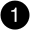

= Visão geral de adicionar e substituir módulo de E/S - AFX 2K
:allow-uri-read: 
:icons: font
:imagesdir: ../media/

[role="lead"]
O sistema de storage AFX 2K oferece flexibilidade na expansão ou substituição de módulos de E/S para aprimorar a conectividade e o desempenho da rede. Adicionar ou substituir um módulo de E/S é essencial ao atualizar os recursos da rede ou ao substituir um módulo com defeito.

Você pode substituir um módulo de E/S com defeito em seu sistema de storage AFX 2K por um módulo de E/S do mesmo tipo ou por um módulo de E/S de tipo diferente. Você também pode adicionar um módulo de E/S a um sistema com slots vazios.

* link:io-module-add.html["Adicione um módulo de e/S."]
+
Adicionar módulos adicionais pode melhorar a redundância, ajudando a garantir que o sistema permaneça operacional mesmo que um módulo falhe.

* link:io-module-replace.html["Substitua um módulo de e/S."]
+
A substituição de um módulo de e/S com falha pode restaurar o sistema ao seu estado de funcionamento ideal.

.Numeração de slots de e/S.
Os slots de E/S no controlador AFX 2K são numerados de 1 a 11, conforme mostrado na ilustração a seguir.

image::../media/drw_afx_2k_rear_slots_ieops-2862.svg[Numeração dos slots em um controlador AFX 2K]

[cols="10%,23%,10%,24%,10%,23%"]
|===
| Número do slot | Slot de E/S | Número do slot | Slot de E/S | Número do slot | Slot de E/S 

 a| 

| HA  a| 
image::../media/icon_round_4.svg[Legenda número 4]

image::../media/icon_round_5.svg[Legenda número 5]
| NVRAM12  a| 
image::../media/icon_round_9.svg[Chamada número 9]
| Rede 

 a| 
image::../media/icon_round_2.svg[Legenda número 2]
| Cluster  a| 
image::../media/icon_round_6.svg[Chamada número 6]

image::../media/icon_round_7.svg[Chamada número 7]
| NVRAM12-EX  a| 
image::../media/icon_round_10.svg[Chamada número 10]
| Armazenamento 

 a| 
image::../media/icon_round_3.svg[Legenda número 3]
| Rede  a| 
image::../media/icon_round_8.svg[Chamada número 8]
| Armazenamento  a| 
image::../media/icon_round_11.svg[Chamada número 11]
| (*Opcional*) SFP28 de 25GbE com quatro portas para conectividade de gerenciamento adicional 
|===