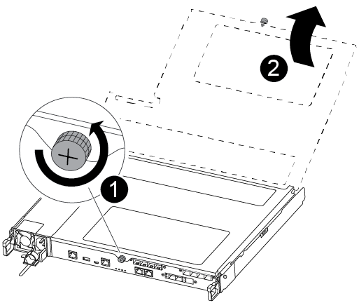

= Substitua uma ventoinha - ASA C250
:allow-uri-read: 
:icons: font
:imagesdir: ../media/

[role="lead"]
Para substituir uma ventoinha, retire o módulo da ventoinha com avaria e substitua-o por um novo módulo da ventoinha.

== Passo 1: Desligue o controlador desativado

Para encerrar o controlador com deficiência, você deve determinar o status do controlador e, se necessário, assumir o controlador para que o controlador saudável continue fornecendo dados do armazenamento do controlador com deficiência.

.Sobre esta tarefa
* Se você tiver um sistema SAN, você deve ter verificado mensagens de  `cluster kernel-service show`evento ) para o blade SCSI do controlador afetado. O `cluster kernel-service show` comando (do modo avançado priv) exibe o nome do nó, link:https://docs.netapp.com/us-en/ontap/system-admin/display-nodes-cluster-task.html["status do quorum"]desse nó, o status de disponibilidade desse nó e o status operacional desse nó.
+
Cada processo SCSI-blade deve estar em quórum com os outros nós no cluster. Qualquer problema deve ser resolvido antes de prosseguir com a substituição.

* Se você tiver um cluster com mais de dois nós, ele deverá estar no quórum. Se o cluster não estiver em quórum ou se um controlador íntegro exibir false para qualificação e integridade, você deverá corrigir o problema antes de encerrar o controlador prejudicado; link:https://docs.netapp.com/us-en/ontap/system-admin/synchronize-node-cluster-task.html?q=Quorum["Sincronize um nó com o cluster"^]consulte .

.Passos
. Se o AutoSupport estiver ativado, suprimir a criação automática de casos invocando uma mensagem AutoSupport: `system node autosupport invoke -node * -type all -message MAINT=<# of hours>h`
+
A seguinte mensagem AutoSupport suprime a criação automática de casos por duas horas: `cluster1:> system node autosupport invoke -node * -type all -message MAINT=2h`

. Desative a giveback automática a partir da consola do controlador saudável: `storage failover modify -node local -auto-giveback false`
+

NOTE: Quando vir _do pretende desativar a auto-giveback?_, introduza `y`.

. Leve o controlador prejudicado para o prompt Loader:
+
[cols="1,2"]
|===
| Se o controlador afetado estiver a apresentar... | Então... 

 a| 
O prompt Loader
 a| 
Vá para a próxima etapa.

 a| 
A aguardar pela giveback...
 a| 
Pressione Ctrl-C e responda `y` quando solicitado.

 a| 
Prompt do sistema ou prompt de senha
 a| 
Assuma ou interrompa o controlador prejudicado do controlador saudável: `storage failover takeover -ofnode _impaired_node_name_`

Quando o controlador prejudicado mostrar aguardando a giveback..., pressione Ctrl-C e responda `y`.

|===

== Passo 2: Remova o módulo do controlador

Deve remover o módulo do controlador do chassis quando substituir um componente no interior do módulo do controlador.

Certifique-se de etiquetar os cabos para que saiba de onde vieram.

. Se você ainda não está aterrado, aterre-se adequadamente.
. Desconete as fontes de alimentação do módulo do controlador da fonte.
. Solte os fixadores do cabo de alimentação e, em seguida, desconete os cabos das fontes de alimentação.
. Insira o dedo indicador no mecanismo de travamento em ambos os lados do módulo do controlador, pressione a alavanca com o polegar e puxe o controlador cuidadosamente alguns centímetros para fora do chassi.
+

NOTE: Se tiver dificuldade em remover o módulo do controlador, coloque os dedos indicadores através dos orifícios dos dedos a partir do interior (cruzando os braços).

+
image::../media/drw_a250_pcm_remove_install.png[Abrir o mecanismo de bloqueio]

+
[cols="1,4"]
|===

 a| 
image:../media/icon_round_1.png["Legenda número 1"]
 a| 
Alavanca

 a| 
image:../media/icon_round_2.png["Legenda número 2"]
 a| 
Mecanismo de bloqueio

|===
. Usando ambas as mãos, segure os lados do módulo do controlador e puxe-o suavemente para fora do chassi e coloque-o em uma superfície plana e estável.
. Rode o parafuso de aperto manual na parte frontal do módulo do controlador no sentido contrário ao dos ponteiros do relógio e abra a tampa do módulo do controlador.
+

+
[cols="1,4"]
|===

 a| 
image:../media/icon_round_1.png["Legenda número 1"]
| Parafuso de aperto manual 

 a| 
image:../media/icon_round_2.png["Legenda número 2"]
 a| 
Tampa do módulo do controlador

|===

== Passo 3: Substitua um ventilador

Para substituir uma ventoinha, retire o módulo da ventoinha com avaria e substitua-o por um novo módulo da ventoinha.

Use o vídeo a seguir ou os passos tabulados para substituir um ventilador:

.Animação - substitua uma ventoinha
video::ccfa6665-2c2b-4571-ae79-ac5b015c19fc[panopto]
. Identifique o módulo do ventilador que você deve substituir verificando as mensagens de erro do console ou localizando o LED aceso do módulo do ventilador na placa-mãe.
. Retire o módulo da ventoinha apertando o lado do módulo da ventoinha e, em seguida, levantando o módulo da ventoinha diretamente para fora do módulo do controlador.
+
image::../media/drw_a250_replace_fan.png[Retirar o módulo da ventoinha]

+
[cols="1,4"]
|===

 a| 
image:../media/icon_round_1.png["Legenda número 1"]
| Módulo da ventoinha 
|===
. Alinhe as extremidades do módulo da ventoinha de substituição com a abertura no módulo do controlador e, em seguida, deslize o módulo da ventoinha de substituição para o módulo do controlador.

== Etapa 4: Reinstale o módulo do controlador

Depois de substituir um componente dentro do módulo do controlador, você deve reinstalar o módulo do controlador no chassi do sistema e iniciá-lo.

. Feche a tampa do módulo do controlador e aperte o parafuso de aperto manual.
+
image::../media/drw_a250_close_controller_module_cover.png[Fechar a tampa do módulo do controlador]

+
[cols="1,4"]
|===

 a| 
image:../media/icon_round_1.png["Legenda número 1"]
| Tampa do módulo do controlador 

 a| 
image:../media/icon_round_2.png["Legenda número 2"]
 a| 
Parafuso de aperto manual

|===
. Insira o módulo do controlador no chassis:
+
.. Certifique-se de que os braços do mecanismo de engate estão bloqueados na posição totalmente estendida.
.. Utilizando ambas as mãos, alinhe e deslize suavemente o módulo do controlador para dentro dos braços do mecanismo de bloqueio até parar.
.. Coloque os dedos indicadores através dos orifícios dos dedos a partir do interior do mecanismo de bloqueio.
.. Pressione os polegares para baixo nas patilhas cor-de-laranja na parte superior do mecanismo de bloqueio e empurre suavemente o módulo do controlador sobre o batente.
.. Solte os polegares da parte superior dos mecanismos de travamento e continue empurrando até que os mecanismos de travamento se encaixem no lugar.
+
O módulo do controlador deve ser totalmente inserido e alinhado com as bordas do chassi.

.. Conete os cabos de alimentação às fontes de alimentação, reinstale o colar de travamento do cabo de alimentação e, em seguida, conete as fontes de alimentação à fonte de alimentação.
+
O módulo do controlador começa a inicializar assim que a energia é restaurada. Esteja preparado para interromper o processo de inicialização.

. Recable o sistema, conforme necessário.
. Volte a colocar o controlador em funcionamento normal, devolvendo o respetivo armazenamento: `storage failover giveback -ofnode _impaired_node_name_`
. Se a giveback automática foi desativada, reative-a: `storage failover modify -node local -auto-giveback true`

== Passo 5: Devolva a peça com falha ao NetApp

Devolva a peça com falha ao NetApp, conforme descrito nas instruções de RMA fornecidas com o kit. Consulte a https://mysupport.netapp.com/site/info/rma["Devolução de peças e substituições"] página para obter mais informações.
