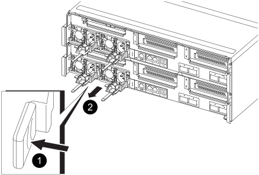
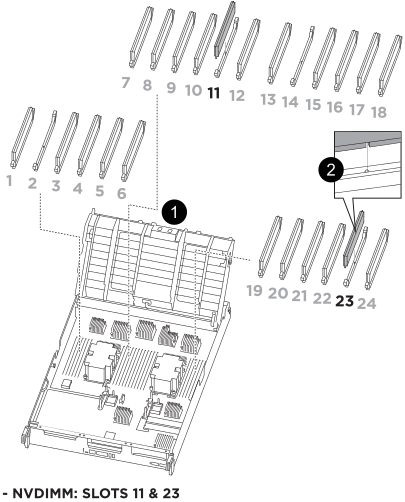

= Substitua o hardware do módulo do controlador - ASA C800
:allow-uri-read: 
:icons: font
:imagesdir: ../media/

[role="lead"]
Para substituir o controlador, tem de remover o controlador afetado, mover os componentes FRU para o módulo do controlador de substituição, instalar o módulo do controlador de substituição no chassis e, em seguida, arrancar o sistema para o modo de manutenção.

== Passo 1: Remova o módulo do controlador

Deve remover o módulo do controlador do chassis quando substituir o módulo do controlador ou substituir um componente dentro do módulo do controlador.

. Certifique-se de que todas as unidades no chassis estão firmemente assentadas contra o plano médio, utilizando os polegares para empurrar cada unidade até sentir um batente positivo.
+
image::../media/drw_a800_drive_seated_IEOPS-960.svg[Acionamentos do disco do assento]

. Vá para a parte traseira do chassis. Se você ainda não está aterrado, aterre-se adequadamente.
. Desconete as fontes de alimentação do módulo do controlador da fonte.
. Solte os fixadores do cabo de alimentação e, em seguida, desconete os cabos das fontes de alimentação.
. Solte o gancho e a alça de loop que prendem os cabos ao dispositivo de gerenciamento de cabos e, em seguida, desconete os cabos do sistema e os módulos SFP e QSFP (se necessário) do módulo do controlador, mantendo o controle de onde os cabos foram conetados.
+
Deixe os cabos no dispositivo de gerenciamento de cabos para que, ao reinstalar o dispositivo de gerenciamento de cabos, os cabos sejam organizados.

. Retire o dispositivo de gestão de cabos do módulo do controlador e coloque-o de lado.
. Prima ambos os trincos de bloqueio para baixo e, em seguida, rode ambos os trincos para baixo ao mesmo tempo.
+
O módulo do controlador desloca-se ligeiramente para fora do chassis.

+
image::../media/drw_a800_pcm_remove.png[Solte o módulo do controlador]

+
[cols="1,4"]
|===

 a| 
image:../media/icon_round_1.png["Legenda número 1"]
 a| 
Trinco de bloqueio

 a| 
image:../media/icon_round_2.png["Legenda número 2"]
 a| 
Pino de bloqueio

|===
. Deslize o módulo do controlador para fora do chassis e coloque-o numa superfície plana e estável.
+
Certifique-se de que suporta a parte inferior do módulo do controlador enquanto o desliza para fora do chassis. .

. Coloque o módulo do controlador numa superfície estável e plana.
. Abra a conduta de ar do módulo do controlador:
+
.. Pressione as patilhas de bloqueio nas laterais da conduta de ar em direção ao centro do módulo do controlador.
.. Deslize a conduta de ar em direção aos módulos da ventoinha e, em seguida, rode-a para cima até à posição completamente aberta.
+
image::../media/drw_a800_open_air_duct.png[Abra a conduta de ar]

+
[cols="1,4"]
|===

 a| 
image:../media/icon_round_1.png["Legenda número 1"]
 a| 
Patilhas de bloqueio da conduta de ar

 a| 
image:../media/icon_round_2.png["Legenda número 2"]
 a| 
Deslize a conduta de ar em direção aos módulos do ventilador

 a| 
image:../media/icon_round_3.png["Legenda número 3"]
 a| 
Gire a conduta de ar em direção aos módulos do ventilador

|===

== Passo 2: Mova as fontes de alimentação

É necessário mover as fontes de alimentação do módulo do controlador desativado para o módulo do controlador de substituição quando substituir um módulo do controlador.

. Rode a pega do excêntrico de forma a que possa ser utilizada para retirar a fonte de alimentação do módulo do controlador enquanto prime a patilha de bloqueio.
+

CAUTION: A fonte de alimentação é curta. Utilize sempre as duas mãos para o apoiar quando o retirar do módulo do controlador, de modo a que não se liberte subitamente do módulo do controlador e o machuque.

+

+
[cols="1,4"]
|===

 a| 
image:../media/icon_round_1.png["Legenda número 1"]
 a| 
Patilha de bloqueio da fonte de alimentação azul

 a| 
image:../media/icon_round_2.png["Legenda número 2"]
 a| 
Fonte de alimentação

|===
. Mova a fonte de alimentação para o novo módulo do controlador e, em seguida, instale-a.
. Utilizando ambas as mãos, apoie e alinhe as extremidades da fonte de alimentação com a abertura no módulo do controlador e, em seguida, empurre cuidadosamente a fonte de alimentação para o módulo do controlador até que a patilha de bloqueio encaixe no lugar.
+
As fontes de alimentação apenas engatarão adequadamente com o conetor interno e trancam no lugar de uma forma.

+

NOTE: Para evitar danificar o conetor interno, não utilize força excessiva ao deslizar a fonte de alimentação para o sistema.

== Passo 3: Mova os fãs

É necessário mover as ventoinhas do módulo do controlador desativado para o módulo de substituição ao substituir um módulo do controlador com falha.

. Retire o módulo da ventoinha apertando as patilhas de bloqueio na parte lateral do módulo da ventoinha e, em seguida, levantando o módulo da ventoinha diretamente para fora do módulo do controlador.
+
image::../media/drw_a800_replace_fan.png[Retire a ventoinha]

+
|===

 a| 
image:../media/icon_round_1.png["Legenda número 1"]

 a| 
Patilhas de bloqueio da ventoinha

 a| 
image:../media/icon_round_2.png["Legenda número 2"]

 a| 
Módulo da ventoinha

|===
. Mova o módulo da ventoinha para o módulo do controlador de substituição e, em seguida, instale o módulo da ventoinha alinhando as extremidades com a abertura no módulo do controlador e, em seguida, deslizando o módulo da ventoinha para o módulo do controlador até que os trincos de bloqueio encaixem no lugar.
. Repita estes passos para os restantes módulos do ventilador.

== Etapa 4: Mova a bateria NVDIMM

Ao substituir o módulo do controlador, tem de mover a bateria do NVRAM do módulo do controlador desativado para o módulo do controlador de substituição

. Abra a tampa da conduta de ar e localize a bateria NVDIMM na riser.
+
image::../media/drw_a800_nvdimm_battery_replace.png[Substitua a bateria NVDIMM]

+
[cols="1,4"]
|===

 a| 
image:../media/icon_round_1.png["Legenda número 1"]
 a| 
Riser da conduta de ar

 a| 
image:../media/icon_round_2.png["Legenda número 2"]
 a| 
Ficha da bateria NVDIMM

 a| 
image:../media/icon_round_3.png["Legenda número 3"]
 a| 
Bateria NVDIMM

|===
+
*Atenção:* o LED da placa de controle da bateria NVDIMM pisca enquanto separa o conteúdo da memória flash quando você interrompe o sistema. Depois que o destage estiver completo, o LED desliga-se.

. Localize a ficha da bateria e aperte o clipe na face da ficha da bateria para soltar a ficha da tomada e, em seguida, desligue o cabo da bateria da tomada.
. Segure a bateria e levante-a para fora da conduta de ar e do módulo do controlador.
. Mova a bateria para o módulo do controlador de substituição e, em seguida, instale-a na conduta de ar NVDIMM:
+
.. Insira a bateria na ranhura e pressione firmemente a bateria para baixo para se certificar de que está bloqueada no lugar.
.. Ligue a ficha da bateria à tomada riser e certifique-se de que a ficha fica fixa no lugar.

== Passo 5: Remova os risers PCIe

Como parte do processo de substituição da controladora, você deve remover os módulos PCIe do módulo controlador prejudicado. Você deve instalá-los no mesmo local no módulo do controlador de substituição assim que os NVDIMMS e DIMMs tiverem sido movidos para o módulo do controlador de substituição.

. Remova a riser PCIe do módulo da controladora:
+
.. Remova quaisquer módulos SFP ou QSFP que possam estar nas placas PCIe.
.. Gire a trava de travamento do riser no lado esquerdo da riser para cima e em direção aos módulos do ventilador.
+
A riser levanta-se ligeiramente do módulo do controlador.

.. Levante a riser, mova-a em direção aos ventiladores de modo que a aba de chapa metálica na riser limpe a borda do módulo do controlador, levante a riser para fora do módulo do controlador e, em seguida, coloque-a em uma superfície estável e plana.
+
image::../media/drw_a800_riser_2_3_remove.png[Remova os tirantes 2 e 3]

+
[cols="1,4"]
|===

 a| 
image:../media/icon_round_1.png["Legenda número 1"]
 a| 
Conduta de ar

 a| 
image:../media/icon_round_2.png["Legenda número 2"]
 a| 
Travas de travamento do riser 1 (riser esquerdo), riser 2 (riser intermediário) e 3 (riser direito)

|===

. Repita o passo anterior para os restantes risers no módulo do controlador desativado.
. Repita os passos acima com os risers vazios no controlador de substituição e guarde-os.

== Passo 6: Mova os DIMMs do sistema

Para mover os DIMMs, localize-os e mova-os do controlador prejudicado para o controlador de substituição e siga a sequência específica de passos.

. Observe a orientação do DIMM no soquete para que você possa inserir o DIMM no módulo do controlador de substituição na orientação adequada.
. Ejete o DIMM de seu slot, empurrando lentamente as duas abas do ejetor do DIMM em ambos os lados do DIMM e, em seguida, deslize o DIMM para fora do slot.
+

NOTE: Segure cuidadosamente o DIMM pelas bordas para evitar a pressão nos componentes da placa de circuito DIMM.

. Localize o slot onde você está instalando o DIMM.
. Insira o DIMM diretamente no slot.
+
O DIMM encaixa firmemente no slot, mas deve entrar facilmente. Caso contrário, realinhar o DIMM com o slot e reinseri-lo.

+

NOTE: Inspecione visualmente o DIMM para verificar se ele está alinhado uniformemente e totalmente inserido no slot.

. Empurre com cuidado, mas firmemente, na borda superior do DIMM até que as abas do ejetor se encaixem no lugar sobre os entalhes nas extremidades do DIMM.
. Repita estas etapas para os DIMMs restantes.

== Etapa 7: Mova os NVDIMMs

Para mover os NVDIMMs, localize-os e mova-os do controlador prejudicado para o controlador de substituição e siga a sequência específica de passos.

. Localize os NVDIMMs no módulo do controlador.
+

+
[cols="1,4"]
|===

 a| 
image:../media/icon_round_1.png["Legenda número 1"]
 a| 
Conduta de ar

 a| 
image:../media/icon_round_2.png["Legenda número 2"]
 a| 
NVDIMMs

|===
. Observe a orientação do NVDIMM no soquete para que você possa inserir o NVDIMM no módulo do controlador de substituição na orientação adequada.
. Ejete o NVDIMM de seu slot, afastando lentamente as duas abas do ejetor NVDIMM em ambos os lados do NVDIMM e, em seguida, deslize o NVDIMM para fora do soquete e coloque-o de lado.
+

NOTE: Segure cuidadosamente o NVDIMM pelas bordas para evitar a pressão nos componentes da placa de circuito NVDIMM.

. Localize o slot onde você está instalando o NVDIMM.
. Insira o NVDIMM diretamente no slot.
+
O NVDIMM encaixa firmemente no slot, mas deve entrar facilmente. Caso contrário, realinhar o NVDIMM com o slot e reinseri-lo.

+

NOTE: Inspecione visualmente o NVDIMM para verificar se ele está alinhado uniformemente e totalmente inserido no slot.

. Empurre com cuidado, mas firmemente, na borda superior do NVDIMM até que as abas do ejetor se encaixem no lugar sobre os entalhes nas extremidades do NVDIMM.
. Repita as etapas anteriores para mover o outro NVDIMM.

== Passo 8: Mova a Mídia de inicialização

Tem de mover o dispositivo multimédia de arranque do controlador afetado e instalá-lo no controlador de substituição.

O suporte de arranque encontra-se sob a riser 3.

. Localize o suporte de arranque:
+
image::../media/drw_a800_pcm_replace_only_boot_media.png[Retire o suporte de arranque]

+
[cols="1,4"]
|===

 a| 
image:../media/icon_round_1.png["Legenda número 1"]
 a| 
Conduta de ar

 a| 
image:../media/icon_round_2.png["Legenda número 2"]
 a| 
Riser 3

 a| 
image:../media/icon_round_3.png["Legenda número 3"]
 a| 
Chave de fendas Phillips nº 1

 a| 
image:../media/icon_round_4.png["Legenda número 4"]
 a| 
Parafuso do suporte de arranque

 a| 
image:../media/icon_round_5.png["Legenda número 5"]
 a| 
Suporte de arranque

|===
. Retire o suporte de arranque do módulo do controlador:
+
.. Utilizando uma chave de fendas Phillips nº 1, retire o parafuso que segura o suporte de arranque e coloque o parafuso de lado num local seguro.
.. Agarrando os lados do suporte de arranque, rode suavemente o suporte de arranque para cima e, em seguida, puxe o suporte de arranque para fora do encaixe e coloque-o de lado.

. Mova o suporte de arranque para o novo módulo do controlador e instale-o:
+
.. Alinhe as extremidades do suporte de arranque com o alojamento do encaixe e, em seguida, empurre-o suavemente no encaixe.
.. Rode o suporte de arranque para baixo em direção à placa-mãe.
.. Fixe o suporte de arranque à placa-mãe utilizando o parafuso do suporte de arranque.
+
Não aperte demasiado o parafuso ou poderá danificar o suporte de arranque.

== Passo 9: Instale os risers PCIe

Você instala os risers PCIe no módulo do controlador de substituição depois de mover os DIMMs, NVDIMMs e Mídia de inicialização.

. Instale a riser no módulo do controlador de substituição:
+
.. Alinhe o lábio da riser com a parte inferior da chapa metálica do módulo do controlador.
.. Guie a riser ao longo dos pinos no módulo da controladora e baixe a riser para dentro do módulo da controladora.
.. Desloque o trinco de bloqueio para baixo e clique-o na posição de bloqueio.
+
Quando bloqueado, a trava de travamento fica alinhada com a parte superior da riser e a riser fica bem no módulo da controladora.

.. Reinsira todos os módulos SFP ou QSFP que foram removidos das placas PCIe.

. Repita a etapa anterior para os risers PCIe restantes.

== Passo 10: Instale o módulo do controlador

Depois de todos os componentes terem sido movidos do módulo do controlador afetado para o módulo do controlador de substituição, tem de instalar o módulo do controlador de substituição no chassis e, em seguida, iniciá-lo no modo de manutenção.

. Se ainda não o tiver feito, feche a conduta de ar:
+
.. Desloque a conduta de ar até ao módulo do controlador.
.. Faça deslizar a conduta de ar na direção dos tirantes até que as patilhas de bloqueio encaixem no lugar.
.. Inspecione a conduta de ar para se certificar de que está corretamente encaixada e trancada no lugar.
+
image::../media/drw_a800_close_air_duct.png[Feche a conduta de ar]

+
[cols="1,4"]
|===

 a| 
image:../media/icon_round_1.png["Legenda número 1"]
 a| 
Patilhas de bloqueio

 a| 
image:../media/icon_round_2.png["Legenda número 2"]
 a| 
Deslize o êmbolo

|===

. Alinhe a extremidade do módulo do controlador com a abertura no chassis e, em seguida, empurre cuidadosamente o módulo do controlador até meio do sistema.
+

NOTE: Não introduza completamente o módulo do controlador no chassis até ser instruído a fazê-lo.

. Faça o cabeamento apenas das portas de gerenciamento e console, para que você possa acessar o sistema para executar as tarefas nas seções a seguir.
+

NOTE: Você conetará o resto dos cabos ao módulo do controlador posteriormente neste procedimento.

. Conclua a reinstalação do módulo do controlador:
+
.. Empurre firmemente o módulo do controlador para dentro do chassi até que ele atenda ao plano médio e esteja totalmente assentado.
+
Os trincos de bloqueio sobem quando o módulo do controlador está totalmente assente.

+

NOTE: Não utilize força excessiva ao deslizar o módulo do controlador para dentro do chassis para evitar danificar os conetores.

.. Rode os trincos de bloqueio para cima, inclinando-os de forma a que estes limpem os pinos de bloqueio e, em seguida, baixe-os para a posição de bloqueio.

. Conete os cabos do sistema e os módulos do transcetor ao módulo do controlador e reinstale o dispositivo de gerenciamento de cabos.
. Ligue os cabos de alimentação às fontes de alimentação e volte a instalar os fixadores do cabo de alimentação.
+
O módulo do controlador começa a arrancar assim que está ligado à alimentação. Esteja preparado para interromper o processo de inicialização.

+

NOTE: Se o sistema tiver fontes de alimentação CC, certifique-se de que os parafusos de aperto manual do cabo da fonte de alimentação estão apertados.

