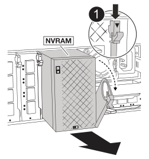

= Substituir o chassis - ASA A1K
:allow-uri-read: 
:icons: font
:imagesdir: ../media/

[role="lead"]
Substitua o chassi do seu sistema ASA A1K quando uma falha de hardware exigir isso.  O processo de substituição envolve a remoção do controlador, placas de E/S, módulo NVRAM12, módulo de gerenciamento do sistema e unidades de fonte de alimentação (PSUs), a instalação do chassi de substituição e a reinstalação dos componentes do chassi.

== Etapa 1: Remova as PSUs e os cabos

Você precisa remover as duas unidades de fonte de alimentação (PSUs) antes de remover o controlador.

.Passos
. Remova as PSUs:
+
.. Se você ainda não está aterrado, aterre-se adequadamente.
.. Desconecte os cabos de alimentação das PSUs.
+
Se o sistema tiver alimentação CC, desligue o bloco de alimentação das PSUs.

.. Remova as duas PSUs da parte traseira do chassi girando a alça da PSU para cima para que você possa puxá-la para fora, pressione a aba de travamento da PSU e, em seguida, puxe a PSU para fora do chassi.
+

CAUTION: A PSU é curta. Utilize sempre as duas mãos para o apoiar quando o retirar do módulo do controlador, de modo a que não se liberte subitamente do módulo do controlador e o machuque.

+
image::../media/drw_a1k_psu_remove_replace_ieops-1378.svg[Remover ou substituir a PSU]

+
[cols="1,4"]
|===

 a| 
image:../media/icon_round_1.png["Legenda número 1"]
 a| 
Patilha de bloqueio da PSU de terracota

|===
.. Repita essas etapas para a segunda PSU.

. Retire os cabos:
+
.. Desconete os cabos do sistema e todos os módulos SFP e QSFP (se necessário) do módulo do controlador, mas deixe-os no dispositivo de gerenciamento de cabos para mantê-los organizados.
+

NOTE: Os cabos devem ter sido identificados no início deste procedimento.

.. Remova o dispositivo de gerenciamento de cabos do chassi e deixe-o de lado.

== Etapa 2: Remova as placas de E/S, NVRAM12 e o módulo de gerenciamento do sistema

. Retire o módulo de e/S alvo do chassis:
+
image:../media/drw_a1k_io_remove_replace_ieops-1382.svg["Remova o módulo de e/S."]

+
[cols="1,4"]
|===

 a| 
image:../media/icon_round_1.png["Legenda número 1"]
 a| 
Trinco do came de e/S.

|===
+
.. Prima o botão do came no módulo alvo.
.. Rode o trinco do excêntrico para longe do módulo o mais longe possível.
.. Remova o módulo do chassi colocando o dedo na abertura da alavanca do came e puxando o módulo para fora do chassi.
+
Certifique-se de manter o controle de qual slot o módulo de e/S estava.

.. Deixe o módulo de E/S de lado e repita essas etapas para quaisquer outros módulos de E/S.

. Remova o módulo NVRAM12:
+
.. Prima o botão do excêntrico de bloqueio.
+
O botão do came afasta-se do chassis.

.. Rode o trinco do excêntrico para baixo o mais longe possível.
.. Retire o módulo NVRAM do chassis, prendendo o dedo na abertura da alavanca do excêntrico e puxando o módulo para fora do chassis.
+

+
[cols="1,4"]
|===

 a| 
image:../media/icon_round_1.png["Legenda número 1"]
| Trava de came NVRAM12 
|===
.. Coloque o módulo NVRAM numa superfície estável.

. Remova o módulo de gerenciamento do sistema:
+
.. Prima o botão do came no módulo de gestão do sistema.
.. Rode a alavanca do came para baixo o mais longe possível.
.. Coloque o dedo no orifício da alavanca do came e puxe o módulo diretamente para fora do sistema.
+
image::../media/drw_a1k_sys-mgmt_remove_ieops-1384.svg[Gerenciamento do Sistema remover]

+
[cols="1,4"]
|===

 a| 
image::../media/icon_round_1.png[Legenda número 1]
 a| 
Trinco do excêntrico do módulo de gestão do sistema

|===

== Passo 3: Remova o módulo do controlador

. Na parte da frente da unidade, prenda os dedos nos orifícios dos cames de bloqueio, aperte as patilhas nas alavancas do excêntrico e, com cuidado, mas rode firmemente ambas as travas na sua direção ao mesmo tempo.
+
O módulo do controlador desloca-se ligeiramente para fora do chassis.

+
image::../media/drw_a1k_pcm_remove_replace_ieops-1375.svg[Controlador remover gráfico]

+
[cols="1,4"]
|===

 a| 
image:../media/icon_round_1.png["Legenda número 1"]
| Travas do came de travamento 
|===
. Deslize o módulo do controlador para fora do chassis e coloque-o numa superfície plana e estável.
+
Certifique-se de que suporta a parte inferior do módulo do controlador enquanto o desliza para fora do chassis.

== Etapa 4: Substitua o chassi danificado

Retire o chassis danificado e instale o chassis de substituição.

.Passos
. Retire o chassis danificado:
+
.. Retire os parafusos dos pontos de montagem do chassis.
.. Deslize o chassi danificado para fora dos trilhos do rack em um gabinete de sistema ou rack de equipamento e, em seguida, coloque-o de lado.

. Instale o chassis de substituição:
+
.. Instale o chassi de substituição no rack do equipamento ou no gabinete do sistema guiando o chassi sobre os trilhos do rack em um gabinete do sistema ou rack do equipamento.
.. Deslize o chassi até o rack de equipamentos ou o gabinete do sistema.
.. Fixe a parte frontal do chassis ao rack de equipamentos ou ao gabinete do sistema, usando os parafusos que você removeu do chassi danificado.

== Etapa 5: Instalar os componentes do chassi

Após a instalação do chassi de substituição, você precisa instalar o módulo controlador, reconectar os módulos de E/S e o módulo de gerenciamento do sistema e, em seguida, reinstalar e conectar as PSUs.

.Passos
. Instale o módulo do controlador:
+
.. Alinhe a extremidade do módulo do controlador com a abertura na parte frontal do chassi e, em seguida, empurre cuidadosamente o controlador até o interior do chassi.
.. Gire as travas de travamento para a posição travada.

. Instale as placas de E/S na parte traseira do chassi:
+
.. Alinhe a extremidade do módulo de E/S com o mesmo slot no chassi de substituição que no chassi danificado e, em seguida, empurre cuidadosamente o módulo até o interior do chassi.
.. Gire a trava do came para cima até a posição travada.
.. Repita essas etapas para quaisquer outros módulos de E/S.

. Instale o módulo de gerenciamento do sistema na parte traseira do chassi:
+
.. Alinhe a extremidade do módulo de gerenciamento do sistema com a abertura no chassi e, em seguida, empurre cuidadosamente o módulo até o interior do chassi.
.. Gire a trava do came para cima até a posição travada.
.. Caso ainda não tenha feito isso, reinstale o dispositivo de gerenciamento de cabos e reconecte os cabos às placas de E/S e ao módulo de gerenciamento do sistema.
+

NOTE: Se você removeu os conversores de Mídia (QSFPs ou SFPs), lembre-se de reinstalá-los.

+
Certifique-se de que os cabos estejam conectados de acordo com as etiquetas dos cabos.

. Instale o módulo NVRAM12 na parte traseira do chassi:
+
.. Alinhe a extremidade do módulo NVRAM12 com a abertura no chassi e empurre cuidadosamente o módulo para dentro do chassi.
.. Gire a trava do came para cima até a posição travada.

. Instalar as PSUs:
+
.. Usando as duas mãos, apoie e alinhe as bordas da PSU com a abertura no chassi.
.. Empurre cuidadosamente a PSU para dentro do chassi até que a aba de travamento se encaixe no lugar.
+
As fontes de alimentação apenas engatarão adequadamente com o conetor interno e trancam no lugar de uma forma.

+

NOTE: Para evitar danificar o conetor interno, não utilize força excessiva ao deslizar a PSU para o sistema.

. Reconecte os cabos de alimentação da PSU em ambas as PSUs e prenda cada cabo de alimentação à PSU usando o retentor do cabo de alimentação.
+
Se você tiver fontes de alimentação CC, reconete o bloco de alimentação às fontes de alimentação depois que o módulo do controlador estiver totalmente encaixado no chassi e prenda o cabo de alimentação à PSU com os parafusos de aperto manual.

+
Os módulos do controlador começam a inicializar assim que as PSUs são instaladas e a energia é restaurada.

.O que se segue?
Depois de substituir o chassi ASA A1K danificado e reinstalar os componentes nele, você precisalink:chassis-replace-complete-system-restore-rma.html["complete a substituição do chassis"] .
