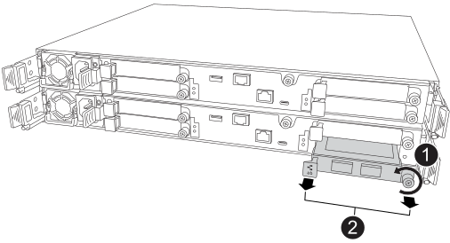

= Troca a quente do módulo de E/S usado para tráfego de cluster e HA - ASA A20, ASA A30 e ASA A50
:allow-uri-read: 
:icons: font
:imagesdir: ../media/

[role="lead"]
O cluster e o módulo de E/S de alta disponibilidade oferecem suporte a interconexões para clustering e alta disponibilidade. Você pode fazer a troca a quente do módulo no seu sistema de armazenamento ASA A20, ASA A30 ou ASA A50 quando o módulo falhar e se o seu sistema de armazenamento atender a requisitos específicos.

O processo de troca a quente envolve preparar o sistema de armazenamento e o slot 4 do módulo de E/S para que seja seguro remover o módulo com falha, fazer a troca a quente do módulo com falha por um equivalente, colocar o módulo de substituição on-line, restaurar o sistema de armazenamento para a operação normal e retornar o módulo com falha para a NetApp.

.Antes de começar
* Seu sistema de armazenamento deve atender a todos os requisitos a seguir para usar este procedimento.
+

NOTE: Se o seu sistema de armazenamento não atender a todos os requisitos a seguir, você deverá usar o link:io-module-replace.html["procedimento de substituição de um módulo de E/S"] .

+
** Seu sistema de armazenamento deve estar executando o ONTAP 9.17.1 ou posterior.
** O módulo de E/S com falha deve ser um módulo de E/S de cluster e HA no slot 4, e você deve substituí-lo por outro módulo de E/S de cluster e HA. Não é possível alterar o tipo de módulo de E/S.
** A configuração do seu sistema de armazenamento deve ter apenas um cluster e um módulo de E/S HA localizados no slot 4, não dois clusters e módulos de E/S HA.
** Seu sistema de armazenamento deve ser uma configuração de cluster de dois nós (sem comutação ou comutado).
** O controlador com o cluster com falha e o módulo de E/S de HA (o controlador com defeito) já deve ter assumido o controle do controlador parceiro saudável. A assunção deveria ter ocorrido automaticamente se o módulo de E/S falhasse.
+
Para clusters de dois nós, o sistema de armazenamento não consegue discernir qual controlador possui o módulo de E/S com falha, portanto, qualquer um dos controladores pode iniciar a aquisição. O procedimento de troca a quente do cluster e do módulo de E/S de alta disponibilidade só é suportado quando o controlador com o módulo de E/S com falha (o controlador com defeito) assumiu o controlador íntegro.

+
Você pode verificar se o controlador prejudicado assumiu com sucesso o controlador saudável inserindo o  `storage failover show` comando.

+
Se você não tiver certeza de qual controlador possui o módulo de E/S com falha, entre em contato  https://mysupport.netapp.com/site/global/dashboard["Suporte à NetApp"] .

* Todos os outros componentes do sistema de armazenamento devem estar a funcionar corretamente; caso contrário, contacte https://mysupport.netapp.com/site/global/dashboard["Suporte à NetApp"] antes de continuar com este procedimento.

.Sobre esta tarefa
* A troca a quente do cluster e do módulo HA I/O significa que você não precisa executar uma aquisição manual; o controlador danificado (o controlador com o cluster e o módulo HA I/O com falha) assumiu automaticamente o controlador íntegro.
+
Quando o controlador danificado assume o controle do controlador saudável, a única maneira de se recuperar sem uma interrupção é fazer a troca a quente do módulo.

* É essencial aplicar os comandos ao controlador correto ao fazer a troca a quente do cluster e do módulo de E/S HA:
+
** O _controlador danificado_ é o controlador no qual você está fazendo o hot-swap do cluster e do módulo HA I/O e é o controlador que assumiu o controle do controlador íntegro.
** O _controlador saudável_ é o parceiro HA do controlador prejudicado e é o controlador que foi assumido pelo controlador prejudicado.

* Se necessário, você pode ligar os LEDs de localização do sistema de armazenamento (azul) para ajudar a localizar fisicamente o sistema de armazenamento afetado. Faça login no BMC usando SSH e digite o `system location-led _on_` comando.
+
Um sistema de armazenamento tem três LEDs de localização: Um no painel de visualização do operador e um em cada controlador. Os LEDs de localização permanecem acesos durante 30 minutos.

+
Você pode desativá-los digitando o `system location-led _off_` comando. Se não tiver a certeza se os LEDs estão ligados ou desligados, pode verificar o seu estado introduzindo o `system location-led show` comando.

== Etapa 1: preparar o sistema de armazenamento e o slot 4 do módulo de E/S

Prepare o sistema de armazenamento e o slot 4 do módulo de E/S para que seja seguro remover o cluster com falha e o módulo de E/S HA:

. Aterre-se corretamente.
. Desconecte o cabeamento do cluster com falha e do módulo de E/S HA.
+
Não se esqueça de etiquetar os cabos para que mais tarde neste procedimento você possa reconectá-los às mesmas portas.

. Se o AutoSupport estiver ativado, suprimir a criação automática de casos invocando uma mensagem AutoSupport:
+
`system node autosupport invoke -node * -type all -message MAINT=<number of hours down>h`

+
Por exemplo, a seguinte mensagem do AutoSupport suprime a criação automática de casos por duas horas:

+
`node2::> system node autosupport invoke -node * -type all -message MAINT=2h`

. Desabilitar o retorno automático do console do controlador prejudicado:
+
`storage failover modify -node local -auto-giveback false`

+

NOTE: Quando vir _do pretende desativar a auto-giveback?_, introduza `y`.

. Prepare o cluster com falha e o módulo HA no slot 4 para remoção, retirando-os de serviço e desligando-os:
+
`system controller slot module remove -node _impaired_node_name_ -slot _slot_number_`

+

NOTE: Quando você vir _Deseja continuar?_, digite  `y` .

+
Por exemplo, o comando a seguir prepara o módulo no slot 4 no nó 2 (o controlador danificado) para remoção e exibe uma mensagem informando que é seguro removê-lo:

+
[listing]
----
node2::> system controller slot module remove -node node2 -slot 4

Warning: IO_2X_100GBE_NVDA_NIC module in slot 4 of node node2 will be powered off for removal.

Do you want to continue? {y|n}: y

The module has been successfully removed from service and powered off. It can now be safely removed.
----
. Verifique se o cluster com falha e o módulo HA no slot 4 estão desligados:
+
`system controller slot module show`

+
A saída deve mostrar  `_powered-off_` na coluna de status do módulo com falha no slot 4.

== Etapa 2: substituir o cluster com falha e o módulo de E/S HA

Substitua o cluster com falha e o módulo de E/S HA no slot 4 por um módulo de E/S equivalente:

.Passos
. Se você ainda não está aterrado, aterre-se adequadamente.
. Remova o cluster com falha e o módulo de E/S HA do controlador danificado:
+

+
[cols="1,4"]
|===

 a| 
image::../media/icon_round_1.png[Legenda número 1]
 a| 
Rode o parafuso de aperto manual do módulo de e/S no sentido contrário ao dos ponteiros do relógio para soltar.

 a| 
image::../media/icon_round_2.png[Legenda número 2]
 a| 
Puxe o módulo de E/S para fora do controlador usando a aba da etiqueta da porta à esquerda e o parafuso de aperto manual à direita.

|===
. Instale o cluster de substituição e o módulo de E/S HA no slot 4:
+
.. Alinhe o módulo de e/S com as extremidades da ranhura.
.. Empurre cuidadosamente o módulo de E/S até o slot, certificando-se de encaixá-lo corretamente no conector.
+
Você pode usar a aba à esquerda e o parafuso de aperto manual à direita para empurrar o módulo de E/S.

.. Rode o parafuso de aperto manual no sentido dos ponteiros do relógio para apertar.

. Conecte os cabos do cluster e do módulo HA I/O.

== Etapa 3: coloque o cluster de substituição e o módulo de E/S HA on-line

Coloque o cluster de substituição e o módulo HA I/O no slot 4 on-line, verifique se as portas do módulo foram inicializadas com sucesso, verifique se o slot 4 está ligado e, em seguida, verifique se o módulo está on-line e é reconhecido.

. Coloque o cluster de substituição e o módulo de E/S HA on-line:
+
`system controller slot module insert -node impaired_node_name_ -slot _slot_name_`

+

NOTE: Quando você vir _Deseja continuar?_, digite  `y` .

+
A saída deve confirmar que o cluster e o módulo HA I/O foram colocados on-line com sucesso (ligados, inicializados e colocados em serviço).

+
Por exemplo, o comando a seguir coloca o slot 4 no nó 2 (o controlador prejudicado) online e exibe uma mensagem de que o processo foi bem-sucedido:

+
[listing]
----
node2::> system controller slot module insert -node node2 -slot 4

Warning: IO_2X_100GBE_NVDA_NIC module in slot 4 of node node2 will be powered on and initialized.

Do you want to continue? {y|n}: `y`

The module has been successfully powered on, initialized and placed into service.
----
. Verifique se cada porta no cluster e o módulo de E/S HA foram inicializados com sucesso:
+
`event log show -event \*hotplug.init*`

+

NOTE: Pode levar vários minutos para permitir quaisquer atualizações de firmware necessárias e a inicialização da porta.

+
A saída deve mostrar um evento hotplug.init.success EMS registrado para cada porta no cluster e módulo HA I/O com  `_hotplug.init.success:_` no  `_Event_` coluna.

+
Por exemplo, a saída a seguir mostra que a inicialização foi bem-sucedida para as portas e4b e e4a do cluster e do módulo de E/S HA:

+
[listing]
----
node2::> event log show -event *hotplug.init*

Time                Node             Severity      Event

------------------- ---------------- ------------- ---------------------------

7/11/2025 16:04:06  node2      NOTICE        hotplug.init.success: Initialization of ports "e4b" in slot 4 succeeded

7/11/2025 16:04:06  node2      NOTICE        hotplug.init.success: Initialization of ports "e4a" in slot 4 succeeded

2 entries were displayed.
----
. Verifique se o slot 4 do módulo de E/S está ligado e pronto para operação:
+
`system controller slot module show`

+
A saída deve mostrar o status do slot 4 como  `_powered-on_` e, portanto, pronto para a operação do cluster de substituição e do módulo HA I/O.

. Verifique se o cluster de substituição e o módulo de E/S HA estão on-line e são reconhecidos.
+
Digite o comando do console do controlador com deficiência:

+
`system controller config show -node local -slot4`

+
Se o cluster de substituição e o módulo de E/S HA forem colocados on-line com sucesso e reconhecidos, a saída mostrará informações do módulo de E/S, incluindo informações de porta, para o slot 4.

+
Por exemplo, você deverá ver uma saída semelhante à seguinte:

+
[listing]
----
node2::> system controller config show -node local -slot 4

Node: node2
Sub- Device/
Slot slot Information
---- ---- -----------------------------
   4    - Dual 40G/100G Ethernet Controller CX6-DX
                  e4a MAC Address: d0:39:ea:59:69:74 (auto-100g_cr4-fd-up)
                          QSFP Vendor:        CISCO-BIZLINK
                          QSFP Part Number:   L45593-D218-D10
                          QSFP Serial Number: LCC2807GJFM-B
                  e4b MAC Address: d0:39:ea:59:69:75 (auto-100g_cr4-fd-up)
                          QSFP Vendor:        CISCO-BIZLINK
                          QSFP Part Number:   L45593-D218-D10
                          QSFP Serial Number: LCC2809G26F-A
                  Device Type:        CX6-DX PSID(NAP0000000027)
                  Firmware Version:   22.44.1700
                  Part Number:        111-05341
                  Hardware Revision:  20
                  Serial Number:      032403001370
----

== Etapa 4: restaurar o sistema de armazenamento para operação normal

Restaure seu sistema de armazenamento para a operação normal devolvendo o armazenamento ao controlador íntegro, restaurando o retorno automático e reativando a criação automática de casos do AutoSupport .

.Passos
. Retorne o controlador saudável (o controlador que foi assumido) à operação normal devolvendo seu armazenamento:
+
`storage failover giveback -ofnode _healthy_node_name_`

. Restaurar o retorno automático do console do controlador danificado (o controlador que assumiu o controle do controlador saudável):
+
`storage failover modify -node local -auto-giveback _true_`

. Se o AutoSupport estiver ativado, restaure a criação automática de casos:
+
`system node autosupport invoke -node * -type all -message MAINT=end`

== Passo 5: Devolva a peça com falha ao NetApp

Devolva a peça com falha ao NetApp, conforme descrito nas instruções de RMA fornecidas com o kit. Consulte a https://mysupport.netapp.com/site/info/rma["Devolução de peças e substituições"] página para obter mais informações.
