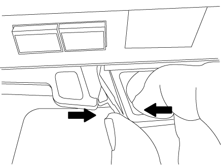

= Substitua o módulo de armazenamento em cache - ASA A150
:allow-uri-read: 
:icons: font
:imagesdir: ../media/

[role="lead"]
Você deve substituir o módulo de cache no módulo do controlador quando o sistema Registrar uma única mensagem AutoSupport (ASUP) informando que o módulo ficou offline; se não o fizer, isso resultará na degradação do desempenho.

Substitua o componente com falha por um componente FRU de substituição que você recebeu de seu provedor.

== Passo 1: Desligue o controlador desativado

[role="lead"]
Para encerrar o controlador com deficiência, você deve determinar o status do controlador e, se necessário, assumir o controlador para que o controlador saudável continue fornecendo dados do armazenamento do controlador com deficiência.

.Sobre esta tarefa
Se você tiver um cluster com mais de dois nós, ele deverá estar no quórum. Se o cluster não estiver em quórum ou se um controlador íntegro exibir false para qualificação e integridade, você deverá corrigir o problema antes de encerrar o controlador prejudicado; link:https://docs.netapp.com/us-en/ontap/system-admin/synchronize-node-cluster-task.html?q=Quorum["Sincronize um nó com o cluster"^]consulte .

Você pode querer apagar o conteúdo do seu módulo de cache antes de substituí-lo.

.Passos
. Embora os dados no módulo de cache sejam criptografados, você pode querer apagar todos os dados do módulo de cache prejudicado e verificar se o módulo de cache não tem dados:
+
.. Apagar os dados no módulo de armazenamento em cache: `system controller flash-cache secure-erase run`
.. Verifique se os dados foram apagados do módulo de cache: `system controller flash-cache secure-erase show -node node_name`
+
A saída deve exibir o status do módulo de cache como apagado.

. Se o controlador afetado fizer parte de um par de HA, desative a giveback automática a partir do console do controlador íntegro: `storage failover modify -node local -auto-giveback false`
. Leve o controlador prejudicado para o prompt Loader:
+
[cols="1,2"]
|===
| Se o controlador afetado estiver a apresentar... | Então... 

 a| 
O prompt Loader
 a| 
Vá para a próxima etapa.

 a| 
A aguardar pela giveback...
 a| 
Pressione Ctrl-C e responda `y` quando solicitado.

 a| 
Prompt do sistema ou prompt de senha (digite a senha do sistema)
 a| 
Assuma ou interrompa o controlador afetado:

** Para um par de HA, assuma o controlador prejudicado do controlador íntegro: `storage failover takeover -ofnode _impaired_node_name_`
+
Quando o controlador prejudicado mostrar aguardando a giveback..., pressione Ctrl-C e responda `y`.

** Para um sistema autónomo: `system node halt _impaired_node_name_`

|===
. Se o sistema tiver apenas um módulo de controlador no chassi, desligue as fontes de alimentação e desconete os cabos de alimentação do controlador prejudicado da fonte de alimentação.

== Passo 2: Remova o módulo do controlador

[role="lead"]
Para aceder aos componentes no interior do controlador, tem de remover primeiro o módulo do controlador do sistema e, em seguida, remover a tampa do módulo do controlador.

.Passos
. Se você ainda não está aterrado, aterre-se adequadamente.
. Solte o gancho e a alça de loop que prendem os cabos ao dispositivo de gerenciamento de cabos e, em seguida, desconete os cabos do sistema e os SFPs (se necessário) do módulo do controlador, mantendo o controle de onde os cabos estavam conetados.
+
Deixe os cabos no dispositivo de gerenciamento de cabos para que, ao reinstalar o dispositivo de gerenciamento de cabos, os cabos sejam organizados.

. Retire e reserve os dispositivos de gerenciamento de cabos dos lados esquerdo e direito do módulo do controlador.
+
image::../media/drw_25xx_cable_management_arm.png[Inserir ou remover o ARM de gerenciamento de cabos]

. Aperte o trinco na pega do excêntrico até que este se solte, abra totalmente o manípulo do excêntrico para libertar o módulo do controlador do plano médio e, em seguida, utilizando duas mãos, puxe o módulo do controlador para fora do chassis.
+

. Vire o módulo do controlador ao contrário e coloque-o numa superfície plana e estável.
. Abra a tampa deslizando as patilhas azuis para soltar a tampa e, em seguida, rode a tampa para cima e abra-a.
+
image::../media/drw_2600_opening_pcm_cover.png[Abrir ou fechar o módulo do controlador]

== Passo 3: Substitua um módulo de cache

[role="lead"]
Para substituir um módulo de armazenamento em cache chamado de placa PCIe M,2 na etiqueta da controladora, localize o slot dentro da controladora e siga a sequência específica de etapas.

Dependendo da situação, seu sistema de storage precisa atender a certos critérios:

* Ele deve ter o sistema operacional apropriado para o módulo de cache que você está instalando.
* A TI precisa dar suporte à capacidade de armazenamento em cache.
* Todos os outros componentes do sistema de armazenamento devem estar funcionando corretamente; caso contrário, você deve entrar em Contato com o suporte técnico.

.Passos
. Se você ainda não está aterrado, aterre-se adequadamente.
. Localize o módulo de armazenamento em cache na parte traseira do módulo do controlador e retire-o.
+
.. Prima a patilha de libertação.
.. Retire o dissipador de calor.

+
image::../media/drw_2600_fcache_repl_animated_gif.png[Removendo um módulo de cache]

. Puxe cuidadosamente o módulo de armazenamento em cache para fora do alojamento.
. Alinhe as extremidades do módulo de armazenamento em cache com o encaixe no alojamento e, em seguida, empurre-o cuidadosamente para dentro do encaixe.
. Verifique se o módulo de armazenamento em cache está assentado diretamente e completamente no soquete.
+
Se necessário, remova o módulo de cache e recoloque-o no soquete.

. Recoloque e empurre o dissipador de calor para baixo para engatar o botão de travamento no compartimento do módulo de cache.
. Feche a tampa do módulo do controlador, conforme necessário.

== Etapa 4: Reinstale o módulo do controlador

[role="lead"]
Depois de substituir os componentes no módulo do controlador, volte a instalá-lo no chassis.

.Passos
. Se você ainda não está aterrado, aterre-se adequadamente.
. Se ainda não o tiver feito, substitua a tampa no módulo do controlador.
. Alinhe a extremidade do módulo do controlador com a abertura no chassis e, em seguida, empurre cuidadosamente o módulo do controlador até meio do sistema.
+

NOTE: Não introduza completamente o módulo do controlador no chassis até ser instruído a fazê-lo.

. Recable o sistema, conforme necessário.
+
Se você removeu os conversores de Mídia (QSFPs ou SFPs), lembre-se de reinstalá-los se você estiver usando cabos de fibra ótica.

. Conclua a reinstalação do módulo do controlador:
+
[cols="1,2"]
|===
| Se o seu sistema estiver em... | Em seguida, execute estas etapas... 

 a| 
Um par de HA
 a| 
O módulo do controlador começa a arrancar assim que estiver totalmente assente no chassis. Esteja preparado para interromper o processo de inicialização.

.. Com a alavanca do came na posição aberta, empurre firmemente o módulo do controlador até que ele atenda ao plano médio e esteja totalmente assentado e, em seguida, feche a alavanca do came para a posição travada.
+

NOTE: Não utilize força excessiva ao deslizar o módulo do controlador para dentro do chassis para evitar danificar os conetores.

+
O controlador começa a arrancar assim que estiver sentado no chassis.

.. Se ainda não o tiver feito, reinstale o dispositivo de gerenciamento de cabos.
.. Prenda os cabos ao dispositivo de gerenciamento de cabos com o gancho e a alça de loop.

 a| 
Uma configuração autônoma
 a| 
.. Com a alavanca do came na posição aberta, empurre firmemente o módulo do controlador até que ele atenda ao plano médio e esteja totalmente assentado e, em seguida, feche a alavanca do came para a posição travada.
+

NOTE: Não utilize força excessiva ao deslizar o módulo do controlador para dentro do chassis para evitar danificar os conetores.

.. Se ainda não o tiver feito, reinstale o dispositivo de gerenciamento de cabos.
.. Prenda os cabos ao dispositivo de gerenciamento de cabos com o gancho e a alça de loop.
.. Reconecte os cabos de alimentação às fontes de alimentação e às fontes de alimentação, ligue a alimentação para iniciar o processo de inicialização.

|===

== Etapa 5: Alterne agregados de volta em uma configuração de MetroCluster de dois nós

[role="lead"]
Depois de concluir a substituição da FRU em uma configuração de MetroCluster de dois nós, você pode executar a operação de switchback do MetroCluster. Isso retorna a configuração ao seu estado operacional normal, com as máquinas virtuais de armazenamento de origem sincronizada (SVMs) no site anteriormente prejudicado agora ativo e fornecendo dados dos pools de discos locais.

Esta tarefa só se aplica a configurações de MetroCluster de dois nós.

.Passos
. Verifique se todos os nós estão no `enabled` estado: `metrocluster node show`
+
[listing]
----
cluster_B::>  metrocluster node show

DR                           Configuration  DR
Group Cluster Node           State          Mirroring Mode
----- ------- -------------- -------------- --------- --------------------
1     cluster_A
              controller_A_1 configured     enabled   heal roots completed
      cluster_B
              controller_B_1 configured     enabled   waiting for switchback recovery
2 entries were displayed.
----
. Verifique se a ressincronização está concluída em todos os SVMs: `metrocluster vserver show`
. Verifique se todas as migrações automáticas de LIF que estão sendo executadas pelas operações de recuperação foram concluídas com sucesso: `metrocluster check lif show`
. Execute o switchback usando o `metrocluster switchback` comando de qualquer nó no cluster sobrevivente.
. Verifique se a operação de comutação foi concluída: `metrocluster show`
+
A operação de switchback ainda está em execução quando um cluster está no `waiting-for-switchback` estado:

+
[listing]
----
cluster_B::> metrocluster show
Cluster              Configuration State    Mode
--------------------	------------------- 	---------
 Local: cluster_B configured       	switchover
Remote: cluster_A configured       	waiting-for-switchback
----
+
A operação de switchback é concluída quando os clusters estão no `normal` estado.:

+
[listing]
----
cluster_B::> metrocluster show
Cluster              Configuration State    Mode
--------------------	------------------- 	---------
 Local: cluster_B configured      		normal
Remote: cluster_A configured      		normal
----
+
Se um switchback estiver demorando muito tempo para terminar, você pode verificar o status das linhas de base em andamento usando o `metrocluster config-replication resync-status show` comando.

. Restabelecer qualquer configuração SnapMirror ou SnapVault.

== Passo 6: Devolva a peça com falha ao NetApp

[role="lead"]
Devolva a peça com falha ao NetApp, conforme descrito nas instruções de RMA fornecidas com o kit. Consulte a https://mysupport.netapp.com/site/info/rma["Devolução de peças e substituições"] página para obter mais informações.
