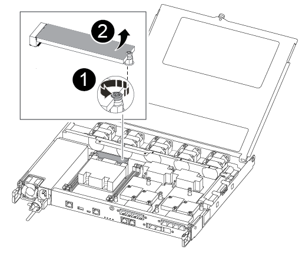

= Substitua a mídia de inicialização para recuperação automática de boot - ASA A250
:allow-uri-read: 
:icons: font
:imagesdir: ../media/

[role="lead"]
A mídia de inicialização no seu sistema ASA A250 armazena firmware e dados essenciais de configuração. O processo de substituição envolve remover e abrir o módulo do controlador, remover a mídia de inicialização com problema, instalar a mídia de inicialização de substituição no módulo do controlador e, em seguida, reinstalar o módulo do controlador.

O processo automatizado de recuperação de mídia de inicialização é compatível apenas com ONTAP 9.18.1 e versões posteriores. Se o seu sistema de storage estiver executando uma versão anterior do ONTAP, use o link:bootmedia-replace-workflow.html["procedimento de recuperação de inicialização manual"].

A mídia de inicialização está localizada dentro do módulo do controlador, sob o duto de ar, e é acessada removendo o módulo do controlador do sistema.

== Passo 1: Remova o módulo do controlador

. Se você ainda não está aterrado, aterre-se adequadamente.
. Desconete as fontes de alimentação do módulo do controlador da fonte.
. Solte os fixadores do cabo de alimentação e, em seguida, desconete os cabos das fontes de alimentação.
. Desconete os cabos de e/S do módulo do controlador.
. Insira o dedo indicador no mecanismo de travamento em ambos os lados do módulo do controlador, pressione a alavanca com o polegar e puxe o controlador cuidadosamente alguns centímetros para fora do chassi.
+

NOTE: Se tiver dificuldade em remover o módulo do controlador, coloque os dedos indicadores através dos orifícios dos dedos a partir do interior (cruzando os braços).

+
image::../media/drw_a250_pcm_remove_install.png[Abrir o mecanismo de bloqueio]

+
[cols="1,4"]
|===

 a| 
image:../media/icon_round_1.png["Legenda número 1"]
 a| 
Alavanca

 a| 
image:../media/icon_round_2.png["Legenda número 2"]
 a| 
Mecanismo de bloqueio

|===
. Usando ambas as mãos, segure os lados do módulo do controlador e puxe-o suavemente para fora do chassi e coloque-o em uma superfície plana e estável.
. Rode o parafuso de aperto manual na parte frontal do módulo do controlador no sentido contrário ao dos ponteiros do relógio e abra a tampa do módulo do controlador.
+
image::../media/drw_a250_open_controller_module_cover.png[Abrir a tampa do módulo do controlador]

+
[cols="1,4"]
|===

 a| 
image:../media/icon_round_1.png["Legenda número 1"]
 a| 
Parafuso de aperto manual

 a| 
image:../media/icon_round_2.png["Legenda número 2"]
 a| 
Tampa do módulo do controlador.

|===
. Levante a tampa da conduta de ar.
+
image::../media/drw_a250_remove_airduct_cover.png[Levantar a tampa da conduta de ar]

== Passo 2: Substitua o suporte de arranque

Pode utilizar o seguinte vídeo ou as etapas tabuladas para substituir o suporte de arranque:

.Animação - substitua o suporte de arranque
video::7c2cad51-dd95-4b07-a903-ac5b015c1a6d[panopto]
. Localize e substitua a mídia de inicialização danificada no módulo controlador e substitua-a:
+

NOTE: Você precisa de uma chave de fenda Phillips magnética nº 1 para remover o parafuso que prende o suporte de inicialização no lugar. Devido às restrições de espaço dentro do módulo do controlador, você também deve ter um ímã para transferir o parafuso para que você não o perca.

+

+
[cols="1,3"]
|===

 a| 
image:../media/icon_round_1.png["Legenda número 1"]
 a| 
Retire o parafuso que fixa o suporte de arranque à placa-mãe no módulo do controlador.

 a| 
image:../media/icon_round_2.png["Legenda número 2"]
 a| 
Levante o suporte de arranque para fora do módulo do controlador.

|===
+
.. Utilizando a chave de fendas magnética nº 1, retire o parafuso do suporte de arranque danificado e coloque-o de lado com segurança no íman.
.. Levante cuidadosamente o suporte da bagageira danificado diretamente para fora da tomada e coloque-o de lado.
.. Retire o suporte de substituição da bolsa de transporte antiestática e alinhe-o no lugar no módulo da controladora.
.. Utilizando a chave de fendas magnética nº 1, introduza e aperte o parafuso no suporte de arranque.
+
Não aperte demasiado o parafuso ou poderá danificar o suporte de arranque.

.. Instale o duto de ar.
+
image::../media/drw_a250_install_airduct_cover.png[Instalação da conduta de ar]

.. Feche a tampa do módulo do controlador e aperte o parafuso de aperto manual.
+
image::../media/drw_a250_close_controller_module_cover.png[Fechar a tampa do módulo do controlador]

+
[cols="1,3"]
|===

 a| 
image:../media/icon_round_1.png["Legenda número 1"]
 a| 
Tampa do módulo do controlador

 a| 
image:../media/icon_round_2.png["Legenda número 2"]
 a| 
Parafuso de aperto manual

|===

. Instale o módulo do controlador:
+
.. Alinhe a extremidade do módulo do controlador com a abertura no chassis e, em seguida, empurre cuidadosamente o módulo do controlador até meio do sistema.
.. Empurre o módulo do controlador até ao chassis:
.. Coloque os dedos indicadores através dos orifícios dos dedos a partir do interior do mecanismo de bloqueio.
.. Pressione os polegares para baixo nas patilhas cor-de-laranja na parte superior do mecanismo de bloqueio e empurre suavemente o módulo do controlador sobre o batente.
.. Solte os polegares da parte superior dos mecanismos de travamento e continue empurrando até que os mecanismos de travamento se encaixem no lugar.
+
O módulo do controlador deve ser totalmente inserido e alinhado com as bordas do chassi.

. Volte a ligar os cabos de e/S do módulo do controlador.
. Conete os cabos de alimentação às fontes de alimentação, reinstale o colar de travamento do cabo de alimentação e, em seguida, conete as fontes de alimentação à fonte de alimentação.
+
O módulo controlador começa a inicializar e para no prompt LOADER.

.O que vem a seguir
Depois de substituir fisicamente o suporte de arranque danificadolink:bootmedia-recovery-image-boot-bmr.html["Restaure a imagem do ONTAP a partir do nó do parceiro"], .
