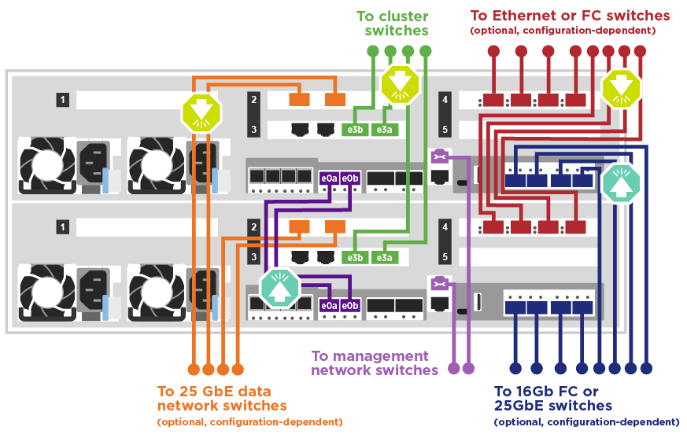
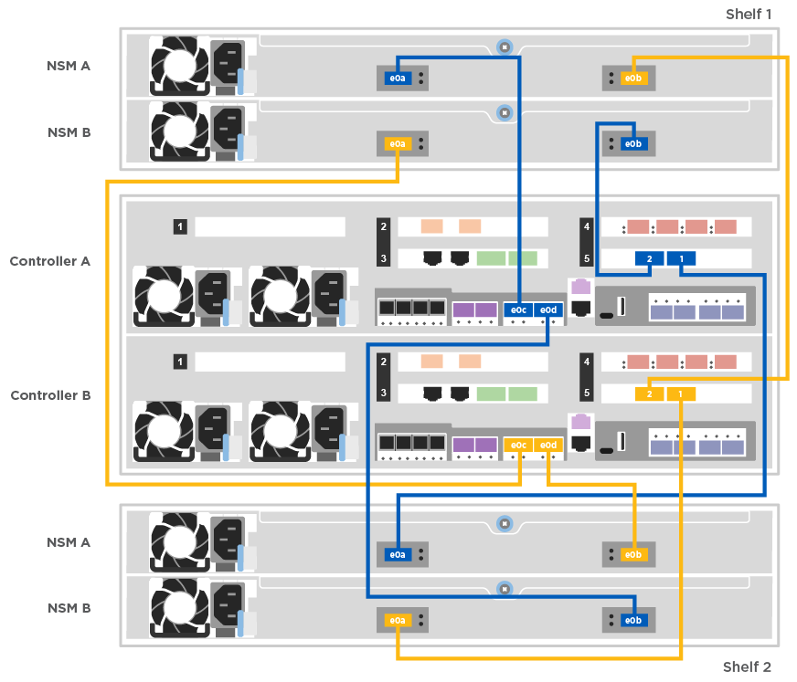

= Guia detalhado - ASA A400
:allow-uri-read: 
:icons: font
:imagesdir: ../media/

[role="lead"]
Esta página fornece instruções detalhadas passo a passo para instalar um sistema NetApp típico. Use este guia se quiser instruções de instalação mais detalhadas.

== Passo 1: Prepare-se para a instalação

Para instalar seu sistema, você precisa criar uma conta, Registrar o sistema e obter chaves de licença. Você também precisa fazer o inventário do número e do tipo apropriados de cabos para o seu sistema e coletar informações específicas de rede.

.Antes de começar
Você precisa ter acesso ao Hardware Universe para obter informações sobre os requisitos do site, bem como informações adicionais sobre o sistema configurado. Você também pode querer ter acesso às Notas de versão da sua versão do ONTAP para obter mais informações sobre este sistema.

https://hwu.netapp.com["NetApp Hardware Universe"]

http://mysupport.netapp.com/documentation/productlibrary/index.html?productID=62286["Encontre as Notas de versão para sua versão do ONTAP 9"]

Você precisa fornecer o seguinte em seu site:

* Espaço em rack para o sistema de armazenamento
* Chave de fendas Phillips nº 2
* Cabos de rede adicionais para conetar seu sistema ao switch de rede e laptop ou console com um navegador da Web

.Passos
. Desembale o conteúdo de todas as caixas.
. Registre o número de série do sistema nos controladores.
+
image::../media/drw_ssn_label.png[Exemplo de número de série do sistema]

. Faça um inventário e anote o número e os tipos de cabos que você recebeu.
+
A tabela a seguir identifica os tipos de cabos que você pode receber. Se você receber um cabo não listado na tabela, consulte o Hardware Universe para localizar o cabo e identificar seu uso.

+
https://hwu.netapp.com["NetApp Hardware Universe"]

+
[cols="1,2,1,2"]
|===
| Tipo de cabo... | Número de peça e comprimento | Tipo de conetor | Para... 

 a| 
Cabo de 100 GbE (QSF(28)
 a| 
X66211A-05 (112-00595), 0,5m

X66211A-1 (112-00573), 1m

X66211A-2 (112-00574), 2m

X66211A-5 (112-00574), 5m
 a| 
image:../media/oie_cable100_gbe_qsfp28.png["Conetor 100 GbE QSFP28"]
 a| 
Storage, interconexão/HA de cluster e dados Ethernet (dependendo da ordem)

 a| 
Cabo de 25 GbE (SFP28s)
 a| 
X66240-2 (112-00598), 2m

X66240-5 (112-00639), 5m
 a| 
image:../media/oie_cable_sfp_gbe_copper.png["Conetor de cobre GbE SFP"]
 a| 
Conexão de rede GbE (dependente da ordem)

 a| 
FC de 32 GB (op SFP)
 a| 
X66250-2 (112-00342), 2m

X66250-5 (112-00344), 5m

X66250-15 (112-00346), 15m
 a| 
image:../media/oie_cable_sfp_gbe_copper.png["Conetor de cobre GbE SFP"]
 a| 
Conexão de rede FC

 a| 
Cabos de armazenamento
 a| 
X66030A (112-00435), 5m

X66031A (112-00436), 1m

X66032A (112-00437), 2m

X66033A (112-00438), 3m
 a| 
image:../media/oie_cable_mini_sas_hd_to_mini_sas_hd.png["Conetor mini-SAS para mini-SAS"]
 a| 
Cabos HD mini-SAS para mini-SAS (dependendo da ordem)

 a| 
Cabos óticos
 a| 
X66250-2-N-C (112-00342)
 a| 
image:../media/oie_cable_fiber_lc_connector.png["Conetor de fibra LC"]
 a| 
Cabos FC de 16 GB ou 25GbE para placas mezzanine (dependendo da ordem)

 a| 
RJ-45 (dependente da ordem)
 a| 
X6585-R6 (112-00291), 3m

X6562-R6 (112-00196), 5m
 a| 
image:../media/oie_cable_rj45.png["Conetor do cabo RJ-45"]
 a| 
Rede de gerenciamento

 a| 
Cabo micro-USB da consola
 a| 
Não aplicável
 a| 
image:../media/oie_cable_micro_usb.png["Conetor micro USB"]
 a| 
Conexão do console usada durante a configuração do software se o laptop ou o console não suportar descoberta de rede.

 a| 
Cabos de alimentação
 a| 
Não aplicável
 a| 
image:../media/oie_cable_power.png["Cabos de alimentação"]
 a| 
Ligar o sistema

|===
. Reveja o _Guia de Configuração do NetApp ONTAP_ e recolha as informações necessárias listadas nesse guia.
+
https://library.netapp.com/ecm/ecm_download_file/ECMLP2862613["Guia de configuração do ONTAP"]

== Passo 2: Instale o hardware

Você precisa instalar seu sistema em um rack de 4 colunas ou gabinete do sistema NetApp, conforme aplicável.

. Instale os kits de calhas, conforme necessário.
. Instale e fixe o seu sistema utilizando as instruções incluídas no kit de calhas.
+

NOTE: Você precisa estar ciente das preocupações de segurança associadas ao peso do sistema.

+
image::../media/drw_katana_lifting_restriction_icon.png[Cuidado com o elevador para duas pessoas]

. Conete os dispositivos de gerenciamento de cabos (como mostrado).
+
image::../media/drw_a320_cable_management_arms.png[Remover ou instalar os braços de gestão do cabo]

. Coloque a moldura na parte frontal do sistema.

== Passo 3: Controladores de cabo para a sua rede

Você pode conetar os controladores à rede usando o método de cluster sem switch de dois nós ou usando a rede de interconexão de cluster.

NOTE: Se as etiquetas de porta na placa não estiverem visíveis, verifique a orientação de instalação da placa (o soquete do conetor PCIe está no lado esquerdo do slot da placa no A400 e no FAS8300/8700) e, em seguida, procure a placa, por número de peça, no https://hwu.netapp.com["NetApp Hardware Universe"^] para obter um gráfico da moldura que mostrará as etiquetas da porta. O número de peça do cartão pode ser encontrado usando o `sysconfig -a` comando ou na lista de embalagem do sistema.

NOTE: Se você estiver fazendo o cabeamento de uma configuração IP do MetroCluster, as portas e0a/e0b estarão disponíveis para hospedar LIFs de dados (geralmente no IPSpace padrão).

=== Opção 1: Cabo de um cluster sem switch de dois nós

As portas de dados opcionais, placas NIC opcionais e portas de gerenciamento nos módulos do controlador são conetadas aos switches. A interconexão de cluster e as portas de HA são cabeadas em ambos os módulos de controladora.

Tem de ter contactado o administrador da rede para obter informações sobre a ligação do sistema aos comutadores.

Certifique-se de que verifica a direção das patilhas de puxar do cabo ao inserir os cabos nas portas. As presilhas de cabos estão para cima para todas as portas integradas e para baixo para placas de expansão (NIC).

image::../media/oie_cable_pull_tab_up.png[Conetor de cabo com patilha na parte superior]

image::../media/oie_cable_pull_tab_down.png[Conetor de cabo com patilha de puxar na parte inferior]

NOTE: Ao inserir o conetor, você deve senti-lo clicar no lugar; se você não sentir que ele clique, remova-o, vire-o e tente novamente.

.Passos
. Use a animação ou ilustração para concluir o cabeamento entre os controladores e os switches:
+
.Animação - cabeamento de cluster sem switch de dois nós
video::48552ddf-0925-4f88-8e93-ab1b00666489[panopto]
+
image::../media/drw_A400_TNSC-network-cabling.png[Cabeamento de cluster sem switch de dois nós]

. Vá para <<Etapa 4: Controladores de cabos para compartimentos de unidades>> para para obter instruções de cabeamento do compartimento de unidade.

=== Opção 2: Conjunto comutado por cabo a

As portas de dados opcionais, placas NIC opcionais, placas mezzanine e portas de gerenciamento nos módulos do controlador são conetadas aos switches. A interconexão de cluster e as portas de HA são cabeadas para o switch cluster/HA.

Tem de ter contactado o administrador da rede para obter informações sobre a ligação do sistema aos comutadores.

Certifique-se de que verifica a direção das patilhas de puxar do cabo ao inserir os cabos nas portas. As presilhas de cabos estão para cima para todas as portas integradas e para baixo para placas de expansão (NIC).

image::../media/oie_cable_pull_tab_up.png[Conetor de cabo com patilha na parte superior]

image::../media/oie_cable_pull_tab_down.png[Conetor de cabo com patilha de puxar na parte inferior]

NOTE: Ao inserir o conetor, você deve senti-lo clicar no lugar; se você não sentir que ele clique, remova-o, vire-o e tente novamente.

.Passos
. Use a animação ou ilustração para concluir o cabeamento entre os controladores e os switches:
+
.Animação - cabeamento de cluster comutado
video::8fefba75-f395-4cf2-ba3c-ab1b00665870[panopto]
+

. Vá para <<Etapa 4: Controladores de cabos para compartimentos de unidades>> para para obter instruções de cabeamento do compartimento de unidade.

== Etapa 4: Controladores de cabos para compartimentos de unidades

Você pode vincular gavetas NSS224 ou SAS ao sistema.

=== Opção 1: Cabeamento das controladoras a um único compartimento de unidade

Você deve vincular cada controlador aos módulos do NSM no compartimento de unidades NS224.

Certifique-se de que verifica a seta da ilustração para a orientação adequada da presilha de puxar do conetor do cabo. A patilha de puxar do cabo para o NS224 está para cima.

image::../media/oie_cable_pull_tab_up.png[Conetor de cabo com patilha na parte superior]

NOTE: Ao inserir o conetor, você deve senti-lo clicar no lugar; se você não sentir que ele clique, remova-o, vire-o e tente novamente.

.Passos
. Use a animação ou a ilustração a seguir para vincular os controladores a um único compartimento de unidade.
+
.Animação - Cable os controladores para uma prateleira de NS224 unidades
video::48d68897-c91d-47dc-b4b0-ab1b0066808a[panopto]
+
image::../media/drw_a400_one_ns224_shelves.png[Fazer o cabeamento dos módulos da controladora em um único compartimento de unidade]

. Aceda a <<Passo 5: Conclua a configuração e configuração do sistema>> para concluir a configuração e configuração do sistema.

=== Opção 2: Cabeamento das controladoras para dois compartimentos de unidades

Você precisa vincular cada controlador aos módulos do NSM em ambas as gavetas de unidades NS224.

Certifique-se de que verifica a seta da ilustração para a orientação adequada da presilha de puxar do conetor do cabo. A patilha de puxar do cabo para o NS224 está para cima.

image::../media/oie_cable_pull_tab_up.png[Conetor de cabo com patilha na parte superior]

NOTE: Ao inserir o conetor, você deve senti-lo clicar no lugar; se você não sentir que ele clique, remova-o, vire-o e tente novamente.

.Passos
. Use a animação ou a ilustração a seguir para vincular os controladores a dois compartimentos de unidades.
+
.Animação - Cable os controladores para uma prateleira de NS224 unidades
video::5501c7bf-8b74-49e8-8067-ab1b00668804[panopto]
+

. Aceda a <<Passo 5: Conclua a configuração e configuração do sistema>> para concluir a configuração e configuração do sistema.

=== Opção 3: Faça o cabeamento das controladoras para gavetas de unidade SAS

Você precisa vincular cada controladora aos módulos IOM nas duas gavetas de unidades SAS.

Certifique-se de que verifica a seta da ilustração para a orientação adequada da presilha de puxar do conetor do cabo. A patilha de puxar do cabo para o DS224-C está para baixo.

image::../media/oie_cable_pull_tab_down.png[Conetor de cabo com patilha de puxar na parte inferior]

NOTE: Ao inserir o conetor, você deve senti-lo clicar no lugar; se você não sentir que ele clique, remova-o, vire-o e tente novamente.

.Passos
. Use a ilustração a seguir para vincular os controladores a dois compartimentos de unidades.
+
.Animação - Cable os controladores para as gavetas de unidade SAS
video::cbb0280e-708d-4365-92b6-ab1b006677ef[panopto]
+
image::../media/drw_a400_three_ds224c_shelves.png[Cabos de três gavetas NS224 até os controladores]

. Aceda a <<Passo 5: Conclua a configuração e configuração do sistema>> para concluir a configuração e configuração do sistema.

== Passo 5: Conclua a configuração e configuração do sistema

Você pode concluir a configuração e configuração do sistema usando a descoberta de cluster com apenas uma conexão com o switch e laptop, ou conetando-se diretamente a um controlador no sistema e, em seguida, conetando-se ao switch de gerenciamento.

=== Opção 1: Concluir a configuração e a configuração do sistema se a deteção de rede estiver ativada

Se tiver a deteção de rede ativada no seu computador portátil, pode concluir a configuração e configuração do sistema utilizando a deteção automática de cluster.

. Use a animação a seguir para definir uma ou mais IDs de gaveta de unidade:
+
Se o seu sistema tiver NS224 compartimentos de unidades, as gavetas serão pré-configuradas para ID do compartimento 00 e 01. Se você quiser alterar as IDs de gaveta, você deve criar uma ferramenta para inserir no orifício onde o botão está localizado.

+
.Animação - Definir IDs do compartimento da unidade
video::c600f366-4d30-481a-89d9-ab1b0066589b[panopto]
. Conete os cabos de alimentação às fontes de alimentação do controlador e, em seguida, conete-os a fontes de alimentação em diferentes circuitos.
. Certifique-se de que o seu computador portátil tem a deteção de rede ativada.
+
Consulte a ajuda online do seu computador portátil para obter mais informações.

. Use a animação a seguir para conetar seu laptop ao switch de gerenciamento.
+
.Animação - Conete seu laptop ao interrutor de gerenciamento
video::d61f983e-f911-4b76-8b3a-ab1b0066909b[panopto]
. Selecione um ícone ONTAP listado para descobrir:
+
image::../media/drw_autodiscovery_controler_select.png[Selecione um ícone ONTAP]

+
.. Abra o Explorador de ficheiros.
.. Clique em rede no painel esquerdo.
.. Clique com o botão direito do rato e selecione Atualizar.
.. Clique duas vezes no ícone ONTAP e aceite quaisquer certificados exibidos na tela.
+

NOTE: XXXXX é o número de série do sistema para o nó de destino.

+
O System Manager é aberto.

. Use a configuração guiada pelo Gerenciador de sistema para configurar o sistema usando os dados coletados no _Guia de configuração do NetApp ONTAP_.
+
https://library.netapp.com/ecm/ecm_download_file/ECMLP2862613["Guia de configuração do ONTAP"]

. Configure a sua conta e transfira o Active IQ Config Advisor:
+
.. Inicie sessão na sua conta existente ou crie uma conta.
+
https://mysupport.netapp.com/eservice/public/now.do["Registro de suporte da NetApp"]

.. Registe o seu sistema.
+
https://mysupport.netapp.com/eservice/registerSNoAction.do?moduleName=RegisterMyProduct["Registro de produto NetApp"]

.. Baixar Active IQ Config Advisor.
+
https://mysupport.netapp.com/site/tools/tool-eula/activeiq-configadvisor["NetApp Downloads: Config Advisor"]

. Verifique a integridade do sistema executando o Config Advisor.
. Depois de concluir a configuração inicial, vá para a https://www.netapp.com/data-management/oncommand-system-documentation/["Recursos de documentação do Gerenciador de sistema do ONTAP  ONTAP"] página para obter informações sobre como configurar recursos adicionais no ONTAP.

=== Opção 2: Concluir a configuração e a configuração do sistema se a deteção de rede não estiver ativada

Se a deteção de rede não estiver ativada no seu computador portátil, tem de concluir a configuração e a configuração utilizando esta tarefa.

. Faça o cabo e configure o seu laptop ou console:
+
.. Defina a porta de console no laptop ou console para 115.200 baud com N-8-1.
+

NOTE: Consulte a ajuda on-line do seu laptop ou console para saber como configurar a porta do console.

.. Conete o cabo do console ao laptop ou console usando o cabo do console fornecido com o sistema e conete o laptop ao switch de gerenciamento na sub-rede de gerenciamento .
.. Atribua um endereço TCP/IP ao laptop ou console, usando um que esteja na sub-rede de gerenciamento.

. Use a animação a seguir para definir uma ou mais IDs de gaveta de unidade:
+
.Animação - Definir IDs do compartimento da unidade
video::c600f366-4d30-481a-89d9-ab1b0066589b[panopto]
+
Se o seu sistema tiver NS224 compartimentos de unidades, as gavetas serão pré-configuradas para ID do compartimento 00 e 01. Se você quiser alterar as IDs de gaveta, você deve criar uma ferramenta para inserir no orifício onde o botão está localizado.

+
.Animação - Definir IDs do compartimento da unidade
video::c600f366-4d30-481a-89d9-ab1b0066589b[panopto]
. Conete os cabos de alimentação às fontes de alimentação do controlador e, em seguida, conete-os a fontes de alimentação em diferentes circuitos.
+

NOTE: FAS8300 e FAS8700 mostrados.

+
.Animação - ligar os controladores
video::50cdf200-ede1-45a9-b4b5-ab1b006698d7[panopto]
+

NOTE: A inicialização inicial pode levar até oito minutos.

. Atribua um endereço IP de gerenciamento de nó inicial a um dos nós.
+
[cols="1,2"]
|===
| Se a rede de gestão tiver DHCP... | Então... 

 a| 
Configurado
 a| 
Registre o endereço IP atribuído aos novos controladores.

 a| 
Não configurado
 a| 
.. Abra uma sessão de console usando PuTTY, um servidor de terminal ou o equivalente para o seu ambiente.
+

NOTE: Verifique a ajuda on-line do seu laptop ou console se você não sabe como configurar o PuTTY.

.. Insira o endereço IP de gerenciamento quando solicitado pelo script.

|===
. Usando o System Manager em seu laptop ou console, configure seu cluster:
+
.. Aponte seu navegador para o endereço IP de gerenciamento de nó.
+

NOTE: O formato para o endereço é https://x.x.x.x.+

.. Configure o sistema usando os dados coletados no _NetApp ONTAP Configuration Guide_.
+
https://library.netapp.com/ecm/ecm_download_file/ECMLP2862613["Guia de configuração do ONTAP"]

. Configure a sua conta e transfira o Active IQ Config Advisor:
+
.. Inicie sessão na sua conta existente ou crie uma conta.
+
https://mysupport.netapp.com/eservice/public/now.do["Registro de suporte da NetApp"]

.. Registe o seu sistema.
+
https://mysupport.netapp.com/eservice/registerSNoAction.do?moduleName=RegisterMyProduct["Registro de produto NetApp"]

.. Baixar Active IQ Config Advisor.
+
https://mysupport.netapp.com/site/tools/tool-eula/activeiq-configadvisor["NetApp Downloads: Config Advisor"]

. Verifique a integridade do sistema executando o Config Advisor.
. Depois de concluir a configuração inicial, vá para a https://www.netapp.com/data-management/oncommand-system-documentation/["Recursos de documentação do Gerenciador de sistema do ONTAP  ONTAP"] página para obter informações sobre como configurar recursos adicionais no ONTAP.

