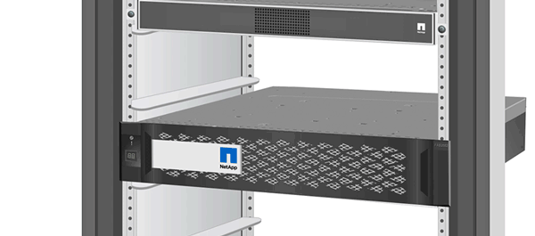

= Substitua a unidade SSD ou a unidade HDD - ASA A800
:allow-uri-read: 
:icons: font
:imagesdir: ../media/

[role="lead lead"]
Você pode substituir uma unidade com falha sem interrupções enquanto a e/S estiver em andamento. O procedimento para substituir um SSD destina-se a unidades não giratórias e o procedimento para substituir um HDD destina-se a unidades giratórias.

Quando uma unidade falha, a plataforma Registra uma mensagem de aviso no console do sistema indicando qual unidade falhou. Além disso, o LED de avaria no painel do visor do operador e o LED de avaria na unidade avariada acendem-se.

.Antes de começar
* Siga as práticas recomendadas e instale a versão atual do Pacote de Qualificação de disco (DQP) antes de substituir uma unidade.
* Identifique a unidade com falha executando o `storage disk show -broken` comando a partir do console do sistema.
+
A unidade com falha aparece na lista de unidades com falha. Se isso não acontecer, você deve esperar, e então executar o comando novamente.

+

NOTE: Dependendo do tipo e da capacidade, a unidade pode levar até várias horas para aparecer na lista de unidades com falha.

* Determine se a autenticação SED está ativada.
+
A forma como você substitui a unidade depende de como a unidade está sendo usada. Se a autenticação SED estiver ativada, você deverá usar as instruções de substituição SED no https://docs.netapp.com/ontap-9/topic/com.netapp.doc.pow-nve/home.html["Guia de alimentação de encriptação ONTAP 9 NetApp"]. Estas instruções descrevem etapas adicionais que você deve executar antes e depois de substituir um SED.

* Certifique-se de que a unidade de substituição é suportada pela sua plataforma. Consulte https://hwu.netapp.com["NetApp Hardware Universe"] .
* Certifique-se de que todos os outros componentes do sistema estão a funcionar corretamente; caso contrário, tem de contactar a assistência técnica.

.Sobre esta tarefa
* O firmware da unidade é atualizado automaticamente (sem interrupções) em novas unidades que tenham versões de firmware não atuais.
* Ao substituir uma unidade, você deve esperar um minuto entre a remoção da unidade com falha e a inserção da unidade de substituição para permitir que o sistema de armazenamento reconheça a existência da nova unidade.

[role="tabbed-block"]
====
.Opção 1: Substituir SSD
--
.Passos
. Se você quiser atribuir manualmente a propriedade da unidade para a unidade de substituição, você precisa desativar a unidade de substituição de atribuição automática de unidade, se ela estiver ativada
+

NOTE: Atribua manualmente a propriedade da unidade e, em seguida, reative a atribuição automática da unidade mais adiante neste procedimento.

+
.. Verifique se a atribuição automática de unidades está ativada: `storage disk option show`
+
Você pode inserir o comando em qualquer um dos módulos do controlador.

+
Se a atribuição automática de unidade estiver ativada, a saída será exibida `on` na coluna "'Auto Assign'" (para cada módulo do controlador).

.. Se a atribuição automática de condução estiver ativada, desative-a: `storage disk option modify -node node_name -autoassign off`
+
Tem de desativar a atribuição automática de condução em ambos os módulos do controlador.

. Aterre-se corretamente.
. Identifique fisicamente a unidade com falha.
+
Quando uma unidade falha, o sistema Registra uma mensagem de aviso no console do sistema indicando qual unidade falhou. Além disso, o LED atenção (âmbar) no painel de visualização do operador da prateleira de acionamento e a unidade com falha acendem-se.

+

NOTE: O LED de atividade (verde) em uma unidade com falha pode ser iluminado (sólido), o que indica que a unidade tem energia, mas não deve estar piscando, o que indica atividade de e/S. Uma unidade com falha não tem atividade de e/S.

. Remova a unidade com falha:
+
.. Prima o botão de libertação na superfície da unidade para abrir a pega do excêntrico.
.. Deslize a unidade para fora da prateleira usando a alça do came e apoiando a unidade com a outra mão.

. Aguarde, no mínimo, 70 segundos antes de inserir a unidade de substituição.
+
Isso permite que o sistema reconheça que uma unidade foi removida.

. Insira a unidade de substituição:
+
.. Com o manípulo do excêntrico na posição aberta, utilize as duas mãos para introduzir a transmissão de substituição.
.. Prima até a unidade parar.
.. Feche a pega do came de forma a que a unidade fique totalmente assente no plano médio e a pega encaixe no devido lugar.
+
Certifique-se de que fecha lentamente a pega do excêntrico de forma a que fique corretamente alinhada com a face da unidade.

. Verifique se o LED de atividade (verde) da unidade está aceso.
+
Quando o LED de atividade da unidade está sólido, significa que a unidade tem energia. Quando o LED de atividade da unidade está intermitente, significa que a unidade tem alimentação e e/S está em curso. Se o firmware da unidade estiver sendo atualizado automaticamente, o LED pisca.

. Se estiver substituindo outra unidade, repita as etapas 3 a 7.
. Se você desativou a atribuição automática de unidade na Etapa 1, atribua manualmente a propriedade da unidade e, em seguida, reative a atribuição automática de unidade, se necessário.
+
.. Exibir todas as unidades não possuídas: `storage disk show -container-type unassigned`
+
Você pode inserir o comando em qualquer um dos módulos do controlador.

.. Atribuir cada unidade: `storage disk assign -disk disk_name -owner node_name`
+
Você pode inserir o comando em qualquer um dos módulos do controlador.

+
Você pode usar o caractere curinga para atribuir mais de uma unidade de uma vez.

.. Reative a atribuição automática de condução, se necessário: `storage disk option modify -node node_name -autoassign on`
+
Você deve reativar a atribuição automática de acionamento em ambos os módulos do controlador.

. Devolva a peça com falha ao NetApp, conforme descrito nas instruções de RMA fornecidas com o kit.
+
Entre em Contato com o suporte técnico em https://mysupport.netapp.com/site/global/dashboard["Suporte à NetApp"], 888-463-8277 (América do Norte), 00-800-44-638277 (Europa) ou 800-800-80-800 (Ásia/Pacífico) se precisar do número de RMA ou de ajuda adicional com o procedimento de substituição.

--
.Opção 2: Substituir HDD
--
. Se você quiser atribuir manualmente a propriedade da unidade para a unidade de substituição, você precisa desativar a unidade de substituição de atribuição automática de unidade, se ela estiver ativada
+

NOTE: Atribua manualmente a propriedade da unidade e, em seguida, reative a atribuição automática da unidade mais adiante neste procedimento.

+
.. Verifique se a atribuição automática de unidades está ativada: `storage disk option show`
+
Você pode inserir o comando em qualquer um dos módulos do controlador.

+
Se a atribuição automática de unidade estiver ativada, a saída será exibida `on` na coluna "'Auto Assign'" (para cada módulo do controlador).

.. Se a atribuição automática de condução estiver ativada, desative-a: `storage disk option modify -node node_name -autoassign off`
+
Tem de desativar a atribuição automática de condução em ambos os módulos do controlador.

. Aterre-se corretamente.
. Retire cuidadosamente a moldura da parte frontal da plataforma.
. Identifique a unidade de disco com falha a partir da mensagem de aviso da consola do sistema e do LED de avaria iluminado na unidade de disco
. Pressione o botão de liberação na face da unidade de disco.
+
Dependendo do sistema de armazenamento, as unidades de disco têm o botão de liberação localizado na parte superior ou à esquerda da face da unidade de disco.

+
Por exemplo, a ilustração a seguir mostra uma unidade de disco com o botão de liberação localizado na parte superior da face da unidade de disco:

+

+
A alavanca do came nas molas da unidade de disco abrem parcialmente e a unidade de disco solta-se do plano médio.

. Puxe o manípulo do excêntrico para a posição totalmente aberta para retirar a unidade do disco do plano médio.
+
image::../media/drw_drive_open.gif[Remova uma unidade com o botão de liberação no meio]

. Deslize ligeiramente a unidade de disco para fora e deixe o disco girar com segurança, o que pode levar menos de um minuto e, em seguida, usando ambas as mãos, remova a unidade de disco da prateleira de disco.
. Com a alça do came na posição aberta, insira a unidade de disco de substituição no compartimento da unidade, pressionando firmemente até que a unidade de disco pare.
+

NOTE: Aguarde pelo menos 10 segundos antes de inserir uma nova unidade de disco. Isso permite que o sistema reconheça que uma unidade de disco foi removida.

+

NOTE: Se os compartimentos de unidade da plataforma não estiverem totalmente carregados com unidades, é importante colocar a unidade de substituição no mesmo compartimento da unidade do qual você removeu a unidade com falha.

+

NOTE: Use duas mãos ao inserir a unidade de disco, mas não coloque as mãos nas placas de unidade de disco expostas na parte inferior do transportador de disco.

. Feche a alça do came de modo que a unidade de disco fique totalmente encaixada no plano médio e a alça encaixe no lugar.
+
Certifique-se de que fecha a pega do came lentamente de forma a que fique corretamente alinhada com a face da unidade de disco.

. Se estiver substituindo outra unidade de disco, repita as etapas 4 a 9.
. Volte a instalar a moldura.
. Se você desativou a atribuição automática de unidade na Etapa 1, atribua manualmente a propriedade da unidade e, em seguida, reative a atribuição automática de unidade, se necessário.
+
.. Exibir todas as unidades não possuídas: `storage disk show -container-type unassigned`
+
Você pode inserir o comando em qualquer um dos módulos do controlador.

.. Atribuir cada unidade: `storage disk assign -disk disk_name -owner owner_name`
+
Você pode inserir o comando em qualquer um dos módulos do controlador.

+
Você pode usar o caractere curinga para atribuir mais de uma unidade de uma vez.

.. Reative a atribuição automática de condução, se necessário: `storage disk option modify -node node_name -autoassign on`
+
Você deve reativar a atribuição automática de acionamento em ambos os módulos do controlador.

. Devolva a peça com falha ao NetApp, conforme descrito nas instruções de RMA fornecidas com o kit.
+
Entre em Contato com o suporte técnico em https://mysupport.netapp.com/site/global/dashboard["Suporte à NetApp"], 888-463-8277 (América do Norte), 00-800-44-638277 (Europa) ou 800-800-80-800 (Ásia/Pacífico) se precisar do número de RMA ou de ajuda adicional com o procedimento de substituição.

--
====