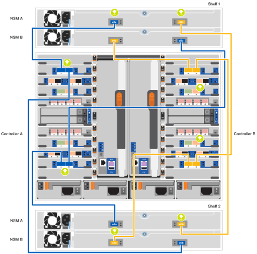

= Etapas detalhadas - ASA 900
:allow-uri-read: 
:icons: font
:imagesdir: ../media/

[role="lead"]
Esta página fornece instruções detalhadas passo a passo para instalar um sistema NetApp típico. Use este artigo se você quiser instruções de instalação mais detalhadas.

== Passo 1: Prepare-se para a instalação

Para instalar seu sistema, você precisa criar uma conta no site de suporte da NetApp, Registrar seu sistema e obter chaves de licença. Você também precisa fazer o inventário do número e do tipo apropriados de cabos para o seu sistema e coletar informações específicas de rede.

Você precisa ter acesso ao https://hwu.netapp.com["NetApp Hardware Universe"^] para obter informações sobre os requisitos do site, bem como informações adicionais sobre o sistema configurado.

.O que você precisa
Você também pode querer ter acesso ao http://mysupport.netapp.com/documentation/productlibrary/index.html?productID=62286["ONTAP 9 Notas de versão"^] para sua versão do ONTAP para obter mais informações sobre este sistema.

Você precisa fornecer o seguinte em seu site:

* Espaço em rack para o sistema de armazenamento
* Chave de fendas Phillips nº 2
* Cabos de rede adicionais para conetar seu sistema ao switch de rede e laptop ou console com um navegador da Web

.Passos
. Desembale o conteúdo de todas as caixas.
. Registre o número de série do sistema nos controladores.
+
image:../media/drw_ssn_label.svg["Exemplo do número de série do sistema que mostra a localização do número"]

. Faça um inventário e anote o número e os tipos de cabos que você recebeu.
+
A tabela a seguir identifica os tipos de cabos que você pode receber. Se você receber um cabo não listado na tabela, consulte o Hardware Universe para localizar o cabo e identificar seu uso.

+
https://hwu.netapp.com["NetApp Hardware Universe"^]

+
[cols="1,2,2,2"]
|===
| Tipo de cabo... | Número de peça e comprimento | Tipo de conetor | Para... 

 a| 
Cabo de dados de 25 GbE
 a| 
X66240A-05 (112-00639), 0,5m

X66240A-2 (112-00598), 2m

X66240A-5 (112-00600), 5m
 a| 
image:../media/oie_cable_sfp_gbe_copper.png["GbE cobre SFP"]
 a| 
Cabo de rede

 a| 
FC de 32 GB (op SFP)
 a| 
X66250-2 (112-00342), 2m

X66250-5 (112-00344), 5m

X66250-15 (112-00346), 15m
 a| 
image:../media/oie_cable_sfp_gbe_copper.png["GbE cobre SFP"]
 a| 
Cabo de rede ótica FC

 a| 
Cabo de rede de 40 GbE
 a| 
X66100-1 (112-00542), 1m

X66100-3 (112-00543), 3m

X66100-5 (112-00544), 5m
 a| 
image:../media/oie_cable100_gbe_qsfp28.png["Cabo de 100 GB"]
 a| 
Dados Ethernet, rede de cluster

 a| 
Cabo de 100 GbE
 a| 
X66211B-1 (112-00573), 1m

X66211B-2 (112-00574), 2m

X66211B-5 (112-00576), 5m
 a| 
image:../media/oie_cable100_gbe_qsfp28.png["Cabo de 100 GB"]
 a| 
Rede,

Storage NVMe,

Dados Ethernet,

rede de cluster

 a| 
Cabos óticos
 a| 
X66031A (112-00436), 1m

X66032A (112-00437), 2m

X66033A (112-00438), 3m
 a| 
image:../media/oie_cable_fiber_lc_connector.png["Conetor de fibra LC"]
 a| 
Rede ótica FC

 a| 
Cat 6, RJ-45 (dependente da encomenda)
 a| 
Números de peça X6585-R6 (112-00291), 3m

X6562-R6 (112-00196), 5m
 a| 
image:../media/oie_cable_rj45.png["Cabos RJ-45"]
 a| 
Rede de gerenciamento e dados Ethernet

 a| 
Cabo micro-USB da consola
 a| 
Não aplicável
 a| 
image:../media/oie_cable_micro_usb.png["Cabo micro USB"]
 a| 
Conexão de console durante a configuração de software em laptop/console não Windows ou Mac

 a| 
Cabos de alimentação
 a| 
Não aplicável
 a| 
image:../media/oie_cable_power.png["Cabos de alimentação"]
 a| 
Ligar o sistema

|===
. Reveja https://library.netapp.com/ecm/ecm_download_file/ECMLP2862613["Guia de configuração do ONTAP"^] o e recolha as informações necessárias listadas nesse guia.

== Passo 2: Instale o hardware

Você precisa instalar seu sistema em um rack de 4 colunas ou gabinete do sistema NetApp, conforme aplicável.

. Instale os kits de calhas, conforme necessário.
. Instale e fixe o seu sistema utilizando as instruções incluídas no kit de calhas.
+

NOTE: Você precisa estar ciente das preocupações de segurança associadas ao peso do sistema.

+
image::../media/drw_9500_lifting_icon.svg[Etiqueta de aviso de levantamento de peso]

. Conete os dispositivos de gerenciamento de cabos (como mostrado).
+
image::../media/drw_9500_cable_management_arms.svg[Pegas de elevação e dispositivo de gestão de cabos]

. Coloque a moldura na parte frontal do sistema.

O diagrama a seguir mostra uma representação de como é um sistema típico e onde os principais componentes estão localizados na parte traseira do sistema:

image::../media/drw_a900_controller_in_chassis_ID_IEOPS-856.svg[Configuração típica do cluster]

== Passo 3: Controladores de cabo para a sua rede

Você pode conetar os controladores à rede usando o método de cluster sem switch de dois nós ou usando a rede de interconexão de cluster.

[role="tabbed-block"]
====
.Opção 1: Cluster sem switch de dois nós
--
A rede de gerenciamento, a rede de dados e as portas de gerenciamento nos controladores são conetadas aos switches. As portas de interconexão de cluster são cabeadas em ambos os controladores.

.Antes de começar
Tem de ter contactado o administrador da rede para obter informações sobre a ligação do sistema aos comutadores.

Certifique-se de que verifica a direção das patilhas de puxar do cabo ao inserir os cabos nas portas. As presilhas de cabos estão disponíveis para todas as portas do módulo de rede.

image:../media/oie_cable_pull_tab_up.png["Direção da patilha de puxar do cabo"]

NOTE: Ao inserir o conetor, você deve senti-lo clicar no lugar; se você não sentir que ele clique, remova-o, vire-o e tente novamente.

. Use a animação ou ilustração para concluir o cabeamento entre os controladores e os switches:
+
.Animação - Cable um cluster sem switch de dois nós
video::37419c37-f56f-48e5-8e6c-afa600095444[panopto]
+
image:../media/drw_a900_tnsc_network_cabling_IEOPS-933.svg["Cabeamento de rede sem switch de dois nós"]

+
[cols="20%,80%"]
|===
| Passo | Execute em cada controlador 

 a| 
image:../media/icon_square_1_green.png["Legenda número 1"]
 a| 
Portas de interconexão do cluster de cabos:

** Ranhura A4 e B4 (e4a)
** Ranhura A8 e B8 (e8a)

image:../media/oie_cable100_gbe_qsfp28.png["Cabo de 100 GB"]

 a| 
image:../media/icon_square_2_purple.png["Legenda número 2"]
 a| 
Portas de gerenciamento do controlador de cabo (chave inglesa).

image:../media/oie_cable_rj45.png["Cabos RJ-45"]

 a| 
image:../media/icon_square_3_orange.png["Legenda número 3"]
 a| 
Switches de rede Cable 25 GbE:

Portas no slot A3 e B3 (E3A e e3c) e no slot A9 e B9 (e9a e e9c) para os switches de rede de 25 GbE.

image:../media/oie_cable_sfp_gbe_copper.png["GbE cobre SFP"]

40GbE switches de rede de host:

Portas b do lado do host do cabo no slot A4 e B4 (e4b) e no slot A8 e B8 (e8b) para o switch do host.

image:../media/oie_cable100_gbe_qsfp28.png["Cabo de 100 GB"]

 a| 
image:../media/icon_square_4_red.png["Legenda número 4"]
 a| 
Cabo conexões FC de 32 GB:

Portas de cabo nos slots A5 e B5 (5a, 5b, 5c e 5D) e slot A7 e B7 (7a, 7b, 7c e 7D) para os switches de rede FC de 32 GB.

image:../media/oie_cable_sfp_gbe_copper.png["GbE cobre SFP"]

 a| 
image::../media/icon_square_5_grey.png[Ícone de legenda cinco]
 a| 
** Prenda os cabos aos braços de gestão do cabo (não ilustrado).
** Ligue os cabos de alimentação às PSUs e ligue-os a diferentes fontes de alimentação (não apresentadas). A PSU 1 e 3 fornecem energia para todos os componentes do lado A, enquanto PSU2 e PSU4 fornecem energia para todos os componentes do lado B.

image:../media/drw_a900fas9500_power_icon_IEOPS-1142.svg["Ligações de alimentação"]

|===

--
.Opção 2: Cluster comutado
--
A rede de gerenciamento, a rede de dados e as portas de gerenciamento nos controladores são conetadas aos switches. A interconexão de cluster e as portas de HA são cabeadas para o switch cluster/HA.

.Antes de começar
Tem de ter contactado o administrador da rede para obter informações sobre a ligação do sistema aos comutadores.

Certifique-se de que verifica a direção das patilhas de puxar do cabo ao inserir os cabos nas portas. As presilhas de cabos estão disponíveis para todas as portas do módulo de rede.

image:../media/oie_cable_pull_tab_up.png["Direção da patilha de puxar do cabo"]

NOTE: Ao inserir o conetor, você deve sentir que ele clique no lugar; se você não sentir que ele clique, remova-o, vire-o e tente novamente.

. Use a animação ou ilustração para concluir o cabeamento entre os controladores e os switches:
+
.Animação - Cable a switched cluster
video::61ec11ec-aa30-474a-87a5-afa60008b52b[panopto]
+
image:../media/drw_a900_switched_network_cabling_IEOPS-934.svg["largura: 500px mm"]

+
[cols="20%,80%"]
|===
| Passo | Execute em cada controlador 

 a| 
image:../media/icon_square_1_green.png["Legenda número 1"]
 a| 
Portas a de interconexão do cluster de cabos:

** Slot A4 e B4 (e4a) para o switch de rede do cluster.
** Slot A8 e B8 (e8a) para o switch de rede do cluster.

image:../media/oie_cable100_gbe_qsfp28.png["Cabo de 100 GB"]

 a| 

 a| 
Portas de gerenciamento do controlador de cabo (chave inglesa).

image:../media/oie_cable_rj45.png["Cabos RJ-45"]

 a| 
image:../media/icon_square_3_orange.png["Legenda número 3"]
 a| 
Switches de rede do cabo 25GbE:

Portas no slot A3 e B3 (E3A e e3c) e no slot A9 e B9 (e9a e e9c) para os switches de rede de 25 GbE.

image:../media/oie_cable_sfp_gbe_copper.png["GbE cobre SFP"]

40GbE switches de rede de host:

Portas b do lado do host do cabo no slot A4 e B4 (e4b) e no slot A8 e B8 (e8b) para o switch do host.

image:../media/oie_cable100_gbe_qsfp28.png["Cabo de 100 GB"]

 a| 
image:../media/icon_square_4_red.png["Legenda número 4"]
 a| 
Cabo conexões FC de 32 GB:

Portas de cabo nos slots A5 e B5 (5a, 5b, 5c e 5D) e slot A7 e B7 (7a, 7b, 7c e 7D) para os switches de rede FC de 32 GB.

image:../media/oie_cable_sfp_gbe_copper.png["GbE cobre SFP"]

 a| 
image:../media/icon_square_5_grey.png["Ícone de legenda cinco"]
 a| 
** Prenda os cabos aos braços de gestão do cabo (não ilustrado).
** Ligue os cabos de alimentação às PSUs e ligue-os a diferentes fontes de alimentação (não apresentadas). A PSU 1 e 3 fornecem energia para todos os componentes do lado A, enquanto PSU2 e PSU4 fornecem energia para todos os componentes do lado B.

image:../media/oie_cable_power.png["Cabos de alimentação"]

image:../media/drw_a900fas9500_power_icon_IEOPS-1142.svg["largura: 200px mm"]

|===

--
====

== Etapa 4: Controladores de cabos para compartimentos de unidades

Faça a cabeamento de uma única gaveta de unidades de NS224 TB ou duas gavetas de unidades de NS224 TB para seus controladores.

[role="tabbed-block"]
====
.Opção 1: Cable os controladores para um único compartimento de unidade de NS224 TB
--
Você deve vincular cada controlador aos módulos do NSM no compartimento de unidades NS224.

.Antes de começar
* Certifique-se de que verifica a seta da ilustração para a orientação adequada da presilha de puxar do conetor do cabo. A presilha de puxar do cabo para os módulos de armazenamento está para cima, enquanto as presilhas de puxar nas prateleiras estão para baixo.

image:../media/oie_cable_pull_tab_up.png["Direção da patilha de puxar do cabo"]

image:../media/oie_cable_pull_tab_down.png["Puxe a direção da patilha"]

NOTE: Ao inserir o conetor, você deve senti-lo clicar no lugar; se você não sentir que ele clique, remova-o, vire-o e tente novamente.

. Use a animação ou os desenhos a seguir para vincular os controladores a um único compartimento de unidade de NS224 TB.
+
.Animação - Cable uma única prateleira NS224
video::8d8b45cd-bd8f-4fab-a4fa-afa5017e7b72[panopto]
+
image:../media/drw_a900_NS224_one shelf_cabling_IEOPS-937.svg["largura: 500px mm"]

+
[cols="20%,80%"]
|===
| Passo | Execute em cada controlador 

 a| 
image:../media/icon_square_1_blue.png["Legenda número 1"]
 a| 
** Conete a porta E2A do controlador A à porta e0a no NSM A na gaveta.
** Conete a porta e10b do controlador A à porta e0b no NSM B na gaveta.

image:../media/oie_cable100_gbe_qsfp28.png["largura: 50px mm"]

Cabo de 100 GbE

 a| 

 a| 
** Conete a porta E2A do controlador B à porta e0a no NSM B na prateleira.
** Conete a porta e10b do controlador B à porta e0b no NSM A na gaveta.

image:../media/oie_cable100_gbe_qsfp28.png["largura: 50px mm"]

Cabo de 100 GbE

|===

--
.Opção 2: Cabeamento das controladoras para duas gavetas de unidades de NS224 TB
--
Você precisa vincular cada controlador aos módulos do NSM nos NS224 compartimentos de unidades.

.Antes de começar
* Certifique-se de que verifica a seta da ilustração para a orientação adequada da presilha de puxar do conetor do cabo. A presilha de puxar do cabo para os módulos de armazenamento está para cima, enquanto as presilhas de puxar nas prateleiras estão para baixo.

image:../media/oie_cable_pull_tab_up.png["Direção da patilha de puxar do cabo"]

image:../media/oie_cable_pull_tab_down.png["Puxe a direção da patilha"]

NOTE: Ao inserir o conetor, você deve senti-lo clicar no lugar; se você não sentir que ele clique, remova-o, vire-o e tente novamente.

. Use a animação ou o diagrama a seguir para enviar os controladores para dois compartimentos de unidades NS224.
+
.Animação - Cabo de duas prateleiras NS224
video::ec143c32-9e4b-47e5-893e-afa5017da6b4[panopto]
+
image:../media/drw_a900_NS224_line_art_two shelf_cabling_IEOPS-1147.svg["largura: 500px mm"]

+

+
[cols="20%,80%"]
|===
| Passo | Execute em cada controlador 

 a| 
image:../media/icon_square_1_blue.png["Legenda número 1"]
 a| 
** Conete a porta E2A do controlador A ao NSM A e0a na gaveta 1.
** Conete a porta e10b do controlador A ao NSM B e0b na gaveta 1.
** Conete a porta E2B do controlador A ao NSM B e0b na gaveta 2.
** Conete a porta e10a do controlador A ao NSM A e0a na gaveta 2.

image:../media/oie_cable100_gbe_qsfp28.png["Conetor QSFP de 100 GbE"]

Cabo de 100 GbE

 a| 

 a| 
** Conete a porta E2A do controlador B ao NSM B e0a na gaveta 1.
** Conete a porta e10b do controlador B ao NSM A e0b na gaveta 1.
** Conete a porta E2B do controlador B ao NSM A e0b na gaveta 2.
** Conete a porta e10a do controlador B ao NSM B e0a na gaveta 2.

image:../media/oie_cable100_gbe_qsfp28.png["Conetor QSFP de 100 GbE"]

Cabo de 100 GbE

|===

--
====

== Passo 5: Conclua a configuração e configuração do sistema

Você pode concluir a configuração e configuração do sistema usando a descoberta de cluster com apenas uma conexão com o switch e laptop, ou conetando-se diretamente a um controlador no sistema e, em seguida, conetando-se ao switch de gerenciamento.

[role="tabbed-block"]
====
.Opção 1: Se a deteção de rede estiver ativada
--
Se tiver a deteção de rede ativada no seu computador portátil, pode concluir a configuração e configuração do sistema utilizando a deteção automática de cluster.

. Use a animação ou o desenho a seguir para definir uma ou mais IDs de gaveta de unidade:
+
As NS224 gavetas são pré-configuradas para as IDs de gaveta 00 e 01. Se você quiser alterar as IDs de gaveta, você deve criar uma ferramenta para inserir no orifício onde o botão está localizado. Consulte link:../ns224/change-shelf-id.html["Alterar o ID de um compartimento - NS224 gavetas"] para obter instruções detalhadas.

+
.Animação - defina IDs do shelf de unidade NVMe
video::95a29da1-faa3-4ceb-8a0b-ac7600675aa6[panopto]
+
image:../media/drw_a900_oie_change_ns224_shelf_ID_ieops-836.svg["Alterar ID do compartimento"]

+
[cols="20%,80%"]
|===

 a| 
image:../media/icon_round_1.png["Legenda número 1"]
 a| 
Tampa da extremidade da prateleira

 a| 
image:../media/icon_round_2.png["Legenda número 2"]
 a| 
Placa frontal da prateleira

 a| 
image:../media/icon_round_3.png["Legenda número 3"]
 a| 
LED de ID da prateleira

 a| 
image:../media/icon_round_4.png["Legenda número 4"]
 a| 
Botão de configuração do ID do compartimento

|===
. Ligue os interruptores de energia das fontes de alimentação para ambos os nós.
+
.Animação - ligue a alimentação dos controladores
video::a905e56e-c995-4704-9673-adfa0005a891[panopto]
+
image:../media/drw_a900_power-on_IEOPS-941.svg["largura: 500px mm"]

+

NOTE: A inicialização inicial pode levar até oito minutos.

. Certifique-se de que o seu computador portátil tem a deteção de rede ativada.
+
Consulte a ajuda online do seu computador portátil para obter mais informações.

. Use a animação a seguir para conetar seu laptop ao switch de gerenciamento.
+
.Animação - Conete seu laptop ao interrutor de gerenciamento
video::d61f983e-f911-4b76-8b3a-ab1b0066909b[panopto]
+
image:../media/dwr_laptop_to_switch_only.svg["largura: 500px mm"]

. Selecione um ícone ONTAP listado para descobrir:
+
image:../media/drw_autodiscovery_controler_select.svg["largura: 500px mm"]

+
.. Abra o Explorador de ficheiros.
.. Clique em rede no painel esquerdo.
.. Clique com o botão direito do rato e selecione Atualizar.
.. Clique duas vezes no ícone ONTAP e aceite quaisquer certificados exibidos na tela.
+

NOTE: XXXXX é o número de série do sistema para o nó de destino.

+
O System Manager é aberto.

. Utilize a configuração guiada do System Manager para configurar o sistema utilizando os dados recolhidos no https://library.netapp.com/ecm/ecm_download_file/ECMLP2862613["Guia de configuração do ONTAP"^].
. Configure a sua conta e transfira o Active IQ Config Advisor:
+
.. Inicie sessão na sua conta existente ou crie uma conta.
+
https://mysupport.netapp.com/eservice/public/now.do["Registro de suporte da NetApp"^]

.. Registe o seu sistema.
+
https://mysupport.netapp.com/eservice/registerSNoAction.do?moduleName=RegisterMyProduct["Registro de produto NetApp"^]

.. Baixar Active IQ Config Advisor.
+
https://mysupport.netapp.com/site/tools/tool-eula/activeiq-configadvisor["NetApp Downloads: Config Advisor"^]

. Verifique a integridade do sistema executando o Config Advisor.
. Depois de concluir a configuração inicial, vá para a https://www.netapp.com/data-management/oncommand-system-documentation/["Recursos de documentação do Gerenciador de sistema do ONTAP  ONTAP"^] página para obter informações sobre como configurar recursos adicionais no ONTAP.

--
.Opção 2: Se a deteção de rede não estiver ativada
--
Se não estiver a utilizar um computador portátil ou uma consola Windows ou Mac ou se a deteção automática não estiver ativada, tem de concluir a configuração e a configuração utilizando esta tarefa.

. Faça o cabo e configure o seu laptop ou console:
+
.. Defina a porta de console no laptop ou console para 115.200 baud com N-8-1.
+

NOTE: Consulte a ajuda on-line do seu laptop ou console para saber como configurar a porta do console.

.. Conete o cabo do console ao laptop ou console usando o cabo do console fornecido com o sistema e conete o laptop ao switch de gerenciamento na sub-rede de gerenciamento.
+
image:../media/drw_a900_cable_console_switch_controller_IEOPS-953.svg["Ligação do cabo da consola"]

.. Atribua um endereço TCP/IP ao laptop ou console, usando um que esteja na sub-rede de gerenciamento.

. Use a animação a seguir para definir uma ou mais IDs de gaveta de unidade:
+
As NS224 gavetas são pré-configuradas para as IDs de gaveta 00 e 01. Se você quiser alterar as IDs de gaveta, você deve criar uma ferramenta para inserir no orifício onde o botão está localizado. Consulte link:../ns224/change-shelf-id.html["Alterar o ID de um compartimento - NS224 gavetas"] para obter instruções detalhadas.

+
.Animação - defina IDs do shelf de unidade NVMe
video::95a29da1-faa3-4ceb-8a0b-ac7600675aa6[panopto]
+
image:../media/drw_a900_oie_change_ns224_shelf_ID_ieops-836.svg["Alterar ID do compartimento"]

+
[cols="1,5"]
|===

 a| 
image:../media/icon_round_1.png["Legenda número 1"]
 a| 
Tampa da extremidade da prateleira

 a| 
image:../media/icon_round_2.png["Legenda número 2"]
 a| 
Placa frontal da prateleira

 a| 
image:../media/icon_round_3.png["Legenda número 3"]
 a| 
LED de ID da prateleira

 a| 
image:../media/icon_round_4.png["Legenda número 4"]
 a| 
Botão de configuração do ID do compartimento

|===
. Ligue os interruptores de energia das fontes de alimentação para ambos os nós.
+
.Animação - ligue a alimentação dos controladores
video::bb04eb23-aa0c-4821-a87d-ab2300477f8b[panopto]
+
Imagem:[legenda número 1] drw_A900_power-on_IEOPS-941.svg[largura 500px]

+

NOTE: A inicialização inicial pode levar até oito minutos.

. Atribua um endereço IP de gerenciamento de nó inicial a um dos nós.
+
[cols="20%,80%"]
|===
| Se a rede de gestão tiver DHCP... | Então... 

 a| 
Configurado
 a| 
Registre o endereço IP atribuído aos novos controladores.

 a| 
Não configurado
 a| 
.. Abra uma sessão de console usando PuTTY, um servidor de terminal ou o equivalente para o seu ambiente.
+

NOTE: Verifique a ajuda on-line do seu laptop ou console se você não sabe como configurar o PuTTY.

.. Insira o endereço IP de gerenciamento quando solicitado pelo script.

|===
. Usando o System Manager em seu laptop ou console, configure seu cluster:
+
.. Aponte seu navegador para o endereço IP de gerenciamento de nó.
+

NOTE: O formato para o endereço é https://x.x.x.x+.

.. Configure o sistema utilizando os dados recolhidos no https://library.netapp.com/ecm/ecm_download_file/ECMLP2862613["Guia de configuração do ONTAP"^]

. Configure a sua conta e transfira o Active IQ Config Advisor:
+
.. Inicie sessão na sua conta existente ou crie uma conta.
+
https://mysupport.netapp.com/eservice/public/now.do["Registro de suporte da NetApp"^]

.. Registe o seu sistema.
+
https://mysupport.netapp.com/eservice/registerSNoAction.do?moduleName=RegisterMyProduct["Registro de produto NetApp"^]

.. Baixar Active IQ Config Advisor.
+
https://mysupport.netapp.com/site/tools/tool-eula/activeiq-configadvisor["NetApp Downloads: Config Advisor"^]

. Verifique a integridade do sistema executando o Config Advisor.
. Depois de concluir a configuração inicial, vá para a https://www.netapp.com/data-management/oncommand-system-documentation/["Recursos de documentação do Gerenciador de sistema do ONTAP  ONTAP"^] página para obter informações sobre como configurar recursos adicionais no ONTAP.

--
====