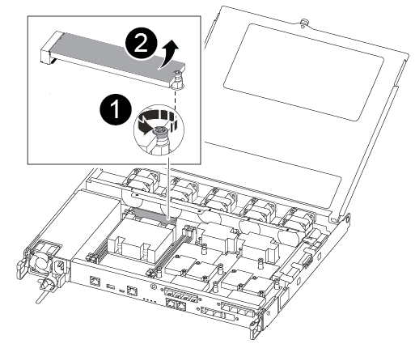

= Substitua o suporte de arranque - AFF C250
:allow-uri-read: 
:icons: font
:imagesdir: ../media/

[role="lead"]
Para substituir o suporte de arranque, tem de remover o módulo do controlador afetado, instalar o suporte de arranque de substituição e transferir a imagem de arranque para uma unidade flash USB.

== Passo 1: Remova o módulo do controlador

Para aceder aos componentes no interior do módulo do controlador, tem de remover primeiro o módulo do controlador do sistema e, em seguida, remover a tampa do módulo do controlador.

.Passos
. Se você ainda não está aterrado, aterre-se adequadamente.
. Desconete as fontes de alimentação do módulo do controlador da fonte.
. Solte os fixadores do cabo de alimentação e, em seguida, desconete os cabos das fontes de alimentação.
. Insira o dedo indicador no mecanismo de travamento em ambos os lados do módulo do controlador, pressione a alavanca com o polegar e puxe o controlador cuidadosamente alguns centímetros para fora do chassi.
+

NOTE: Se tiver dificuldade em remover o módulo do controlador, coloque os dedos indicadores através dos orifícios dos dedos a partir do interior (cruzando os braços).

+
image::../media/drw_a250_pcm_remove_install.png[Abrir o mecanismo de bloqueio]

+
|===

 a| 
image:../media/icon_round_1.png["Legenda número 1"]
 a| 
Alavanca

 a| 
image:../media/icon_round_2.png["Legenda número 2"]
 a| 
Mecanismo de bloqueio

|===
. Usando ambas as mãos, segure os lados do módulo do controlador e puxe-o suavemente para fora do chassi e coloque-o em uma superfície plana e estável.
. Rode o parafuso de aperto manual na parte frontal do módulo do controlador no sentido contrário ao dos ponteiros do relógio e abra a tampa do módulo do controlador.
+
image::../media/drw_a250_open_controller_module_cover.png[Abrir a tampa do módulo do controlador]

+
|===

 a| 
image:../media/icon_round_1.png["Legenda número 1"]
 a| 
Parafuso de aperto manual

 a| 
image:../media/icon_round_2.png["Legenda número 2"]
 a| 
Tampa do módulo do controlador.

|===
. Levante a tampa da conduta de ar.
+
image::../media/drw_a250_remove_airduct_cover.png[Levantar a tampa da conduta de ar]

== Passo 2: Substitua o suporte de arranque

Pode localizar o suporte de arranque avariado no módulo do controlador removendo a conduta de ar no módulo do controlador antes de poder substituir o suporte de arranque.

Você precisa de uma chave de fenda Phillips magnética nº 1 para remover o parafuso que prende o suporte de inicialização no lugar. Devido às restrições de espaço dentro do módulo do controlador, você também deve ter um ímã para transferir o parafuso para que você não o perca.

Pode utilizar o seguinte vídeo ou as etapas tabuladas para substituir o suporte de arranque:

.Animação - substitua o suporte de arranque
video::7c2cad51-dd95-4b07-a903-ac5b015c1a6d[panopto]
. Localize e substitua os suportes de arranque danificados a partir do módulo do controlador.
+

+
[cols="1,3"]
|===

 a| 
image:../media/icon_round_1.png["Legenda número 1"]
 a| 
Retire o parafuso que fixa o suporte de arranque à placa-mãe no módulo do controlador.

 a| 
image:../media/icon_round_2.png["Legenda número 2"]
 a| 
Levante o suporte de arranque para fora do módulo do controlador.

|===
. Utilizando a chave de fendas magnética nº 1, retire o parafuso do suporte de arranque danificado e coloque-o de lado com segurança no íman.
. Levante cuidadosamente o suporte da bagageira danificado diretamente para fora da tomada e coloque-o de lado.
. Retire o suporte de substituição da bolsa de transporte antiestática e alinhe-o no lugar no módulo da controladora.
. Utilizando a chave de fendas magnética nº 1, introduza e aperte o parafuso no suporte de arranque.
+

NOTE: Não aplique força ao apertar o parafuso na Mídia de inicialização; você pode quebrá-lo.

== Passo 3: Transfira a imagem de arranque para o suporte de arranque

A Mídia de inicialização de substituição que você instalou é sem uma imagem de inicialização, então você precisa transferir uma imagem de inicialização usando uma unidade flash USB.

* Você deve ter uma unidade flash USB, formatada para MBR/FAT32, com pelo menos 4GBGB de capacidade
* Uma cópia da mesma versão de imagem do ONTAP que a que o controlador afetado estava a executar. Você pode baixar a imagem apropriada da seção Downloads no site de suporte da NetApp
+
** Se a NVE estiver ativada, transfira a imagem com encriptação de volume NetApp, conforme indicado no botão de transferência.
** Se a NVE não estiver ativada, transfira a imagem sem encriptação de volume NetApp, conforme indicado no botão de transferência.

* Se o seu sistema for um par de HA, tem de ter uma ligação de rede.
* Se o seu sistema for um sistema autónomo, não necessita de uma ligação de rede, mas tem de efetuar uma reinicialização adicional ao restaurar o sistema de ficheiros var.
+
.. Transfira e copie a imagem de serviço apropriada do site de suporte da NetApp para a unidade flash USB.
.. Transfira a imagem de serviço para o seu espaço de trabalho no seu computador portátil.
.. Descompacte a imagem de serviço.
+

NOTE: Se você estiver extraindo o conteúdo usando o Windows, não use o winzip para extrair a imagem netboot. Use outra ferramenta de extração, como 7-Zip ou WinRAR.

+
Há duas pastas no arquivo de imagem de serviço descompactado:

+
*** inicialização
*** efi

.. Copie a pasta efi para o diretório superior da unidade flash USB.

+

NOTE: Se a imagem de serviço não tiver uma pasta efi, link:https://kb.netapp.com/onprem/ontap/hardware/EFI_folder_missing_from_Service_Image_download_file_used_for_boot_device_recovery_for_FAS_and_AFF_models["Pasta EFI ausente do arquivo de download de imagem de serviço usado para recuperação de dispositivo de inicialização para modelos FAS e AFF"]consulte .

+
A unidade flash USB deve ter a pasta efi e a mesma versão de imagem de serviço (BIOS) do que o controlador deficiente está executando.

+
.. Retire a unidade flash USB do seu computador portátil.
.. Se ainda não o tiver feito, instale a conduta de ar.
+
image::../media/drw_a250_install_airduct_cover.png[Instalação da conduta de ar]

.. Feche a tampa do módulo do controlador e aperte o parafuso de aperto manual.
+
image::../media/drw_a250_close_controller_module_cover.png[Fechar a tampa do módulo do controlador]

+
[cols="1,3"]
|===

 a| 
image:../media/icon_round_1.png["Legenda número 1"]
 a| 
Tampa do módulo do controlador

 a| 
image:../media/icon_round_2.png["Legenda número 2"]
 a| 
Parafuso de aperto manual

|===
.. Alinhe a extremidade do módulo do controlador com a abertura no chassis e, em seguida, empurre cuidadosamente o módulo do controlador até meio do sistema.
.. Introduza a unidade flash USB na ranhura USB do módulo do controlador.
+
Certifique-se de que instala a unidade flash USB na ranhura identificada para dispositivos USB e não na porta da consola USB.

.. Empurre o módulo do controlador até ao chassis:
.. Coloque os dedos indicadores através dos orifícios dos dedos a partir do interior do mecanismo de bloqueio.
.. Pressione os polegares para baixo nas patilhas cor-de-laranja na parte superior do mecanismo de bloqueio e empurre suavemente o módulo do controlador sobre o batente.
.. Solte os polegares da parte superior dos mecanismos de travamento e continue empurrando até que os mecanismos de travamento se encaixem no lugar.
+
O módulo do controlador deve ser totalmente inserido e alinhado com as bordas do chassi.

.. Conete os cabos de alimentação às fontes de alimentação, reinstale o colar de travamento do cabo de alimentação e, em seguida, conete as fontes de alimentação à fonte de alimentação.
+
O módulo do controlador começa a inicializar assim que a energia é restaurada. Esteja preparado para interromper o processo de inicialização.

.. Interrompa o processo de inicialização para parar no prompt DO Loader pressionando Ctrl-C quando você vir iniciando o AUTOBOOT pressione Ctrl-C para abortar....
+
Se você perder essa mensagem, pressione Ctrl-C, selecione a opção para inicializar no modo Manutenção e, em seguida, interrompa o controlador para inicializar NO Loader.

.. Para sistemas com um controlador no chassi, reconete a alimentação e ligue as fontes de alimentação.
+
O sistema começa a inicializar e pára no prompt DO Loader.

