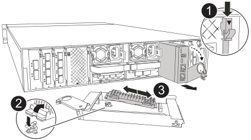

= Substitua o suporte de arranque - FAS70 e FAS90
:allow-uri-read: 
:icons: font
:imagesdir: ../media/

[role="lead"]
O suporte de arranque do seu sistema FAS70 ou FAS90 armazena dados essenciais de firmware e configuração. O processo de substituição envolve a remoção do módulo de Gestão do sistema, remoção do suporte de arranque com problemas, instalação do suporte de arranque de substituição e, em seguida, transferência da imagem ONTAP para o suporte de arranque de substituição.

.

== Passo 1: Substitua o suporte de arranque

O suporte de arranque encontra-se no interior do módulo de gestão do sistema e é acedido removendo o módulo do sistema.

[cols="1,4"]
|===

 a| 
image::../media/icon_round_1.png[Legenda número 1]
 a| 
Trinco do excêntrico do módulo de gestão do sistema

 a| 
image::../media/icon_round_2.png[Legenda número 2]
 a| 
Botão de bloqueio do suporte de arranque

 a| 
image::../media/icon_round_3.png[Legenda número 3]
 a| 
Suporte de arranque

|===
. Se você ainda não está aterrado, aterre-se adequadamente.
. Desconete os cabos da fonte de alimentação das PSUs do controlador.
+

NOTE: Se o sistema de armazenamento tiver fontes de alimentação CC, desconete o bloco de cabos de alimentação das unidades de fonte de alimentação (PSUs).

+
.. Retire todos os cabos ligados ao módulo de gestão do sistema. Certifique-se de que identifica onde os cabos foram ligados, para que possa ligá-los às portas corretas quando reinstalar o módulo.
.. Gire a bandeja de gerenciamento de cabos para baixo puxando os botões de ambos os lados no interior da bandeja de gerenciamento de cabos e, em seguida, gire a bandeja para baixo.
.. Prima o botão do came de gestão do sistema.
.. Rode o trinco do excêntrico para baixo o mais longe possível.
.. Retire o módulo de gestão do sistema do compartimento, prendendo o dedo na abertura da alavanca do came e puxando o módulo para fora do compartimento.
.. Coloque o módulo de gestão do sistema num tapete anti-estático, de forma a que o suporte de arranque fique acessível.

. Retire o suporte de arranque do módulo de gestão:
+
.. Prima o botão azul de trancamento.
.. Rode o suporte de arranque para cima, deslize-o para fora do encaixe e coloque-o de lado.

. Instale o suporte de arranque de substituição no módulo de gestão do sistema:
+
.. Alinhe as extremidades do suporte de arranque com o alojamento do encaixe e, em seguida, empurre-o suavemente no encaixe.
.. Rode o suporte de arranque para baixo em direção ao botão de bloqueio.
.. Prima o botão de bloqueio, rode o suporte de arranque totalmente para baixo e, em seguida, solte o botão de bloqueio.

. Volte a instalar o módulo de gestão do sistema.
+
.. Alinhe o módulo com as extremidades da abertura da ranhura do compartimento.
.. Deslize cuidadosamente o módulo para dentro da ranhura até ao compartimento e, em seguida, rode o trinco da came até ao fim para bloquear o módulo no lugar.

. Rode o tabuleiro de gestão de cabos para cima até à posição fechada.
+
.. Recable o módulo de Gestão do sistema.

== Passo 2: Transfira a imagem ONTAP para o suporte de arranque

A Mídia de inicialização de substituição que você instalou é sem uma imagem ONTAP. Pode transferir a imagem ONTAP para o suporte de arranque de substituição, transferindo a imagem de serviço ONTAP adequada da https://mysupport.netapp.com/["Site de suporte da NetApp"] para uma unidade flash USB e, em seguida, para o suporte de arranque de substituição.

.Antes de começar
* Você deve ter uma unidade flash USB vazia, formatada para FAT32, com pelo menos 4GBGB de capacidade.
* Faça o download de uma cópia da mesma versão de imagem do ONTAP que a controladora prejudicada estava sendo executada. Você pode baixar a imagem apropriada da seção Downloads no site de suporte da NetApp. Use o `version -v` comando para exibir se sua versão do ONTAP oferece suporte a NVE. Se o comando output for exibido `<10no- DARE>`, sua versão do ONTAP não suporta NVE.
+
** Se a NVE for suportada pela sua versão do ONTAP, transfira a imagem com encriptação de volume NetApp, conforme indicado no botão de transferência.
** Se não for suportado NVE, transfira a imagem sem encriptação de volume NetApp, conforme indicado no botão de transferência.

* Se o sistema for um par de HA, você precisará ter uma conexão de rede entre as portas de gerenciamento de nós dos controladores (normalmente as interfaces e0M).

.Passos
. Transfira e copie a imagem de serviço adequada do https://mysupport.netapp.com/["Site de suporte da NetApp"] para a unidade flash USB.
+
.. Transfira a imagem de serviço a partir do link Downloads na página, para o seu espaço de trabalho no seu computador portátil.
.. Descompacte a imagem de serviço.
+

NOTE: Se você estiver extraindo o conteúdo usando o Windows, não use o WinZip para extrair a imagem netboot. Use outra ferramenta de extração, como 7-Zip ou WinRAR.

+
A unidade flash USB deve ter a imagem ONTAP apropriada do que o controlador afetado está a executar.

.. Retire a unidade flash USB do seu computador portátil.

. Introduza a unidade flash USB na ranhura USB do módulo de gestão do sistema.
+
Certifique-se de que instala a unidade flash USB na ranhura identificada para dispositivos USB e não na porta da consola USB.

. Ligue os cabos de alimentação às fontes de alimentação e volte a instalar o retentor do cabo de alimentação.
+
O controlador começa a inicializar assim que a energia é reconetada ao sistema.

. Interrompa o processo de inicialização pressionando Ctrl-C para parar no prompt DO Loader.
+
Se você perder essa mensagem, pressione Ctrl-C, selecione a opção para inicializar no modo Manutenção e, em seguida, interrompa o controlador para inicializar NO Loader.

.O que se segue?
Depois de substituir a Mídia de inicialização, você precisa link:bootmedia-recovery-image-boot.html["inicie a imagem de recuperação"].
