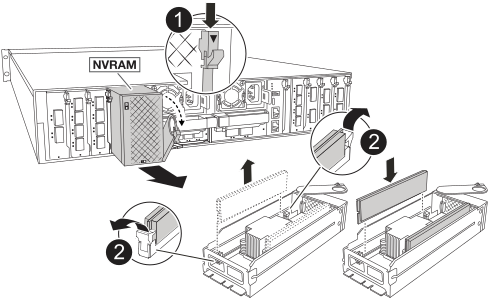

= Substitua o NVRAM - FAS70 e FAS90
:allow-uri-read: 
:icons: font
:imagesdir: ../media/

[role="lead"]
O módulo NVRAM consiste no hardware NVRAM12 e DIMMs substituíveis em campo. Você pode substituir um módulo NVRAM com falha ou os DIMMs dentro do módulo NVRAM. Para substituir um módulo NVRAM com falha, você deve remover o módulo do gabinete, mover os DIMMs para o módulo de substituição e instalar o módulo NVRAM de substituição no gabinete.

Todos os outros componentes do sistema devem estar funcionando corretamente; caso contrário, você deve entrar em https://support.netapp.com["Suporte à NetApp"]Contato com .

Você deve substituir o componente com falha por um componente FRU de substituição que você recebeu de seu provedor.

== Passo 1: Desligue o controlador desativado

Encerre ou assuma o controlador afetado utilizando uma das seguintes opções.

[role="tabbed-block"]
====
.Opção 1: A maioria dos sistemas
--
Para encerrar o controlador com deficiência, você deve determinar o status do controlador e, se necessário, assumir o controlador para que o controlador saudável continue fornecendo dados do armazenamento do controlador com deficiência.

.Sobre esta tarefa
* Se você tiver um sistema SAN, você deve ter verificado mensagens de  `cluster kernel-service show`evento ) para o blade SCSI do controlador afetado. O `cluster kernel-service show` comando (do modo avançado priv) exibe o nome do nó, link:https://docs.netapp.com/us-en/ontap/system-admin/display-nodes-cluster-task.html["status do quorum"]desse nó, o status de disponibilidade desse nó e o status operacional desse nó.
+
Cada processo SCSI-blade deve estar em quórum com os outros nós no cluster. Qualquer problema deve ser resolvido antes de prosseguir com a substituição.

* Se você tiver um cluster com mais de dois nós, ele deverá estar no quórum. Se o cluster não estiver em quórum ou se um controlador íntegro exibir false para qualificação e integridade, você deverá corrigir o problema antes de encerrar o controlador prejudicado; link:https://docs.netapp.com/us-en/ontap/system-admin/synchronize-node-cluster-task.html?q=Quorum["Sincronize um nó com o cluster"^]consulte .

.Passos
. Se o AutoSupport estiver ativado, suprimir a criação automática de casos invocando uma mensagem AutoSupport: `system node autosupport invoke -node * -type all -message MAINT=<# of hours>h`
+
A seguinte mensagem AutoSupport suprime a criação automática de casos por duas horas: `cluster1:> system node autosupport invoke -node * -type all -message MAINT=2h`

. Desative a giveback automática a partir da consola do controlador saudável: `storage failover modify -node local -auto-giveback false`
+

NOTE: Quando vir _do pretende desativar a auto-giveback?_, introduza `y`.

. Leve o controlador prejudicado para o prompt Loader:
+
[cols="1,2"]
|===
| Se o controlador afetado estiver a apresentar... | Então... 

 a| 
O prompt Loader
 a| 
Vá para a próxima etapa.

 a| 
A aguardar pela giveback...
 a| 
Pressione Ctrl-C e responda `y` quando solicitado.

 a| 
Prompt do sistema ou prompt de senha
 a| 
Assuma ou interrompa o controlador prejudicado do controlador saudável: `storage failover takeover -ofnode _impaired_node_name_`

Quando o controlador prejudicado mostrar aguardando a giveback..., pressione Ctrl-C e responda `y`.

|===

--
.Opção 2: O controlador está em um MetroCluster
--
Para encerrar o controlador com deficiência, você deve determinar o status do controlador e, se necessário, assumir o controlador para que o controlador saudável continue fornecendo dados do armazenamento do controlador com deficiência.

* Se você tiver um cluster com mais de dois nós, ele deverá estar no quórum. Se o cluster não estiver em quórum ou se um controlador íntegro exibir false para qualificação e integridade, você deverá corrigir o problema antes de encerrar o controlador prejudicado; link:https://docs.netapp.com/us-en/ontap/system-admin/synchronize-node-cluster-task.html?q=Quorum["Sincronize um nó com o cluster"^]consulte .
* Você deve ter confirmado que o estado de configuração do MetroCluster está configurado e que os nós estão em um estado ativado e normal (`metrocluster node show`).

.Passos
. Se o AutoSupport estiver ativado, suprimir a criação automática de casos invocando uma mensagem AutoSupport: `system node autosupport invoke -node * -type all -message MAINT=number_of_hours_downh`
+
A seguinte mensagem AutoSupport suprime a criação automática de casos por duas horas: `cluster1:*> system node autosupport invoke -node * -type all -message MAINT=2h`

. Desative a giveback automática a partir da consola do controlador saudável: `storage failover modify –node local -auto-giveback false`
. Leve o controlador prejudicado para o prompt Loader:
+
[cols="1,2"]
|===
| Se o controlador afetado estiver a apresentar... | Então... 

 a| 
O prompt Loader
 a| 
Vá para a próxima seção.

 a| 
A aguardar pela giveback...
 a| 
Pressione Ctrl-C e responda `y` quando solicitado.

 a| 
Prompt do sistema ou prompt de senha (digite a senha do sistema)
 a| 
Assuma ou interrompa o controlador prejudicado do controlador saudável: `storage failover takeover -ofnode _impaired_node_name_`

Quando o controlador prejudicado mostrar aguardando a giveback..., pressione Ctrl-C e responda `y`.

|===

--
====

== Passo 2: Substitua o módulo NVRAM

Para substituir o módulo NVRAM, localize-o no slot 4/5 no gabinete e siga a sequência específica de etapas.

. Se você ainda não está aterrado, aterre-se adequadamente.
. Desconete o cabo de alimentação de ambas as PSUs.
. Gire a bandeja de gerenciamento de cabos para baixo puxando cuidadosamente os pinos nas extremidades da bandeja e girando-a para baixo.
. Remova o módulo NVRAM desativado do compartimento:
+
.. Prima o botão do excêntrico de bloqueio.
+
O botão do came se afasta do compartimento.

.. Rode o trinco do excêntrico para baixo o mais longe possível.
.. Remova o módulo NVRAM desativado do compartimento prendendo o dedo na abertura da alavanca do came e puxando o módulo para fora do compartimento.
+

+
[cols="1,4"]
|===

 a| 
image:../media/icon_round_1.png["Legenda número 1"]
| Botão de bloqueio do came 

 a| 
image:../media/icon_round_2.png["Legenda número 2"]
 a| 
Patilhas de bloqueio do DIMM

|===

. Coloque o módulo NVRAM numa superfície estável.
. Remova os DIMMs, um de cada vez, do módulo NVRAM prejudicado e instale-os no módulo NVRAM de substituição.
. Instale o módulo NVRAM de substituição no compartimento:
+
.. Alinhe o módulo com as bordas da abertura do compartimento no slot 4/5.
.. Deslize cuidadosamente o módulo para dentro da ranhura e, em seguida, rode o trinco do excêntrico até ao fim para bloquear o módulo no lugar.

. Recable as PSUs.
. Rode o tabuleiro de gestão de cabos para cima até à posição fechada.

== Etapa 3: Substitua um DIMM NVRAM

Para substituir DIMMs NVRAM no módulo NVRAM, você deve remover o módulo NVRAM e, em seguida, substituir o DIMM de destino.

. Se você ainda não está aterrado, aterre-se adequadamente.
. Desconete o cabo de alimentação de ambas as PSUs.
. Gire a bandeja de gerenciamento de cabos para baixo puxando cuidadosamente os pinos nas extremidades da bandeja e girando-a para baixo.
. Remova o módulo NVRAM de destino do compartimento.
+

+
[cols="1,4"]
|===

 a| 
image:../media/icon_round_1.png["Legenda número 1"]
| Botão de bloqueio do came 

 a| 
image:../media/icon_round_2.png["Legenda número 2"]
 a| 
Patilhas de bloqueio do DIMM

|===
. Coloque o módulo NVRAM numa superfície estável.
. Localize o DIMM a ser substituído dentro do módulo NVRAM.
+

NOTE: Consulte a etiqueta do mapa da FRU na lateral do módulo NVRAM para determinar os locais dos slots DIMM 1 e 2.

. Remova o DIMM pressionando as abas de travamento do DIMM e levantando o DIMM para fora do soquete.
. Instale o DIMM de substituição alinhando o DIMM com o soquete e empurrando cuidadosamente o DIMM para dentro do soquete até que as abas de travamento travem posição.
. Instale o módulo NVRAM no compartimento:
+
.. Deslize cuidadosamente o módulo para dentro da ranhura até que o trinco do excêntrico comece a engatar com o pino do excêntrico de e/S e, em seguida, rode o trinco do excêntrico totalmente para cima para bloquear o módulo no devido lugar.

. Recable as PSUs.
. Rode o tabuleiro de gestão de cabos para cima até à posição fechada.

== Passo 4: Reinicie o controlador

Depois de substituir a FRU, você deve reiniciar o módulo do controlador.

. Para inicializar o ONTAP a partir do prompt Loader, digite _bye_.
. Devolva o controlador afetado ao funcionamento normal, devolvendo o respetivo armazenamento: `_storage failover giveback -ofnode _impaired_node_name_`.
. Se a giveback automática foi desativada, reative-a: `storage failover modify -node local -auto-giveback true` .
. Se o AutoSupport estiver ativado, restaurar/anular a criação automática de casos: `system node autosupport invoke -node * -type all -message MAINT=END`.

== Etapa 5: Reatribuir discos

Você deve confirmar a alteração da ID do sistema quando inicializar o controlador e verificar se a alteração foi implementada.

CAUTION: A reatribuição de disco só é necessária quando substituir o módulo NVRAM e não se aplica à substituição do DIMM NVRAM.

.Passos
. Se o controlador estiver no modo Manutenção (mostrando o `*>` prompt), saia do modo Manutenção e vá para o prompt Loader: _Halt_
. A partir do prompt Loader no controlador, inicialize o controlador e digite _y_ quando solicitado a substituir o ID do sistema devido a uma incompatibilidade de ID do sistema.
. Aguarde até que a mensagem aguardando a giveback... seja exibida no console do controlador com o módulo de substituição e, em seguida, a partir do controlador de integridade, verifique se o novo ID do sistema do parceiro foi atribuído automaticamente: _Storage failover show_
+
Na saída do comando, você verá uma mensagem informando que a ID do sistema foi alterada no controlador prejudicado, mostrando as IDs antigas e novas corretas. No exemplo a seguir, o node2 foi substituído e tem um novo ID de sistema de 151759706.

+
[listing]
----
node1:> storage failover show
                                    Takeover
Node              Partner           Possible     State Description
------------      ------------      --------     -------------------------------------
node1             node2             false        System ID changed on partner (Old:
                                                  151759755, New: 151759706), In takeover
node2             node1             -            Waiting for giveback (HA mailboxes)
----
. Devolver o controlador:
+
.. A partir do controlador de integridade, devolva o armazenamento do controlador substituído: _Storage failover giveback -ofnode replacement_node_name_
+
O controlador recupera seu armazenamento e completa a inicialização.

+
Se você for solicitado a substituir o ID do sistema devido a uma incompatibilidade de ID do sistema, digite _y_.

+

NOTE: Se o giveback for vetado, você pode considerar substituir os vetos.

+
Para obter mais informações, consulte o https://docs.netapp.com/us-en/ontap/high-availability/ha_manual_giveback.html#if-giveback-is-interrupted["Comandos manuais de giveback"^] tópico para substituir o veto.

.. Após a conclusão do giveback, confirme se o par de HA está saudável e que o controle é possível: _Storage failover show_
+
A saída do `storage failover show` comando não deve incluir a ID do sistema alterada na mensagem do parceiro.

. Verifique se os discos foram atribuídos corretamente: `storage disk show -ownership`
+
Os discos pertencentes ao controlador devem apresentar a nova ID do sistema. No exemplo a seguir, os discos de propriedade de node1 agora mostram o novo ID do sistema, 151759706:

+
[listing]
----
node1:> storage disk show -ownership

Disk  Aggregate Home  Owner  DR Home  Home ID    Owner ID  DR Home ID Reserver  Pool
----- ------    ----- ------ -------- -------    -------    -------  ---------  ---
1.0.0  aggr0_1  node1 node1  -        151759706  151759706  -       151759706 Pool0
1.0.1  aggr0_1  node1 node1           151759706  151759706  -       151759706 Pool0
.
.
.
----
. Se o sistema estiver em uma configuração MetroCluster, monitore o status do controlador: _MetroCluster node show_
+
A configuração do MetroCluster leva alguns minutos após a substituição para retornar a um estado normal, quando cada controlador mostrará um estado configurado, com espelhamento de DR ativado e um modo normal. O `metrocluster node show -fields node-systemid` comando output exibe a ID do sistema prejudicada até que a configuração do MetroCluster retorne a um estado normal.

. Se o controlador estiver em uma configuração MetroCluster, dependendo do estado MetroCluster, verifique se o campo ID inicial do DR mostra o proprietário original do disco se o proprietário original for um controlador no local de desastre.
+
Isso é necessário se ambos os seguintes itens forem verdadeiros:

+
** A configuração do MetroCluster está em um estado de switchover.
** O controlador é o proprietário atual dos discos no local de desastre.
+
Consulte https://docs.netapp.com/us-en/ontap-metrocluster/manage/concept_understanding_mcc_data_protection_and_disaster_recovery.html#disk-ownership-changes-during-ha-takeover-and-metrocluster-switchover-in-a-four-node-metrocluster-configuration["Alterações na propriedade do disco durante o takeover de HA e o switchover do MetroCluster em uma configuração de MetroCluster de quatro nós"] para obter mais informações.

. Se o sistema estiver em uma configuração do MetroCluster, verifique se cada controlador está configurado: _MetroCluster node show - fields Configuration-State_
+
[listing]
----
node1_siteA::> metrocluster node show -fields configuration-state

dr-group-id            cluster node           configuration-state
-----------            ---------------------- -------------- -------------------
1 node1_siteA          node1mcc-001           configured
1 node1_siteA          node1mcc-002           configured
1 node1_siteB          node1mcc-003           configured
1 node1_siteB          node1mcc-004           configured

4 entries were displayed.
----
. Verifique se os volumes esperados estão presentes para cada controlador: `vol show -node node-name`
. Devolva o controlador afetado ao funcionamento normal, devolvendo o respetivo armazenamento: `storage failover giveback -ofnode _impaired_node_name_`.
. Se a giveback automática foi desativada, reative-a: `storage failover modify -node local -auto-giveback true`.
. Se o AutoSupport estiver ativado, restaurar/anular a criação automática de casos: `system node autosupport invoke -node * -type all -message MAINT=END`.

== Passo 6: Devolva a peça com falha ao NetApp

Devolva a peça com falha ao NetApp, conforme descrito nas instruções de RMA fornecidas com o kit. Consulte a https://mysupport.netapp.com/site/info/rma["Devolução de peças e substituições"] página para obter mais informações.
