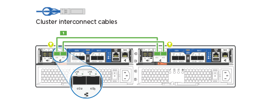
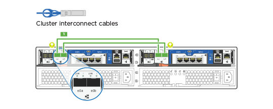
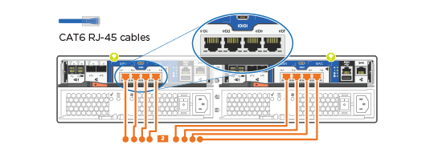

= Guia detalhado - FAS2700
:allow-uri-read: 
:icons: font
:imagesdir: ../media/

[role="lead"]
Esta página fornece instruções detalhadas passo a passo para instalar um sistema NetApp típico. Use este guia se quiser instruções de instalação mais detalhadas.

== Passo 1: Prepare-se para a instalação

Para instalar seu sistema FAS2700, você precisa criar uma conta no site de suporte da NetApp, Registrar seu sistema e obter chaves de licença. Você também precisa fazer o inventário do número e do tipo apropriados de cabos para o seu sistema e coletar informações específicas de rede.

Você precisa ter acesso ao Hardware Universe para obter informações sobre os requisitos do site, bem como informações adicionais sobre o sistema configurado. Você também pode querer ter acesso às Notas de versão da sua versão do ONTAP para obter mais informações sobre este sistema.

https://hwu.netapp.com["NetApp Hardware Universe"]

http://mysupport.netapp.com/documentation/productlibrary/index.html?productID=62286["Encontre as Notas de versão para sua versão do ONTAP 9"]

Você precisa fornecer o seguinte em seu site:

* Espaço em rack para o sistema de armazenamento
* Chave de fendas Phillips nº 2
* Cabos de rede adicionais para conetar seu sistema ao switch de rede e laptop ou console com um navegador da Web
* Um laptop ou console com uma conexão RJ-45 e acesso a um navegador da Web

.Passos
. Desembale o conteúdo de todas as caixas.
. Registre o número de série do sistema nos controladores.
+
image::../media/drw_ssn_label.png[Exemplo de número de série do sistema]

. Configure a sua conta:
+
.. Inicie sessão na sua conta existente ou crie uma conta.
.. Registe o seu sistema.
+
https://mysupport.netapp.com/eservice/registerSNoAction.do?moduleName=RegisterMyProduct["Registro de produto NetApp"]

. Baixe e instale o Config Advisor em seu laptop.
+
https://mysupport.netapp.com/site/tools/tool-eula/activeiq-configadvisor["NetApp Downloads: Config Advisor"]

. Faça um inventário e anote o número e os tipos de cabos que você recebeu.
+
A tabela a seguir identifica os tipos de cabos que você pode receber. Se você receber um cabo não listado na tabela, consulte o Hardware Universe para localizar o cabo e identificar seu uso.

+
https://hwu.netapp.com["NetApp Hardware Universe"]

+
[cols="1,2,1,2"]
|===
| Tipo de cabo... | Número de peça e comprimento | Tipo de conetor | Para... 

 a| 
Cabo de 10 GbE (dependente da ordem)
 a| 
X6566B-05-R6 (112-00297), 0,5m

X6566B-2-R6 (112-00299), 2m
 a| 
image:../media/oie_cable_sfp_gbe_copper.png["Conetor de cobre GbE SFP"]
 a| 
Rede de interconexão de cluster

 a| 
Cabo de 10 GbE (dependente da ordem)
 a| 
Código de peça X6566B-2-R6 (112-00299), 2m

Ou X6566B-3-R6 (112-00300), 3m

X6566B-5-R6 (112-00301), 5m
 a| 
image:../media/oie_cable_sfp_gbe_copper.png["Conetor de cobre GbE SFP"]
 a| 
Dados

 a| 
Cabos de rede ótica (dependendo da ordem)
 a| 
X6553-R6 (112-00188), 2m

X6536-R6 (112-00090), 5m

X6554-R6 (112-00189), 15m
 a| 
image:../media/oie_cable_fiber_lc_connector.png["Conetor de fibra LC"]
 a| 
Rede de host FC

 a| 
Cat 6, RJ-45 (dependente da encomenda)
 a| 
Números de peça X6585-R6 (112-00291), 3m

X6562-R6 (112-00196), 5m
 a| 
image:../media/oie_cable_rj45.png["Conetor do cabo RJ-45"]
 a| 
Rede de gerenciamento e dados Ethernet

 a| 
Armazenamento (dependente da encomenda)
 a| 
Código de peça X66030A (112-00435), 0,5m

X66031A (112-00436), 1m

X66032A (112-00437), 2m

X66033A (112-00438), 3m
 a| 
image:../media/oie_cable_mini_sas_hd_to_mini_sas_hd.png["Conetor mini-SAS para mini-SAS"]
 a| 
Armazenamento

 a| 
Cabo micro-USB da consola
 a| 
Não aplicável
 a| 
image:../media/oie_cable_micro_usb.png["Conetor micro USB"]
 a| 
Conexão de console durante a configuração de software em laptop/console não Windows ou Mac

 a| 
Cabos de alimentação
 a| 
Não aplicável
 a| 
image:../media/oie_cable_power.png["Cabos de alimentação"]
 a| 
Ligar o sistema

|===
. Baixe e complete a Planilha de configuração _Cluster_.
+
https://library.netapp.com/ecm/ecm_download_file/ECMLP2839002["Folha de trabalho de configuração do cluster"]

== Passo 2: Instale o hardware

Você precisa instalar seu sistema em um rack de 4 colunas ou gabinete do sistema NetApp, conforme aplicável.

.Passos
. Instale os kits de calhas, conforme necessário.
. Instale e fixe o seu sistema utilizando as instruções incluídas no kit de calhas.
+

NOTE: Você precisa estar ciente das preocupações de segurança associadas ao peso do sistema.

+
image::../media/drw_oie_fas2700_weight_caution.png[Cuidado com o elevador para duas pessoas]

. Conete os dispositivos de gerenciamento de cabos (como mostrado).
+
image::../media/drw_cable_management_arm_install.png[Anexando dispositivos de gerenciamento de cabos]

. Coloque a moldura na parte frontal do sistema.

== Passo 3: Controladores de cabo para a sua rede

Você pode conetar os controladores à rede usando o método de cluster sem switch de dois nós ou usando a rede de interconexão de cluster.

=== Opção 1: Cabo de um cluster sem switch de dois nós, configuração de rede unificada

A rede de gerenciamento, a rede de dados UTA2 e as portas de gerenciamento nos controladores são conetadas aos switches. As portas de interconexão de cluster são cabeadas em ambos os controladores.

Tem de ter contactado o administrador da rede para obter informações sobre a ligação do sistema aos comutadores.

Certifique-se de que verifica a seta da ilustração para a orientação adequada da presilha de puxar do conetor do cabo.

image::../media/oie_cable_pull_tab_down.png[Conetor de cabo com patilha de puxar na parte inferior]

NOTE: Ao inserir o conetor, você deve senti-lo clicar no lugar; se você não sentir que ele clique, remova-o, vire-o e tente novamente.

.Passos
. Você pode usar o gráfico ou as instruções passo a passo para concluir o cabeamento entre as controladoras e os switches:
+
image::../media/drw_2700_tnsc_unified_network_cabling_animated_gif.png[Cabeamento de cluster sem switch de dois nós em uma configuração de rede unificada]

+
[cols="1,3"]
|===
| Passo | Execute em cada controlador 

 a| 

 a| 
Faça o cabeamento das portas de interconexão de cluster entre si com o cabo de interconexão de cluster:

** e0a a e0a
** e0b a e0b 

 a| 

 a| 
Use um dos seguintes tipos de cabo para enviar as portas de dados UTA2 à rede host:

Um host FC

** 0c e 0d
** *OR* 0e e 0f A 10GbE
** e0c e e0d
** *or* e0e e e0f

NOTE: Você pode conetar um par de portas como CNA e um par de portas como FC, ou pode conetar ambos os pares de portas como CNA ou ambos os pares de portas como FC.

image:../media/drw_c190_u_fc_10gbe_cabling.png["Conexões de porta de dados"]

 a| 
image:../media/icon_square_3_purple.png["Passo 3"]
 a| 
Faça o cabeamento das e0M portas aos switches de rede de gerenciamento com os cabos RJ45:

image:../media/drw_c190_u_mgmt_cabling.png["Cabeamento de porta de gerenciamento"]

 a| 
image:../media/oie_legend_icon_attn_symbol.png["Símbolo de atenção"]
 a| 
NÃO conete os cabos de energia neste momento.

|===
. Para ligar o armazenamento por cabo, consulte <<Etapa 4: Controladores de cabos para compartimentos de unidades>>

=== Opção 2: Cable a switched cluster, configuração de rede unificada

A rede de gerenciamento, a rede de dados UTA2 e as portas de gerenciamento nos controladores são conetadas aos switches. As portas de interconexão de cluster são cabeadas para os switches de interconexão de cluster.

Tem de ter contactado o administrador da rede para obter informações sobre a ligação do sistema aos comutadores.

Certifique-se de que verifica a seta da ilustração para a orientação adequada da presilha de puxar do conetor do cabo.

image::../media/oie_cable_pull_tab_down.png[Conetor de cabo com patilha de puxar na parte inferior]

NOTE: Ao inserir o conetor, você deve senti-lo clicar no lugar; se você não sentir que ele clique, remova-o, vire-o e tente novamente.

.Passos
. Você pode usar o gráfico ou as instruções passo a passo para concluir o cabeamento entre as controladoras e os switches:
+
image::../media/drw_2700_switched_unified_network_cabling_animated_gif.png[Cabeamento de rede unificado de brilho comutado]

+
[cols="1,3"]
|===
| Passo | Execute em cada módulo do controlador 

 a| 

 a| 
Cabo e0a e e0b para os switches de interconexão de cluster com o cabo de interconexão de cluster:

image:../media/drw_c190_u_switched_clust_cbling.png["Cabeamento de interconexão Clusterinterconnect"]

 a| 

 a| 
Use um dos seguintes tipos de cabo para enviar as portas de dados UTA2 à rede host:

Um host FC

** 0c e 0d
** ** ou** 0e e 0f

A 10GbE

** e0c e e0d
** ** ou** e0e e e0f

NOTE: Você pode conetar um par de portas como CNA e um par de portas como FC, ou pode conetar ambos os pares de portas como CNA ou ambos os pares de portas como FC.

image:../media/drw_c190_u_fc_10gbe_cabling.png["Conexões de porta de dados"]

 a| 
image:../media/icon_square_3_purple.png["Passo 3"]
 a| 
Faça o cabeamento das e0M portas aos switches de rede de gerenciamento com os cabos RJ45:

image:../media/drw_c190_u_mgmt_cabling.png["Cabeamento de porta de gerenciamento"]

 a| 
image:../media/oie_legend_icon_attn_symbol.png["Símbolo de atenção"]
 a| 
NÃO conete os cabos de energia neste momento.

|===
. Para ligar o armazenamento por cabo, consulte <<Etapa 4: Controladores de cabos para compartimentos de unidades>>

=== Opção 3: Cable um cluster sem switch de dois nós, configuração de rede Ethernet

A rede de gerenciamento, a rede de dados Ethernet e as portas de gerenciamento nos controladores são conetadas aos switches. As portas de interconexão de cluster são cabeadas em ambos os controladores.

Tem de ter contactado o administrador da rede para obter informações sobre a ligação do sistema aos comutadores.

Certifique-se de que verifica a seta da ilustração para a orientação adequada da presilha de puxar do conetor do cabo.

image::../media/oie_cable_pull_tab_down.png[Conetor de cabo com patilha de puxar na parte inferior]

NOTE: Ao inserir o conetor, você deve senti-lo clicar no lugar; se você não sentir que ele clique, remova-o, vire-o e tente novamente.

.Passos
. Você pode usar o gráfico ou as instruções passo a passo para concluir o cabeamento entre as controladoras e os switches:
+
image::../media/drw_2700_tnsc_ethernet_network_cabling_animated_gif.png[Cabeamento de rede sem switch de dois nós]

+
[cols="1,3"]
|===
| Passo | Execute em cada controlador 

 a| 

 a| 
Faça o cabeamento das portas de interconexão de cluster entre si com o cabo de interconexão de cluster:

** e0a a e0a
** e0b a e0b 

 a| 

 a| 
Use o cabo Cat 6 RJ45 para fazer o cabo das portas e0c a e0f para a rede host:

 a| 
image:../media/icon_square_3_purple.png["Passo 3"]
 a| 
Faça o cabeamento das e0M portas aos switches de rede de gerenciamento com os cabos RJ45:

image:../media/drw_c190_e_mgmt_cbling.png["Cabeamento de porta de gerenciamento"]

 a| 
image:../media/oie_legend_icon_attn_symbol.png["Símbolo de atenção"]
 a| 
NÃO conete os cabos de energia neste momento.

|===
. Para ligar o armazenamento por cabo, consulte <<Etapa 4: Controladores de cabos para compartimentos de unidades>>

=== Opção 4: Cable a switched cluster, configuração de rede Ethernet

A rede de gerenciamento, a rede de dados Ethernet e as portas de gerenciamento nos controladores são conetadas aos switches. As portas de interconexão de cluster são cabeadas para os switches de interconexão de cluster.

Tem de ter contactado o administrador da rede para obter informações sobre a ligação do sistema aos comutadores.

Certifique-se de que verifica a seta da ilustração para a orientação adequada da presilha de puxar do conetor do cabo.

image::../media/oie_cable_pull_tab_down.png[Conetor de cabo com patilha de puxar na parte inferior]

NOTE: Ao inserir o conetor, você deve senti-lo clicar no lugar; se você não sentir que ele clique, remova-o, vire-o e tente novamente.

.Passos
. Você pode usar o gráfico ou as instruções passo a passo para concluir o cabeamento entre as controladoras e os switches:
+
image::../media/drw_2700_switched_ethernet_network_cabling_animated_gif.png[Cabeamento Ethernet comutado]

+
[cols="1,2"]
|===
| Passo | Execute em cada módulo do controlador 

 a| 

 a| 
Cabo e0a e e0b para os switches de interconexão de cluster com o cabo de interconexão de cluster:

image:../media/drw_c190_e_switched_clust_cbling.png["Cabeamento de interconexão de cluster"]

 a| 

 a| 
Use o cabo Cat 6 RJ45 para fazer o cabo das portas e0c a e0f para a rede host:

 a| 
image:../media/icon_square_3_purple.png["Passo 3"]
 a| 
Faça o cabeamento das e0M portas aos switches de rede de gerenciamento com os cabos RJ45:

image:../media/drw_c190_e_mgmt_cbling.png["Cabeamento de porta de gerenciamento"]

 a| 
image:../media/oie_legend_icon_attn_symbol.png["Símbolo de atenção"]
 a| 
NÃO conete os cabos de energia neste momento.

|===
. Para ligar o armazenamento por cabo, consulte <<Etapa 4: Controladores de cabos para compartimentos de unidades>>

== Etapa 4: Controladores de cabos para compartimentos de unidades

Você precisa vincular os controladores às gavetas usando as portas de storage integradas. A NetApp recomenda cabeamento MP-HA para sistemas com storage externo. Se você tiver uma unidade de fita SAS, poderá usar cabeamento de caminho único. Se você não tiver gavetas externas, o cabeamento MP-HA para unidades internas será opcional (não exibido) se os cabos SAS forem solicitados com o sistema.

.Antes de começar
* É necessário fazer o cabeamento das conexões de gaveta a gaveta e, em seguida, fazer o cabeamento das duas controladoras às gavetas de unidades.
* Certifique-se de que verifica a seta da ilustração para a orientação adequada da presilha de puxar do conetor do cabo.

image::../media/oie_cable_pull_tab_down.png[Conetor de cabo com patilha de puxar na parte inferior]

.Passos
. Faça o par de HA com compartimentos de unidade externos:
+

NOTE: O exemplo usa DS224C. O cabeamento é semelhante a outras gavetas de unidade compatíveis.

+
image::../media/drw_2700_ha_storage_cabling_animated_gif.png[Cabeamento de gaveta em um par de HA]

+
[cols="1,3"]
|===
| Passo | Execute em cada controlador 

 a| 
image:../media/icon_square_1_blue.png["Legenda número 1"]
 a| 
Faça o cabeamento das portas de prateleira a prateleira.

** A porta 3 da IOM a à porta 1 da IOM A na gaveta diretamente abaixo.
** Porta 3 na IOM B para a porta 1 na IOM B na gaveta diretamente abaixo.
+
image:../media/oie_cable_mini_sas_hd_to_mini_sas_hd.png["Conetor mini-SAS para mini-SAS"] Cabos HD mini-SAS HD para mini-SAS HD

 a| 
image:../media/icon_square_2_yellow.png["Passo 2"]
 a| 
Conecte cada nó à IOM A na stack.

** Controladora 1 porta 0b a IOM A porta 3 na última gaveta de unidades na stack.
** Controlador 2 porta 0a para IOM A porta 1 na primeira gaveta de unidades na stack.
+
image:../media/oie_cable_mini_sas_hd_to_mini_sas_hd.png["Conetor mini-SAS para mini-SAS"] Cabos HD mini-SAS HD para mini-SAS HD

 a| 
image:../media/icon_square_3_tourquoise.png["Passo 3"]
 a| 
Conectar cada nó à IOM B na stack

** Controladora 1 porta 0a a porta IOM B 1 na primeira gaveta de unidades na stack.
** Controladora 2 porta 0b a porta IOM B 3 na última gaveta de unidades na stack.

image:../media/oie_cable_mini_sas_hd_to_mini_sas_hd.png["Conetor mini-SAS para mini-SAS"] Cabos HD mini-SAS HD para mini-SAS HD

|===

NOTE: Para obter mais informações sobre cabeamento SAS e planilhas, consulte link:../sas3/overview-cabling-rules-examples.html["Visão geral das regras de cabeamento SAS, planilhas e exemplos - prateleiras com IOM12 módulos"]

. Para concluir a configuração do sistema, consulte <<Passo 5: Conclua a configuração e configuração do sistema>>

== Passo 5: Conclua a configuração e configuração do sistema

Você pode concluir a configuração e configuração do sistema usando a descoberta de cluster com apenas uma conexão com o switch e laptop, ou conetando-se diretamente a um controlador no sistema e, em seguida, conetando-se ao switch de gerenciamento.

=== Opção 1: Conclua a configuração do sistema se a deteção de rede estiver ativada

Se tiver a deteção de rede ativada no seu computador portátil, pode concluir a configuração e configuração do sistema utilizando a deteção automática de cluster.

.Passos
. Use a animação a seguir para definir uma ou mais IDs de gaveta de unidade
+
.Animação - Definir IDs do compartimento da unidade
video::c600f366-4d30-481a-89d9-ab1b0066589b[panopto]
. Conete os cabos de alimentação às fontes de alimentação do controlador e, em seguida, conete-os a fontes de alimentação em diferentes circuitos.
. Ligue os interruptores de energia para ambos os nós.
+
image::../media/drw_turn_on_power_switches_to_psus.png[Ligar a alimentação]

+

NOTE: A inicialização inicial pode levar até oito minutos.

. Certifique-se de que o seu computador portátil tem a deteção de rede ativada.
+
Consulte a ajuda online do seu computador portátil para obter mais informações.

. Use a animação a seguir para conetar seu laptop ao switch de gerenciamento.
+
.Animação - Conete seu laptop ao interrutor de gerenciamento
video::d61f983e-f911-4b76-8b3a-ab1b0066909b[panopto]
. Selecione um ícone ONTAP listado para descobrir:
+
ficheiro:drw_autoDiscovery_controler_Select_ieops-1849.svg[Selecionar um ícone ONTAP]

+
.. Abra o Explorador de ficheiros.
.. Clique em *rede* no painel esquerdo e clique com o botão direito do rato e selecione *atualizar*.
.. Clique duas vezes no ícone ONTAP e aceite quaisquer certificados exibidos na tela.
+

NOTE: XXXXX é o número de série do sistema para o nó de destino.

+
O System Manager é aberto.

. Use a configuração guiada pelo Gerenciador de sistema para configurar o sistema usando os dados coletados no _Guia de configuração do NetApp ONTAP_.
+
https://library.netapp.com/ecm/ecm_download_file/ECMLP2862613["Guia de configuração do ONTAP"]

. Verifique a integridade do sistema executando o Config Advisor.
. Depois de concluir a configuração inicial, vá para para https://docs.netapp.com/us-en/ontap/index.html["Documentação do ONTAP 9"^] para obter informações sobre como configurar recursos adicionais no ONTAP.

=== Opção 2: Concluir a configuração e a configuração do sistema se a deteção de rede não estiver ativada

Se a deteção de rede não estiver ativada no seu computador portátil, tem de concluir a configuração e a configuração utilizando esta tarefa.

.Passos
. Faça o cabo e configure o seu laptop ou console:
+
.. Defina a porta de console no laptop ou console para 115.200 baud com N-8-1.
+

NOTE: Consulte a ajuda on-line do seu laptop ou console para saber como configurar a porta do console.

.. Conete o cabo do console ao laptop ou console e conete a porta do console no controle usando o cabo do console fornecido com o sistema.
+
image::../media/drw_console_connect_fas2700_affa200.png[Conexão à porta do console]

.. Conete o laptop ou o console ao switch na sub-rede de gerenciamento.
+
image::../media/drw_client_to_mgmt_subnet_fas2700_affa220.png[Ligar à sub-rede de gestão]

.. Atribua um endereço TCP/IP ao laptop ou console, usando um que esteja na sub-rede de gerenciamento.

. Use a animação a seguir para definir uma ou mais IDs de gaveta de unidade:
+
.Animação - Definir IDs do compartimento da unidade
video::c600f366-4d30-481a-89d9-ab1b0066589b[panopto]
. Conete os cabos de alimentação às fontes de alimentação do controlador e, em seguida, conete-os a fontes de alimentação em diferentes circuitos.
. Ligue os interruptores de energia para ambos os nós.
+
image::../media/drw_turn_on_power_switches_to_psus.png[Ligar a alimentação]

+

NOTE: A inicialização inicial pode levar até oito minutos.

. Atribua um endereço IP de gerenciamento de nó inicial a um dos nós.
+
[cols="1-3"]
|===
| Se a rede de gestão tiver DHCP... | Então... 

 a| 
Configurado
 a| 
Registre o endereço IP atribuído aos novos controladores.

 a| 
Não configurado
 a| 
.. Abra uma sessão de console usando PuTTY, um servidor de terminal ou o equivalente para o seu ambiente.
+

NOTE: Verifique a ajuda on-line do seu laptop ou console se você não sabe como configurar o PuTTY.

.. Insira o endereço IP de gerenciamento quando solicitado pelo script.

|===
. Usando o System Manager em seu laptop ou console, configure seu cluster:
+
.. Aponte seu navegador para o endereço IP de gerenciamento de nó.
+

NOTE: O formato para o endereço é https://x.x.x.x.+

.. Configure o sistema usando os dados coletados no _NetApp ONTAP Configuration Guide_.
+
https://library.netapp.com/ecm/ecm_download_file/ECMLP2862613["Guia de configuração do ONTAP"]

. Verifique a integridade do sistema executando o Config Advisor.
. Depois de concluir a configuração inicial, vá para para https://docs.netapp.com/us-en/ontap/index.html["Documentação do ONTAP 9"^] para obter informações sobre como configurar recursos adicionais no ONTAP.

