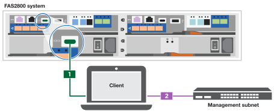

= Passos detalhados - FAS2800
:allow-uri-read: 
:icons: font
:imagesdir: ../media/

[role="lead"]
Este procedimento fornece instruções detalhadas passo a passo para a instalação de um sistema de armazenamento NetApp típico. Use este procedimento se desejar instruções de instalação mais detalhadas.

== Passo 1: Prepare-se para a instalação

.Antes de começar
Você precisa fornecer o seguinte em seu site:

* Espaço em rack para o sistema de armazenamento em um rack de telecomunicações ou gabinete do sistema.
+
** 2U para o sistema de armazenamento
** 2U TB ou 4U TB para cada compartimento de unidade no sistema

* Chave de fendas Phillips nº 2
* Cabos de rede adicionais para conetar seu sistema de armazenamento ao switch de rede e laptop ou console com um navegador da Web
* Um laptop ou console com uma conexão RJ-45 e acesso a um navegador da Web
+
** Acesso ao https://hwu.netapp.com["NetApp Hardware Universe"] para obter informações sobre os requisitos do local, bem como informações adicionais sobre o sistema de armazenamento configurado.
** Você também pode querer ter acesso ao http://mysupport.netapp.com/documentation/productlibrary/index.html?productID=62286["Notas de versão para a sua versão do ONTAP 9"] para sua versão do ONTAP para obter mais informações sobre esse sistema de storage.

.Passos
. Desembale todas as caixas e faça o inventário do conteúdo.
+

IMPORTANT: Os clientes com requisitos de energia específicos devem verificar https://hwu.netapp.com["NetApp Hardware Universe"] as suas opções de configuração.

. Aceda ao https://docs.netapp.com/us-en/ontap/task_configure_ontap.html#assign-a-node-management-ip-address["Configure o ONTAP em um novo cluster com o Gerenciador do sistema"^]
+
.. Revise os requisitos da amd procedimentos passos.
.. Reúna informações sobre o seu sistema de armazenamento completando o https://docs.netapp.com/us-en/ontap/task_configure_ontap.html["Planilha de configuração (precisa de URL para a Planilha)"].
.. Registre o número de série do sistema de armazenamento dos controladores.
+
image::../media/drw_ssn_label.svg[Exemplo de número de série do sistema]

A tabela a seguir identifica os tipos de cabos que você pode receber. Se receber um cabo não listado na tabela, consulte https://hwu.netapp.com["NetApp Hardware Universe"] para localizar o cabo e identificar a respetiva utilização.

[cols="1,2,1,2"]
|===
| Tipo de cabo... | Número de peça e comprimento | Tipo de conetor | Para... 

 a| 
10 GbE, cabo SFP28 (dependente da ordem)
 a| 
X6566B-05-R6, .5,

X6566B-2-R6, 2m
 a| 
image::../media/oie_cable_sfp_gbe_copper.png[Conetor de cobre GbE SFP]
 a| 
Cabo de rede

 a| 
25GB Ethernet, SFP28
 a| 
X66240A-05, .5m

X66240-2, 2m

X66240A-5, 5m
 a| 
image::../media/oie_cable_25Gb_Ethernet_SFP28_IEOPS-1069.svg[Cabo oie 25GB Ethernet SFP28 IEOPS 1069]
 a| 
Cabo de rede

 a| 
32GB Fibre Channel, SFP (alvo/iniciador)
 a| 
X66250-2, 2m

X66250-5, 5m

X66250-15, 15m
 a| 
image::../media/oie_cable_sfp_gbe_copper.png[Conetor de cobre GbE SFP]
 a| 
Rede FC

 a| 
Cat 6, RJ-45 (dependente da encomenda)
 a| 
X6561-R6

X6562-R6
 a| 
image::../media/oie_cable_rj45.png[Cabos RJ-45]
 a| 
Rede de gerenciamento e dados Ethernet

 a| 
Armazenamento
 a| 
X66030A, 0,5m

X66031A, 1m

X66032A, 2m
 a| 
image::../media/oie_cable_mini_sas_hd_to_mini_sas_hd.svg[cabo oie mini sas hd para mini sas hd]
 a| 
Armazenamento

 a| 
Cabo da consola USB-C.
 a| 
Nenhuma etiqueta de número de peça
 a| 
image::../media/oie_cable_micro_usb.png[Conetor micro USB]
 a| 
Conexão de console durante a configuração de software em laptop/console não Windows ou Mac

 a| 
Cabos de alimentação
 a| 
Nenhuma etiqueta de número de peça
 a| 
image::../media/oie_cable_power.png[alimentação do cabo oie]
 a| 
Ligar o sistema de armazenamento

 a| 
Cabo FC opcional
 a| 
Cabo FC opcional
 a| 
image::../media/oie_cable_fiber_lc_connector.png[Conetor de fibra LC]
 a| 
Cabo de rede FC adicional

|===

== Passo 2: Instale o hardware

Instale o sistema de armazenamento em um rack de telecomunicações ou gabinete do sistema de armazenamento NetApp, conforme aplicável.

.Passos
. Instale os kits de calhas, conforme necessário.
. Instale e fixe o seu sistema de armazenamento utilizando as instruções incluídas no kit de calhas.
+

NOTE: Você precisa estar ciente das preocupações de segurança associadas ao peso do sistema de armazenamento.

+
image::../media/oie_fas2800_weight_caution_IEOPS-1070.svg[oie fas2800 cuidado de peso IEOPS 1070]

. Conete os dispositivos de gerenciamento de cabos (como mostrado).
+
image::../media/drw_cable_management_arm_install.svg[instalação do ARM de gerenciamento de cabos drw]

. Coloque a moldura na parte frontal do sistema de armazenamento.

== Passo 3: Controladores de cabo para a sua rede

Encaminhe os controladores para a rede como um cluster sem switch de dois nós ou um cluster comutado.

A tabela a seguir identifica o tipo de cabo com o número de chamada e a cor do cabo nas ilustrações para cluster sem switch de dois nós e cluster comutado.

[cols="20%,80%"]
|===
| Cabeamento | Tipo de ligação 

 a| 
image::../media/icon_square_1_green.png[Legenda número 3]]
 a| 
Interconexão de cluster

 a| 

 a| 
Switch de rede de gerenciamento

 a| 
image::../media/icon_square_3_orange.png[Legenda número 3]
 a| 
Switches de rede de host

|===
.Antes de começar
* Contacte o administrador da rede para obter informações sobre como ligar o sistema de armazenamento aos comutadores.
* Verifique a seta da ilustração para a orientação adequada da presilha do conetor do cabo.
+
** Ao inserir o conetor, você deve senti-lo clicar no lugar; se você não sentir que ele clique, remova-o, vire a cabeça do cabo e tente novamente.
** Se estiver conetando a um switch ótico, insira o SFP na porta do controlador antes de fazer o cabeamento para a porta.

image::../media/oie_cable_pull_tab_down.png[Puxe a direção da patilha]

[role="tabbed-block"]
====
.Opção 1: Cabo de um cluster sem switch de dois nós
--
Faça o cabeamento das conexões de rede e das portas de interconexão de cluster para um cluster sem switch de dois nós.

.Sobre esta tarefa
Use a animação ou as instruções passo a passo para concluir o cabeamento entre os controladores e os switches.

.Animação - cabeamento de um cabeamento de cluster sem switch de dois nós
video::90577508-fa79-46cf-b18a-afe8016325af[panopto]
.Passos
. Cable as portas de interconexão de cluster e0a a e0a e e0b a e0b com o cabo de interconexão de cluster:
+
image::../media/oie_cable_25Gb_Ethernet_SFP28_IEOPS-1069.svg[Cabo oie 25GB Ethernet SFP28 IEOPS 1069]

+
*Cabos de interconexão de cluster*

+
image::../media/drw_2800_tnsc_cluster_cabling_IEOPS-892.svg[Cabeamento de cluster drw 2800 tnsc IEOPS 892]

. Faça o cabeamento das e0M portas aos switches de rede de gerenciamento com os cabos RJ45:
+
image::../media/oie_cable_rj45.png[Cabos RJ-45]

+
*RJ45 cabos*

+
image::../media/drw_2800_management_connection_IEOPS-1077.svg[Conexão de gerenciamento drw 2800 IEOPS 1077]

. Faça o cabeamento das portas da placa mezzanine à rede host.
+
image::../media/drw_2800_network_cabling_IEOPS-894.svg[Cabeamento de rede drw 2800 IEOPS 894]

+
.. Se você tiver uma rede de dados Ethernet de 4 portas, as portas de cabo de e1a a e1d para sua rede de dados Ethernet.
+
*** 4 portas, Ethernet 10/25GB GbE, SFP28
+
image::../media/oie_cable_sfp_gbe_copper.png[Conetor de cobre GbE SFP]

+
image::../media/oie_cable_25Gb_Ethernet_SFP28_IEOPS-1069.svg[Cabo oie 25GB Ethernet SFP28 IEOPS 1069]

*** 4 PORTAS, 10GBASEBASE-T, RJ45
+
image::../media/oie_cable_rj45.png[Cabos RJ-45]

.. Se você tiver uma rede de dados de canal de fibra de 4 portas, as portas de cabo de 1a a 1D para sua rede FC.
+
*** 4 portas, Canal de fibra de 32GB GbE, SFP (somente destino)
+
image::../media/oie_cable_sfp_gbe_copper.png[Conetor de cobre GbE SFP]

*** 4 portas, 32GB Fibre Channel, SFP (iniciador/destino)
+
image::../media/oie_cable_sfp_gbe_copper.png[Conetor de cobre GbE SFP]

.. Se você tiver uma placa 2 mais 2 (2 portas com conexões Ethernet e 2 portas com conexões Fibre Channel), as portas de cabo e1a e e1b para sua rede de dados FC e as portas E1C e e1d para sua rede de dados Ethernet.
+
*** Ethernet de 2 portas, 10/25GB GB (SFP28 GbE) e FC de 2 portas de 32GB GB (SFP)
+
image::../media/oie_cable_sfp_gbe_copper.png[Conetor de cobre GbE SFP]

+
image::../media/oie_cable_sfp_gbe_copper.png[Conetor de cobre GbE SFP]

IMPORTANT: Não ligue os cabos de alimentação.

--
.Opção 2: Conjunto comutado por cabo a
--
Faça o cabeamento das suas conexões de rede e das portas de interconexão de cluster para um cluster comutado.

.Sobre esta tarefa
Use a animação ou as instruções passo a passo para concluir o cabeamento entre os controladores e os switches.

.Animação - cabeamento de cluster comutado
video::6553a3db-57dd-4247-b34a-afe8016315d4[panopto]
.Passos
. Cable as portas de interconexão de cluster e0a a e0a e e0b a e0b com o cabo de interconexão de cluster:
+
image::../media/oie_cable_25Gb_Ethernet_SFP28_IEOPS-1069.svg[Cabo oie 25GB Ethernet SFP28 IEOPS 1069]

+
image::../media/drw_2800_switched_cluster_cabling_IEOPS-893.svg[Cabeamento de cluster comutado drw 2800 IEOPS 893]

. Faça o cabeamento das e0M portas aos switches de rede de gerenciamento com os cabos RJ45:
+
image::../media/oie_cable_rj45.png[Cabos RJ-45]

+
image::../media/drw_2800_management_connection_IEOPS-1077.svg[Conexão de gerenciamento drw 2800 IEOPS 1077]

. Faça o cabeamento das portas da placa mezzanine à rede host.
+
image::../media/drw_2800_network_cabling_IEOPS-894.svg[Cabeamento de rede drw 2800 IEOPS 894]

+
.. Se você tiver uma rede de dados Ethernet de 4 portas, as portas de cabo de e1a a e1d para sua rede de dados Ethernet.
+
*** 4 portas, Ethernet 10/25GB GbE, SFP28
+
image::../media/oie_cable_sfp_gbe_copper.png[Conetor de cobre GbE SFP]

+
image::../media/oie_cable_25Gb_Ethernet_SFP28_IEOPS-1069.svg[Cabo oie 25GB Ethernet SFP28 IEOPS 1069]

*** 4 PORTAS, 10GBASEBASE-T, RJ45
+
image::../media/oie_cable_rj45.png[Cabos RJ-45]

.. Se você tiver uma rede de dados de canal de fibra de 4 portas, as portas de cabo de 1a a 1D para sua rede FC.
+
*** 4 portas, Canal de fibra de 32GB GbE, SFP (somente destino)
+
image::../media/oie_cable_sfp_gbe_copper.png[Conetor de cobre GbE SFP]

*** 4 portas, 32GB Fibre Channel, SFP (iniciador/destino)
+
image::../media/oie_cable_sfp_gbe_copper.png[Conetor de cobre GbE SFP]

.. Se você tiver uma placa 2 mais 2 (2 portas com conexões Ethernet e 2 portas com conexões Fibre Channel), as portas de cabo e1a e e1b para sua rede de dados FC e as portas E1C e e1d para sua rede de dados Ethernet.
+
*** Ethernet de 2 portas, 10/25GB GB (SFP28 GbE) e FC de 2 portas de 32GB GB (SFP)
+
image::../media/oie_cable_sfp_gbe_copper.png[Conetor de cobre GbE SFP]

+
image::../media/oie_cable_sfp_gbe_copper.png[Conetor de cobre GbE SFP]

IMPORTANT: Não ligue os cabos de alimentação.

--
====

== Etapa 4: Controladores de cabos para compartimentos de unidades

Conete seus controladores ao armazenamento externo.

A tabela a seguir identifica o tipo de cabo com o número de chamada e a cor do cabo nas ilustrações para fazer o cabeamento das prateleiras de unidades para o sistema de armazenamento.

NOTE: O exemplo usa DS224C. O cabeamento é semelhante a outras gavetas de unidade compatíveis. Consulte link:../sas3/install-new-system.html["Instale e as gavetas de cabos para uma nova instalação do sistema - prateleiras com módulos IOM12/IOM12B"] para obter mais informações.

[cols="20%,80%"]
|===
| Cabeamento | Tipo de ligação 

 a| 
image::../media/icon_square_1_yellow.png[Ícone de legenda 1]
 a| 
Cabeamento de prateleira a prateleira

 a| 
image::../media/icon_square_2_blue.png[Ícone de legenda 2]
 a| 
Controladora A para as gavetas de unidades

 a| 
image::../media/icon_square_3_tourquoise.png[Ícone de legenda 3]
 a| 
Controlador B para as gavetas de unidades

|===
Certifique-se de que verifica a seta da ilustração para a orientação adequada da presilha de puxar do conetor do cabo.

image::../media/oie_cable_pull_tab_down.png[Puxe a direção da patilha]

.Sobre esta tarefa
Use a animação ou as instruções passo a passo para concluir o cabeamento entre as controladoras e os compartimentos de unidades.

IMPORTANT: Não use a porta 0B2 em um FAS2800. Esta porta SAS não é utilizada pelo ONTAP e está sempre desativada. Consulte link:../sas3/install-new-system.html["Instalar uma gaveta em um novo sistema de storage"^] para obter mais informações.

.Animação - cabeamento do compartimento de unidade
video::b2a7549d-8141-47dc-9e20-afe8016f4386[panopto]
.Passos
. Faça o cabeamento das portas de prateleira a prateleira.
+
.. A porta 1 da IOM a à porta 3 da IOM A na gaveta diretamente abaixo.
.. Porta 1 na IOM B para a porta 3 na IOM B na gaveta diretamente abaixo.
+
image::../media/oie_cable_mini_sas_hd_to_mini_sas_hd.svg[cabo oie mini sas hd para mini sas hd]

+
*Cabos HD mini-SAS HD para mini-SAS HD*

+
image::../media/drw_2800_shelf-to-shelf_cabling_IEOPS-895.svg[Cabeamento de gaveta para gaveta drw 2800 IEOPS 895]

. Controlador de cabos A às gavetas de unidades.
+
.. Controladora A porta 0a a IOM B porta 1 na primeira gaveta de unidades na stack.
.. Controladora A porta 0b1 para IOM A porta 3 na última gaveta de unidades na stack.
+
image::../media/oie_cable_mini_sas_hd_to_mini_sas_hd.svg[cabo oie mini sas hd para mini sas hd]

+
*Cabos HD mini-SAS HD para mini-SAS HD*

+
image::../media/dwr-2800_controller1-to shelves_IEOPS-896.svg[dwr 2800 controller1 para compartimentos IEOPS 896]

. Conecte o controlador B às gavetas de unidades.
+
.. Controladora B porta 0a a IOM A porta 1 na primeira gaveta de unidades na stack.
.. Porta 0B1 da controladora B para porta IOM B 3 na última gaveta de unidades na stack.
+
image::../media/oie_cable_mini_sas_hd_to_mini_sas_hd.svg[cabo oie mini sas hd para mini sas hd]

+
*Cabos HD mini-SAS HD para mini-SAS HD*

+
image::../media/dwr-2800_controller2-to shelves_IEOPS-897.svg[dwr 2800 controller2 para compartimentos IEOPS 897]

== Passo 5: Conclua a configuração e configuração do sistema de armazenamento

Conclua a configuração e a configuração do sistema de armazenamento usando a opção 1: Se a deteção de rede estiver ativada ou a opção 2: Se a deteção de rede não estiver ativada.

[role="tabbed-block"]
====
.Opção 1: Se a deteção de rede estiver ativada
--
Se a deteção de rede estiver ativada no seu computador portátil, conclua a configuração e configuração do sistema de armazenamento utilizando a deteção automática de cluster.

.Passos
. Use a animação a seguir para ativar a energia do compartimento e definir IDs de gaveta.
+
.Animação - Definir IDs do compartimento da unidade
video::c600f366-4d30-481a-89d9-ab1b0066589b[panopto]
. Ligue os controladores
+
.. Conete os cabos de alimentação às fontes de alimentação do controlador e, em seguida, conete-os a fontes de alimentação em diferentes circuitos.
.. Ligue os interruptores de energia para ambos os nós.
+

NOTE: A inicialização inicial pode levar até oito minutos.

+
image::../media/dwr_2800_turn_on_power_IEOPS-898.svg[dwr 2800 Ligue a alimentação IEOPS 898]

. Certifique-se de que o seu computador portátil tem a deteção de rede ativada.
+
Consulte a ajuda online do seu computador portátil para obter mais informações.

. Ligue o seu computador portátil ao interrutor de gestão.
. Use o gráfico ou as etapas para descobrir o nó do sistema de armazenamento a ser configurado:
+
image::../media/drw_autodiscovery_controler_select.svg[seleção do controlador de deteção automática drw]

+
.. Abra o Explorador de ficheiros.
.. Clique em rede no painel esquerdo.
.. Clique com o botão direito do rato e selecione Atualizar.
.. Clique duas vezes no ícone ONTAP e aceite quaisquer certificados exibidos na tela.
+

NOTE: XXXXX é o número de série do sistema de armazenamento para o nó de destino.

+
O System Manager é aberto.

. Use a configuração guiada do System Manager para configurar o sistema de armazenamento usando os dados coletados <<Passo 1: Prepare-se para a instalação>>no .
. Crie uma conta ou inicie sessão na sua conta.
+
.. Clique em https://mysupport.netapp.com["mysupport.NetApp.com"]
.. Clique em _criar conta_ se precisar criar uma conta ou fazer login na sua conta.

. Baixe e instale https://mysupport.netapp.com/site/tools["Active IQ Config Advisor"]
+
.. Verifique a integridade do sistema de storage executando o Active IQ Config Advisor.

. Registe o seu sistema em https://mysupport.netapp.com/site/systems/register[].
. Depois de concluir a configuração inicial, vá para a https://www.netapp.com/support-and-training/documentation/["Recursos do NetApp ONTAP"] página para obter informações sobre como configurar recursos adicionais no ONTAP.

--
.Opção 2: Se a deteção de rede não estiver ativada
--
Se a deteção de rede não estiver ativada no computador portátil, conclua manualmente a configuração e a configuração.

.Passos
. Faça o cabo e configure o seu laptop ou console:
+
.. Defina a porta de console no laptop ou console para 115.200 baud com N-8-1.
+

NOTE: Consulte a ajuda on-line do seu laptop ou console para saber como configurar a porta do console.

.. Conete o cabo do console ao laptop ou console e conete a porta do console no controlador usando o cabo do console fornecido com o sistema de armazenamento e, em seguida, cConete o laptop ou o console ao switch na sub-rede de gerenciamento.
+

.. Atribua um endereço TCP/IP ao laptop ou console, usando um que esteja na sub-rede de gerenciamento.

. Use a animação a seguir para definir uma ou mais IDs de gaveta de unidade:
+
.Animação - Definir IDs do compartimento da unidade
video::c600f366-4d30-481a-89d9-ab1b0066589b[panopto]
. Conete os cabos de alimentação às fontes de alimentação do controlador e, em seguida, conete-os a fontes de alimentação em diferentes circuitos.
. Ligue os interruptores de energia para ambos os nós.
+
image::../media/dwr_2800_turn_on_power_IEOPS-898.svg[dwr 2800 Ligue a alimentação IEOPS 898]

+

NOTE: A inicialização inicial pode levar até oito minutos.

. Atribua um endereço IP de gerenciamento de nó inicial a um dos nós.
+
[cols="20%,80%"]
|===
| Se a rede de gestão tiver DHCP... | Então... 

 a| 
Configurado
 a| 
Registre o endereço IP atribuído aos novos controladores.

 a| 
Não configurado
 a| 
.. Abra uma sessão de console usando PuTTY, um servidor de terminal ou o equivalente para o seu ambiente.
+

NOTE: Verifique a ajuda on-line do seu laptop ou console se você não sabe como configurar o PuTTY.

.. Insira o endereço IP de gerenciamento quando solicitado pelo script.

|===
. Usando o System Manager em seu laptop ou console, configure seu cluster:
+
.. Aponte seu navegador para o endereço IP de gerenciamento de nó.
+

NOTE: O formato para o endereço é https://x.x.x.x.+

.. Configure o sistema de armazenamento usando os dados coletados em <<Passo 1: Prepare-se para a instalação>>..

. Crie uma conta ou inicie sessão na sua conta.
+
.. Clique em https://mysupport.netapp.com["mysupport.NetApp.com"]
.. Clique em _criar conta_ se precisar criar uma conta ou fazer login na sua conta.

. Baixe e instale https://mysupport.netapp.com/site/tools["Active IQ Config Advisor"]
+
.. Verifique a integridade do sistema de storage executando o Active IQ Config Advisor.

. Registe o seu sistema em https://mysupport.netapp.com/site/systems/register[].
. Depois de concluir a configuração inicial, vá para a https://www.netapp.com/support-and-training/documentation/["Recursos do NetApp ONTAP"] página para obter informações sobre como configurar recursos adicionais no ONTAP.

--
====