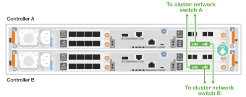
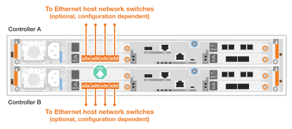
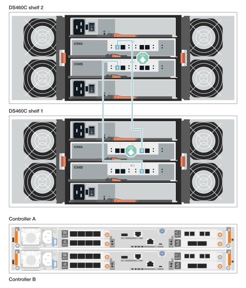
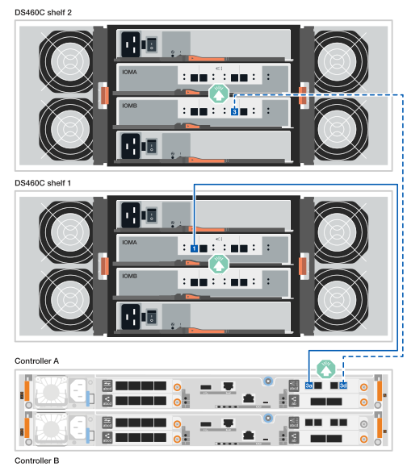

= Cable the hardware - FAS50
:allow-uri-read: 
:icons: font
:imagesdir: ../media/

[role="lead"]
Depois de instalar o hardware do sistema de storage FAS50, faça o cabeamento das controladoras à rede e às gavetas.

.Antes de começar
Contacte o administrador da rede para obter informações sobre como ligar o sistema de armazenamento aos comutadores de rede.

.Sobre esta tarefa
* Os procedimentos de cabeamento de rede de cluster/HA e host mostram configurações comuns. Tenha em mente que o cabeamento específico depende dos componentes solicitados para o seu sistema de armazenamento. Para obter detalhes abrangentes de configuração e prioridade de slot, link:https://hwu.netapp.com["NetApp Hardware Universe"^]consulte .
* Os gráficos de cabeamento têm ícones de seta mostrando a orientação adequada (para cima ou para baixo) da aba de puxar do conetor do cabo ao inserir um conetor em uma porta.
+
Ao inserir o conetor, você deve sentir que ele clique no lugar; se você não sentir que ele clique, remova-o, vire-o e tente novamente.

+
image:../media/drw_cable_pull_tab_direction_ieops-1699.svg["Direção da patilha de puxar do cabo"]

* Se o cabeamento de um switch ótico for feito, insira o transcetor ótico na porta da controladora antes de fazer o cabeamento da porta do switch.

== Etapa 1: Faça o cabeamento das conexões cluster/HA

Faça o cabeamento dos controladores para criar as conexões do cluster ONTAP.

[role="tabbed-block"]
====
.Cabeamento de cluster sem switch
--
.FAS50 com um módulo de e/S de 40/100 GbE de 2 portas
[%collapsible]
=====
.Passos
. Cable as conexões de interconexão cluster/HA:
+

NOTE: O tráfego de interconexão de cluster e o tráfego de HA compartilham as mesmas portas físicas (no módulo de e/S no slot 4). As portas são de 40/100 GbE.

+
.. Controlador de cabo A porta e4a para a porta e4a do controlador B.
.. Controlador de cabo A porta e4b para a porta e4b do controlador B.
+
*Cabos de interconexão de cluster/HA de 100 GbE*

+
image::../media/oie_cable100_gbe_qsfp28.png[Cabo de cluster HA de 100 GbE]

+
image::../media/drw_isi_fas50_switchless_2p_100gbe_cabling_ieops-1937.svg[diagrama de cabeamento de cluster sem switch de fas50 gbe usando um módulo de e/s de 100gbe gbe]

=====
--
.Cabeamento de cluster comutado
--
.FAS50 com um módulo de e/S de 40/100 GbE de 2 portas
[%collapsible]
=====
. Faça o cabo dos controladores para os switches de rede do cluster:
+

NOTE: O tráfego de interconexão de cluster e o tráfego de HA compartilham as mesmas portas físicas (no módulo de e/S no slot 4). As portas são de 40/100 GbE.

+
.. Controlador de cabo A porta e4a para o switch de rede do cluster A..
.. Controlador de cabo A porta e4b para o switch de rede do cluster B.
.. Porta e4a do controlador de cabo B para o switch de rede do cluster A..
.. Porta e4b do controlador de cabo B para o switch de rede do cluster B.
+
*Cabos de interconexão de cluster/HA de 40/100 GbE*

+
image::../media/oie_cable100_gbe_qsfp28.png[Cabo de cluster HA de 40/100 GbE]

+

=====
--
====

== Etapa 2: Faça o cabeamento das conexões de rede do host

Faça o cabeamento das controladoras à rede de host Ethernet ou FC.

[role="tabbed-block"]
====
.Cabeamento de host Ethernet
--
.FAS50 com um módulo de e/S de 10/25 GbE de 4 portas
[%collapsible]
=====
.Passos
. Em cada controlador, as portas de cabo E2A, E2B, E2C e e2D para os switches de rede de host Ethernet.
+
*Cabos de 10/25 GbE*

+
image:../media/oie_cable_sfp_gbe_copper.png["Conetor de cobre GbE SFP, largura de 100px mm"]

+

=====
--
.Cabeamento de host FC
--
.FAS50 com um módulo de e/S FC de 4 portas de 64 GB/s.
[%collapsible]
=====
.Passos
. Em cada controladora, cable as portas 1a, 1b, 1c e 1D para os switches de rede de host FC.
+
*Cabos FC de 64 GB/s*

+
image:../media/oie_cable_sfp_gbe_copper.png["Cabo fc de 64 GB, largura de 100px mm"]

+
image::../media/drw_isi_fas50_4p_64gb_fc_optional_cabling_ieops-1935.svg[Cabo para switches de rede host 64GB fc]

=====
--
====

== Passo 3: Faça o cabeamento das conexões de rede de gerenciamento

Ligue os controladores à rede de gestão.

. Cable as portas de gerenciamento (chave inglesa) em cada controlador para os switches de rede de gerenciamento.
+
*CABOS RJ-45 DE 1000BASEBASE-T*

+
image::../media/oie_cable_rj45.png[Cabos RJ-45]

+
image::../media/drw_isi_fas50_wrench_cabling_ieops-1938.svg[Conete-se à sua rede de gerenciamento]

IMPORTANT: Não conete os cabos de energia ainda.

== Etapa 4: Faça o cabeamento das conexões da prateleira

Os procedimentos a seguir mostram como vincular os controladores a uma ou duas gavetas DS460C.

.Sobre esta tarefa
* Os exemplos de cabeamento mostram DS460C gavetas. No entanto, há suporte para gavetas SAS adicionais, link:https://hwu.netapp.com["NetApp Hardware Universe"^]consulte .
+
O cabeamento para outras gavetas SAS com suporte é semelhante. link:../sas3/install-new-system.html["Instale e as gavetas de cabos para uma nova instalação do sistema"^]Consulte . Você também pode se referir link:../sas3/overview-cabling-rules-examples.html["Visão geral de rues, planilhas e exemplos de cabeamento SAS"^]a .

* Para obter o número máximo de gavetas compatíveis com o sistema de storage e todas as opções de cabeamento, como ótico e conectado a switch, link:https://hwu.netapp.com["NetApp Hardware Universe"^]consulte .
* Os gráficos mostram o cabeamento A do controlador em azul e o cabeamento B do controlador em amarelo.
* Você usa os cabos de armazenamento fornecidos com o sistema de armazenamento, que podem ser o seguinte tipo de cabo:
+
*Cabo HD mini-SAS*

+
image::../media/oie_cable_mini_sas_hd_to_mini_sas_hd.svg[Cabo mini-SAS HD]

[role="tabbed-block"]
====
.Opção 1: Uma prateleira DS460C
--
Conete cada controlador a cada módulo IOM12 na gaveta DS460C.

.Passos
. Controlador de cabo A para a prateleira:
+
.. Controlador de cabo A porta 3a para a porta IOMA 1.
.. Controlador de cabo A porta 3D para porta IOMB 3.
+
image:../media/drw_isi_fas50_1_ds460c_controller_a_cabling_ieops-2167.svg["Controladora A, portas 3a e 3D cabeadas para uma gaveta de DS460C U."]

. Controlador de cabo B para a prateleira:
+
.. Porta B do controlador de cabo 3a para a porta IOMB 1.
.. Porta B do controlador de cabo 3D para a porta IOMA 3.
+
image:../media/drw_isi_fas50_1_ds460c_controller_b_cabling_ieops-2169.svg["Portas 3a e 3D do controlador B cabeadas para uma gaveta de DS460C U."]

--
.Opção 2: Duas prateleiras DS460C
--
Conecte cada controladora aos IOM12 módulos das duas gavetas DS460C.

. Faça o cabeamento das conexões da prateleira para a prateleira:
+
.. Compartimento de cabos 1 porta IOMA 3 para gaveta 2 porta IOMA 1.
.. Compartimento de cabos 1 porta IOMB 3 para gaveta 2 porta IOMB 1.
+

. Controlador de cabos A para as prateleiras:
+
.. Controlador de cabo A porta 3a para gaveta 1 porta IOMA 1.
.. Controlador de cabo A porta 3D para gaveta 2 porta IOMB 3.
+

. Controlador de cabos B para as prateleiras:
+
.. Porta B do controlador de cabo 3a para a gaveta 1 porta IOMB 1.
.. Porta B do controlador de cabo 3D para a gaveta 2 porta IOMA 3.
+
image:../media/drw_isi_fas50_2_ds460c_controller_b_cabling_ieops-2171.svg["Portas 3a e 3D do controlador B cabeadas para duas gavetas DS460C"]

--
====
.O que se segue?
Depois de ativar o hardware para o sistema de storage, você link:install-power-hardware.html["ligue o sistema de armazenamento"].
