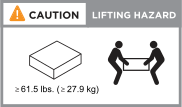

= Requisitos de instalação - FAS50
:allow-uri-read: 
:icons: font
:imagesdir: ../media/

[role="lead"]
Revise os requisitos do seu sistema de storage FAS50.

== Equipamento necessário para instalação

Para instalar seu sistema de storage, você precisa dos seguintes equipamentos e ferramentas.

* Acesso a um navegador da Web para configurar o sistema de armazenamento
* Fita de descarga eletrostática (ESD)
* Lanterna
* Computador portátil ou console com conexão USB/serial
* Chave de fendas Phillips nº 2

== Precauções de elevação

Os sistemas de armazenamento e as prateleiras são pesados. Tenha cuidado ao levantar e mover estes itens.

=== Peso do sistema de armazenamento

Tome as precauções necessárias ao mover ou elevar o sistema de armazenamento.

O sistema de armazenamento pode pesar até 53,8 lbs (24,4 kg). Para levantar o sistema de armazenamento, utilize duas pessoas ou um elevador hidráulico.

=== Peso da prateleira

Tome as precauções necessárias ao mover ou levantar a prateleira.

Uma prateleira de DS460C kg pode pesar até 260,4 lbs (181,1 kg). Para levantar a prateleira, você pode precisar de até cinco pessoas ou um elevador hidráulico. Mantenha todos os componentes na prateleira (dianteira e traseira) para evitar desequilibrar o peso da prateleira.

image::../media/drw_ds460c_weight_warning_ieops-1932.svg[DS460C precaução de elevação]

.Informações relacionadas
* https://library.netapp.com/ecm/ecm_download_file/ECMP12475945["Informações de segurança e avisos regulamentares"^]

.O que se segue?
Depois de analisar os requisitos e considerações de instalação do seu sistema de armazenamento, link:install-prepare.html["prepare-se para a instalação"]você .
