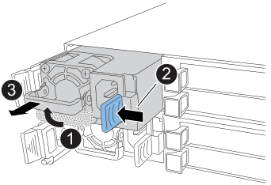

= Substitua uma fonte de alimentação - FAS50
:allow-uri-read: 
:icons: font
:imagesdir: ../media/

[role="lead"]
Substitua uma fonte de alimentação CA ou CC (PSU) no seu sistema FAS50 quando falhar ou ficar com defeito, garantindo que o sistema continua a receber a energia necessária para uma operação estável. O processo de substituição envolve desconetar a PSU defeituosa da fonte de alimentação, desconetar o cabo de alimentação, substituir a PSU defeituosa e reconectá-la à fonte de alimentação.

.Sobre esta tarefa
* Este procedimento é escrito para substituir uma PSU de cada vez.
+
As PSUs são redundantes e hot-swap.

* IMPORTANTE: Não misture PSUs com diferentes classificações de eficiência ou diferentes tipos de entrada. Sempre substitua como por like.
* Use o procedimento apropriado para o seu tipo de PSU: AC ou DC.
* Se necessário, você pode ligar os LEDs de localização do sistema de armazenamento (azul) para ajudar a localizar fisicamente o sistema de armazenamento afetado. Faça login no BMC usando SSH e digite o `system location-led _on_` comando.
+
Um sistema de armazenamento tem três LEDs de localização: Um no painel de visualização do operador e um em cada controlador. Os LEDs de localização permanecem acesos durante 30 minutos.

+
Você pode desativá-los digitando o `system location-led _off_` comando. Se não tiver a certeza se os LEDs estão ligados ou desligados, pode verificar o seu estado introduzindo o `system location-led show` comando.

[role="tabbed-block"]
====
.Opção 1: Substituir uma PSU CA
--
Para substituir uma PSU CA, execute as etapas a seguir.

.Passos
. Se você ainda não está aterrado, aterre-se adequadamente.
. Identifique a PSU avariada com base em mensagens de erro da consola ou através do LED de atenção vermelho na PSU.
. Desconete o cabo de alimentação da PSU abrindo o retentor do cabo de alimentação e, em seguida, desconete o cabo de alimentação da PSU.
+

NOTE: As PSUs não têm um interrutor de alimentação.

. Retire o PSU:
+

+
[cols="1,4"]
|===

 a| 
image::../media/icon_round_1.png[Legenda número 1]
 a| 
Rode a pega da PSU para cima, para a sua posição horizontal e, em seguida, segure-a.

 a| 
image::../media/icon_round_2.png[Legenda número 2]
 a| 
Com o polegar, pressione a aba azul para liberar a PSU do controlador.

 a| 
image::../media/icon_round_3.png[Legenda número 3]
 a| 
Retire a PSU do controlador enquanto utiliza a outra mão para suportar o peso.

CAUTION: A PSU é curta. Sempre use duas mãos para apoiá-lo ao removê-lo do controlador de modo que ele não oscile repentinamente livre do controlador e o machuque.

|===
. Instale a PSU de substituição:
+
.. Utilizando ambas as mãos, apoie e alinhe as extremidades da PSU com a abertura no controlador.
.. Empurre cuidadosamente a PSU para dentro do controlador até que a patilha de bloqueio encaixe no lugar.
+
Uma PSU só engata adequadamente com o conetor interno e trava no lugar de uma forma.

+

NOTE: Para evitar danificar o conetor interno, não use força excessiva ao deslizar a PSU para dentro do controlador.

.. Gire a alça para baixo, de modo que esteja fora do caminho das operações normais.

. Volte a ligar o cabo de alimentação à PSU e fixe o cabo de alimentação com o fixador do cabo de alimentação.
+
Uma vez que a energia é restaurada para a PSU, o LED de status deve estar verde.

. Devolva a peça com falha ao NetApp, conforme descrito nas instruções de RMA fornecidas com o kit. Consulte a https://mysupport.netapp.com/site/info/rma["Devolução de peças e substituições"^] página para obter mais informações.

--
.Opção 2: Substituir uma PSU CC
--
Para substituir uma PSU CC, execute as etapas a seguir.

.Passos
. Se você ainda não está aterrado, aterre-se adequadamente.
. Identifique a PSU avariada com base em mensagens de erro da consola ou através do LED de atenção vermelho na PSU.
. Desligar a PSU:
+

NOTE: As PSUs não têm um interrutor de alimentação.

+
.. Desaperte os dois parafusos de orelhas no conetor do cabo de alimentação DC D-SUB.
+
A ilustração e a tabela no passo 4 mostram os dois parafusos de orelhas (item 1) e o conetor do cabo de alimentação DC D-SUB (item 2).

.. Desligue o cabo da PSU e coloque-o de lado.

. Retire o PSU:
+
.. Rode o manípulo para cima, para a sua posição horizontal e, em seguida, segure-o.
.. Com o polegar, prima a patilha de terracota para soltar o mecanismo de bloqueio.
.. Retire a PSU do controlador enquanto utiliza a outra mão para suportar o peso.
+

CAUTION: A PSU é curta. Utilize sempre duas mãos para apoiá-lo ao removê-lo do controlador, de modo a que não se liberte do controlador e o machuque.

+
image::../media/drw_dcpsu_remove-replace-generic_IEOPS-788.svg[Remova uma PSU CC]

+
[cols="1,4"]
|===

 a| 
image::../media/icon_round_1.png[Legenda número 1]
 a| 
Parafusos de orelhas

 a| 
image::../media/icon_round_2.png[Legenda número 2]
 a| 
Conetor do cabo de alimentação da fonte de alimentação DC D-SUB

 a| 
image::../media/icon_round_3.png[Legenda número 3]
 a| 
Pega da fonte de alimentação

 a| 
image::../media/icon_round_4.png[Legenda número 4]
 a| 
Patilha de bloqueio da PSU de terracota

|===
. Insira a PSU de substituição:
+
.. Utilizando ambas as mãos, apoie e alinhe as extremidades da PSU com a abertura no controlador.
.. Deslize cuidadosamente a PSU para dentro do controlador até que a patilha de bloqueio encaixe no lugar.
+
Uma PSU deve engatar adequadamente com o conetor interno e o mecanismo de travamento. Repita este passo se sentir que a PSU não está corretamente encaixada.

+

NOTE: Para evitar danificar o conetor interno, não use força excessiva ao deslizar a PSU para dentro do controlador.

.. Gire a alça para baixo, de modo que esteja fora do caminho das operações normais.

. Volte a ligar o cabo de alimentação D-SUB DC:
+
Uma vez que a energia é restaurada para a PSU, o LED de status deve estar verde.

+
.. Ligue o conetor do cabo de alimentação DC D-SUB à PSU.
.. Aperte os dois parafusos de orelhas para fixar o conetor do cabo de alimentação D-SUB DC à PSU.

. Devolva a peça com falha ao NetApp, conforme descrito nas instruções de RMA fornecidas com o kit. Consulte a https://mysupport.netapp.com/site/info/rma["Devolução de peças e substituições"^] página para obter mais informações.

--
====