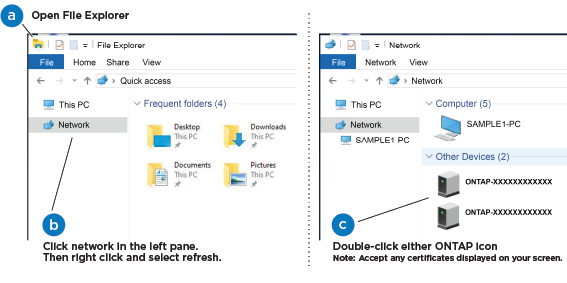

= Passos detalhados - FAS500f
:allow-uri-read: 
:icons: font
:imagesdir: ../media/

[role="lead"]
Esta seção fornece instruções detalhadas passo a passo para a instalação de um sistema FAS500f.

== Passo 1: Prepare-se para a instalação

Para instalar o sistema FAS500f, você precisa criar uma conta e Registrar o sistema. Você também precisa fazer o inventário do número e do tipo apropriados de cabos para o seu sistema e coletar informações específicas de rede.

Você precisa ter acesso ao link:https://hwu.netapp.com["NetApp Hardware Universe"^] (HWU) para obter informações sobre os requisitos do site, bem como informações adicionais sobre o seu sistema configurado. Também pode pretender ter acesso ao link:http://mysupport.netapp.com/documentation/productlibrary/index.html?productID=62286["Notas de versão para a sua versão do ONTAP"^] para obter mais informações sobre este sistema.

.O que você precisa
Você precisa fornecer o seguinte em seu site:

* Espaço em rack para o sistema de armazenamento
* Chave de fendas Phillips nº 2
* Cabos de rede adicionais para conetar seu sistema ao switch de rede e laptop ou console com um navegador da Web

.Passos
. Desembale o conteúdo de todas as caixas.
. Registre o número de série do sistema nos controladores.
+
image::../media/drw_ssn_label.png[Exemplo de número de série do sistema]

. Configure a sua conta:
+
.. Inicie sessão na sua conta existente ou crie uma conta.
.. Registe o seu sistema (link:https://mysupport.netapp.com/eservice/registerSNoAction.do?moduleName=RegisterMyProduct["Registro de produto NetApp"^]).

. Baixe e instale link:https://mysupport.netapp.com/site/tools/tool-eula/activeiq-configadvisor["NetApp Downloads: Config Advisor"^] em seu laptop.
. Faça um inventário e anote o número e os tipos de cabos que você recebeu.
+
A tabela a seguir identifica os tipos de cabos que você pode receber. Se receber um cabo não listado na tabela, consulte link:https://hwu.netapp.com["NetApp Hardware Universe"^] para localizar o cabo e identificar a respetiva utilização.

|===

| Tipo de cabo... | Número de peça e comprimento | Tipo de conetor | Para... 

 a| 
Cabo de 25 GbE
 a| 
X66240A-05 (112-00595), 0,5m;

X66240-2 (112-00573), 2m
 a| 
image:../media/oie_cable100_gbe_qsfp28.png["Conetor 100 GbE QSFP28"]
 a| 
Rede de interconexão de cluster

 a| 
X66240A-2 (112-00598), 2m;

X66240A-5 (112-00600), 5m
 a| 
Dados

 a| 
Cabo de 100 GbE
 a| 
X66211-2 (112-00574), 2m;

X66211-5 (112-00576), 5m
 a| 
Armazenamento

 a| 
RJ-45 (dependente da ordem)
 a| 
Não aplicável
 a| 
image:../media/oie_cable_rj45.png["Conetor do cabo RJ-45"]
 a| 
Rede de gerenciamento (porta BMC e Wrench) e dados Ethernet (e0a e e0b)

 a| 
Fibre Channel
 a| 
X66250-2 (112-00342) 2m;

X66250-5 (112-00344) 5m;

X66250-15 (112-00346) 15m;

X66250-30 (112-00347) 30m
 a| 
image:../media/oie_cable_fc_optical.png["Cabo ótico OIE Fibre Channel"]
 a| 

 a| 
Cabo micro-USB da consola
 a| 
Não aplicável
 a| 
image:../media/oie_cable_micro_usb.png["Conetor micro USB"]
 a| 
Ligação da consola durante a configuração do software

 a| 
Cabos de alimentação
 a| 
Não aplicável
 a| 

 a| 
Ligar o sistema

|===
. Reveja link:https://library.netapp.com/ecm/ecm_download_file/ECMLP2862613["Guia de configuração do ONTAP"^]o e recolha as informações necessárias listadas nesse guia.

== Passo 2: Instale o hardware

Você precisa instalar seu sistema em um rack de 4 colunas ou gabinete do sistema NetApp, conforme aplicável.

.Passos
. Instale os kits de calhas, conforme necessário.
. Instale e fixe o seu sistema utilizando as instruções incluídas no kit de calhas.
+

NOTE: Você precisa estar ciente das preocupações de segurança associadas ao peso do sistema.

+
image::../media/drw_affa250_weight_caution.png[Cuidado com o elevador para duas pessoas]

. Identifique e gerencie cabos porque este sistema não possui um dispositivo de gerenciamento de cabos.
. Coloque a moldura na parte frontal do sistema.

== Passo 3: Controladores de cabo

Há cabeamento necessário para o cluster da sua plataforma usando o método de cluster sem switch de dois nós ou o método de rede de interconexão de cluster. Há cabeamento opcional para as redes de host Fibre Channel ou iSCSI ou armazenamento de conexão direta. Este cabeamento não é exclusivo; você pode ter um cabo para uma rede host e armazenamento.

=== Cabeamento necessário: Controladores de cabo para um cluster

Conete os controladores a um cluster usando o método de cluster sem switch de dois nós ou usando a rede de interconexão de cluster.

==== Opção 1: Cabo de um cluster sem switch de dois nós

As portas de gerenciamento, Fibre Channel e dados ou rede de host nos módulos do controlador são conetadas aos switches. As portas de interconexão de cluster são cabeadas em ambos os módulos do controlador.

.Antes de começar
Contacte o administrador da rede para obter informações sobre como ligar o sistema aos comutadores.

Certifique-se de que verifica a seta da ilustração para a orientação adequada da presilha de puxar do conetor do cabo.

image::../media/oie_cable_pull_tab_down.png[Conetor de cabo com patilha de puxar na parte inferior]

NOTE: Ao inserir o conetor, você deve senti-lo clicar no lugar; se você não sentir que ele clique, remova-o, vire-o e tente novamente.

Use a animação ou as etapas tabuladas para concluir o cabeamento entre os controladores e os switches:

.Animação - Cable um cluster sem switch de dois nós
video::beec3966-0a01-473c-a5de-ac68017fbf29[panopto]
[cols="10,90"]
|===
| Passo | Execute em cada controlador 

 a| 
image:../media/icon_square_1_green.png["Passo 1"]
 a| 
Ligue as portas de interconexão de cluster umas às outras com o cabo de interconexão de cluster 25GbE

image:../media/oie_cable_sfp_gbe_copper.png["Conetor de cobre GbE SFP"]:

* e0c a e0c
* e0d a e0d image:../media/drw_affa250_tnsc_cabling.png["Cabeamento de interconexão de cluster em um cluster sem switch de dois nós"]

 a| 
image:../media/icon_square_2_yellow.png["Legenda número 2"]
 a| 
Faça o cabo das portas da chave de fenda aos switches de rede de gerenciamento com os cabos RJ45.

image::../media/drw_affa250_mgmt_cabling.png[Cabeamento de porta de gerenciamento]

 a| 

 a| 
NÃO conete os cabos de energia neste momento.

|===
Para concluir a configuração do sistema, link:install-detailed-guide.html#step-4-complete-system-setup-and-configuration["Passo 4: Conclua a configuração e configuração do sistema"]consulte .

==== Opção 2: Conjunto comutado por cabo a

Todas as portas dos controladores são conetadas a switches; switches de rede host, interconexão de cluster, gerenciamento, Fibre Channel e de dados.

.Antes de começar
Contacte o administrador da rede para obter informações sobre como ligar o sistema aos comutadores.

Certifique-se de que verifica a seta da ilustração para a orientação adequada da presilha de puxar do conetor do cabo.

image::../media/oie_cable_pull_tab_down.png[Conetor de cabo com patilha de puxar na parte inferior]

NOTE: Ao inserir o conetor, você deve senti-lo clicar no lugar; se você não sentir que ele clique, remova-o, vire-o e tente novamente.

Use a animação ou as etapas tabuladas para concluir o cabeamento entre os controladores e os switches:

.Animação - Cable a switched cluster
video::bf6759dc-4cbf-488e-982e-ac68017fbef8[panopto]
[cols="10,90"]
|===
| Passo | Execute em cada controlador 

 a| 
image:../media/icon_square_1_green.png["Passo 1"]
 a| 
Cable as portas de interconexão de cluster aos switches de interconexão de cluster de 25 GbE.

* e0c
* e0d image:../media/drw_affa250_switched_clust_cabling.png["Cabeamento de interconexão de cluster"]

 a| 
image:../media/icon_square_2_yellow.png["Legenda número 2"]
 a| 
Faça o cabo das portas da chave de fenda aos switches de rede de gerenciamento com os cabos RJ45.

image::../media/drw_affa250_mgmt_cabling.png[Cabeamento de porta de gerenciamento]

 a| 

 a| 
NÃO conete os cabos de energia neste momento.

|===
Para concluir a configuração do sistema, link:install-detailed-guide.html#step-4-complete-system-setup-and-configuration["Passo 4: Conclua a configuração e configuração do sistema"]consulte .

=== Cabeamento opcional: Opções dependentes da configuração de cabos

Você tem cabeamento opcional dependente da configuração para as redes de host Fibre Channel ou iSCSI ou armazenamento de conexão direta. Esse cabeamento não é exclusivo; você pode ter cabeamento para uma rede host e armazenamento.

==== Opção 1: Cabo para uma rede host Fibre Channel

As portas Fibre Channel nos controladores são conetadas aos switches de rede host Fibre Channel.

.Antes de começar
Contacte o administrador da rede para obter informações sobre como ligar o sistema aos comutadores.

Certifique-se de que verifica a seta da ilustração para a orientação adequada da presilha de puxar do conetor do cabo.

image::../media/oie_cable_pull_tab_up.png[Conetor de cabo com patilha na parte superior]

NOTE: Ao inserir o conetor, você deve senti-lo clicar no lugar; se você não sentir que ele clique, remova-o, vire-o e tente novamente.

[cols="10,90"]
|===
| Passo | Execute em cada módulo do controlador 

 a| 
1
 a| 
Portas de cabo de 2a a 2D para os switches de host FC.

image::../media/drw_affa250_fc_host_cabling.png[Cabeamento de host Fibre Channel]

 a| 
2
 a| 
Para executar outro cabeamento opcional, escolha entre:

* <<Opção 2: Cabo para uma rede de dados 25GbE ou host>>
* <<Opção 3: Cabeamento das controladoras a um único compartimento de unidade>>

 a| 
3
 a| 
Para concluir a configuração do sistema, link:install-detailed-guide.html#step-4-complete-system-setup-and-configuration["Passo 4: Conclua a configuração e configuração do sistema"]consulte .

|===

==== Opção 2: Cabo para uma rede de dados 25GbE ou host

As portas 25GbE nos controladores são conetadas a switches de rede de host ou dados 25GbE.

.Antes de começar
Contacte o administrador da rede para obter informações sobre como ligar o sistema aos comutadores.

Certifique-se de que verifica a seta da ilustração para a orientação adequada da presilha de puxar do conetor do cabo.

image::../media/oie_cable_pull_tab_up.png[Conetor de cabo com patilha na parte superior]

NOTE: Ao inserir o conetor, você deve senti-lo clicar no lugar; se você não sentir que ele clique, remova-o, vire-o e tente novamente.

[cols="10,90"]
|===
| Passo | Execute em cada módulo do controlador 

 a| 
1
 a| 
Portas de cabo de e4a a e4d para os switches de rede de host 10GbE.

image::../media/drw_affa250_25gbe_host_cabling.png[Cabeamento de 25 GbE]

 a| 
2
 a| 
Para executar outro cabeamento opcional, escolha entre:

* <<Opção 1: Cabo para uma rede host Fibre Channel>>
* <<Opção 3: Cabeamento das controladoras a um único compartimento de unidade>>

 a| 
3
 a| 
Para concluir a configuração do sistema, link:install-detailed-guide.html#step-4-complete-system-setup-and-configuration["Passo 4: Conclua a configuração e configuração do sistema"]consulte .

|===

==== Opção 3: Cabeamento das controladoras a um único compartimento de unidade

Você deve vincular cada controlador aos módulos do NSM no compartimento de unidades NS224.

Certifique-se de que verifica a seta da ilustração para a orientação adequada da presilha de puxar do conetor do cabo.

image::../media/oie_cable_pull_tab_up.png[Conetor de cabo com patilha na parte superior]

NOTE: Ao inserir o conetor, você deve senti-lo clicar no lugar; se você não sentir que ele clique, remova-o, vire-o e tente novamente.

Use a animação ou as etapas tabuladas para concluir o cabeamento entre as controladoras e a gaveta única:

.Animação - Cable os controladores para um único NS224
video::3f92e625-a19c-4d10-9028-ac68017fbf57[panopto]
[cols="10,90"]
|===
| Passo | Execute em cada módulo do controlador 

 a| 
image:../media/icon_square_1_blue.png["Legenda número 1"]
 a| 
Controlador de cabo A para a prateleira: image:../media/drw_affa250_1shelf_cabling_a.png["Cabeamento da controladora A."]

 a| 
image:../media/icon_square_2_yellow.png["Legenda número 2"]
 a| 
Controlador de cabo B para a prateleira: image:../media/drw_affa250_1shelf_cabling_b.png["Cabeamento da controladora B."]

|===
Para concluir a configuração do sistema, link:install-detailed-guide.html#step-4-complete-system-setup-and-configuration["Passo 4: Conclua a configuração e configuração do sistema"]consulte .

== Passo 4: Conclua a configuração e configuração do sistema

Conclua a configuração e a configuração do sistema usando a descoberta de cluster apenas com uma conexão com o switch e laptop, ou conetando-se diretamente a um controlador no sistema e, em seguida, conetando-se ao switch de gerenciamento.

=== Opção 1: Conclua a configuração e a configuração do sistema se a deteção de rede estiver ativada

Se tiver a deteção de rede ativada no seu computador portátil, pode concluir a configuração e configuração do sistema utilizando a deteção automática de cluster.

.Passos
. Conete os cabos de alimentação às fontes de alimentação do controlador e, em seguida, conete-os a fontes de alimentação em diferentes circuitos.
. Certifique-se de que o seu computador portátil tem a deteção de rede ativada.
+
Consulte a ajuda online do seu computador portátil para obter mais informações.

. Use a animação para conetar seu laptop ao switch de gerenciamento:
+
.Animação - Conete seu laptop ao interrutor de gerenciamento
video::d61f983e-f911-4b76-8b3a-ab1b0066909b[panopto]
. Selecione um ícone ONTAP listado para descobrir:
+

+
.. Abra o Explorador de ficheiros.
.. Clique em *rede* no painel esquerdo.
.. Clique com o botão direito do rato e selecione *Refresh*.
.. Clique duas vezes no ícone ONTAP e aceite quaisquer certificados exibidos na tela.
+

NOTE: XXXXX é o número de série do sistema para o nó de destino.

+
O System Manager é aberto.

. Utilize a configuração guiada do System Manager para configurar o sistema utilizando os dados recolhidos no link:https://library.netapp.com/ecm/ecm_download_file/ECMLP2862613["Guia de configuração do ONTAP"^].
. Verifique a integridade do sistema executando o Config Advisor.
. Depois de concluir a configuração inicial, vá para a link:https://www.netapp.com/data-management/oncommand-system-documentation/["Recursos de documentação do Gerenciador de sistema do ONTAP  ONTAP"^] página para obter informações sobre como configurar recursos adicionais no ONTAP.

=== Opção 2: Conclua a configuração e a configuração do sistema se a deteção de rede não estiver ativada

Se a deteção de rede não estiver ativada no seu computador portátil, tem de concluir a configuração e a configuração utilizando esta tarefa.

.Passos
. Faça o cabo e configure o seu laptop ou console:
+
.. Defina a porta de console no laptop ou console para 115.200 baud com N-8-1.
+

NOTE: Consulte a ajuda on-line do seu laptop ou console para saber como configurar a porta do console.

.. Conete o laptop ou o console ao switch na sub-rede de gerenciamento.
+

.. Atribua um endereço TCP/IP ao laptop ou console, usando um que esteja na sub-rede de gerenciamento.

. Conete os cabos de alimentação às fontes de alimentação do controlador e, em seguida, conete-os a fontes de alimentação em diferentes circuitos.
. Atribua um endereço IP de gerenciamento de nó inicial a um dos nós.
+
[cols="1,2"]
|===
| Se a rede de gestão tiver DHCP... | Então... 

 a| 
Configurado
 a| 
Registre o endereço IP atribuído aos novos controladores.

 a| 
Não configurado
 a| 
.. Abra uma sessão de console usando PuTTY, um servidor de terminal ou o equivalente para o seu ambiente.
+

NOTE: Verifique a ajuda on-line do seu laptop ou console se você não sabe como configurar o PuTTY.

.. Insira o endereço IP de gerenciamento quando solicitado pelo script.

|===
. Usando o System Manager em seu laptop ou console, configure seu cluster:
+
.. Aponte seu navegador para o endereço IP de gerenciamento de nó.
+

NOTE: O formato para o endereço é https://x.x.x.x+.

.. Configure o sistema utilizando os dados recolhidos no link:https://library.netapp.com/ecm/ecm_download_file/ECMLP2862613["Guia de configuração do ONTAP"^].

. Verifique a integridade do sistema executando o Config Advisor.
. Depois de concluir a configuração inicial, vá para a link:https://www.netapp.com/data-management/oncommand-system-documentation/["Recursos de documentação do Gerenciador de sistema do ONTAP  ONTAP"^] página para obter informações sobre como configurar recursos adicionais no ONTAP.

