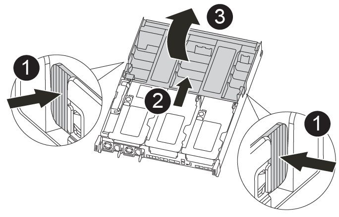

= Substitua o suporte de arranque - FAS8300 e FAS8700
:allow-uri-read: 
:icons: font
:imagesdir: ../media/

Para substituir o suporte de arranque, tem de remover o módulo do controlador afetado, instalar o suporte de arranque de substituição e transferir a imagem de arranque para uma unidade flash USB.

== Passo 1: Remova o módulo do controlador

[role="lead"]
Para aceder aos componentes no interior do módulo do controlador, tem de remover o módulo do controlador do chassis.

Você pode usar a animação, ilustração ou as etapas escritas a seguir para remover o módulo do controlador do chassi.

.Animação - retire o módulo do controlador
video::ca74d345-e213-4390-a599-aae10019ec82[panopto]
.Passos
. Se você ainda não está aterrado, aterre-se adequadamente.
. Solte os fixadores do cabo de alimentação e, em seguida, desconete os cabos das fontes de alimentação.
. Solte o gancho e a alça de loop que prendem os cabos ao dispositivo de gerenciamento de cabos e, em seguida, desconete os cabos do sistema e os SFPs (se necessário) do módulo do controlador, mantendo o controle de onde os cabos estavam conetados.
+
Deixe os cabos no dispositivo de gerenciamento de cabos para que, ao reinstalar o dispositivo de gerenciamento de cabos, os cabos sejam organizados.

. Retire o dispositivo de gestão de cabos do módulo do controlador e coloque-o de lado.
. Prima ambos os trincos de bloqueio para baixo e, em seguida, rode ambos os trincos para baixo ao mesmo tempo.
+
O módulo do controlador desloca-se ligeiramente para fora do chassis.

+
image::../media/drw_A400_Remove_controller.png[Soltar o módulo do controlador]

+
[cols="1,3"]
|===

 a| 
image:../media/icon_round_1.png["Legenda número 1"]
 a| 
Trincos de bloqueio

 a| 
image:../media/icon_round_2.png["Legenda número 2"]
 a| 
Deslize o controlador para fora do chassi

|===
. Faça deslizar o módulo do controlador para fora do chassis.
+
Certifique-se de que suporta a parte inferior do módulo do controlador enquanto o desliza para fora do chassis.

. Coloque o módulo do controlador numa superfície estável e plana.

== Passo 2: Substitua o suporte de arranque

Deve localizar o suporte de arranque no módulo do controlador (consulte o mapa da FRU no módulo do controlador) e, em seguida, seguir as instruções para o substituir.

.Antes de começar
Embora o conteúdo da Mídia de inicialização seja criptografado, é uma prática recomendada apagar o conteúdo da Mídia de inicialização antes de substituí-la. Para obter mais informações, consulte https://mysupport.netapp.com/info/web/ECMP1132988.html["Declaração de volatilidade"] o para o seu sistema no site de suporte da NetApp.

NOTE: Você deve fazer login no site de suporte da NetApp para exibir a _Declaração de volatilidade_ para o seu sistema.

Você pode usar a animação, ilustrações ou as etapas escritas a seguir para substituir o suporte de inicialização.

.Animação - substitua o suporte de arranque
video::e0825a97-c57d-47d7-b87d-aad9012efa12[panopto]
.Passos
. Abrir a conduta de ar:
+

+
[cols="1,3"]
|===

 a| 
image:../media/icon_round_1.png["Legenda número 1"]
 a| 
Patilhas de bloqueio

 a| 
image:../media/icon_round_2.png["Legenda número 2"]
 a| 
Deslize o duto de ar em direção à parte traseira do controlador

 a| 
image::../media/icon_round_3.png[Legenda número 3]
 a| 
Rode a conduta de ar para cima

|===
+
.. Pressione as patilhas de bloqueio nas laterais da conduta de ar para dentro, em direção ao centro do módulo do controlador.
.. Faça deslizar a conduta de ar em direção à parte de trás do módulo do controlador e, em seguida, rode-a para cima até à posição completamente aberta.

. Localize e remova o suporte de arranque do módulo do controlador:
+
image::../media/drw_A400_Replace-boot_media.png[Remover o suporte de arranque]

+
[cols="1,3"]
|===

 a| 
image:../media/icon_round_1.png["Legenda número 1"]
 a| 
Prima o botão azul

 a| 
image:../media/icon_round_2.png["Legenda número 2"]
 a| 
Rode o suporte de arranque para cima e retire-o da tomada

|===
+
.. Pressione o botão azul na extremidade do suporte de inicialização até que o lábio do suporte de inicialização apague o botão azul.
.. Rode o suporte de arranque para cima e puxe cuidadosamente o suporte de arranque para fora do encaixe.

. Alinhe as extremidades do suporte de arranque de substituição com a tomada de suporte de arranque e, em seguida, empurre-o cuidadosamente para dentro do encaixe.
. Verifique o suporte de arranque para se certificar de que está encaixado corretamente e completamente no encaixe.
+
Se necessário, retire o suporte de arranque e volte a colocá-lo no socket.

. Bloqueie o suporte de arranque no devido lugar:
+
.. Rode o suporte de arranque para baixo em direção à placa-mãe.
.. Colocando um dedo na extremidade do suporte de arranque com o botão azul, prima a extremidade do suporte de arranque para engatar o botão de bloqueio azul.
.. Enquanto pressiona o suporte de arranque, levante o botão azul de bloqueio para bloquear o suporte de arranque no lugar.

. Feche a conduta de ar.

== Passo 3: Transfira a imagem de arranque para o suporte de arranque

A Mídia de inicialização de substituição que você instalou não tem uma imagem de inicialização, então você precisa transferir uma imagem de inicialização usando uma unidade flash USB.

.Antes de começar
* Você deve ter uma unidade flash USB, formatada para MBR/FAT32, com pelo menos 4GBGB de capacidade
* Uma cópia da mesma versão de imagem do ONTAP que a que o controlador afetado estava a executar. Você pode baixar a imagem apropriada da seção Downloads no site de suporte da NetApp
+
** Se a NVE estiver ativada, transfira a imagem com encriptação de volume NetApp, conforme indicado no botão de transferência.
** Se a NVE não estiver ativada, transfira a imagem sem encriptação de volume NetApp, conforme indicado no botão de transferência.

* Se o seu sistema for um par de HA, tem de ter uma ligação de rede.
* Se o seu sistema for um sistema autónomo, não necessita de uma ligação de rede, mas tem de efetuar uma reinicialização adicional ao restaurar o `var` sistema de ficheiros.
+
.. Transfira e copie a imagem de serviço apropriada do site de suporte da NetApp para a unidade flash USB.
+
... Transfira a imagem de serviço para o seu espaço de trabalho no seu computador portátil.
... Descompacte a imagem de serviço.
+

NOTE: Se você estiver extraindo o conteúdo usando o Windows, não use o WinZip para extrair a imagem netboot. Use outra ferramenta de extração, como 7-Zip ou WinRAR.

+
Há duas pastas no arquivo de imagem de serviço descompactado:

+
**** `boot`
**** `efi`

... Copie a `efi` pasta para o diretório superior da unidade flash USB.
+

NOTE: Se a imagem de serviço não tiver uma pasta efi, link:https://kb.netapp.com/onprem/ontap/hardware/EFI_folder_missing_from_Service_Image_download_file_used_for_boot_device_recovery_for_FAS_and_AFF_models["Pasta EFI ausente do arquivo de download de imagem de serviço usado para recuperação de dispositivo de inicialização para modelos FAS e AFF"]consulte .

+
A unidade flash USB deve ter a pasta efi e a mesma versão de imagem de serviço (BIOS) do que o controlador deficiente está executando.

... Retire a unidade flash USB do seu computador portátil.

.. Se ainda não o tiver feito, feche a conduta de ar.
.. Alinhe a extremidade do módulo do controlador com a abertura no chassis e, em seguida, empurre cuidadosamente o módulo do controlador até meio do sistema.
.. Reinstale o dispositivo de gerenciamento de cabos e reconete o sistema, conforme necessário.
+
Ao reativar, lembre-se de reinstalar os conversores de Mídia (SFPs ou QSFPs) se eles foram removidos.

.. Introduza a unidade flash USB na ranhura USB do módulo do controlador.
+
Certifique-se de que instala a unidade flash USB na ranhura identificada para dispositivos USB e não na porta da consola USB.

.. Conclua a instalação do módulo do controlador:
+
... Empurre firmemente o módulo do controlador para dentro do chassi até que ele atenda ao plano médio e esteja totalmente assentado.
+
Os trincos de bloqueio sobem quando o módulo do controlador está totalmente assente.

+

NOTE: Não utilize força excessiva ao deslizar o módulo do controlador para dentro do chassis para evitar danificar os conetores.

... Rode os trincos de bloqueio para cima, inclinando-os de forma a que estes limpem os pinos de bloqueio e, em seguida, baixe-os para a posição de bloqueio.
... Conete os cabos de alimentação às fontes de alimentação, reinstale o colar de travamento do cabo de alimentação e, em seguida, conete as fontes de alimentação à fonte de alimentação.
+
O módulo do controlador começa a inicializar assim que a energia é restaurada. Esteja preparado para interromper o processo de inicialização.

... Se ainda não o tiver feito, reinstale o dispositivo de gerenciamento de cabos.

.. Interrompa o processo de inicialização pressionando Ctrl-C para parar no prompt DO Loader.
+
Se você perder essa mensagem, pressione Ctrl-C, selecione a opção para inicializar no modo Manutenção e, em seguida `halt`, o controlador para inicializar NO Loader.

.. Se o controlador estiver em um MetroCluster elástico ou conetado à malha, será necessário restaurar a configuração do adaptador FC:
+
... Arranque para o modo de manutenção: `boot_ontap maint`
... Defina as portas MetroCluster como iniciadores: `ucadmin modify -m fc -t _initiator adapter_name_`
... Parar para voltar ao modo de manutenção: `halt`

+
As alterações serão implementadas quando o sistema for inicializado.

