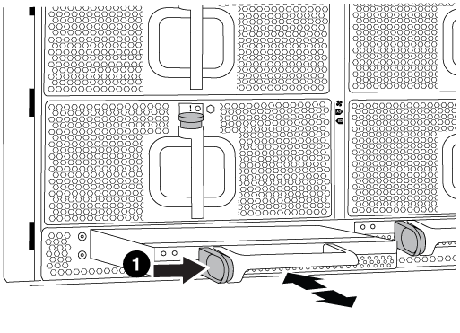

= Módulo de alimentação do controlador de fase de troca a quente (DCPM) - FAS9000
:allow-uri-read: 
:icons: font
:imagesdir: ../media/

[role="lead"]
Para trocar a quente um módulo de alimentação do controlador de estágio (DCPM), que contém a bateria de NVRAM10 V, você deve localizar o módulo DCPM com falha, removê-lo do chassi e instalar o módulo DCPM de substituição.

Tem de ter um módulo DCPM de substituição em mãos antes de remover o módulo com falha do chassis e este tem de ser substituído no prazo de cinco minutos após a remoção. Uma vez que o módulo DCPM é removido do chassi, não há proteção de desligamento para o módulo do controlador que possui o módulo DCPM, além de failover para o outro módulo do controlador.

== Passo 1: Substitua o módulo DCPM

Para substituir o módulo DCPM em seu sistema, você deve remover o módulo DCPM com falha do sistema e, em seguida, substituí-lo por um novo módulo DCPM.

.Passos
. Se você ainda não está aterrado, aterre-se adequadamente.
. Retire a moldura na parte frontal do sistema e coloque-a de lado.
. Localize o módulo DCPM com falha na parte frontal do sistema, procurando o LED de atenção no módulo.
+
O LED ficará âmbar fixo se o módulo estiver avariado.

+

NOTE: O módulo DCPM deve ser substituído no chassi dentro de cinco minutos após a remoção ou o controlador associado será desligado.

. Prima o botão laranja de bloqueio na pega do módulo e, em seguida, deslize o módulo DCPM para fora do chassis.
+

+
[cols="1,4"]
|===

 a| 
image:../media/icon_round_1.png["Legenda número 1"]
 a| 
Botão de bloqueio laranja do módulo DCPM

|===
. Alinhe a extremidade do módulo DCPM com a abertura do chassi e, em seguida, deslize-o cuidadosamente para dentro do chassi até que ele encaixe no lugar.
+

NOTE: O módulo e o slot são chaveados. Não force o módulo para dentro da abertura. Se o módulo não entrar facilmente, realinhar o módulo e inseri-lo no chassis.

+
O LED do módulo DCPM acende quando o módulo está totalmente encaixado no chassis.

== Passo 2: Elimine as pilhas

Tem de eliminar as baterias de acordo com os regulamentos locais relativos à reciclagem ou eliminação das baterias. Se não conseguir eliminar as pilhas corretamente, deve devolver as pilhas à NetApp, conforme descrito nas instruções de RMA que são enviadas com o kit.

https://library.netapp.com/ecm/ecm_download_file/ECMP12475945[]

== Passo 3: Devolva a peça com falha ao NetApp

Devolva a peça com falha ao NetApp, conforme descrito nas instruções de RMA fornecidas com o kit. Consulte a https://mysupport.netapp.com/site/info/rma["Devolução de peças e substituições"] página para obter mais informações.
