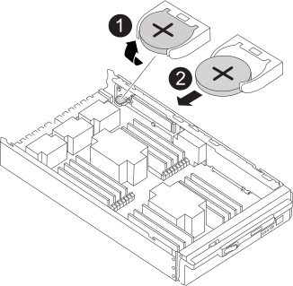

= Substitua a bateria do relógio em tempo real - FAS9500
:allow-uri-read: 
:icons: font
:imagesdir: ../media/

[role="lead"]
Você substitui a bateria do relógio em tempo real (RTC) no módulo do controlador para que os serviços e aplicativos do sistema que dependem da sincronização precisa de tempo continuem funcionando.

* Pode utilizar este procedimento com todas as versões do ONTAP suportadas pelo seu sistema
* Todos os outros componentes do sistema devem estar funcionando corretamente; caso contrário, você deve entrar em Contato com o suporte técnico.

== Etapa 1: Encerre o nó prejudicado

Para encerrar o controlador com deficiência, você deve determinar o status do controlador e, se necessário, assumir o controlador para que o controlador saudável continue fornecendo dados do armazenamento do controlador com deficiência.

.Sobre esta tarefa
* Se você tiver um sistema SAN, você deve ter verificado mensagens de  `cluster kernel-service show`evento ) para o blade SCSI do controlador afetado. O `cluster kernel-service show` comando (do modo avançado priv) exibe o nome do nó, link:https://docs.netapp.com/us-en/ontap/system-admin/display-nodes-cluster-task.html["status do quorum"]desse nó, o status de disponibilidade desse nó e o status operacional desse nó.
+
Cada processo SCSI-blade deve estar em quórum com os outros nós no cluster. Qualquer problema deve ser resolvido antes de prosseguir com a substituição.

* Se você tiver um cluster com mais de dois nós, ele deverá estar no quórum. Se o cluster não estiver em quórum ou se um controlador íntegro exibir false para qualificação e integridade, você deverá corrigir o problema antes de encerrar o controlador prejudicado; link:https://docs.netapp.com/us-en/ontap/system-admin/synchronize-node-cluster-task.html?q=Quorum["Sincronize um nó com o cluster"^]consulte .

.Passos
. Se o AutoSupport estiver ativado, suprimir a criação automática de casos invocando uma mensagem AutoSupport:
+
`system node autosupport invoke -node * -type all -message MAINT=<# of hours>h`

+
A seguinte mensagem AutoSupport suprime a criação automática de casos por duas horas:

+
`cluster1:> system node autosupport invoke -node * -type all -message MAINT=2h`

. Desative a giveback automática a partir da consola do controlador saudável:
+
`storage failover modify -node local -auto-giveback false`

+

NOTE: Quando vir _do pretende desativar a auto-giveback?_, introduza `y`.

. Leve o controlador prejudicado para o prompt Loader:
+
[cols="1,2"]
|===
| Se o controlador afetado estiver a apresentar... | Então... 

 a| 
O prompt Loader
 a| 
Vá para a próxima etapa.

 a| 
A aguardar pela giveback...
 a| 
Pressione Ctrl-C e responda `y` quando solicitado.

 a| 
Prompt do sistema ou prompt de senha
 a| 
Assuma ou interrompa o controlador prejudicado do controlador saudável:

`storage failover takeover -ofnode _impaired_node_name_ -halt _true_`

O parâmetro _-halt True_ traz para o prompt Loader.

|===

== Passo 2: Remova o controlador

Para aceder aos componentes no interior do controlador, tem de remover primeiro o módulo do controlador do sistema e, em seguida, remover a tampa do módulo do controlador.

. Se você ainda não está aterrado, aterre-se adequadamente.
. Desconete os cabos do módulo do controlador desativado e mantenha o controle de onde os cabos foram conetados.
. Deslize o botão terra cotta na pega do came para baixo até que este se destranque.
+
.Animação - Remover módulo do controlador
video::5e029a19-8acc-4fa1-be5d-ae78004b365a[panopto]
+
image::../media/drw_9500_remove_PCM.svg[drw 9500, retire o PCM]

+
[cols="20%,80%"]
|===

 a| 
image::../media/icon_round_1.png[Legenda número 1]
 a| 
Botão de libertação do manípulo do excêntrico

 a| 
image::../media/icon_round_2.png[Legenda número 2]
 a| 
Pega do came

|===
. Rode o manípulo do excêntrico de forma a desengatar completamente o módulo do controlador do chassis e, em seguida, deslize o módulo do controlador para fora do chassis.
+
Certifique-se de que suporta a parte inferior do módulo do controlador enquanto o desliza para fora do chassis.

. Coloque a tampa do módulo do controlador para cima sobre uma superfície estável e plana, pressione o botão azul na tampa, deslize a tampa para a parte traseira do módulo do controlador e, em seguida, gire a tampa para cima e levante-a do módulo do controlador.

image::../media/drw_9500_PCM_open.svg[drw 9500 PCM aberto]

[cols="20%,80%"]
|===

 a| 
image::../media/icon_round_1.png[Legenda número 1]
 a| 
Botão de bloqueio da tampa do módulo do controlador

|===

== Passo 3: Substitua a bateria RTC

Para substituir a bateria RTC, tem de localizar a bateria avariada no módulo do controlador, removê-la do suporte e, em seguida, instalar a bateria de substituição no suporte.

. Se você ainda não está aterrado, aterre-se adequadamente.
. Localize a bateria do RTC.
+
.Animação - Substituir a bateria RTC
video::3b977f96-3ebb-4b11-9703-ae78004b4add[panopto]
+

+
[cols="20%,80%"]
|===

 a| 
image::../media/icon_round_1.png[Legenda número 1]
 a| 
Rode a bateria para cima

 a| 
image::../media/icon_round_2.png[Legenda número 2]
 a| 
Deslize a bateria para fora do alojamento

|===
. Empurre cuidadosamente a bateria para fora do suporte, rode-a para fora do suporte e, em seguida, levante-a para fora do suporte.
+

NOTE: Observe a polaridade da bateria ao removê-la do suporte. A bateria está marcada com um sinal de mais e deve ser posicionada corretamente no suporte. Um sinal de mais perto do suporte indica-lhe como a bateria deve ser posicionada.

. Retire a bateria de substituição do saco de transporte antiestático.
. Localize o suporte da bateria vazio no módulo do controlador.
. Observe a polaridade da bateria RTC e, em seguida, insira-a no suporte inclinando a bateria em ângulo e empurrando-a para baixo.
. Inspecione visualmente a bateria para se certificar de que está completamente instalada no suporte e de que a polaridade está correta.
. Volte a instalar a tampa do módulo do controlador.

== Etapa 4: Reinstale o módulo do controlador e defina a hora/data

Depois de substituir a bateria do RTC, tem de reinstalar o módulo do controlador. Se a bateria do RTC tiver sido deixada fora do módulo do controlador durante mais de 10 minutos, poderá ter de repor a hora e a data.

. Se ainda não o tiver feito, feche a tampa da conduta de ar ou do módulo do controlador.
. Alinhe a extremidade do módulo do controlador com a abertura no chassis e, em seguida, empurre cuidadosamente o módulo do controlador até meio do sistema.
+
Não introduza completamente o módulo do controlador no chassis até ser instruído a fazê-lo.

. Recable o sistema, conforme necessário.
+
Se você removeu os conversores de Mídia (QSFPs ou SFPs), lembre-se de reinstalá-los se você estiver usando cabos de fibra ótica.

. Se as fontes de alimentação estiverem desconetadas, conete-as novamente e reinstale os retentores do cabo de alimentação.
. Conclua a reinstalação do módulo do controlador:
+
.. Com a alavanca do came na posição aberta, empurre firmemente o módulo do controlador até que ele atenda ao plano médio e esteja totalmente assentado e, em seguida, feche a alavanca do came para a posição travada.
+

IMPORTANT: Não utilize força excessiva ao deslizar o módulo do controlador para dentro do chassis para evitar danificar os conetores.

.. Se ainda não o tiver feito, reinstale o dispositivo de gerenciamento de cabos.
.. Prenda os cabos ao dispositivo de gerenciamento de cabos com o gancho e a alça de loop.
.. Volte a ligar os cabos de alimentação às fontes de alimentação e às fontes de alimentação e, em seguida, ligue a alimentação para iniciar o processo de arranque.
.. Interrompa o controlador no prompt DO Loader.

NOTE: Se o sistema parar no menu de inicialização, selecione a opção "Reboot node" (nó de reinicialização) e responda y quando solicitado e, em seguida, inicialize no Loader pressionando `Ctrl-C`.

. Redefina a hora e a data no controlador:
+
.. Verifique a data e a hora no nó saudável com o `show date` comando.
.. No prompt Loader no nó de destino, verifique a hora e a data.
.. Se necessário, modifique a data com o `set date mm/dd/yyyy` comando.
.. Se necessário, defina a hora, em GMT, usando o `set time hh:mm:ss` comando.
.. Confirme a data e a hora no nó de destino.

. No prompt Loader, digite `bye` para reinicializar as placas PCIe e outros componentes e deixar o nó reinicializar.
. Retorne o nó à operação normal, devolvendo seu armazenamento: `storage failover giveback -ofnode impaired_node_name`
. Se a giveback automática foi desativada, reative-a: `storage failover modify -node local -auto-giveback true`

== Passo 5: Devolva a peça com falha ao NetApp

Devolva a peça com falha ao NetApp, conforme descrito nas instruções de RMA fornecidas com o kit. Consulte a https://mysupport.netapp.com/site/info/rma["Devolução de peças e substituições"] página para obter mais informações.
