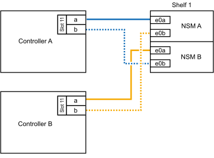
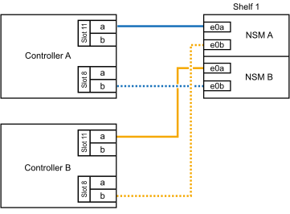
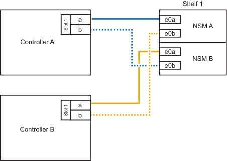
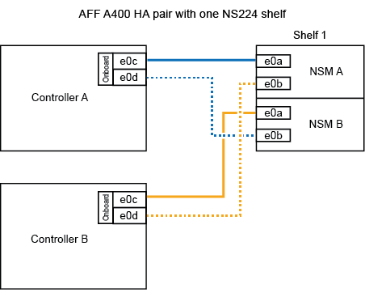

= Compartimento de cabos para sistemas ASA - NS224 gavetas
:allow-uri-read: 
:icons: font
:imagesdir: ../media/

[role="lead"]
Você faz a adição de cabos para cada gaveta de NS224 TB, de modo que cada gaveta tenha duas conexões a cada controladora no par de HA.

.Sobre esta tarefa
Seu sistema de hardware pode ser compatível com ambas as prateleiras NS224 com NSM100 módulos e NS224 prateleiras com NSM100B módulos. Para verificar a compatibilidade e os nomes das portas do hardware e das prateleiras, consulte o https://hwu.netapp.com["NetApp Hardware Universe"].

.Compartimento de cabos para ASA A1K
[%collapsible]
====
É possível adicionar mais três gavetas NS224 adicionais (para um total de quatro gavetas) a um par de HA ASA A1K.

.Antes de começar
* Tem de ter revisto a link:requirements-hot-add-shelf.html["requisitos e práticas recomendadas de adição dinâmica"].
* Você deve ter concluído os procedimentos aplicáveis no link:prepare-hot-add-shelf.html["Prepare-se para adicionar uma prateleira a quente"].
* Você precisa ter instalado as gavetas, ligado e definido as IDs de gaveta como descrito em link:prepare-hot-add-shelf.html["Instale uma prateleira para adicionar um hot-add"].

.Sobre esta tarefa
* Esse procedimento pressupõe que o seu par de HA tenha pelo menos uma gaveta de NS224 existente.
* Este procedimento aborda os seguintes cenários de adição dinâmica:
+
** Adição automática de uma segunda gaveta a um par de HA com dois módulos de e/S compatíveis com RoCE em cada controladora. (Você instalou um segundo módulo de e/S e reconetou a primeira gaveta para ambos os módulos de e/S ou já tinha a primeira gaveta cabeada para dois módulos de e/S. Você vai ligar a segunda gaveta a ambos os módulos de e/S).
** Adição automática de uma terceira gaveta a um par de HA com três módulos de e/S compatíveis com RoCE em cada controladora. (Você instalou um terceiro módulo de e/S e caberá a terceira prateleira somente ao terceiro módulo de e/S).
** Adição automática de uma terceira gaveta a um par de HA com quatro módulos de e/S compatíveis com RoCE em cada controladora. (Você instalou um terceiro e quarto módulo de e/S e caberá a terceira prateleira para o terceiro e quarto módulos de e/S).
** Adição automática de uma quarta gaveta a um par de HA com quatro módulos de e/S compatíveis com RoCE em cada controladora. (Você instalou um quarto módulo de e/S e reconetou a terceira gaveta para o terceiro e quarto módulos de e/S ou já tinha a terceira gaveta cabeada para o terceiro e quarto módulos de e/S. Você vai ligar a quarta prateleira para o terceiro e quarto módulo de e/S).

.Passos
. Se a gaveta de NS224 TB que você está adicionando quente for a segunda gaveta de NS224 TB no par de HA, execute as seguintes etapas.
+
Caso contrário, vá para a próxima etapa.

+
.. Compartimento de cabos NSM A porta e0a para controlador A slot 10 porta a (e10a).
.. Compartimento de cabos NSM A porta e0b para a porta b (e11b) do slot 11 do controlador B.
.. Compartimento de cabos NSM B porta e0a para a porta a (e10a) do slot B do controlador B slot 10.
.. Compartimento de cabos NSM B porta e0b para a porta b (e11b) do slot 11 do controlador A.
+
A ilustração a seguir destaca o cabeamento para a segunda gaveta do par de HA com dois módulos de e/S compatíveis com RoCE em cada controladora:

+
image::../media/drw_ns224_vino_m_2shelves_2cards_ieops-1642.svg[Cabeamento para AFF/ASA A1K com duas gavetas e dois módulos de e/S]

. Se o compartimento de NS224 TB que você estiver adicionando a quente for o terceiro compartimento de NS224 TB no par de HA com três módulos de e/S compatíveis com RoCE em cada controladora, execute as seguintes etapas. Caso contrário, vá para a próxima etapa.
+
.. Compartimento de cabos NSM A porta e0a para controlador A slot 9 porta a (e9a).
.. Compartimento de cabos NSM A porta e0b para a porta b (e9b) do slot 9 do controlador B.
.. Compartimento de cabos NSM B porta e0a para a porta a (e9a) do slot B do controlador B slot 9.
.. Compartimento de cabos NSM B porta e0b para a porta b (e9b) do slot 9 do controlador A.
+
A ilustração a seguir destaca o cabeamento da terceira gaveta do par de HA com três módulos de e/S compatíveis com RoCE em cada controladora:

+
image::../media/drw_ns224_vino_m_3shelves_3cards_ieops-1643.svg[Cabeamento para AFF/ASA A1K com três gavetas e três módulos de e/S]

. Se o compartimento de NS224 TB que você estiver adicionando a quente for o terceiro compartimento de NS224 TB no par de HA com quatro módulos de e/S compatíveis com RoCE em cada controladora, execute as seguintes etapas. Caso contrário, vá para a próxima etapa.
+
.. Compartimento de cabos NSM A porta e0a para controlador A slot 9 porta a (e9a).
.. Compartimento de cabos NSM A porta e0b para a porta b (e8b) do slot 8 do controlador B.
.. Compartimento de cabos NSM B porta e0a para a porta a (e9a) do slot B do controlador B slot 9.
.. Compartimento de cabos NSM B porta e0b para a porta b (e8b) do slot 8 do controlador A.
+
A ilustração a seguir destaca o cabeamento da terceira gaveta do par de HA com quatro módulos de e/S compatíveis com RoCE em cada controladora:

+
image::../media/drw_ns224_vino_m_3shelves_4cards_ieops-1644.svg[Cabeamento para AFF/ASA A1K com três gavetas e quatro módulos de e/S]

. Se o compartimento NS224 que você está adicionando a quente for o quarto compartimento NS224 no par de HA com quatro módulos de e/S compatíveis com RoCE em cada controladora, execute as seguintes etapas.
+
.. Compartimento de cabos NSM A porta e0a para controlador A slot 8 porta a (e8a).
.. Compartimento de cabos NSM A porta e0b para a porta b (e9b) do slot 9 do controlador B.
.. Compartimento de cabos NSM B porta e0a para a porta a (e8a) do slot B do controlador B slot 8.
.. Compartimento de cabos NSM B porta e0b para a porta b (e9b) do slot 9 do controlador A.
+
A ilustração a seguir destaca o cabeamento da quarta gaveta no par de HA com quatro módulos de e/S compatíveis com RoCE em cada controladora:

+
image::../media/drw_ns224_vino_m_4shelves_4cards_ieops-1645.svg[Cabeamento para AFF/ASA A1K com quatro gavetas e quatro módulos de e/S]

. Verifique se o compartimento hot-added está cabeado corretamente usando https://mysupport.netapp.com/site/tools/tool-eula/activeiq-configadvisor["Active IQ Config Advisor"^]o .
+
Se forem gerados erros de cabeamento, siga as ações corretivas fornecidas.

.O que se segue?
Se você desativou a atribuição automática de unidade como parte da preparação para este procedimento, será necessário atribuir manualmente a propriedade da unidade e, em seguida, reativar a atribuição automática de unidade, se necessário. Vá para link:complete-hot-add-shelf.html["Complete o hot-add"].

Caso contrário, você é feito com o procedimento de hot-add prateleira.

====
.Compartimento de cabos para ASA A20
[%collapsible]
====
É possível adicionar um máximo de NS224 gaveta a um par de HA ASA A20 quando for necessário storage adicional (para a gaveta interna).

.Antes de começar
* Tem de ter revisto a link:requirements-hot-add-shelf.html["requisitos e práticas recomendadas de adição dinâmica"].
* Você deve ter concluído os procedimentos aplicáveis no link:prepare-hot-add-shelf.html["Prepare-se para adicionar uma prateleira a quente"].
* Você precisa ter instalado as gavetas, ligado e definido as IDs de gaveta como descrito em link:prepare-hot-add-shelf.html["Instale uma prateleira para adicionar um hot-add"].

.Sobre esta tarefa
* Esse procedimento pressupõe que seu par de HA tenha apenas storage interno (sem gavetas externas) e que você esteja adicionando mais uma gaveta adicional.
* Este procedimento aborda os seguintes cenários de adição dinâmica:
+
** Adição automática da primeira gaveta a um par de HA com um módulo de e/S compatível com RoCE em cada controladora.
** Adição automática da primeira gaveta a um par de HA com dois módulos de e/S compatíveis com RoCE em cada controladora.

* Esses sistemas são compatíveis com as duas gavetas NS224 com NSM100 módulos e NS224 gavetas com NSM100B módulos. Para garantir que você faça o cabeamento de seus controladores às portas corretas, substitua o "X" em cada diagrama pelo número de porta correto para seu módulo:
+
[cols="1,4"]
|===
| Tipo de módulo | Rotulagem do porto 

 a| 
NSM100
 a| 
"0"

ex. e0a

 a| 
NSM100B
 a| 
"1"

ex. e1a

|===

.Passos
. Se você estiver adicionando um compartimento usando um conjunto de portas compatíveis com RoCE (um módulo de e/S compatível com RoCE) em cada módulo de controladora e esse for o único compartimento de NS224 TB do seu par de HA, execute as seguintes etapas.
+
Caso contrário, vá para a próxima etapa.

+

NOTE: Esta etapa pressupõe que você instalou o módulo de e/S compatível com RoCE no slot 3.

+
.. Compartimento de cabos NSM A porta Exa para controlador A slot 3 porta a (E3A).
.. Porta eXb do compartimento de cabos NSM A para a porta b (e3b) do slot 3 do controlador B.
.. Porta Exa do NSM B da gaveta de cabos para a porta a (E3A) do slot 3 do controlador B.
.. Porta eXb da gaveta de cabos NSM B para porta b (e3b) da ranhura 3 do controlador A.
+
A ilustração a seguir mostra o cabeamento de uma gaveta hot-added usando um módulo de e/S compatível com RoCE em cada módulo de controladora:

+
image::../media/drw_ns224_g_1shelf_1card_ieops-2002.svg[Cabeamento para AFF/ASA A20 com uma gaveta e um módulo de e/S]

. Se você estiver adicionando um compartimento usando dois conjuntos de portas compatíveis com RoCE (dois módulos de e/S compatíveis com RoCE) em cada módulo de controladora, execute as seguintes etapas.
+
.. Cabo NSM A porta Exa para controlador A slot 3 porta a (E3A).
.. Cabo NSM A porta eXb para o slot B do controlador 1 porta b (e1b).
.. Cabo NSM B porta Exa para o slot B do controlador 3 porta a (E3A).
.. Cabo NSM B porta eXb para controlador A slot 1 porta b (e1b).

A ilustração a seguir mostra o cabeamento de uma gaveta hot-added usando dois módulos de e/S compatíveis com RoCE em cada módulo de controladora:

image::../media/drw_ns224_g_1shelf_2card_ieops-2005.svg[Cabeamento para AFF/ASA A20 com uma gaveta e dois módulos de e/S]

. Verifique se o compartimento hot-added está cabeado corretamente usando https://mysupport.netapp.com/site/tools/tool-eula/activeiq-configadvisor["Active IQ Config Advisor"^]o .
+
Se forem gerados erros de cabeamento, siga as ações corretivas fornecidas.

.O que se segue?
Se você desativou a atribuição automática de unidade como parte da preparação para este procedimento, será necessário atribuir manualmente a propriedade da unidade e, em seguida, reativar a atribuição automática de unidade, se necessário. Vá para link:complete-hot-add-shelf.html["Complete o hot-add"].

Caso contrário, você é feito com o procedimento de hot-add prateleira.

====
.Compartimento de cabos para ASA A30 ou ASA A50
[%collapsible]
====
É possível adicionar mais de duas gavetas NS224 a um par de HA ASA A30 ou A50 quando for necessário storage adicional (para a gaveta interna).

.Antes de começar
* Tem de ter revisto a link:requirements-hot-add-shelf.html["requisitos e práticas recomendadas de adição dinâmica"].
* Você deve ter concluído os procedimentos aplicáveis no link:prepare-hot-add-shelf.html["Prepare-se para adicionar uma prateleira a quente"].
* Você precisa ter instalado as gavetas, ligado e definido as IDs de gaveta como descrito em link:prepare-hot-add-shelf.html["Instale uma prateleira para adicionar um hot-add"].

.Sobre esta tarefa
* Esse procedimento pressupõe que seu par de HA tenha apenas storage interno (sem compartimentos externos) e que você esteja adicionando "Hot-Adding" a duas gavetas adicionais e dois módulos de e/S com capacidade para RoCE em cada controladora.
* Este procedimento aborda os seguintes cenários de adição dinâmica:
+
** Adição automática da primeira gaveta a um par de HA com um módulo de e/S compatível com RoCE em cada controladora.
** Adição automática da primeira gaveta a um par de HA com dois módulos de e/S compatíveis com RoCE em cada controladora.
** Adição rápida da segunda gaveta a um par de HA com dois módulos de e/S compatíveis com RoCE em cada controladora.

* Esses sistemas são compatíveis com as duas gavetas NS224 com NSM100 módulos e NS224 gavetas com NSM100B módulos. Para garantir que você faça o cabeamento de seus controladores às portas corretas, substitua o "X" em cada diagrama pelo número de porta correto para seu módulo:
+
[cols="1,4"]
|===
| Tipo de módulo | Rotulagem do porto 

 a| 
NSM100
 a| 
"0"

ex. e0a

 a| 
NSM100B
 a| 
"1"

ex. e1a

|===

.Passos
. Se você estiver adicionando um compartimento usando um conjunto de portas compatíveis com RoCE (um módulo de e/S compatível com RoCE) em cada módulo de controladora e esse for o único compartimento de NS224 TB do seu par de HA, execute as seguintes etapas.
+
Caso contrário, vá para a próxima etapa.

+

NOTE: Esta etapa pressupõe que você instalou o módulo de e/S compatível com RoCE no slot 3.

+
.. Compartimento de cabos NSM A porta Exa para controlador A slot 3 porta a (E3A).
.. Porta eXb do compartimento de cabos NSM A para a porta b (e3b) do slot 3 do controlador B.
.. Porta Exa do NSM B da gaveta de cabos para a porta a (E3A) do slot 3 do controlador B.
.. Porta eXb da gaveta de cabos NSM B para porta b (e3b) da ranhura 3 do controlador A.
+
A ilustração a seguir mostra o cabeamento de uma gaveta hot-added usando um módulo de e/S compatível com RoCE em cada módulo de controladora:

+
image::../media/drw_ns224_g_1shelf_1card_ieops-2002.svg[Cabeamento para AFF/ASA A30,452px,AFF/ASA A50]

. Se você estiver adicionando uma ou duas gavetas usando dois conjuntos de portas compatíveis com RoCE (dois módulos de e/S compatíveis com RoCE) em cada módulo de controladora, execute as subetapas aplicáveis.
+

NOTE: Esta etapa pressupõe que você instalou os módulos de e/S compatíveis com RoCE nos slots 3 e 1.

+
[cols="1,3"]
|===
| Compartimentos | Cabeamento 

 a| 
Gaveta 1
 a| 
.. Cabo NSM A porta Exa para controlador A slot 3 porta a (E3A).
.. Cabo NSM A porta eXb para o slot B do controlador 1 porta b (e1b).
.. Cabo NSM B porta Exa para o slot B do controlador 3 porta a (E3A).
.. Cabo NSM B porta eXb para controlador A slot 1 porta b (e1b).
.. Se você estiver adicionando uma segunda prateleira a quente, conclua as subetapas "'prateleira 2"; caso contrário, vá para a etapa 3.

A ilustração a seguir mostra o cabeamento de uma gaveta hot-added usando dois módulos de e/S compatíveis com RoCE em cada módulo de controladora:

image::../media/drw_ns224_g_1shelf_2card_ieops-2005.svg[Cabeamento para AFF/ASA A30,452px,AFF/ASA A50]

 a| 
Gaveta 2
 a| 
.. Cabo NSM A porta Exa para controlador A slot 1 porta a (e1a).
.. Cabo NSM A porta eXb para o slot B do controlador 3 porta b (e3b).
.. Cabo NSM B porta Exa para o slot B do controlador 1 porta a (e1a).
.. Cabo NSM B porta eXb para controlador A slot 3 porta b (e3b).
.. Avance para o passo 3.

A ilustração a seguir mostra o cabeamento de duas prateleiras hot-added usando dois módulos de e/S compatíveis com RoCE em cada módulo de controladora:

image::../media/drw_ns224_g_2shelf_2card_ieops-2003.svg[Cabeamento para AFF A30/ASA,452px,AFF/ASA A50]

|===
. Verifique se o compartimento hot-added está cabeado corretamente usando https://mysupport.netapp.com/site/tools/tool-eula/activeiq-configadvisor["Active IQ Config Advisor"^]o .
+
Se forem gerados erros de cabeamento, siga as ações corretivas fornecidas.

.O que se segue?
Se você desativou a atribuição automática de unidade como parte da preparação para este procedimento, será necessário atribuir manualmente a propriedade da unidade e, em seguida, reativar a atribuição automática de unidade, se necessário. Vá para link:complete-hot-add-shelf.html["Complete o hot-add"].

Caso contrário, você é feito com o procedimento de hot-add prateleira.

====
.Compartimento de cabos para ASA A70 ou ASA A90
[%collapsible]
====
É possível adicionar sem desligamento até duas gavetas NS224 a um par de HA ASA A70 ou ASA A90 quando for necessário storage adicional (para a gaveta interna).

.Antes de começar
* Tem de ter revisto a link:requirements-hot-add-shelf.html["requisitos e práticas recomendadas de adição dinâmica"].
* Você deve ter concluído os procedimentos aplicáveis no link:prepare-hot-add-shelf.html["Prepare-se para adicionar uma prateleira a quente"].
* Você precisa ter instalado as gavetas, ligado e definido as IDs de gaveta como descrito em link:prepare-hot-add-shelf.html["Instale uma prateleira para adicionar um hot-add"].

.Sobre esta tarefa
* Esse procedimento pressupõe que seu par de HA tenha apenas storage interno (sem compartimentos externos) e que você esteja adicionando mais duas gavetas adicionais e dois módulos de e/S com capacidade para RoCE em cada controladora.
* Este procedimento aborda os seguintes cenários de adição dinâmica:
+
** Adição automática da primeira gaveta a um par de HA com um módulo de e/S compatível com RoCE em cada controladora.
** Adição automática da primeira gaveta a um par de HA com dois módulos de e/S compatíveis com RoCE em cada controladora.
** Adição rápida da segunda gaveta a um par de HA com dois módulos de e/S compatíveis com RoCE em cada controladora.

.Passos
. Se você estiver adicionando um compartimento usando um conjunto de portas compatíveis com RoCE (um módulo de e/S compatível com RoCE) em cada módulo de controladora e esse for o único compartimento de NS224 TB do seu par de HA, execute as seguintes etapas.
+
Caso contrário, vá para a próxima etapa.

+

NOTE: Esta etapa pressupõe que você instalou o módulo de e/S compatível com RoCE no slot 11.

+
.. Compartimento de cabos NSM A porta e0a para controlador A slot 11 porta a (e11a).
.. Compartimento de cabos NSM A porta e0b para a porta b (e11b) do slot 11 do controlador B.
.. Compartimento de cabos NSM B porta e0a para a porta a (e11a) do slot B do controlador B slot 11.
.. Compartimento de cabos NSM B porta e0b para a porta b (e11b) do slot 11 do controlador A.
+
A ilustração a seguir mostra o cabeamento de uma gaveta hot-added usando um módulo de e/S compatível com RoCE em cada módulo de controladora:

+

. Se você estiver adicionando uma ou duas gavetas usando dois conjuntos de portas compatíveis com RoCE (dois módulos de e/S compatíveis com RoCE) em cada módulo de controladora, execute as subetapas aplicáveis.
+

NOTE: Esta etapa pressupõe que você instalou os módulos de e/S compatíveis com RoCE nos slots 11 e 8.

+
[cols="1,3"]
|===
| Compartimentos | Cabeamento 

 a| 
Gaveta 1
 a| 
.. Cabo NSM A porta e0a para controlador A slot 11 porta a (e11a).
.. Cabo NSM A porta e0b para a porta b (e8b) do slot 8 do controlador B.
.. Cabo NSM B porta e0a para o slot B do controlador 11 porta a (e11a).
.. Cabo NSM B porta e0b para o slot 8 do controlador A porta b (e8b).
.. Se você estiver adicionando uma segunda prateleira a quente, conclua as subetapas "'prateleira 2"; caso contrário, vá para a etapa 3.

A ilustração a seguir mostra o cabeamento de uma gaveta hot-added usando dois módulos de e/S compatíveis com RoCE em cada módulo de controladora:

 a| 
Gaveta 2
 a| 
.. Cabo NSM A porta e0a para controlador A slot 8 porta a (e8a).
.. Cabo NSM A porta e0b para a porta b (e11b) do slot 11 do controlador B.
.. Cabo NSM B porta e0a para o slot B do controlador 8 porta a (e8a).
.. Cabo NSM B porta e0b para o slot 11 do controlador A porta b (e11b).
.. Avance para o passo 3.

A ilustração a seguir mostra o cabeamento de duas prateleiras hot-added usando dois módulos de e/S compatíveis com RoCE em cada módulo de controladora:

image::../media/drw_ns224_vino_i_2shelves_2cards_ieops-1641.svg[Cabeamento para AFF/ASA A70 ou A90 com duas gavetas e dois módulos de e/S]

|===
. Verifique se o compartimento hot-added está cabeado corretamente usando https://mysupport.netapp.com/site/tools/tool-eula/activeiq-configadvisor["Active IQ Config Advisor"^]o .
+
Se forem gerados erros de cabeamento, siga as ações corretivas fornecidas.

.O que se segue?
Se você desativou a atribuição automática de unidade como parte da preparação para este procedimento, será necessário atribuir manualmente a propriedade da unidade e, em seguida, reativar a atribuição automática de unidade, se necessário. Vá para link:complete-hot-add-shelf.html["Complete o hot-add"].

Caso contrário, você é feito com o procedimento de hot-add prateleira.

====
.Compartimento de cabos para ASA A250 ou ASA C250
[%collapsible]
====
Quando for necessário storage adicional, é possível adicionar um compartimento máximo de NS224 TB a um par de HA ASA A250 ou ASA C250.

.Antes de começar
* Tem de ter revisto a link:requirements-hot-add-shelf.html["requisitos e práticas recomendadas de adição dinâmica"].
* Você deve ter concluído os procedimentos aplicáveis no link:prepare-hot-add-shelf.html["Prepare-se para adicionar uma prateleira a quente"].
* Você precisa ter instalado as gavetas, ligado e definido as IDs de gaveta como descrito em link:prepare-hot-add-shelf.html["Instale uma prateleira para adicionar um hot-add"].

.Sobre esta tarefa
Quando vista da parte traseira do chassi da plataforma, a porta da placa compatível com RoCE à esquerda é a porta "a" (e1a) e a porta à direita é a porta "b" (e1b).

.Passos
. Faça o cabeamento das conexões da prateleira:
+
.. Compartimento de cabos NSM A porta e0a para controlador A slot 1 porta a (e1a).
.. Compartimento de cabos NSM A porta e0b para a porta b (e1b) do slot 1 do controlador B.
.. Compartimento de cabos NSM B porta e0a para a porta a (e1a) do slot B do controlador B slot 1.
.. Compartimento de cabos NSM B porta e0b para a porta b (e1b) do slot 1 do controlador A. A ilustração a seguir mostra o cabeamento da prateleira quando concluída.
+

. Verifique se o compartimento hot-added está cabeado corretamente usando https://mysupport.netapp.com/site/tools/tool-eula/activeiq-configadvisor["Active IQ Config Advisor"^]o .
+
Se forem gerados erros de cabeamento, siga as ações corretivas fornecidas.

.O que se segue?
Se você desativou a atribuição automática de unidade como parte da preparação para este procedimento, será necessário atribuir manualmente a propriedade da unidade e, em seguida, reativar a atribuição automática de unidade, se necessário. Vá para link:complete-hot-add-shelf.html["Complete o hot-add"].

Caso contrário, você é feito com o procedimento de hot-add prateleira.

====
.Compartimento de cabos para ASA A400 ou ASA C400
[%collapsible]
====
A forma como você utiliza uma gaveta de NS224 TB para adicionar hot-add depende de você ter um par de HA ASA A400 ou ASA C400.

.Antes de começar
* Tem de ter revisto a link:requirements-hot-add-shelf.html["requisitos e práticas recomendadas de adição dinâmica"].
* Você deve ter concluído os procedimentos aplicáveis no link:prepare-hot-add-shelf.html["Prepare-se para adicionar uma prateleira a quente"].
* Você precisa ter instalado as gavetas, ligado e definido as IDs de gaveta como descrito em link:prepare-hot-add-shelf.html["Instale uma prateleira para adicionar um hot-add"].

* Prateleira de cabos para um par AFF A400 HA*

Para um par de HA AFF A400, é possível adicionar mais quente a duas gavetas e usar portas integradas e0c/e0d e portas no slot 5 conforme necessário.

.Passos
. Se você estiver adicionando um compartimento usando um conjunto de portas compatíveis com RoCE (portas integradas compatíveis com RoCE) em cada controladora e esse for o único compartimento de NS224 TB do seu par de HA, execute as seguintes etapas.
+
Caso contrário, vá para a próxima etapa.

+
.. Compartimento de cabos NSM A porta e0a para a porta e0c do controlador A.
.. Compartimento de cabos NSM A porta e0b para a porta e0d do controlador B.
.. Compartimento de cabos NSM B porta e0a para a porta e0c do controlador B.
.. Compartimento de cabos NSM B porta e0b para a porta e0d do controlador A.
+
A ilustração a seguir mostra o cabeamento de uma gaveta hot-added usando um conjunto de portas compatíveis com RoCE em cada controladora:

+

. Se você estiver adicionando uma ou duas prateleiras usando dois conjuntos de portas compatíveis com RoCE (portas compatíveis com RoCE e placa PCIe) em cada controladora, execute as seguintes etapas.
+
[cols="1,3"]
|===
| Compartimentos | Cabeamento 

 a| 
Gaveta 1
 a| 
.. Cabo NSM A porta e0a para controlador A porta e0c.
.. Cabo NSM A porta e0b para o slot B do controlador 5 porta 2 (e5b).
.. Cabo NSM B porta e0a para a porta e0c do controlador B.
.. Cabo NSM B porta e0b para o slot 5 do controlador A porta 2 (e5b).
.. Se você estiver adicionando uma segunda prateleira a quente, conclua as subetapas "'prateleira 2"; caso contrário, vá para a etapa 3.

 a| 
Gaveta 2
 a| 
.. Cabo NSM A porta e0a para controlador A slot 5 porta 1 (E5A).
.. Cabo NSM A porta e0b para a porta e0d do controlador B.
.. Cabo NSM B porta e0a para o slot B do controlador 5 porta 1 (E5A).
.. Cabo NSM B porta e0b para a porta e0d do controlador A.
.. Avance para o passo 3.

|===
+
A ilustração a seguir mostra o cabeamento de duas prateleiras adicionadas a quente:

+
image::../media/drw_ns224_a400_2shelves_IEOPS-983.svg[Cabeamento para um /ASA A400 com duas gavetas NS224 e um conjunto de portas integradas e um conjunto de portas em placas PCIe]

. Verifique se o compartimento hot-added está cabeado corretamente usando https://mysupport.netapp.com/site/tools/tool-eula/activeiq-configadvisor["Active IQ Config Advisor"^]o .
+
Se forem gerados erros de cabeamento, siga as ações corretivas fornecidas.

. Se tiver desativado a atribuição automática de condução como parte da preparação para este procedimento, terá de atribuir manualmente a propriedade da unidade e, em seguida, voltar a ativar a atribuição automática de condução, se necessário. link:complete-hot-add-shelf.html["Complete o hot-add"]Consulte .
+
Caso contrário, você é feito com este procedimento.

* Prateleira de cabos para um par AFF C400 HA*

Para um par de HA da AFF C400, é possível adicionar mais quente a duas gavetas e usar portas nos slots 4 e 5, conforme necessário.

.Passos
. Se você estiver adicionando um compartimento usando um conjunto de portas compatíveis com RoCE em cada controladora e esse for o único compartimento de NS224 TB do seu par de HA, execute as seguintes etapas.
+
Caso contrário, vá para a próxima etapa.

+
.. Compartimento de cabos NSM A porta e0a para a porta 1 do slot 4 do controlador A (e4a).
.. Compartimento de cabos NSM A porta e0b para a porta 2 (e4b) do slot B do controlador 4.
.. Compartimento de cabos NSM B porta e0a para a porta 1 (e4a) do slot B do controlador B slot 4.
.. Compartimento de cabos NSM B porta e0b para o slot 4 do controlador A porta 2 (e4b).
+
A ilustração a seguir mostra o cabeamento de uma gaveta hot-added usando um conjunto de portas compatíveis com RoCE em cada controladora:

+
image::../media/drw_ns224_c400_1shelf_IEOPS-985.svg[Cabeamento para um AFF/ASA C400 com uma gaveta NS224 e um conjunto de portas de placa PCIe]

. Se você estiver adicionando uma ou duas gavetas usando dois conjuntos de portas compatíveis com RoCE em cada controladora, execute as seguintes etapas.
+
[cols="1,3"]
|===
| Compartimentos | Cabeamento 

 a| 
Gaveta 1
 a| 
.. Cabo NSM A porta e0a para controlador A slot 4 porta 1 (e4a).
.. Cabo NSM A porta e0b para o slot B do controlador 5 porta 2 (e5b).
.. Cabo NSM B porta e0a para o slot 4 da porta do controlador B porta 1 (e4a).
.. Cabo NSM B porta e0b para o slot 5 do controlador A porta 2 (e5b).
.. Se você estiver adicionando uma segunda prateleira a quente, conclua as subetapas "'prateleira 2"; caso contrário, vá para a etapa 3.

 a| 
Gaveta 2
 a| 
.. Cabo NSM A porta e0a para controlador A slot 5 porta 1 (E5A).
.. Cabo NSM A porta e0b para o slot B do controlador 4 porta 2 (e4b).
.. Cabo NSM B porta e0a para o slot B do controlador 5 porta 1 (E5A).
.. Cabo NSM B porta e0b para o slot 4 do controlador A porta 2 (e4b).
.. Avance para o passo 3.

|===
+
A ilustração a seguir mostra o cabeamento de duas prateleiras adicionadas a quente:

+
image::../media/drw_ns224_c400_2shelves_IEOPS-984.svg[Cabeamento para um AFF/ASA C400 com duas gavetas NS224 e dois conjuntos de portas de placa PCIe]

. Verifique se o compartimento hot-added está cabeado corretamente usando https://mysupport.netapp.com/site/tools/tool-eula/activeiq-configadvisor["Active IQ Config Advisor"^]o .
+
Se forem gerados erros de cabeamento, siga as ações corretivas fornecidas.

.O que se segue?
Se você desativou a atribuição automática de unidade como parte da preparação para este procedimento, será necessário atribuir manualmente a propriedade da unidade e, em seguida, reativar a atribuição automática de unidade, se necessário. Vá para link:complete-hot-add-shelf.html["Complete o hot-add"].

Caso contrário, você é feito com o procedimento de hot-add prateleira.

====
.Compartimento de cabos para ASA A800 ou ASA C800
[%collapsible]
====
A forma como você faz a cabeamento de uma gaveta de NS224 U em um par de HA ASA A800 ou ASA C800 depende do número de gavetas que você está adicionando ao quente e do número de conjuntos de portas com capacidade para RoCE (um ou dois) que você está usando nas controladoras.

.Antes de começar
* Tem de ter revisto a link:requirements-hot-add-shelf.html["requisitos e práticas recomendadas de adição dinâmica"].
* Você deve ter concluído os procedimentos aplicáveis no link:prepare-hot-add-shelf.html["Prepare-se para adicionar uma prateleira a quente"].
* Você precisa ter instalado as gavetas, ligado e definido as IDs de gaveta como descrito em link:prepare-hot-add-shelf.html["Instale uma prateleira para adicionar um hot-add"].

.Passos
. Se você estiver adicionando um compartimento usando um conjunto de portas compatíveis com RoCE (uma placa PCIe compatível com RoCE) em cada controladora e esse for o único compartimento de NS224 TB do seu par de HA, execute as seguintes etapas.
+
Caso contrário, vá para a próxima etapa.

+

NOTE: Esta etapa pressupõe que você instalou a placa PCIe compatível com RoCE no slot 5.

+
.. Compartimento de cabos NSM A porta e0a para controlador A slot 5 porta a (E5A).
.. Compartimento de cabos NSM A porta e0b para a porta b (e5b) do slot 5 do controlador B.
.. Compartimento de cabos NSM B porta e0a para a porta a (E5A) do slot B do controlador B slot 5.
.. Compartimento de cabos NSM B porta e0b para a porta b (e5b) do slot 5 do controlador A.
+
A ilustração a seguir mostra o cabeamento de uma gaveta hot-added usando uma placa PCIe compatível com RoCE em cada controladora:

+
image::../media/drw_ns224_a800_c800_1shelf_IEOPS-964.svg[Cabeamento para AFF/ASA A800 ou AFF/ASA C800 com uma gaveta NS224 e uma placa PCIe]

. Se você estiver adicionando uma ou duas prateleiras usando dois conjuntos de portas compatíveis com RoCE (duas placas PCIe compatíveis com RoCE) em cada controladora, execute as subetapas aplicáveis.
+

NOTE: Esta etapa pressupõe que você instalou as placas PCIe compatíveis com RoCE no slot 5 e slot 3.

+
[cols="1,3"]
|===
| Compartimentos | Cabeamento 

 a| 
Gaveta 1
 a| 

NOTE: Essas subetapas supõem que você está começando o cabeamento pela porta da gaveta de cabeamento e0a para a placa PCIe compatível com RoCE no slot 5, em vez do slot 3.

.. Cabo NSM A porta e0a para controlador A slot 5 porta a (E5A).
.. Cabo NSM A porta e0b para a porta b (e3b) do slot 3 do controlador B.
.. Cabo NSM B porta e0a para o slot B do controlador 5 porta a (E5A).
.. Cabo NSM B porta e0b para o slot 3 do controlador A porta b (e3b).
.. Se você estiver adicionando uma segunda prateleira a quente, conclua as subetapas "'prateleira 2"; caso contrário, vá para a etapa 3.

 a| 
Gaveta 2
 a| 

NOTE: Essas subetapas supõem que você está começando o cabeamento pela porta da gaveta de cabeamento e0a para a placa PCIe compatível com RoCE no slot 3, em vez do slot 5 (que se correlaciona com as subetapas de cabeamento para a gaveta 1).

.. Cabo NSM A porta e0a para controlador A slot 3 porta a (E3A).
.. Cabo NSM A porta e0b para a porta b (e5b) do slot 5 do controlador B.
.. Cabo NSM B porta e0a para o slot B do controlador 3 porta a (E3A).
.. Cabo NSM B porta e0b para o slot 5 do controlador A porta b (e5b).
.. Avance para o passo 3.

|===
+
A ilustração a seguir mostra o cabeamento de duas prateleiras adicionadas a quente:

+
image::../media/drw_ns224_a800_c800_2shelves_IEOPS-966.svg[drw ns224 A800 C800 2shelves IEOPS 966]

. Verifique se o compartimento hot-added está cabeado corretamente usando https://mysupport.netapp.com/site/tools/tool-eula/activeiq-configadvisor["Active IQ Config Advisor"^]o .
+
Se forem gerados erros de cabeamento, siga as ações corretivas fornecidas.

.O que se segue?
Se você desativou a atribuição automática de unidade como parte da preparação para este procedimento, será necessário atribuir manualmente a propriedade da unidade e, em seguida, reativar a atribuição automática de unidade, se necessário. Vá para link:complete-hot-add-shelf.html["Complete o hot-add"].

Caso contrário, você é feito com o procedimento de hot-add prateleira.

====
.Prateleira de cabos para ASA A900
[%collapsible]
====
Quando for necessário storage adicional, é possível adicionar mais três gavetas de unidade de NS224 TB adicionais (para um total de quatro gavetas) a um par de HA da ASA A900.

.Antes de começar
* Tem de ter revisto a link:requirements-hot-add-shelf.html["requisitos e práticas recomendadas de adição dinâmica"].
* Você deve ter concluído os procedimentos aplicáveis no link:prepare-hot-add-shelf.html["Prepare-se para adicionar uma prateleira a quente"].
* Você precisa ter instalado as gavetas, ligado e definido as IDs de gaveta como descrito em link:prepare-hot-add-shelf.html["Instale uma prateleira para adicionar um hot-add"].

.Sobre esta tarefa
* Esse procedimento pressupõe que o seu par de HA tenha pelo menos uma gaveta de NS224 existente e que você esteja adicionando mais três gavetas adicionais.
* Se o seu par de HA tiver apenas uma gaveta de NS224 TB existente, esse procedimento pressupõe que o compartimento seja cabeado por dois módulos de e/S 100GbE compatíveis com RoCE em cada controladora.

.Passos
. Se a gaveta de NS224 TB que você está adicionando quente for a segunda gaveta de NS224 TB no par de HA, execute as seguintes etapas.
+
Caso contrário, vá para a próxima etapa.

+
.. Compartimento de cabos NSM A porta e0a para controlador A slot 10 porta a (e10a).
.. Compartimento de cabos NSM A porta e0b para a porta b (E2B) do slot 2 do controlador B.
.. Compartimento de cabos NSM B porta e0a para a porta a (e10a) do slot B do controlador B slot 10.
.. Compartimento de cabos NSM B porta e0b para a porta b (E2B) do slot 2 do controlador A.
+
A ilustração a seguir mostra o cabeamento da segunda gaveta (e a primeira gaveta).

+
image::../media/drw_ns224_a900_2shelves.png[Cabeamento para AFF/ASA A900 com duas gavetas NS224 e dois módulos de e/S]

. Se a gaveta de NS224 TB que você está adicionando quente for a terceira gaveta de NS224 TB no par de HA, execute as seguintes etapas.
+
Caso contrário, vá para a próxima etapa.

+
.. Compartimento de cabos NSM A porta e0a para controlador A slot 1 porta a (e1a).
.. Compartimento de cabos NSM A porta e0b para a porta b (e11b) do slot 11 do controlador B.
.. Compartimento de cabos NSM B porta e0a para a porta a (e1a) do slot B do controlador B slot 1.
.. Compartimento de cabos NSM B porta e0b para a porta b (e11b) do slot 11 do controlador A.
+
A ilustração a seguir mostra o cabeamento da terceira prateleira.

+
image::../media/drw_ns224_a900_3shelves.png[Cabeamento para AFF/ASA A900 com três gavetas NS224 e quatro módulos de e/S]

. Se a gaveta NS224 que você está adicionando quente for a quarta gaveta NS224 no par de HA, execute as seguintes etapas.
+
Caso contrário, vá para a próxima etapa.

+
.. Compartimento de cabos NSM A porta e0a para controlador A slot 11 porta a (e11a).
.. Compartimento de cabos NSM A porta e0b para a porta b (e1b) do slot 1 do controlador B.
.. Compartimento de cabos NSM B porta e0a para a porta a (e11a) do slot B do controlador B slot 11.
.. Compartimento de cabos NSM B porta e0b para a porta b (e1b) do slot 1 do controlador A.
+
A ilustração a seguir mostra o cabeamento da quarta prateleira.

+
image::../media/drw_ns224_a900_4shelves.png[Cabeamento para AFF/ASA A900 com quatro gavetas NS224 e quatro módulos de e/S]

. Verifique se o compartimento hot-added está cabeado corretamente usando https://mysupport.netapp.com/site/tools/tool-eula/activeiq-configadvisor["Active IQ Config Advisor"^]o .
+
Se forem gerados erros de cabeamento, siga as ações corretivas fornecidas.

.O que se segue?
Se você desativou a atribuição automática de unidade como parte da preparação para este procedimento, será necessário atribuir manualmente a propriedade da unidade e, em seguida, reativar a atribuição automática de unidade, se necessário. Vá para link:complete-hot-add-shelf.html["Complete o hot-add"].

Caso contrário, você é feito com o procedimento de hot-add prateleira.

====