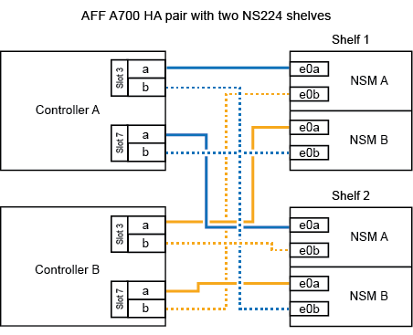

= Compartimento de cabos para sistemas de fim de disponibilidade - NS224 gavetas
:allow-uri-read: 
:icons: font
:imagesdir: ../media/

[role="lead"]
Você faz a adição de cabos para cada gaveta de NS224 TB, de modo que cada gaveta tenha duas conexões a cada controladora no par de HA.

.Prateleira de cabos para AFF A320
[%collapsible]
====
É possível adicionar uma segunda gaveta a um par de HA existente quando for necessário storage adicional.

.Antes de começar
* Tem de ter revisto a link:requirements-hot-add-shelf.html["requisitos e práticas recomendadas de adição dinâmica"].
* Você deve ter concluído os procedimentos aplicáveis no link:prepare-hot-add-shelf.html["Prepare-se para adicionar uma prateleira a quente"].
* Você precisa ter instalado as gavetas, ligado e definido as IDs de gaveta como descrito em link:prepare-hot-add-shelf.html["Instale uma prateleira para adicionar um hot-add"].

.Passos
. Prenda o compartimento às controladoras.
+
.. Cabo NSM A porta e0a para controlador A porta e0e.
.. Cabo NSM A porta e0b para a porta e0b do controlador B.
.. Cabo NSM B porta e0a para a porta e0e do controlador B.
.. Cabo NSM B porta e0b para a porta e0b do controlador A. A ilustração a seguir mostra o cabeamento para a prateleira hot-added (prateleira 2):
+
image::../media/drw_ns224_a320_2shelves_direct_attached.png[Cabeamento de um AFF A320 com duas gavetas NS224 e três conjuntos de portas integradas]

. Verifique se o compartimento hot-added está cabeado corretamente usando https://mysupport.netapp.com/site/tools/tool-eula/activeiq-configadvisor["Active IQ Config Advisor"^]o .
+
Se forem gerados erros de cabeamento, siga as ações corretivas fornecidas.

.O que se segue?
Se você desativou a atribuição automática de unidade como parte da preparação para este procedimento, será necessário atribuir manualmente a propriedade da unidade e, em seguida, reativar a atribuição automática de unidade, se necessário. Vá para link:complete-hot-add-shelf.html["Complete o hot-add"].

Caso contrário, você é feito com o procedimento de hot-add prateleira.

====
.Prateleira de cabos para AFF A700
[%collapsible]
====
A forma como você faz o cabeamento de uma gaveta de NS224 a um par de HA do AFF A700 depende do número de gavetas que você está adicionando ao quente e do número de conjuntos de portas com capacidade para RoCE (um ou dois) que você está usando nas controladoras.

.Antes de começar
* Tem de ter revisto a link:requirements-hot-add-shelf.html["requisitos e práticas recomendadas de adição dinâmica"].
* Você deve ter concluído os procedimentos aplicáveis no link:prepare-hot-add-shelf.html["Prepare-se para adicionar uma prateleira a quente"].
* Você precisa ter instalado as gavetas, ligado e definido as IDs de gaveta como descrito em link:prepare-hot-add-shelf.html["Instale uma prateleira para adicionar um hot-add"].
* Se você estiver adicionando o shelf inicial de NS224 TB (não há compartimento de NS224 TB no seu par de HA), instale um módulo de despejo de memória (X9170A GB, NVMe 1TB SSD) em cada controladora para dar suporte a despejos de núcleo (armazenar arquivos de núcleo).
+
link:../fas9000/caching-module-and-core-dump-module-replace.html["Substitua o módulo de armazenamento em cache ou adicione/substitua um módulo de despejo de núcleo - AFF A700 e FAS9000"^]Consulte .

.Passos
. Se você estiver adicionando um compartimento usando um conjunto de portas compatíveis com RoCE (um módulo de e/S compatível com RoCE) em cada controladora e esse for o único compartimento de NS224 TB do seu par de HA, execute as seguintes etapas.
+
Caso contrário, vá para a próxima etapa.

+

NOTE: Esta etapa pressupõe que você instalou o módulo de e/S compatível com RoCE no slot 3, em vez do slot 7, em cada controlador.

+
.. Prateleira de cabos NSM A porta e0a para controlador A slot 3 porta a..
.. Compartimento de cabos NSM A porta e0b para a porta B do slot 3 do controlador b.
.. Compartimento de cabos NSM B porta e0a para a 3 porta a. do slot B do controlador B..
.. Compartimento de cabos NSM B porta e0b para a porta b do slot 3 do controlador A.
+
A ilustração a seguir mostra o cabeamento de uma gaveta hot-added usando um módulo de e/S compatível com RoCE em cada controladora:

+
image::../media/drw_ns224_a700_1shelf.png[Cabeamento de um AFF A700 com uma gaveta de NS224 U e um conjunto de portas do módulo de e/S]

. Se você estiver adicionando uma ou duas gavetas usando dois conjuntos de portas compatíveis com RoCE (dois módulos de e/S compatíveis com RoCE) em cada controladora, execute as subetapas aplicáveis.
+
[cols="1,3"]
|===
| Compartimentos | Cabeamento 

 a| 
Gaveta 1
 a| 

NOTE: Essas subetapas supõem que você está iniciando o cabeamento pela porta da gaveta de cabeamento e0a para o módulo de e/S compatível com RoCE no slot 3, em vez do slot 7.

.. Cabo NSM A porta e0a para controlador A slot 3 porta a..
.. Cabo NSM A porta e0b para a porta B do slot 7 do controlador b.
.. Cabo NSM B porta e0a para a 3 porta a. do slot B do controlador B..
.. Cabo NSM B porta e0b para controlador A slot 7 porta b..
.. Se você estiver adicionando uma segunda prateleira com o produto em funcionamento, conclua as subetapas "`Prateleira 2`"; caso contrário, vá para a próxima etapa.

 a| 
Gaveta 2
 a| 

NOTE: Essas subetapas supõem que você está iniciando o cabeamento pela porta da gaveta de cabeamento e0a para o módulo de e/S compatível com RoCE no slot 7, em vez do slot 3 (que se correlaciona com as subetapas de cabeamento para a gaveta 1).

.. Cabo NSM A porta e0a para controlador A slot 7 porta a..
.. Cabo NSM A porta e0b para a porta B do slot 3 do controlador b.
.. Cabo NSM B porta e0a para a 7 porta a. do slot B do controlador B..
.. Cabo NSM B porta e0b para controlador A slot 3 porta b..
.. Vá para a próxima etapa.

|===
+
A ilustração a seguir mostra o cabeamento para a primeira e segunda prateleiras hot-added:

+

. Verifique se o compartimento hot-added está cabeado corretamente usando https://mysupport.netapp.com/site/tools/tool-eula/activeiq-configadvisor["Active IQ Config Advisor"^]o .
+
Se forem gerados erros de cabeamento, siga as ações corretivas fornecidas.

.O que se segue?
Se você desativou a atribuição automática de unidade como parte da preparação para este procedimento, será necessário atribuir manualmente a propriedade da unidade e, em seguida, reativar a atribuição automática de unidade, se necessário. Vá para link:complete-hot-add-shelf.html["Complete o hot-add"].

Caso contrário, você é feito com o procedimento de hot-add prateleira.

====
.Prateleira de cabos para FAS500f
[%collapsible]
====
Quando for necessário storage adicional, é possível adicionar um compartimento de NS224 TB a um par de HA da FAS500f.

.Antes de começar
* Tem de ter revisto a link:requirements-hot-add-shelf.html["requisitos e práticas recomendadas de adição dinâmica"].
* Você deve ter concluído os procedimentos aplicáveis no link:prepare-hot-add-shelf.html["Prepare-se para adicionar uma prateleira a quente"].
* Você precisa ter instalado as gavetas, ligado e definido as IDs de gaveta como descrito em link:prepare-hot-add-shelf.html["Instale uma prateleira para adicionar um hot-add"].

.Sobre esta tarefa
Quando vista da parte traseira do chassi da plataforma, a porta da placa compatível com RoCE à esquerda é a porta "a" (e1a) e a porta à direita é a porta "b" (e1b).

.Passos
. Faça o cabeamento das conexões da prateleira:
+
.. Compartimento de cabos NSM A porta e0a para controlador A slot 1 porta a (e1a).
.. Compartimento de cabos NSM A porta e0b para a porta b (e1b) do slot 1 do controlador B.
.. Compartimento de cabos NSM B porta e0a para a porta a (e1a) do slot B do controlador B slot 1.
.. Compartimento de cabos NSM B porta e0b para a porta b (e1b) do slot 1 do controlador A. A ilustração a seguir mostra o cabeamento da prateleira quando concluída.
+
image::../media/drw_ns224_a250_c250_f500f_1shelf_ieops-1824.svg[Cabeamento de FAS500f AFF A250 ou AFF C250 com uma gaveta de NS224 e um conjunto de portas]

. Verifique se o compartimento hot-added está cabeado corretamente usando https://mysupport.netapp.com/site/tools/tool-eula/activeiq-configadvisor["Active IQ Config Advisor"^]o .
+
Se forem gerados erros de cabeamento, siga as ações corretivas fornecidas.

.O que se segue?
Se você desativou a atribuição automática de unidade como parte da preparação para este procedimento, será necessário atribuir manualmente a propriedade da unidade e, em seguida, reativar a atribuição automática de unidade, se necessário. Vá para link:complete-hot-add-shelf.html["Complete o hot-add"].

Caso contrário, você é feito com o procedimento de hot-add prateleira.

====