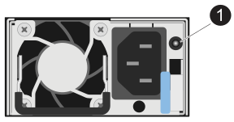

= Monitore os LEDs do compartimento de unidades - NS224 gavetas
:allow-uri-read: 
:icons: font
:imagesdir: ../media/

[role="lead"]
Você pode monitorar a integridade do compartimento de unidades compreendendo a localização e as condições de status dos LEDs nos componentes do compartimento de unidades.

* Os LEDs de localização (azul), no painel de exibição do operador (ODP) de uma prateleira e em ambos os NSMs, podem ser ativados para ajudar a localizar fisicamente a prateleira que precisa de manutenção: `storage shelf location-led modify -shelf-name _shelf_name_ -led-status on`
+
Se você não souber `_shelf_name_` o do compartimento afetado, execute o `storage shelf show` comando.

+
Os LEDs de localização permanecem acesos durante 30 minutos. Você pode desativá-los digitando o mesmo comando, mas usando a `off` opção.

* Um estado de LED pode ser:
+
** "On" (ligado): A iluminação do LED está fixa/fixa
** "OFF" (Desligado): O LED não está aceso
** "Blink": O LED liga-se e desliga-se em intervalos variáveis, dependendo do estado da FRU
** "Qualquer estado": O LED pode estar "ligado", "desligado" ou "intermitente"

== LEDs do painel de visualização do operador

Os LEDs no painel frontal do monitor do operador (ODP) do compartimento de unidades indicam se o compartimento de unidades está funcionando normalmente ou se há problemas com o hardware.

A ilustração e a tabela a seguir descrevem os três LEDs no ODP:

image::../media/drw_ns224_odp_leds_IEOPS-1262.svg[LEDs do painel de visualização do operador]

[cols="1,2,1,5"]
|===
| Ícone LED | Nome e cor do LED | Estado | Descrição 

 a| 
image::../media/drw_sas_power_icon.svg[LED de alimentação do painel do visor do operador]
 a| 
Potência (verde)
 a| 
Ligado
 a| 
Uma ou mais fontes de alimentação estão fornecendo energia para o compartimento de unidades.

 a| 
image::../media/drw_sas_fault_icon.svg[LED de atenção do painel de visualização do operador]
 a| 
Atenção (âmbar)
 a| 
Ligado
 a| 
* Ocorreu um erro com a função de uma das mais FRUs de gaveta.
+
Verifique as mensagens de eventos para determinar as ações corretivas a serem tomadas.

* Se o ID do compartimento de dois dígitos também estiver piscando, o ID do compartimento está em um estado pendente.
+
Ligue o compartimento de unidades para que o ID do compartimento afete.

 a| 
image::../media/drw_sas3_location_icon.svg[LED de localização do painel de visualização do operador]
 a| 
Localização (azul)
 a| 
Ligado
 a| 
O administrador do sistema ativou esta função LED.

|===

== LEDs NSM

Os LEDs em um NSM indicam se o módulo está funcionando normalmente, se ele está pronto para tráfego de e/S e se há algum problema com o hardware.

A ilustração e as tabelas a seguir descrevem os LEDs NSM associados à função de um módulo e à função de cada porta NVMe em um módulo.

[role="tabbed-block"]
====
.NSM100 módulos
--
image::../media/drw_ns224_nsm_leds_IEOPS-1270.svg[NS224 NSM100 LEDs do módulo]

[cols="1,1,2,4"]
|===
| Chamada para fora | Ícone LED | Cor | Descrição 

 a| 
image:../media/icon_round_1.png["Legenda número 1"]
 a| 
image::../media/drw_sas3_location_icon.svg[LED de localização do painel de visualização do operador]
 a| 
Azul
 a| 
NSM: Localização

 a| 
image:../media/icon_round_2.png["Legenda número 2"]
 a| 
image::../media/drw_sas_fault_icon.svg[LED de atenção do painel de visualização do operador]
 a| 
Âmbar
 a| 
NSM: Atenção

 a| 
image:../media/icon_round_3.png["Legenda número 3"]
 a| 
LNK
 a| 
Verde
 a| 
Porta/link NVMe: Status

 a| 
image:../media/icon_round_4.png["Legenda número 4"]
 a| 
image::../media/drw_sas_fault_icon.svg[LED de atenção do painel de visualização do operador]
 a| 
Âmbar
 a| 
Porta/link NVMe: Atenção

|===
--
.NSM100B módulos
--
image::../media/drw_ns224_nsmb_leds_ieops-2004.svg[NS224 NSM100B LEDs do módulo]

[cols="1,1,2,4"]
|===
| Chamada para fora | Ícone LED | Cor | Descrição 

 a| 
image:../media/icon_round_1.png["Legenda número 1"]
 a| 
LNK
 a| 
Verde
 a| 
Porta/link NVMe: Status

 a| 
image:../media/icon_round_2.png["Legenda número 2"]
 a| 
image::../media/drw_sas_fault_icon.svg[LED de atenção do painel de visualização do operador]
 a| 
Âmbar
 a| 
Porta/link NVMe: Atenção

 a| 
image:../media/icon_round_3.png["Legenda número 3"]
 a| 
image::../media/drw_sas_fault_icon.svg[LED de atenção do painel de visualização do operador]
 a| 
Âmbar
 a| 
Módulo I/o: Estado

 a| 
image:../media/icon_round_4.png["Legenda número 4"]
 a| 
image::../media/drw_sas3_location_icon.svg[LED de localização do painel de visualização do operador]
 a| 
Azul
 a| 
NSM: Localização

 a| 
image:../media/icon_round_5.png["Legenda número 5"]
 a| 
image::../media/drw_sas_fault_icon.svg[LED de atenção do painel de visualização do operador]
 a| 
Âmbar
 a| 
NSM: Atenção

|===
--
====
[cols="2,1,1,1"]
|===
| Estado | Atenção do NSM (âmbar) | Port LNK (Verde) | Atenção da porta (âmbar) 

 a| 
NSM normal
 a| 
Desligado
 a| 
Qualquer estado
 a| 
Desligado

 a| 
Avaria NSM
 a| 
Ligado
 a| 
Qualquer estado
 a| 
Qualquer estado

 a| 
Erro VPD NSM
 a| 
Ligado
 a| 
Qualquer estado
 a| 
Qualquer estado

 a| 
Sem conexão de porta de host
 a| 
Qualquer estado
 a| 
Desligado
 a| 
Desligado

 a| 
Link de conexão da porta do host ativo
 a| 
Qualquer estado
 a| 
Ligado/pisca com a atividade
 a| 
Qualquer estado

 a| 
Conexão da porta do host com falha
 a| 
Ligado
 a| 
Ligar/desligar se todas as faixas estiverem com defeito
 a| 
Ligado

 a| 
Inicialização do BIOS a partir da imagem do BIOS após a inicialização
 a| 
Pisca
 a| 
Qualquer estado
 a| 
Qualquer estado

|===

== LEDs da fonte de alimentação

Os LEDs de uma fonte de alimentação CA ou CC (PSU) indicam se a PSU está funcionando normalmente ou se há problemas de hardware.

A ilustração e as tabelas a seguir descrevem o LED em uma PSU. (A ilustração é uma PSU CA; no entanto, a localização do LED é a mesma na PSU DC):

[cols="1,4"]
|===
| Chamada para fora | Descrição 

 a| 
image:../media/icon_round_1.png["Legenda número 1"]
 a| 
O LED bicolor indica alimentação/atividade quando verde e uma avaria quando vermelho.

|===
[cols="2,1,1"]
|===
| Estado | Potência/atividade (verde) | Atenção (vermelho) 

 a| 
Sem alimentação CA/CC para o compartimento
 a| 
Desligado
 a| 
Desligado

 a| 
Sem alimentação CA/CC para a PSU
 a| 
Desligado
 a| 
Ligado

 a| 
Alimentação CA/CC ligada, mas a PSU não está no compartimento
 a| 
Pisca
 a| 
Desligado

 a| 
PSU funcionando corretamente
 a| 
Ligado
 a| 
Desligado

 a| 
Falha PSU
 a| 
Desligado
 a| 
Ligado

 a| 
Falha da ventoinha
 a| 
Desligado
 a| 
Ligado

 a| 
Modo de atualização do firmware
 a| 
Pisca
 a| 
Desligado

|===

== LEDs da unidade

Os LEDs em uma unidade NVMe indicam se ela está funcionando normalmente ou se há problemas com o hardware.

A ilustração e as tabelas a seguir descrevem os dois LEDs em uma unidade NVMe:

image::../media/drw_ns224_drive_leds_IEOPS-1263.svg[LEDs de atenção e energia da unidade NVMe]

[cols="1,2,2"]
|===
| Chamada para fora | Nome do LED | Cor 

 a| 
image:../media/icon_round_1.png["Legenda número 1"]
 a| 
Atenção
 a| 
Âmbar

 a| 
image:../media/icon_round_2.png["Legenda número 2"]
 a| 
Potência/atividade
 a| 
Verde

|===
[cols="2,1,1,1"]
|===
| Estado | Potência/atividade (verde) | Atenção (âmbar) | LED ODP associado 

 a| 
Unidade instalada e operacional
 a| 
Ligado/pisca com a atividade
 a| 
Qualquer estado
 a| 
N/A.

 a| 
Falha da unidade
 a| 
Ligado/pisca com a atividade
 a| 
Ligado
 a| 
Atenção (âmbar)

 a| 
Conjunto de identificação do dispositivo SES
 a| 
Ligado/pisca com a atividade
 a| 
Pisca
 a| 
Atenção (âmbar) desligada

 a| 
Conjunto de bits de falha do dispositivo SES
 a| 
Ligado/pisca com a atividade
 a| 
Ligado
 a| 
Atenção (âmbar)

 a| 
Avaria no circuito de controlo da alimentação
 a| 
Desligado
 a| 
Qualquer estado
 a| 
Atenção (âmbar)

|===