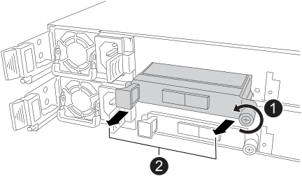

= Substitua o módulo de e/S Ethernet - NS224 gavetas por NSM100B módulos
:allow-uri-read: 
:icons: font
:imagesdir: ../media/

[role="lead"]
Você pode substituir um módulo de e/S Ethernet com falha sem interrupções em um compartimento de unidade de NS224 TB que esteja ligado e enquanto e/S estiver em andamento. Este procedimento aplica-se apenas a NS224 prateleiras com NSM100B módulos.

.Antes de começar
* O NSM do parceiro do compartimento deve estar ativo e em execução, e ser cabeado corretamente, para que o compartimento mantenha a conectividade quando você remover o NSM com falha.
+
https://mysupport.netapp.com/site/tools/tool-eula/activeiq-configadvisor["NetApp Downloads: Config Advisor"^]

* Todos os outros componentes do sistema devem estar a funcionar corretamente.

.Sobre esta tarefa
* Aguarde pelo menos 70 segundos entre a remoção e a instalação do módulo de gaveta NVMe (NSM).
+
Isso permite tempo suficiente para que o ONTAP processe o evento de remoção de NSM.

* *Prática recomendada:* a prática recomendada é ter versões atuais do firmware do módulo de gaveta NVMe (NSM) e do firmware da unidade em seu sistema antes de substituir componentes FRU.
+
https://mysupport.netapp.com/site/downloads/firmware/disk-shelf-firmware["Downloads do NetApp: Firmware da gaveta de disco"^]

+
https://mysupport.netapp.com/site/downloads/firmware/disk-drive-firmware["Downloads do NetApp: Firmware da unidade de disco"^]

+
[NOTE]
====
Não reverta o firmware para uma versão que não suporte a gaveta e seus componentes.

====
* O firmware do shelf (NSM) é atualizado automaticamente (sem interrupções) em um novo NSM que tenha uma versão de firmware não atual.
+
As verificações de firmware do NSM ocorrem a cada 10 minutos. Uma atualização de firmware NSM pode levar até 30 minutos.

* Se necessário, você pode ligar os LEDs de localização da prateleira (azul) para ajudar a localizar fisicamente a prateleira afetada: `storage shelf location-led modify -shelf-name _shelf_name_ -led-status on`
+
Se você não souber `shelf_name` o do compartimento afetado, execute o `storage shelf show` comando.

+
Uma prateleira tem três LEDs de localização: Um no painel de visualização do operador e um em cada NSM. Os LEDs de localização permanecem acesos durante 30 minutos. Você pode desativá-los digitando o mesmo comando, mas usando a `off` opção.

* Quando você desembalar o NSM de substituição, salve todos os materiais de embalagem para uso quando retornar o NSM com falha.
+
Se você precisar do número RMA ou de ajuda adicional com o procedimento de substituição, entre em Contato com o suporte técnico em https://mysupport.netapp.com/site/global/dashboard["Suporte à NetApp"^], 888-463-8277 (América do Norte), 00-800-44-638277 (Europa) ou 800-800-80-800 (Ásia/Pacífico).

.Passos
. Aterre-se corretamente.
. Desconete o cabeamento do NSM que contém a FRU que você está substituindo:
+
.. Desconete o cabo de alimentação da fonte de alimentação abrindo o retentor do cabo de alimentação se for uma fonte de alimentação CA ou desapertando os dois parafusos de orelhas se for uma fonte de alimentação CC e, em seguida, desconete o cabo de alimentação da fonte de alimentação.
+
As fontes de alimentação não têm um interrutor de alimentação.

.. Desconete o cabeamento de armazenamento das portas NSM.
+
Anote as portas NSM às quais cada cabo está conetado. Reconete os cabos às mesmas portas quando você reinserir o NSM, mais adiante neste procedimento.

. Retire o NSM:
+
image::../media/drw_g_and_t_handles_remove_ieops-1837.svg[Retire o NSM.]

+
[cols="1,4"]
|===

 a| 
image::../media/icon_round_1.png[Legenda número 1]
 a| 
Em ambas as extremidades do NSM, empurre as patilhas de bloqueio verticais para fora para soltar as pegas.

 a| 
image::../media/icon_round_2.png[Legenda número 2]
 a| 
** Puxe as pegas na sua direção para retirar o NSM do plano médio.
+
Ao puxar, as alças se estendem para fora da prateleira. Quando sentir alguma resistência, continue puxando.

** Deslize o NSM para fora da prateleira e coloque-o sobre uma superfície plana e estável.
+
Certifique-se de que apoia a parte inferior do NSM enquanto o desliza para fora da prateleira.

 a| 
image::../media/icon_round_3.png[Legenda número 3]
 a| 
Rode as pegas para a posição vertical (junto às patilhas) para as afastar.

|===
. Remova o módulo de e/S com falha do NSM:
+

+
[cols="1,4"]
|===

 a| 
image::../media/icon_round_1.png[Legenda número 1]
 a| 
Rode o parafuso de aperto manual do módulo de e/S no sentido contrário ao dos ponteiros do relógio para soltar.

 a| 
image::../media/icon_round_2.png[Legenda número 2]
 a| 
Puxe o módulo de e/S para fora do NSM usando a aba da etiqueta da porta à esquerda e o parafuso de aperto manual.

|===
. Instale o módulo de e/S de substituição na ranhura de destino:
+
.. Alinhe o módulo de e/S com as extremidades da ranhura.
.. Empurre cuidadosamente o módulo de e/S totalmente para dentro da ranhura, certificando-se de que assenta corretamente o módulo no conetor.
+
Você pode usar a aba à esquerda e o parafuso de aperto manual para empurrar o módulo de e/S.

.. Rode o parafuso de aperto manual no sentido dos ponteiros do relógio para apertar.

. Insira o NSM na prateleira:
+
image::../media/drw_g_and_t_handles_reinstall_ieops-1838.svg[Substitua o NSM.]

+
[cols="1,4"]
|===

 a| 
image::../media/icon_round_1.png[Legenda número 1]
 a| 
Se tiver girado os manípulos de NSM na vertical (junto às patilhas) para os retirar do caminho enquanto efetua a manutenção do NSM, rode-os para baixo para a posição horizontal.

 a| 
image::../media/icon_round_2.png[Legenda número 2]
 a| 
Alinhe a parte de trás do NSM com a abertura na prateleira e, em seguida, empurre cuidadosamente o NSM utilizando as pegas até estar completamente assente.

 a| 
image::../media/icon_round_3.png[Legenda número 3]
 a| 
Rode as pegas para a posição vertical e bloqueie-as com as patilhas.

|===
. Recable o NSM.
+
.. Reconecte o cabeamento de storage às mesmas duas portas NSM.
+
Os cabos são inseridos com a presilha do conetor voltada para cima. Quando um cabo é inserido corretamente, ele clica no lugar.

.. Volte a ligar o cabo de alimentação à fonte de alimentação e, em seguida, fixe o cabo de alimentação com o fixador do cabo de alimentação se for uma fonte de alimentação CA ou aperte os dois parafusos de orelhas se for uma fonte de alimentação CC e, em seguida, desligue o cabo de alimentação da fonte de alimentação.
+
Quando estiver a funcionar corretamente, o LED bicolor de uma fonte de alimentação acende-se a verde.

+
Além disso, ambos os LEDs LNK da porta NSM (verde) acendem-se. Se um LED LNK não acender, recoloque o cabo.

. Verifique se os LEDs atenção (âmbar) no NSM que contém o módulo de e/S com falha e o painel de visualização do operador da prateleira já não estão iluminados
+
Os LEDs de atenção do NSM desligam-se após o reinício do NSM e não detetam mais um problema no módulo de e/S. Isso pode levar de três a cinco minutos.

. Verifique se o NSM está cabeado corretamente, executando o Active IQ Config Advisor.
+
Se forem gerados erros de cabeamento, siga as ações corretivas fornecidas.

+
https://mysupport.netapp.com/site/tools/tool-eula/activeiq-configadvisor["NetApp Downloads: Config Advisor"^]

