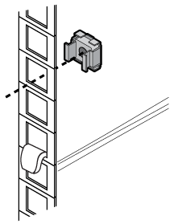

= Instale trilhos de suporte adicionais
:allow-uri-read: 
:icons: font
:imagesdir: ../media/

[role="lead"]
Seu gabinete do sistema tem alguns trilhos de suporte já instalados nele. Se você precisar de trilhos de suporte adicionais para o seu sistema, você deve instalá-los antes de instalar os componentes do sistema.

Essa tarefa se aplica a todas as controladoras e gavetas de disco, exceto as gavetas de disco DS212C e DE212C. Use as instruções no folheto do kit de trilho aplicável a essas duas prateleiras de disco.

https://library.netapp.com/ecm/ecm_download_file/ECMLP2484194["Instalação de uma prateleira de DE212C ou DS212CU em um rack de dois ou quatro colunas"]

. Determine quanto espaço seu equipamento precisa.
+
Calcule a quantidade de espaço em U (1,75 polegadas por U) que o equipamento requer, com base na altura do equipamento, e então determine onde o equipamento será instalado no gabinete do sistema com base no espaço disponível.

. Localize onde você precisa instalar os trilhos de suporte e, em seguida, instale-os usando a seguinte ilustração para referência:
+
image::../media/drw_syscab_ozeki_support_rail_installation.gif[Como instalar os trilhos de suporte]

. Se os flanges de montagem do seu equipamento se estenderem além dos orifícios dos parafusos no trilho de suporte, instale as porcas da gaiola acima do trilho de suporte, onde necessário.
+

