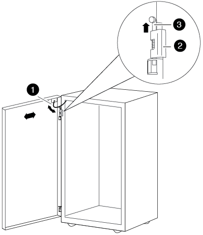

= Instale o kit de interconexão do gabinete
:allow-uri-read: 
:icons: font
:imagesdir: ../media/

[role="lead"]
Você pode conetar gabinetes de sistema juntos usando o kit opcional de interconexão de gabinete. Recomenda-se que instale o kit para evitar que os gabinetes se separem e danifiquem os cabos do sistema.

. Coloque os armários do sistema junto.
+
Os gabinetes devem ser dispostos de forma semelhante à ilustração a seguir, com o gabinete com os módulos do controlador no meio e os gabinetes com prateleiras de disco adicionais em ambos os lados. Os lados dos armários devem estar próximos, mas não precisam tocar um ao outro ainda.

+
image::../media/drw_fcc_cabinet_ordering.png[A ilustração é descrita no texto circundante.]

. Se estiver a instalar o kit de interligação com os painéis laterais, conforme recomendado, volte a instalar os painéis laterais que foram removidos durante a desembalagem:
+
.. Levante o painel lateral, inclinando-o a cerca de 15 graus de distância da parte inferior do armário do sistema, e pendure-o então sobre o lábio na parte superior da estrutura do armário do sistema.
.. Empurre suavemente o painel lateral contra a estrutura do gabinete e, em seguida, bloqueie-o no lugar com a chave.
.. Repita estes subpassos para os restantes painéis laterais.

. Se estiver a instalar o kit de interligação com os painéis laterais removidos, retire a porta dianteira cujas dobradiças estão na extremidade onde os armários se encontram:
+
.. Destranque e abra a porta dianteira que está a ser removida.
.. Use a ilustração a seguir para referência para desligar a alimentação da moldura iluminada:
+
image::../media/drw_sys_cab_remove_brimstone_back_banel.png[Como desligar a alimentação da moldura iluminada]

+
|===

 a| 
image:../media/icon_round_1.png["Legenda número 1"]

 a| 
Placa de circuito e cabo iluminados da moldura

 a| 
image:../media/icon_round_2.png["Legenda número 2"]

 a| 
Painel traseiro e parafusos de aperto manual

|===
.. Utilize a seguinte ilustração para referência para remover a porta dianteira:
+

+
|===

 a| 
image:../media/icon_round_1.png["Legenda número 1"]

 a| 
Cabo de ligação à terra da porta

 a| 
image:../media/icon_round_2.png["Legenda número 2"]

 a| 
Dobradiça superior da porta

 a| 
image:../media/icon_round_3.png["Legenda número 3"]

 a| 
Pino da dobradiça

|===
+
Certifique-se de que coloca as portas removidas num local seguro para que não fiquem danificadas acidentalmente.

. Retire a porta traseira cujas dobradiças estão na extremidade onde os armários se encontram:
+
.. Destranque e abra a porta traseira que está a remover.
.. Levante o pino da dobradiça superior até que ele saia da parte inferior da dobradiça.
.. Incline cuidadosamente a parte superior da porta para longe da estrutura do armário do sistema e, em seguida, solte o pino da dobradiça.
.. Levante a porta da dobradiça inferior e, em seguida, coloque a porta de lado.

. Mova os gabinetes do sistema completamente juntos e, em seguida, alinhe-os e nivele-os ajustando os quatro pés de nivelamento na parte inferior dos gabinetes do sistema.
. Instale os suportes de interligação.
+
** Use a ilustração a seguir para referência se estiver instalando os suportes de interconexão com os painéis laterais do gabinete do sistema, conforme recomendado: image:../media/drw_syscab_interconnect_bracket_side_panels_on.gif["Como instalar os suportes de interconexão com os painéis laterais do gabinete do sistema"]

+
|===

 a| 
image:../media/icon_round_1.png["Legenda número 1"]

 a| 
Rebites de encaixe de plástico na parte superior do armário do sistema

 a| 
image:../media/icon_round_2.png["Legenda número 2"]

 a| 
Suporte superior de interconexão

 a| 
image:../media/icon_round_3.png["Legenda número 3"]

 a| 
Suporte de interligação inferior

|===
+
** Use a ilustração a seguir para referência se estiver instalando os suportes de interconexão com os painéis laterais do gabinete do sistema desligados: image:../media/drw_syscab_interconnect_bracket_side_panels_off.gif["Como instalar os suportes de interconexão com os painéis laterais do gabinete do sistema desligados"]

. Repita o processo para quaisquer gabinetes de sistema restantes.
. Aperte todos os parafusos do suporte de interconexão.

